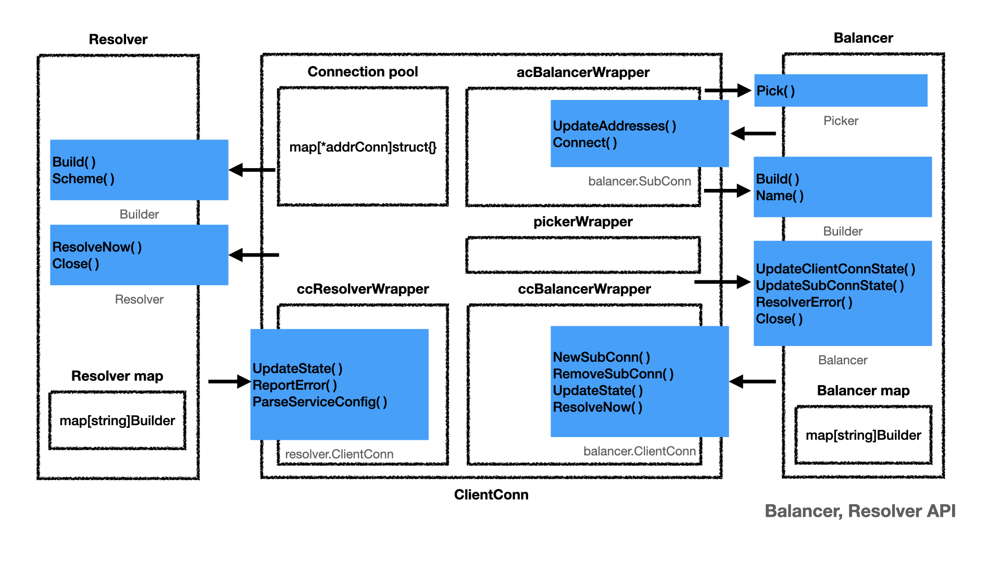

# gSkills

My original goal is to understand the source code of [gRPC-go](https://github.com/grpc/grpc-go). When researching the source code, I found a lot of coding skills/design which deserved to be noted for later reference.

Gradually, as more chapter finished, it becomes "Understanding gRPC-go": the code analysis book. All content are golang and gRPC-go related.

Get a quick glimpse from the following diagram. See  [Balancer and Resolver API](docs/dial.md#balancer-and-resolver-api) for detail.

## Status

- `xDS protocol support` is almost done. Next chapter is `Load Balancing - ServiceConfig`
- Plan to write `Stream dial`, `Stream request and response`.
- `Send Request` needs review because I learn more from `Client Dial` and `Load Balancing` chapters
- `Send Response` also need review to update the diagram

## Content

### [Client Dial](docs/dial.md)

### [Send Request](docs/request.md)

### [Send Response](docs/response.md)

### [Request parameters](docs/parameters.md)

### [controlBuffer, loopyWriter and framer](docs/control.md)

### [Interceptor](docs/interceptor.md)

### [Authentication](docs/auth.md)

### [Load Balancing - Client](docs/load.md)

### [xDS protocol support](docs/xds.md)

### [Load Balancing - xDS](docs/lbxds.md)

## Reading material

The following books help me to build a solid foundation for [HTTP2](https://tools.ietf.org/html/rfc7540) and [gRPC](https://www.grpc.io/docs/). They answer a lot of questions about Why, What and some part of How, while `gSkills` purely focus on How to implement them in gRPC.

- HTTP2
  - [Learning HTTP/2](https://www.oreilly.com/library/view/learning-http2/9781491962435/)
  - [HTTP/2 in Action](https://www.manning.com/books/http2-in-action?query=http2)
- gRPC
  - [gRPC: Up and Running](https://www.oreilly.com/library/view/grpc-up-and/9781492058328/)
  - [gRPC doc](https://github.com/grpc/grpc/tree/master/doc)

The following articles are very helpful to understand [envoy](http://envoyproxy.io). The official [Introduction](https://www.envoyproxy.io/docs/envoy/v1.16.0/intro/intro) is not easy to understand, full of terminology, too much details to easily get distracted.

- Envoy introduction
  - [Introduction to modern network load balancing and proxying](https://blog.envoyproxy.io/introduction-to-modern-network-load-balancing-and-proxying-a57f6ff80236)
  - [Announcing Envoy: C++ L7 proxy and communication bus](https://eng.lyft.com/announcing-envoy-c-l7-proxy-and-communication-bus-92520b6c8191)
  - [Anatomy of envoy proxy: the architecture of envoy and how it works](https://songrgg.github.io/architecture/deeper-understanding-to-envoy/)
- Envoy data plane and control plane
  - [The universal data plane API](https://blog.envoyproxy.io/the-universal-data-plane-api-d15cec7a)
  - [Service mesh data plane vs. control plane](https://blog.envoyproxy.io/service-mesh-data-plane-vs-control-plane-2774e720f7fc)
- Envoy internal
  - [Envoy hot restart](https://blog.envoyproxy.io/envoy-hot-restart-1d16b14555b5)
  - [Envoy threading model](https://blog.envoyproxy.io/envoy-threading-model-a8d44b922310)
- Envoy proto3 <> JSON <> YAML
  - [Dynamic extensibility and Protocol Buffers](https://blog.envoyproxy.io/dynamic-extensibility-and-protocol-buffers-dcd0bf0b8801)
  - [Evolving a Protocol Buffer canonical API](https://blog.envoyproxy.io/evolving-a-protocol-buffer-canonical-api-e1b2c2ca0dec)
- Envoy and gRPC-Web
  - [Envoy and gRPC-Web: a fresh new alternative to REST](https://blog.envoyproxy.io/envoy-and-grpc-web-a-fresh-new-alternative-to-rest-6504ce7eb880)

## License

Please read the [LICENSE](LICENSE) for more details.
