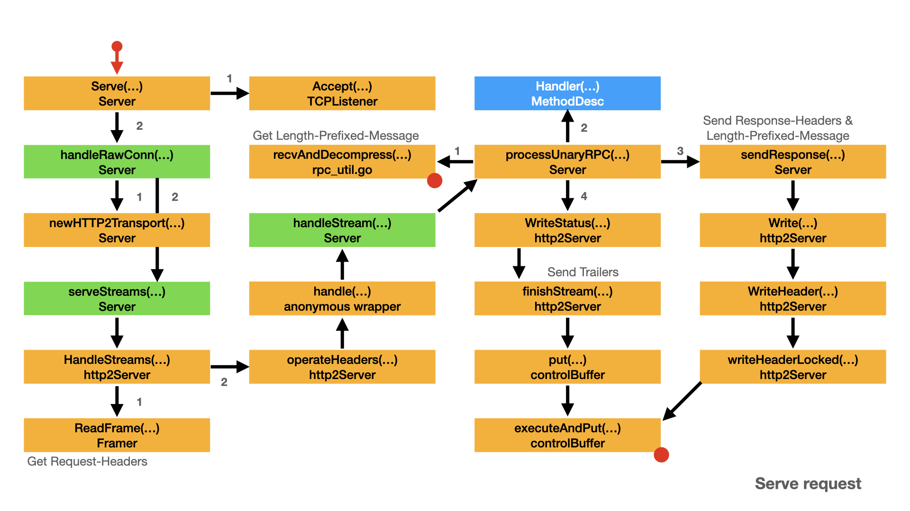
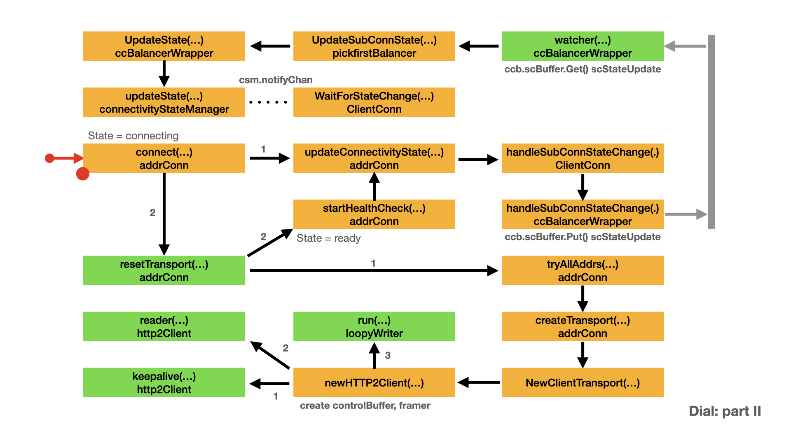

# Authentication

- [Client side](#client-side)
- [Server side](#server-side)
- [DialOption and ServerOption](#dialoption-and-serveroption)
- [Server internal](#server-internal)
- [Client internal](#client-internal)
- [Server internal 2](#server-internal-2)

Let's discuss the [authentication example](https://github.com/grpc/grpc-go/tree/master/examples) from `grpc-go/examples/features/authentication`. Through this discussion, we can learn how to perform the authentication tasks: TLS connection, oauth2 authentication. We can also learn authentication related internal components of gRPC.

## Client side

In the following client code snippet, the application performs the one-way(server side) TLS connection and provides oauth token for gRPC call validation.

- `perRPC` is a value of `credentials.PerRPCCredentials` interface.
  - `oauth.NewOauthAccess()` creates the `oauthAccess` struct with a given token
  - `oauthAccess` implements `credentials.PerRPCCredentials` interface
  - You can get the token via OAuth2 or other way. Here the token is a fixed oauth2 token.
  - Furthermore `perRPC` requires transport security. Because `oauthAccess.RequireTransportSecurity()` return true.
- `credentials.NewClientTLSFromFile()` creates a credential object from the server certificate and server name,
  - `creds` is a vale of `TransportCredentials` interface.
  - `credentials.NewClientTLSFromFile()` creates the `tlsCreds` struct, which implements `TransportCredentials`.
  - `creds` can be used to establish a secure connection.
- prepare a `DialOption` with `grpc.WithPerRPCCredentials()`, which sets credentials and places auth state on each outbound RPC.
  - `grpc.WithPerRPCCredentials()` just sets the value of `o.copts.PerRPCCredentials`
- prepare a `DialOption` with `grpc.WithTransportCredentials()`, which configures a connection level security credentials
  - `grpc.WithTransportCredentials()` just sets the value of `o.copts.TransportCredentials`
- `o.copts` is actually `dialOptions.copts`, which is a value of `transport.ConnectOptions` struct
  - Which covers all relevant options for communicating with the server.

After finish the above preparing, `Dial()` will use `o.copts.TransportCredentials` option to establish the TLS connection. gRPC will use `o.copts.PerRPCCredentials` option to add the token to the gRPC call context.

Let's discuss the counterpart in next section: server side authentication.

```go
// client side
func main() {                                                     
    flag.Parse()                                                            
                                                                             
    // Set up the credentials for the connection.                                
    perRPC := oauth.NewOauthAccess(fetchToken())                                
    creds, err := credentials.NewClientTLSFromFile(data.Path("x509/ca_cert.pem"), "x.test.example.com")                                
    if err != nil {                                                
        log.Fatalf("failed to load credentials: %v", err)                                
    }                                                    
    opts := []grpc.DialOption{                                
        // In addition to the following grpc.DialOption, callers may also use                                
        // the grpc.CallOption grpc.PerRPCCredentials with the RPC invocation                                
        // itself.                                                               
        // See: https://godoc.org/google.golang.org/grpc#PerRPCCredentials                                
        grpc.WithPerRPCCredentials(perRPC),                                
        // oauth.NewOauthAccess requires the configuration of transport                                
        // credentials.                                  
        grpc.WithTransportCredentials(creds),                                
    }                                                        
                                                             
    opts = append(opts, grpc.WithBlock())                                
    conn, err := grpc.Dial(*addr, opts...)                                
    if err != nil {                                
        log.Fatalf("did not connect: %v", err)                                
    }                                                                                     
    defer conn.Close()                                                                 
    rgc := ecpb.NewEchoClient(conn)                                      
                                                                           
    callUnaryEcho(rgc, "hello world")                                     
}                                

var addr = flag.String("addr", "localhost:50051", "the address to connect to")                                
                                
func callUnaryEcho(client ecpb.EchoClient, message string) {                                
    ctx, cancel := context.WithTimeout(context.Background(), 10*time.Second)                                
    defer cancel()                                
    resp, err := client.UnaryEcho(ctx, &ecpb.EchoRequest{Message: message})                                
    if err != nil {                                
        log.Fatalf("client.UnaryEcho(_) = _, %v: ", err)                                
    }                                
    fmt.Println("UnaryEcho: ", resp.Message)                                
}                                

// fetchToken simulates a token lookup and omits the details of proper token
// acquisition. For examples of how to acquire an OAuth2 token, see:
// https://godoc.org/golang.org/x/oauth2
func fetchToken() *oauth2.Token {
    return &oauth2.Token{
        AccessToken: "some-secret-token",
    }
}

// WithPerRPCCredentials returns a DialOption which sets credentials and places
// auth state on each outbound RPC.                                          
func WithPerRPCCredentials(creds credentials.PerRPCCredentials) DialOption {
    return newFuncDialOption(func(o *dialOptions) {
        o.copts.PerRPCCredentials = append(o.copts.PerRPCCredentials, creds)
    })                                                                    
}                                                  

// WithTransportCredentials returns a DialOption which configures a connection                         
// level security credentials (e.g., TLS/SSL). This should not be used together
// with WithCredentialsBundle.                                               
func WithTransportCredentials(creds credentials.TransportCredentials) DialOption {
    return newFuncDialOption(func(o *dialOptions) {                    
        o.copts.TransportCredentials = creds                                
    })                                                                    
}                                                  

// oauthAccess supplies PerRPCCredentials from a given token.
type oauthAccess struct {            
    token oauth2.Token
}               
                                                                                   
// NewOauthAccess constructs the PerRPCCredentials using a given token.
func NewOauthAccess(token *oauth2.Token) credentials.PerRPCCredentials {
    return oauthAccess{token: *token}                                                                  
}                                                                         
                                                                         
func (oa oauthAccess) GetRequestMetadata(ctx context.Context, uri ...string) (map[string]string, error) {
    ri, _ := credentials.RequestInfoFromContext(ctx)                  
    if err := credentials.CheckSecurityLevel(ri.AuthInfo, credentials.PrivacyAndIntegrity); err != nil {
        return nil, fmt.Errorf("unable to transfer oauthAccess PerRPCCredentials: %v", err)
    }                                 
    return map[string]string{                                              
        "authorization": oa.token.Type() + " " + oa.token.AccessToken,
    }, nil                                                                           
}                                                                         
                                             
func (oa oauthAccess) RequireTransportSecurity() bool {
    return true
}                                        

// NewClientTLSFromFile constructs TLS credentials from the provided root
// certificate authority certificate file(s) to validate server connections. If
// certificates to establish the identity of the client need to be included in
// the credentials (eg: for mTLS), use NewTLS instead, where a complete
// tls.Config can be specified.
// serverNameOverride is for testing only. If set to a non empty string,
// it will override the virtual host name of authority (e.g. :authority header
// field) in requests.
func NewClientTLSFromFile(certFile, serverNameOverride string) (TransportCredentials, error) {
    b, err := ioutil.ReadFile(certFile)
    if err != nil {
        return nil, err
    }
    cp := x509.NewCertPool()
    if !cp.AppendCertsFromPEM(b) {
        return nil, fmt.Errorf("credentials: failed to append certificates")
    }
    return NewTLS(&tls.Config{ServerName: serverNameOverride, RootCAs: cp}), nil
}

// NewTLS uses c to construct a TransportCredentials based on TLS.
func NewTLS(c *tls.Config) TransportCredentials {
    tc := &tlsCreds{credinternal.CloneTLSConfig(c)}
    tc.config.NextProtos = credinternal.AppendH2ToNextProtos(tc.config.NextProtos)
    return tc
}

// ConnectOptions covers all relevant options for communicating with the server.
type ConnectOptions struct {
    // UserAgent is the application user agent.
    UserAgent string
    // Dialer specifies how to dial a network address.
    Dialer func(context.Context, string) (net.Conn, error)                                                                                                       
    // FailOnNonTempDialError specifies if gRPC fails on non-temporary dial errors.                                                                     
    FailOnNonTempDialError bool                                                                                                                          
    // PerRPCCredentials stores the PerRPCCredentials required to issue RPCs.                                                                                
    PerRPCCredentials []credentials.PerRPCCredentials                                                                                                               
    // TransportCredentials stores the Authenticator required to setup a client                                                                          
    // connection. Only one of TransportCredentials and CredsBundle is non-nil.                                                                                     
    TransportCredentials credentials.TransportCredentials                                                                                                         
    // CredsBundle is the credentials bundle to be used. Only one of                                                                                                
    // TransportCredentials and CredsBundle is non-nil.                                                                                                             
    CredsBundle credentials.Bundle
    // KeepaliveParams stores the keepalive parameters.                                                                                                          
    KeepaliveParams keepalive.ClientParameters                                                                                                                  
    // StatsHandler stores the handler for stats.                                                                                                                
    StatsHandler stats.Handler                                                                                                                                      
    // InitialWindowSize sets the initial window size for a stream.                                                                                                 
    InitialWindowSize int32                                                                                                                                         
    // InitialConnWindowSize sets the initial window size for a connection.                                                                                         
    InitialConnWindowSize int32                                                                                                                                    
    // WriteBufferSize sets the size of write buffer which in turn determines how much data can be batched before it's written on the wire.                         
    WriteBufferSize int
    // ReadBufferSize sets the size of read buffer, which in turn determines how much data can be read at most for one read syscall.                                
    ReadBufferSize int                                                                                                                                              
    // ChannelzParentID sets the addrConn id which initiate the creation of this client transport.                                                                 
    ChannelzParentID int64
    // MaxHeaderListSize sets the max (uncompressed) size of header list that is prepared to be received.                                                           
    MaxHeaderListSize *uint32
    // UseProxy specifies if a proxy should be used.                                                                                                           
    UseProxy bool                                                                                                                                                  
}

```

## Server side

The server side must perform the counterpart work to enable the client side authentication. In the following server code snippet, the application performs

- `tls.LoadX509KeyPair()` reads and parses a public/private key pair from a pair of files.
  - `cert` is a `Certificate`
- prepare a `ServerOption` with `grpc.UnaryInterceptor()`, which installs the `ensureValidToken` interceptor to gRPC.
  - `grpc.UnaryInterceptor()` just sets the value of `o.unaryInt`
- prepare a `ServerOption` with `grpc.Creds()`, which sets credentials for server connections.
  - `credentials.NewServerTLSFromCert()`  constructs TLS credentials from the `Certificate` parameter.
  - `grpc.Creds()` just sets the value of `o.creds`
- `o` is `serverOptions`, which cover all the options for the server.
- `ensureValidToken()` is an interceptor, which ensures a valid token exists within a request's metadata.
  - First it calls `metadata.FromIncomingContext()` to get the metadata from the context.
  - Then it verifies the expected token exist in the metadata. Otherwise the interceptor will stop the execution of handler and return error.
  - There is a dedicated chapter to discuss [Interceptor](interceptor.md)

If we finish the above setup and run the application (both client side and server side), the expected TLS connection and oauth authentication will wok.

```go
func main() {                                                                   
    flag.Parse()                                                                                                                       
    fmt.Printf("server starting on port %d...\n", *port)                                
                                                                                         
    cert, err := tls.LoadX509KeyPair(data.Path("x509/server_cert.pem"), data.Path("x509/server_key.pem"))                                
    if err != nil {                                           
        log.Fatalf("failed to load key pair: %s", err)                                                       
    }                                                                                                        
    opts := []grpc.ServerOption{                                                 
        // The following grpc.ServerOption adds an interceptor for all unary                                
        // RPCs. To configure an interceptor for streaming RPCs, see:                                
        // https://godoc.org/google.golang.org/grpc#StreamInterceptor                                  
        grpc.UnaryInterceptor(ensureValidToken),                                
        // Enable TLS for all incoming connections.                                
        grpc.Creds(credentials.NewServerTLSFromCert(&cert)),                                
    }                                                        
    s := grpc.NewServer(opts...)                                         
    pb.RegisterEchoServer(s, &ecServer{})                                 
    lis, err := net.Listen("tcp", fmt.Sprintf(":%d", *port))                                
    if err != nil {                                                           
        log.Fatalf("failed to listen: %v", err)                                           
    }                                                                                  
    if err := s.Serve(lis); err != nil {                                 
        log.Fatalf("failed to serve: %v", err)                                
    }                                                                     
}                                

var (
    errMissingMetadata = status.Errorf(codes.InvalidArgument, "missing metadata")
    errInvalidToken    = status.Errorf(codes.Unauthenticated, "invalid token")
)

var port = flag.Int("port", 50051, "the port to serve on")

type ecServer struct {
    pb.UnimplementedEchoServer
}

func (s *ecServer) UnaryEcho(ctx context.Context, req *pb.EchoRequest) (*pb.EchoResponse, error) {
    return &pb.EchoResponse{Message: req.Message}, nil
}

// valid validates the authorization.
func valid(authorization []string) bool {
    if len(authorization) < 1 {
        return false
    }
    token := strings.TrimPrefix(authorization[0], "Bearer ")
    // Perform the token validation here. For the sake of this example, the code
    // here forgoes any of the usual OAuth2 token validation and instead checks
    // for a token matching an arbitrary string.
    return token == "some-secret-token"
}

// ensureValidToken ensures a valid token exists within a request's metadata. If
// the token is missing or invalid, the interceptor blocks execution of the
// handler and returns an error. Otherwise, the interceptor invokes the unary
// handler.
func ensureValidToken(ctx context.Context, req interface{}, info *grpc.UnaryServerInfo, handler grpc.UnaryHandler) (interface{}, error) {
    md, ok := metadata.FromIncomingContext(ctx)
    if !ok {
        return nil, errMissingMetadata
    }
    // The keys within metadata.MD are normalized to lowercase.
    // See: https://godoc.org/google.golang.org/grpc/metadata#New
    if !valid(md["authorization"]) {
        return nil, errInvalidToken
    }
    // Continue execution of handler after ensuring a valid token.
    return handler(ctx, req)
}

// Creds returns a ServerOption that sets credentials for server connections.                           
func Creds(c credentials.TransportCredentials) ServerOption {                               
    return newFuncServerOption(func(o *serverOptions) {                                                 
        o.creds = c              
    })                                                                          
}                                                                          
                                                                                                      
// UnaryInterceptor returns a ServerOption that sets the UnaryServerInterceptor for the              
// server. Only one unary interceptor can be installed. The construction of multiple                 
// interceptors (e.g., chaining) can be implemented at the caller.                      
func UnaryInterceptor(i UnaryServerInterceptor) ServerOption {                                                                                  
    return newFuncServerOption(func(o *serverOptions) {              
        if o.unaryInt != nil {                                             
            panic("The unary server interceptor was already set and may not be reset.")
        }                                                                                
        o.unaryInt = i                                                                           
    })                                                                            
}                                                                        

// NewServerTLSFromCert constructs TLS credentials from the input certificate for server.
func NewServerTLSFromCert(cert *tls.Certificate) TransportCredentials {                  
    return NewTLS(&tls.Config{Certificates: []tls.Certificate{*cert}})                                   
}                                                                     

// NewTLS uses c to construct a TransportCredentials based on TLS.                       
func NewTLS(c *tls.Config) TransportCredentials {                                                        
    tc := &tlsCreds{credinternal.CloneTLSConfig(c)}                   
    tc.config.NextProtos = credinternal.AppendH2ToNextProtos(tc.config.NextProtos)
    return tc                                                                             
}                                                                                         
```

## DialOption and ServerOption

gRPC client and gRPC server both need options to extend the capability. Let's discuss the design of `DialOption` and `ServerOption`. It's more likely you can also use this design in you application code.

`DialOption` and `ServerOption` has the same design. Lets' discuss the `ServerOption` to understand the design.

`ServerOption` is an interface. It has an `apply(*serverOptions)` method.

- one implementation is `EmptyServerOption`. It's a empty struct with an empty `apply()` method
- one implementation is `funcServerOption`. It's a struct with a `f func(*serverOptions)` field.
  - `funcServerOption` has a `apply(do *serverOptions)` method, the only action of this method is to call the `fdo.f()`
  - `newFuncServerOption` is a function. It accepts the `f func(*serverOptions)` parameter and return a `funcServerOption` value.
- Both `grpc.UnaryInterceptor()` and `grpc.Creds()` call `newFuncServerOption` to build a `funcServerOption`.

From the application point of view, `grpc.UnaryInterceptor()` and `grpc.Creds()` just returns `ServerOption` value. While these value is a struct  with a `f func(*serverOptions)` field and has a `apply(do *serverOptions)` method, gRPC still needs to take some actions to use these  `ServerOption` value.

```go
// A ServerOption sets options such as credentials, codec and keepalive parameters, etc.                                                                          
type ServerOption interface {                                                                                                                                  
    apply(*serverOptions)                                                                                                                                           
}                                                                                                                                                                  
                                                                                                                                                       
// EmptyServerOption does not alter the server configuration. It can be embedded                                                                                    
// in another structure to build custom server options.                                                                                                            
//                                                                                                                                                               
// Experimental                                                                                                                                               
//                                                                                                                                                                         
// Notice: This type is EXPERIMENTAL and may be changed or removed in a                                                                                             
// later release.                                                                                                                                                  
type EmptyServerOption struct{}                                                                                                                     
                                                                                                                                      
func (EmptyServerOption) apply(*serverOptions) {}                                                                                                                  
                                                                                                                                                                  
// funcServerOption wraps a function that modifies serverOptions into an                                                                                        
// implementation of the ServerOption interface.                                                                                                                   
type funcServerOption struct {                                                                                                                              
    f func(*serverOptions)                                                                                                                                          
}                                                                                                                                                                 
                                                                                                                                      
func (fdo *funcServerOption) apply(do *serverOptions) {                                                                                                             
    fdo.f(do)                                                                                                                                                       
}                                                                                                                                                                   
                                                                                                                                                                
func newFuncServerOption(f func(*serverOptions)) *funcServerOption {                                                                                               
    return &funcServerOption{                                                                                                                                      
        f: f,                                                                                                                                       
    }                                                                                                                                 
}                                                                                                                                                         

type serverOptions struct {
    creds                 credentials.TransportCredentials
    codec                 baseCodec
    cp                    Compressor
    dc                    Decompressor
    unaryInt              UnaryServerInterceptor
    streamInt             StreamServerInterceptor
    chainUnaryInts        []UnaryServerInterceptor
    chainStreamInts       []StreamServerInterceptor
    inTapHandle           tap.ServerInHandle
    statsHandler          stats.Handler
    maxConcurrentStreams  uint32
    maxReceiveMessageSize int
    maxSendMessageSize    int
    unknownStreamDesc     *StreamDesc
    keepaliveParams       keepalive.ServerParameters
    keepalivePolicy       keepalive.EnforcementPolicy
    initialWindowSize     int32
    initialConnWindowSize int32
    writeBufferSize       int
    readBufferSize        int
    connectionTimeout     time.Duration
    maxHeaderListSize     *uint32
    headerTableSize       *uint32
    numServerWorkers      uint32
}

```

We will not discuss the design of `DialOption` in detail.

```go
// DialOption configures how we set up the connection.                                                                                                            
type DialOption interface {
    apply(*dialOptions)                                                                                                                               
}                                                                                                                                 
                                                                                                                                  
// EmptyDialOption does not alter the dial configuration. It can be embedded in                                                                                      
// another structure to build custom dial options.                                                                                                           
//             
// Experimental                                                                                                                                                           
//                                                                                                                                                            
// Notice: This type is EXPERIMENTAL and may be changed or removed in a                                                                                                 
// later release.            
type EmptyDialOption struct{}                                                                                                                                            
                                                                                                                                   
func (EmptyDialOption) apply(*dialOptions) {}                                                                                                               
                                                                                                                                               
// funcDialOption wraps a function that modifies dialOptions into an                                                                                         
// implementation of the DialOption interface.                                                                                                  
type funcDialOption struct {                                                                                                                                 
    f func(*dialOptions)                                                                                                                          
}                                                  
                                                   
func (fdo *funcDialOption) apply(do *dialOptions) {
    fdo.f(do)  
}                                                                    
               
func newFuncDialOption(f func(*dialOptions)) *funcDialOption {
    return &funcDialOption{
        f: f,                                                     
    }                                       
}                                                                 

// dialOptions configure a Dial call. dialOptions are set by the DialOption
// values passed to Dial.
type dialOptions struct {
    unaryInt  UnaryClientInterceptor
    streamInt StreamClientInterceptor

    chainUnaryInts  []UnaryClientInterceptor
    chainStreamInts []StreamClientInterceptor

    cp              Compressor
    dc              Decompressor
    bs              internalbackoff.Strategy
    block           bool
    returnLastError bool
    insecure        bool
    timeout         time.Duration
    scChan          <-chan ServiceConfig
    authority       string
    copts           transport.ConnectOptions
    callOptions     []CallOption
    // This is used by WithBalancerName dial option.                                        
    balancerBuilder             balancer.Builder
    channelzParentID            int64
    disableServiceConfig        bool
    disableRetry                bool
    disableHealthCheck          bool
    healthCheckFunc             internal.HealthChecker
    minConnectTimeout           func() time.Duration
    defaultServiceConfig        *ServiceConfig // defaultServiceConfig is parsed from defaultServiceConfigRawJSON.
    defaultServiceConfigRawJSON *string
    // This is used by ccResolverWrapper to backoff between successive calls to
    // resolver.ResolveNow(). The user will have no need to configure this, but
    // we need to be able to configure this in tests.
    resolveNowBackoff func(int) time.Duration
    resolvers         []resolver.Builder
}

```

Let's continue discuss the use of `ServerOption` object. When you call  `grpc.NewServer()`, `ServerOption` objects will be used to initialize the gRPC server.

In `grpc.NewServer()`

- All the `opt ...ServerOption` parameters will be processed by a for loop.
- Before the for loop, `defaultServerOptions` will be assigned to `opts`.
- In the for loop, every `ServerOption.apply()` will be called and the `opts` will be the parameter of `ServerOption.apply()`.
- After the for loop, `opts` will be assigned to `Server.opts`. All the options is stored in the gRPC server.

In this way, all the fields of `serverOptions` can be processed in a clean and intuitive way. Actually, If more options were added to the `serverOptions`, you only need to add the corresponding function similar like `grpc.UnaryInterceptor()`.

```go
// NewServer creates a gRPC server which has no service registered and has not                                                   
// started to accept requests yet.                                                                                                                            
func NewServer(opt ...ServerOption) *Server {
    opts := defaultServerOptions                                                                                                                    
    for _, o := range opt {                                                                                                                           
        o.apply(&opts)                                                                                                                                
    }                                                                                                                                                 
    s := &Server{                                                                                                                                     
        lis:      make(map[net.Listener]bool),                                                                                                        
        opts:     opts,                                                                                                                               
        conns:    make(map[transport.ServerTransport]bool),                                                                                           
        services: make(map[string]*serviceInfo),                                                                                              
        quit:     grpcsync.NewEvent(),                                                                                                                
        done:     grpcsync.NewEvent(),                                                                                                                
        czData:   new(channelzData),                                                                                                                  
    }                                                                                                                                                 
    chainUnaryServerInterceptors(s)                                                                                                                
    chainStreamServerInterceptors(s)                                                                                                                  
    s.cv = sync.NewCond(&s.mu)                                                                                                                       
    if EnableTracing {                                                                                                                                
        _, file, line, _ := runtime.Caller(1)                                                                                                  
        s.events = trace.NewEventLog("grpc.Server", fmt.Sprintf("%s:%d", file, line))                                            
    }                                                                                                                                                 

    if s.opts.numServerWorkers > 0 {
        s.initServerWorkers()
    }

    if channelz.IsOn() {
        s.channelzID = channelz.RegisterServer(&channelzServer{s}, "")
    }
    return s
}

```

## Server internal

At the [Server side](#server-side), `grpc.Creds()` sets the value of `o.creds`. Let's discuss how the server use `o.creds` to active the server side TLS connection. We will not discuss the `o.unaryInt` option which is set by `grpc.UnaryInterceptor()`. There is a dedicated chapter to discuss [Interceptor](interceptor.md)

From the [Serve Request](response.md#serve-request), in the `s.handleRawConn()` method. `s.useTransportAuthenticator()` will be called before `s.newHTTP2Transport()` and `s.serveStreams()`. The secret is in `s.useTransportAuthenticator()`. Let's examine it in detail.



```go
// handleRawConn forks a goroutine to handle a just-accepted connection that
// has not had any I/O performed on it yet.
func (s *Server) handleRawConn(rawConn net.Conn) {
    if s.quit.HasFired() {
        rawConn.Close()
        return
    }
    rawConn.SetDeadline(time.Now().Add(s.opts.connectionTimeout))
    conn, authInfo, err := s.useTransportAuthenticator(rawConn)
    if err != nil {
        // ErrConnDispatched means that the connection was dispatched away from
        // gRPC; those connections should be left open.
        if err != credentials.ErrConnDispatched {
            s.mu.Lock()
            s.errorf("ServerHandshake(%q) failed: %v", rawConn.RemoteAddr(), err)
            s.mu.Unlock()
            channelz.Warningf(logger, s.channelzID, "grpc: Server.Serve failed to complete security handshake from %q: %v", rawConn.RemoteAddr(), err)
            rawConn.Close()
        }
        rawConn.SetDeadline(time.Time{})
        return
    }

    // Finish handshaking (HTTP2)
    st := s.newHTTP2Transport(conn, authInfo)
    if st == nil {
        return
    }

    rawConn.SetDeadline(time.Time{})
    if !s.addConn(st) {
        return
    }
    go func() {
        s.serveStreams(st)
        s.removeConn(st)
    }()
}
```

In `useTransportAuthenticator()`, if `s.opts.creds` is not nil, `creds.ServerHandshake()` method will be called.

- When we prepare the `s.opts.creds` value, we call `credentials.NewServerTLSFromCert()` to get the `TransportCredentials` object.
- `NewServerTLSFromCert()` calls `NewTLS()` to finish the job and provides the certificate as parameter.
- `NewTLS()` creates a `tlsCreds` object and returns `tlsCreds`.
- `tlsCreds` is a struct, its `ServerHandshake()` method will perform the TLS handshake to establish the secure connection.
- We will not dive into the `ServerHandshake()`, it's enough to know the that  `useTransportAuthenticator()` will use the `s.opts.creds` to finish its job.

After the call of `useTransportAuthenticator()`, the server gets the secure connection.

```go
func (s *Server) useTransportAuthenticator(rawConn net.Conn) (net.Conn, credentials.AuthInfo, error) {
    if s.opts.creds == nil {                                                                                                                          
        return rawConn, nil, nil
    }    
    return s.opts.creds.ServerHandshake(rawConn)
}             
     
// NewServerTLSFromCert constructs TLS credentials from the input certificate for server.                                
func NewServerTLSFromCert(cert *tls.Certificate) TransportCredentials {                                
    return NewTLS(&tls.Config{Certificates: []tls.Certificate{*cert}})                                                                                 
}                                                                                                                 
                                                                                                                          
// NewTLS uses c to construct a TransportCredentials based on TLS.                                                       
func NewTLS(c *tls.Config) TransportCredentials {                                                      
    tc := &tlsCreds{credinternal.CloneTLSConfig(c)}                                                                                                    
    tc.config.NextProtos = credinternal.AppendH2ToNextProtos(tc.config.NextProtos)                                
    return tc                                                                                                             
}                                                                                                                         

// tlsCreds is the credentials required for authenticating a connection using TLS.                                       
type tlsCreds struct {                                                                                 
    // TLS configuration                                                                                                                               
    config *tls.Config                                                                                            
}                                                                                                                         
                                                                                                                          
func (c *tlsCreds) ServerHandshake(rawConn net.Conn) (net.Conn, AuthInfo, error) {
    conn := tls.Server(rawConn, c.config)
    if err := conn.Handshake(); err != nil {
        conn.Close()
        return nil, nil, err
    }
    tlsInfo := TLSInfo{
        State: conn.ConnectionState(),
        CommonAuthInfo: CommonAuthInfo{
            SecurityLevel: PrivacyAndIntegrity,
        },
    }
    id := credinternal.SPIFFEIDFromState(conn.ConnectionState())
    if id != nil {
        tlsInfo.SPIFFEID = id
    }
    return credinternal.WrapSyscallConn(rawConn, conn), tlsInfo, nil
}

```

## Client internal

In the [Client side](#client-side), `grpc.WithPerRPCCredentials()` sets the value of `o.copts.PerRPCCredentials`.  `grpc.WithTransportCredentials()` sets the value of `o.copts.TransportCredentials`. Let's discuss how the client use `o.copts.PerRPCCredentials` and `o.copts.TransportCredentials`.

In the [Client Dial](dial.md), `newHTTP2Client()` will be called to establish the secure transport connection. Before `newHTTP2Client()` is called, the `opts ConnectOptions` parameter need to be set correctly.




- In `ccBalancerWrapper.NewSubConn()`, `ccb.cc.newAddrConn()` will be called, actually `ClientConn.newAddrConn()` will be called.
  - In `ClientConn.newAddrConn()`, `ac.dopts` is assigned the value of `cc.dopts`, which is `dopts dialOption` field of `ClientConn` struct.
- In `addrConn.tryAllAddrs()`, `ac.createTransport()` gets the `copts` parameter from `ac.dopts.copts`. `ac.dopts.copts` is the `copts  transport.ConnectOptions` field of `ClientConn` struct.
- In `addrConn.createTransport()`, `transport.NewClientTransport()` gets the `copts` parameter from input arguments.
- In `NewClientTransport`, `newHTTP2Client()` gets the `opts` parameter from input arguments.
- In `newHTTP2Client()`, After the `dial()` finished, the normal TCP connection has been established.
  - `newHTTP2Client()` extracts the `transportCreds` and `perRPCCreds` from `opts`
  - If `transportCreds` is not nil, call `transportCreds.ClientHandshake()` to perform the TLS handshake.
  - In our case, `transportCreds` is created by previous `credentials.NewClientTLSFromFile()` invocation. So `transportCreds` is a value of type `tlsCreds`.

That's the way gRPC using `o.copts.TransportCredentials` option, eventually `o.copts.TransportCredentials` option is used to perform the tls client hand shake.

Let's continue the discussion of `o.copts.PerRPCCredentials` next.

```go
// newHTTP2Client constructs a connected ClientTransport to addr based on HTTP2
// and starts to receive messages on it. Non-nil error returns if construction
// fails.
func newHTTP2Client(connectCtx, ctx context.Context, addr resolver.Address, opts ConnectOptions, onPrefaceReceipt func(), onGoAway func(GoAwayReason), onClose func()) (_ *http2Client, err error) {
    scheme := "http"
    ctx, cancel := context.WithCancel(ctx)
+--  5 lines: defer func() {···························································································

    conn, err := dial(connectCtx, opts.Dialer, addr, opts.UseProxy, opts.UserAgent)
    if err != nil {
        if opts.FailOnNonTempDialError {
            return nil, connectionErrorf(isTemporary(err), err, "transport: error while dialing: %v", err)
        }
        return nil, connectionErrorf(true, err, "transport: Error while dialing %v", err)
    }
+-- 25 lines: Any further errors will close the underlying connection··················································
    transportCreds := opts.TransportCredentials
    perRPCCreds := opts.PerRPCCredentials

    if b := opts.CredsBundle; b != nil {
        if t := b.TransportCredentials(); t != nil {
            transportCreds = t
        }
        if t := b.PerRPCCredentials(); t != nil {
            perRPCCreds = append(perRPCCreds, t)
        }
    }
    if transportCreds != nil {
        // gRPC, resolver, balancer etc. can specify arbitrary data in the
        // Attributes field of resolver.Address, which is shoved into connectCtx
        // and passed to the credential handshaker. This makes it possible for
        // address specific arbitrary data to reach the credential handshaker.
        contextWithHandshakeInfo := internal.NewClientHandshakeInfoContext.(func(context.Context, credentials.ClientHandshakeInfo) context.Context)
        connectCtx = contextWithHandshakeInfo(connectCtx, credentials.ClientHandshakeInfo{Attributes: addr.Attributes})
        conn, authInfo, err = transportCreds.ClientHandshake(connectCtx, addr.ServerName, conn)
        if err != nil {
            return nil, connectionErrorf(isTemporary(err), err, "transport: authentication handshake failed: %v", err)
        }
        for _, cd := range perRPCCreds {
            if cd.RequireTransportSecurity() {
                if ci, ok := authInfo.(interface {
                    GetCommonAuthInfo() credentials.CommonAuthInfo
                }); ok {
                    secLevel := ci.GetCommonAuthInfo().SecurityLevel
                    if secLevel != credentials.InvalidSecurityLevel && secLevel < credentials.PrivacyAndIntegrity {
                        return nil, connectionErrorf(true, nil, "transport: cannot send secure credentials on an insecure connection")
                    }
                }
            }
        }
        isSecure = true
        if transportCreds.Info().SecurityProtocol == "tls" {
            scheme = "https"
        }
    }
+-- 12 lines: dynamicWindow := true····················································································
    t := &http2Client{
        ctx:                   ctx,
        ctxDone:               ctx.Done(), // Cache Done chan.
        cancel:                cancel,
        userAgent:             opts.UserAgent,
        conn:                  conn,
        remoteAddr:            conn.RemoteAddr(),
        localAddr:             conn.LocalAddr(),
        authInfo:              authInfo,
+---  8 lines: readerDone:            make(chan struct{}),·····························································
        perRPCCreds:           perRPCCreds,
+--- 13 lines: kp:                    kp,··············································································
    }
+--- 96 lines: if md, ok := addr.Metadata.(*metadata.MD); ok {·························································
    return t, nil
}

// newAddrConn creates an addrConn for addrs and adds it to cc.conns.
//
// Caller needs to make sure len(addrs) > 0.
func (cc *ClientConn) newAddrConn(addrs []resolver.Address, opts balancer.NewSubConnOptions) (*addrConn, error) {
    ac := &addrConn{
        state:        connectivity.Idle,
        cc:           cc,
        addrs:        addrs,
        scopts:       opts,
        dopts:        cc.dopts,
        czData:       new(channelzData),
        resetBackoff: make(chan struct{}),
    }
    ac.ctx, ac.cancel = context.WithCancel(cc.ctx)
+-- 19 lines: Track ac in cc. This needs to be done before any getTransport(...) is called.····························
    return ac, nil
}                       

// tryAllAddrs tries to creates a connection to the addresses, and stop when at the
// first successful one. It returns the transport, the address and a Event in
// the successful case. The Event fires when the returned transport disconnects.
func (ac *addrConn) tryAllAddrs(addrs []resolver.Address, connectDeadline time.Time) (transport.ClientTransport, resolver.Address, *grpcsync.Event, error) {
    var firstConnErr error                                                        
    for _, addr := range addrs {
        ac.mu.Lock()
        if ac.state == connectivity.Shutdown {
            ac.mu.Unlock()
            return nil, resolver.Address{}, nil, errConnClosing
        }

        ac.cc.mu.RLock()
        ac.dopts.copts.KeepaliveParams = ac.cc.mkp
        ac.cc.mu.RUnlock()

        copts := ac.dopts.copts
        if ac.scopts.CredsBundle != nil {
            copts.CredsBundle = ac.scopts.CredsBundle
        }
        ac.mu.Unlock()

        channelz.Infof(logger, ac.channelzID, "Subchannel picks a new address %q to connect", addr.Addr)

        newTr, reconnect, err := ac.createTransport(addr, copts, connectDeadline)
        if err == nil {
            return newTr, addr, reconnect, nil
        }
        if firstConnErr == nil {
            firstConnErr = err
        }
        ac.cc.updateConnectionError(err)
    }

    // Couldn't connect to any address.
    return nil, resolver.Address{}, nil, firstConnErr
}

// createTransport creates a connection to addr. It returns the transport and a
// Event in the successful case. The Event fires when the returned transport
// disconnects.
func (ac *addrConn) createTransport(addr resolver.Address, copts transport.ConnectOptions, connectDeadline time.Time) (transport.ClientTransport, *grpcsync.Event, error) {
    prefaceReceived := make(chan struct{})
    onCloseCalled := make(chan struct{})
    reconnect := grpcsync.NewEvent()

+-- 48 lines: addr.ServerName takes precedent over ClientConn authority, if present.···································
    newTr, err := transport.NewClientTransport(connectCtx, ac.cc.ctx, addr, copts, onPrefaceReceipt, onGoAway, onClose)
    if err != nil {                            
        // newTr is either nil, or closed.                                         
        channelz.Warningf(logger, ac.channelzID, "grpc: addrConn.createTransport failed to connect to %v. Err: %v. Reconnecting...", addr, err)
        return nil, nil, err                                                   
    }                                                                   
             
    select {
    case <-time.After(time.Until(connectDeadline)):
        // We didn't get the preface in time.
        newTr.Close()
        channelz.Warningf(logger, ac.channelzID, "grpc: addrConn.createTransport failed to connect to %v: didn't receive server preface in time. Reconnecting...", addr)
        return nil, nil, errors.New("timed out waiting for server handshake")
    case <-prefaceReceived:
        // We got the preface - huzzah! things are good.
    case <-onCloseCalled:                                                          
        // The transport has already closed - noop.
        return nil, nil, errors.New("connection closed")
        // TODO(deklerk) this should bail on ac.ctx.Done(). Add a test and fix.
    }                                                                   
    return newTr, reconnect, nil
}         

// NewClientTransport establishes the transport with the required ConnectOptions
// and returns it to the caller.                                                
func NewClientTransport(connectCtx, ctx context.Context, addr resolver.Address, opts ConnectOptions, onPrefaceReceipt fuc(), onGoAway func(GoAwayReason), onClose func()) (ClientTransport, error) {
    return newHTTP2Client(connectCtx, ctx, addr, opts, onPrefaceReceipt, onGoAway, onClose)
}                                                                             

// NewClientTLSFromFile constructs TLS credentials from the provided root
// certificate authority certificate file(s) to validate server connections. If
// certificates to establish the identity of the client need to be included in                      
// the credentials (eg: for mTLS), use NewTLS instead, where a complete
// tls.Config can be specified.
// serverNameOverride is for testing only. If set to a non empty string,
// it will override the virtual host name of authority (e.g. :authority header
// field) in requests.
func NewClientTLSFromFile(certFile, serverNameOverride string) (TransportCredentials, error) {
    b, err := ioutil.ReadFile(certFile)
    if err != nil {
        return nil, err
    }
    cp := x509.NewCertPool()
    if !cp.AppendCertsFromPEM(b) {
        return nil, fmt.Errorf("credentials: failed to append certificates")
    }
    return NewTLS(&tls.Config{ServerName: serverNameOverride, RootCAs: cp}), nil
}

// NewTLS uses c to construct a TransportCredentials based on TLS.                                                   
func NewTLS(c *tls.Config) TransportCredentials {                                                                    
    tc := &tlsCreds{credinternal.CloneTLSConfig(c)}
    tc.config.NextProtos = credinternal.AppendH2ToNextProtos(tc.config.NextProtos)                                   
    return tc                                                                                                        
}                                                                                                                    

// tlsCreds is the credentials required for authenticating a connection using TLS.                                   
type tlsCreds struct {
    // TLS configuration                                                                                             
    config *tls.Config                                                                                               
}                                                                                                                    
                                                                                                                     
```

Let's discuss the `opts.PerRPCCredentials` option.

- In the same `newHTTP2Client()`, `newHTTP2Client()` extracts the `transportCreds` and `perRPCCreds` from opts.
- After `transportCreds.ClientHandshake()` finished, `authInfo` got the value.
- `newHTTP2Client()` creates a `http2Client` and assigns the `perRPCCreds` field with the vale `perRPCCreds`.

The above happens in the establishing connection phase. `opts.PerRPCCredentials` option is used in RPC call phase. Let's move on to sending request header phase.

In the [Send Request-Headers](request.md#send-request-headers), in the `a.t.NewStream()` method, `http2Client.createHeaderFields()` will be called to build the HPACK header fields.


- In `http2Client.createHeaderFields()`
  - `t.getTrAuthData()` is called to get the `authData` map from `t.perRPCCreds`
  - In `t.getTrAuthData()`, `c.GetRequestMetadata()` is called, actually `oauthAccess.GetRequestMetadata()` will be called.
    - `oauthAccess.GetRequestMetadata()` returns `"authorization": oa.token.Type() + " " + oa.token.AccessToken`
  - `t.getTrAuthData()` returns and `authData` got the value: `map[authorization:Bearer some-secret-token]`
  - Then `http2Client.createHeaderFields()` uses the `authData` to build the `headerFields`.
- After the call of `http2Client.createHeaderFields()`, the client is ready to send the request http headers.

Now the `opts.PerRPCCredentials` option was sent as the HTTP reqeust header meta data by the gRPC client.

Let's continue the discussion of how the gRPC server use these reqeust header meta data.

```go
func (t *http2Client) createHeaderFields(ctx context.Context, callHdr *CallHdr) ([]hpack.HeaderField, error) {
    aud := t.createAudience(callHdr)
    ri := credentials.RequestInfo{
        Method:   callHdr.Method,
        AuthInfo: t.authInfo,
    }
    ctxWithRequestInfo := internal.NewRequestInfoContext.(func(context.Context, credentials.RequestInfo) context.Context)(ctx, ri)
    authData, err := t.getTrAuthData(ctxWithRequestInfo, aud)
    if err != nil {
        return nil, err
    }
    callAuthData, err := t.getCallAuthData(ctxWithRequestInfo, aud, callHdr)
    if err != nil {
        return nil, err
    }
    // TODO(mmukhi): Benchmark if the performance gets better if count the metadata and other header fields
    // first and create a slice of that exact size.
    // Make the slice of certain predictable size to reduce allocations made by append.
    hfLen := 7 // :method, :scheme, :path, :authority, content-type, user-agent, te
    hfLen += len(authData) + len(callAuthData)
    headerFields := make([]hpack.HeaderField, 0, hfLen)
    headerFields = append(headerFields, hpack.HeaderField{Name: ":method", Value: "POST"})
    headerFields = append(headerFields, hpack.HeaderField{Name: ":scheme", Value: t.scheme})
    headerFields = append(headerFields, hpack.HeaderField{Name: ":path", Value: callHdr.Method})
+-- 18 lines: headerFields = append(headerFields, hpack.HeaderField{Name: ":authority", Value: callHdr.Host})········································
    for k, v := range authData {                                                                                                     
        headerFields = append(headerFields, hpack.HeaderField{Name: k, Value: encodeMetadataHeader(k, v)})
    }                                                                                    
    for k, v := range callAuthData { 
        headerFields = append(headerFields, hpack.HeaderField{Name: k, Value: encodeMetadataHeader(k, v)})                                       
    }
    if b := stats.OutgoingTags(ctx); b != nil {
        headerFields = append(headerFields, hpack.HeaderField{Name: "grpc-tags-bin", Value: encodeBinHeader(b)})
    }                                                                                                             
    if b := stats.OutgoingTrace(ctx); b != nil {                                                                         
        headerFields = append(headerFields, hpack.HeaderField{Name: "grpc-trace-bin", Value: encodeBinHeader(b)})
    }                                
                                                                                                  
+-- 33 lines: if md, added, ok := metadata.FromOutgoingContextRaw(ctx); ok {·········································································
    return headerFields, nil
}

func (t *http2Client) getTrAuthData(ctx context.Context, audience string) (map[string]string, error) {
    if len(t.perRPCCreds) == 0 {             
        return nil, nil
    }                                                   
    authData := map[string]string{}                                               
    for _, c := range t.perRPCCreds {
        data, err := c.GetRequestMetadata(ctx, audience)
        if err != nil {                                       
            if _, ok := status.FromError(err); ok {                                                                                 
                return nil, err                    
            }                                                                          
                                                                                   
            return nil, status.Errorf(codes.Unauthenticated, "transport: %v", err)
        }                                                                                   
        for k, v := range data {                                                          
            // Capital header names are illegal in HTTP/2.                                  
            k = strings.ToLower(k)                                                              
            authData[k] = v                                                                                  
        }                                                                                                                            
    }                                                                                                          
    return authData, nil                                                                 
}

func (oa oauthAccess) GetRequestMetadata(ctx context.Context, uri ...string) (map[string]string, error) {
    ri, _ := credentials.RequestInfoFromContext(ctx)                      
    if err := credentials.CheckSecurityLevel(ri.AuthInfo, credentials.PrivacyAndIntegrity); err != nil {
        return nil, fmt.Errorf("unable to transfer oauthAccess PerRPCCredentials: %v", err)                   
    }                                                                                                                                 
    return map[string]string{                                                                                   
        "authorization": oa.token.Type() + " " + oa.token.AccessToken,                    
    }, nil                                                                                               
}                                                                                                

```

## Server internal 2

In [Server side](#server-side), `ensureValidToken()` calls `metadata.FromIncomingContext()` to get the metadata from the context. Who put that metadata into the context?  There is only one function `metadata.NewIncomingContext()` which can set the `mdIncomingKey{}`.  Then the question is: who can call `metadata.NewIncomingContext()`?  

From the [Serve Request](response.md#serve-request), in the `t.operateHeaders()` method.

- `decodeState` is initialized and its `state.decodeHeader()` method is called.
  - `state.decodeHeader()` calls `d.processHeaderField()` to process the header fields.
  - In `decodeState.processHeaderField()` every valid field will call `d.addMetadata()`
  - `d.addMetadata()` is a method which store the header field key-value pair to `d.data.mdata`
  - `d.data.mdata` is `state.data.mdata` in `t.operateHeaders()`.
- `metadata.NewIncomingContext()` is called to creates a new context with incoming `md` attached. The argument for `md` parameter is `state.data.mdata`

In this way, the `opts.PerRPCCredentials` is read from HTTP request header meta data and attached to the stream `contex`. Now, `ensureValidToken()` can call `metadata.FromIncomingContext()` to get the metadata from the context.

```go
// NewIncomingContext creates a new context with incoming md attached.                                                         
func NewIncomingContext(ctx context.Context, md MD) context.Context {                                                                       
    return context.WithValue(ctx, mdIncomingKey{}, md)                                                                                                  
}                                                                                                                                                 
// FromIncomingContext returns the incoming metadata in ctx if it exists.  The
// returned MD should not be modified. Writing to it may cause races.
// Modification should be made to copies of the returned MD.
func FromIncomingContext(ctx context.Context) (md MD, ok bool) {
    md, ok = ctx.Value(mdIncomingKey{}).(MD)
    return
}

// operateHeader takes action on the decoded headers.
func (t *http2Server) operateHeaders(frame *http2.MetaHeadersFrame, handle func(*Stream), traceCtx func(context.Context, string) context.Context) (fatal bool) {
    streamID := frame.Header().StreamID
    state := &decodeState{                           
        serverSide: true,                                                                                                                                       
    }                                  
    if h2code, err := state.decodeHeader(frame); err != nil {
        if _, ok := status.FromError(err); ok {
            t.controlBuf.put(&cleanupStream{
                streamID: streamID,                          
                rst:      true,                
                rstCode:  h2code,           
                onWrite:  func() {},
            })                 
        }                        
        return false                
    }         
         
    buf := newRecvBuffer()
    s := &Stream{
        id:             streamID,
        st:             t,
        buf:            buf,
        fc:             &inFlow{limit: uint32(t.initialWindowSize)},
        recvCompress:   state.data.encoding,
        method:         state.data.method,
        contentSubtype: state.data.contentSubtype,                  
    }                                       
+-- 16 lines: if frame.StreamEnded() {·····························································································································
    s.ctx = peer.NewContext(s.ctx, pr)            
    // Attach the received metadata to the context.
    if len(state.data.mdata) > 0 {
        s.ctx = metadata.NewIncomingContext(s.ctx, state.data.mdata)
    }                                              
+-- 96 lines: if state.data.statsTags != nil {·····················································································································
    handle(s)                                                       
    return false
}

func (d *decodeState) decodeHeader(frame *http2.MetaHeadersFrame) (http2.ErrCode, error) {
    // frame.Truncated is set to true when framer detects that the current header
    // list size hits MaxHeaderListSize limit.
    if frame.Truncated {
        return http2.ErrCodeFrameSize, status.Error(codes.Internal, "peer header list size exceeded limit")
    }

    for _, hf := range frame.Fields {
        d.processHeaderField(hf)
    }

    if d.data.isGRPC {
        if d.data.grpcErr != nil {
            return http2.ErrCodeProtocol, d.data.grpcErr
        }
        if d.serverSide {
            return http2.ErrCodeNo, nil
        }
+-- 10 lines: if d.data.rawStatusCode == nil && d.data.statusGen == nil {···························································································
        return http2.ErrCodeNo, nil      
    }                                                               
+-- 18 lines: HTTP fallback mode····································································································································
    return http2.ErrCodeProtocol, status.Error(code, d.constructHTTPErrMsg())
}                                                                            

func (d *decodeState) addMetadata(k, v string) {
    if d.data.mdata == nil {
        d.data.mdata = make(map[string][]string)
    }
    d.data.mdata[k] = append(d.data.mdata[k], v)
}

func (d *decodeState) processHeaderField(f hpack.HeaderField) {
    switch f.Name {
    case "content-type":
        contentSubtype, validContentType := grpcutil.ContentSubtype(f.Value)
        if !validContentType {
            d.data.contentTypeErr = fmt.Sprintf("transport: received the unexpected content-type %q", f.Value)
            return
        }
        d.data.contentSubtype = contentSubtype
        // TODO: do we want to propagate the whole content-type in the metadata,
        // or come up with a way to just propagate the content-subtype if it was set?
        // ie {"content-type": "application/grpc+proto"} or {"content-subtype": "proto"}
        // in the metadata?
        d.addMetadata(f.Name, f.Value)
        d.data.isGRPC = true
    case "grpc-encoding":
        d.data.encoding = f.Value
    case "grpc-status":
        code, err := strconv.Atoi(f.Value)
        if err != nil {
            d.data.grpcErr = status.Errorf(codes.Internal, "transport: malformed grpc-status: %v", err)
            return
        }
        d.data.rawStatusCode = &code
    case "grpc-message":
        d.data.rawStatusMsg = decodeGrpcMessage(f.Value)
    case "grpc-status-details-bin":
        v, err := decodeBinHeader(f.Value)
        if err != nil {
            d.data.grpcErr = status.Errorf(codes.Internal, "transport: malformed grpc-status-details-bin: %v", err)
            return
        }
        s := &spb.Status{}
        if err := proto.Unmarshal(v, s); err != nil {
            d.data.grpcErr = status.Errorf(codes.Internal, "transport: malformed grpc-status-details-bin: %v", err)
            return
        }
        d.data.statusGen = status.FromProto(s)
    case "grpc-timeout":
        d.data.timeoutSet = true
        var err error
        if d.data.timeout, err = decodeTimeout(f.Value); err != nil {
            d.data.grpcErr = status.Errorf(codes.Internal, "transport: malformed time-out: %v", err)
        }
    case ":path":
        d.data.method = f.Value
    case ":status":
        code, err := strconv.Atoi(f.Value)
        if err != nil {
            d.data.httpErr = status.Errorf(codes.Internal, "transport: malformed http-status: %v", err)
            return
        }
        d.data.httpStatus = &code
    case "grpc-tags-bin":
        v, err := decodeBinHeader(f.Value)
        if err != nil {
            d.data.grpcErr = status.Errorf(codes.Internal, "transport: malformed grpc-tags-bin: %v", err)
            return
        }
        d.data.statsTags = v
        d.addMetadata(f.Name, string(v))
    case "grpc-trace-bin":
        v, err := decodeBinHeader(f.Value)
        if err != nil {
            d.data.grpcErr = status.Errorf(codes.Internal, "transport: malformed grpc-trace-bin: %v", err)
            return
        }
        d.data.statsTrace = v
        d.addMetadata(f.Name, string(v))
    default:
        if isReservedHeader(f.Name) && !isWhitelistedHeader(f.Name) {
            break
        }
        v, err := decodeMetadataHeader(f.Name, f.Value)
        if err != nil {
            if logger.V(logLevel) {
                logger.Errorf("Failed to decode metadata header (%q, %q): %v", f.Name, f.Value, err)
            }
            return
        }
        d.addMetadata(f.Name, v)
    }
}
```
