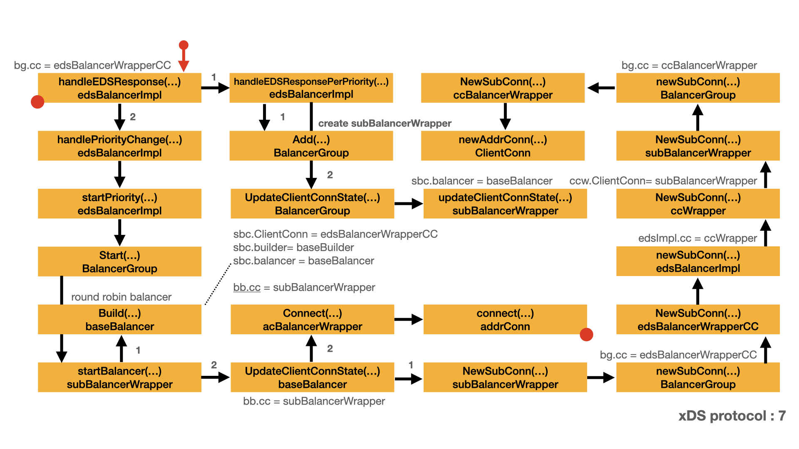

# xDS protocol - CDS/EDS

- [Connect to upstream server](#connect-to-upstream-server)
  - [Add sub balancer](#add-sub-balancer)
  - [Start balancer](#start-balancer)
  - [Update connection state](#update-connection-state)
  - [Prepare for the sub-connection](#prepare-for-the-sub-connection)
  - [Start connection](#start-connection)
  - [Which balancer, which `ClientConn` ?](#which-balancer-which-clientconn-)
  - [Connect endpoint](conn2.md#connect-endpoint)
  - [Update sub-connection state](conn2.md#update-sub-connection-state)
  - [Update state](conn2.md#update-state)
  - [Get notification](conn2.md#get-notification)

## Connect to upstream server

EDS response endpoints is re-ordered by priority. Each priority has a balancer group. Each priority contains several localities. Each locality contains several endpoints. Each locality has a sub-balancer for those endpoints. Each locality is a member of the previous balancer group.

This is the second article of EDS processing. xDS protocol is a complex protocol. Compare with `pickfirst` balancer, xDS needs more steps to connect with the upstream server. After the [Process EDS update](eds2.md#process-eds-update), we are ready to initialize endpoints by priority. Only the priority in use is started, other priority locality is waiting for start.

In this stage, we continue the discussion of xDS protocol: connect to upstream server.  Here is the map for this stage. In this map:

- Yellow box represents the important type and method/function.
- Arrow represents the call direction and order.
- Left red dot represents the box is a continue part from other map.
- Right red dot represents there is a extension map for that box.



In `handleEDSResponse()`, there are some important fields need to be mentioned.

- Here, `bgwc.bg` is created through calling `balancergroup.New()`. The argument for `cc balancer.ClientConn` parameter is `ccPriorityWrapper`.
- That means `bgwc.bg.cc` field is of type `edsBalancerWrapperCC`.
- The `stateAggregator` field of `bgwc` is of type `weightedaggregator.Aggregator`.

```go
// handleEDSResponse handles the EDS response and creates/deletes localities and
// SubConns. It also handles drops.
//
// HandleChildPolicy and HandleEDSResponse must be called by the same goroutine.
func (edsImpl *edsBalancerImpl) handleEDSResponse(edsResp xdsclient.EndpointsUpdate) {
+-- 45 lines: TODO: Unhandled fields from EDS response:··································································································
    for priority, newLocalities := range newLocalitiesWithPriority {
        if !priorityLowest.isSet() || priorityLowest.higherThan(priority) {
            priorityLowest = priority
        }

        bgwc, ok := edsImpl.priorityToLocalities[priority]
        if !ok {
            // Create balancer group if it's never created (this is the first
            // time this priority is received). We don't start it here. It may
            // be started when necessary (e.g. when higher is down, or if it's a
            // new lowest priority).
            ccPriorityWrapper := edsImpl.ccWrapperWithPriority(priority)
            stateAggregator := weightedaggregator.New(ccPriorityWrapper, edsImpl.logger, newRandomWRR)
            bgwc = &balancerGroupWithConfig{
                bg:              balancergroup.New(ccPriorityWrapper, stateAggregator, edsImpl.loadReporter, edsImpl.logger),
                stateAggregator: stateAggregator,
                configs:         make(map[internal.LocalityID]*localityConfig),
            }
            edsImpl.priorityToLocalities[priority] = bgwc
            priorityChanged = true
            edsImpl.logger.Infof("New priority %v added", priority)
        }
        edsImpl.handleEDSResponsePerPriority(bgwc, newLocalities)
    }
    edsImpl.priorityLowest = priorityLowest
+-- 16 lines: Delete priorities that are removed in the latest response, and also close··································································
    if priorityChanged {
        edsImpl.handlePriorityChange()
    }
}

func (edsImpl *edsBalancerImpl) ccWrapperWithPriority(priority priorityType) *edsBalancerWrapperCC {
    return &edsBalancerWrapperCC{
        ClientConn: edsImpl.cc,
        priority:   priority,
        parent:     edsImpl,
    }
}

// New creates a new BalancerGroup. Note that the BalancerGroup
// needs to be started to work.
func New(cc balancer.ClientConn, stateAggregator BalancerStateAggregator, loadStore load.PerClusterReporter, logger *grpclog.PrefixLogger) *BalancerGroup {
    return &BalancerGroup{
        cc:        cc,
        logger:    logger,
        loadStore: loadStore,

        stateAggregator: stateAggregator,

        idToBalancerConfig: make(map[string]*subBalancerWrapper),
        balancerCache:      cache.NewTimeoutCache(DefaultSubBalancerCloseTimeout),
        scToSubBalancer:    make(map[balancer.SubConn]*subBalancerWrapper),
    }
}
```

`edsImpl.handleEDSResponsePerPriority()` creates a sub-balancer for each locality, the sub-balancer contains the address of all the endpoints.

In `handleEDSResponsePerPriority()`, for each `locality`, if the `locality` doesn't exist in `bgwc.configs`, calls `bgwc.bg.Add()` to add it.

- `bgwc.bg.Add()` is actually `BalancerGroup.Add()`.
- `edsImpl.subBalancerBuilder` is the argument for the `builder balancer.Builder` parameter.
- `lidJSON` is the JSON representation of `locality.ID`, as the argument for the `id string` parameter.

If the `locality` is added, which means `addrsChanged = true`, `handleEDSResponsePerPriority()` calls `bgwc.bg.UpdateClientConnState()` to forward the request to `bgwc.bg`.

- `bgwc.bg.UpdateClientConnState()` is actually `BalancerGroup.UpdateClientConnState()`.
- Here, `bgwc` is the `balancerGroupWithConfig` parameter passed to `handleEDSResponsePerPriority()`.
- `bgwc` is created in previous `handleEDSResponse()`.
- `bgwc.bg` is also created in previous `handleEDSResponse()`. `bgwc.bg.cc` is of type `edsBalancerWrapperCC`.

Let's discuss the `BalancerGroup.Add()` first.

```go
func (edsImpl *edsBalancerImpl) handleEDSResponsePerPriority(bgwc *balancerGroupWithConfig, newLocalities []xdsclient.Locality) {
    // newLocalitiesSet contains all names of localities in the new EDS response
    // for the same priority. It's used to delete localities that are removed in
    // the new EDS response.
    newLocalitiesSet := make(map[internal.LocalityID]struct{})
    var rebuildStateAndPicker bool
    for _, locality := range newLocalities {
        // One balancer for each locality.

        lid := locality.ID
        lidJSON, err := lid.ToString()
        if err != nil {
            edsImpl.logger.Errorf("failed to marshal LocalityID: %#v, skipping this locality", lid)
            continue
        }
        newLocalitiesSet[lid] = struct{}{}

        newWeight := locality.Weight
        var newAddrs []resolver.Address
        for _, lbEndpoint := range locality.Endpoints {
            // Filter out all "unhealthy" endpoints (unknown and
            // healthy are both considered to be healthy:
            // https://www.envoyproxy.io/docs/envoy/latest/api-v2/api/v2/core/health_check.proto#envoy-api-enum-core-healthstatus).
            if lbEndpoint.HealthStatus != xdsclient.EndpointHealthStatusHealthy &&
                lbEndpoint.HealthStatus != xdsclient.EndpointHealthStatusUnknown {
                continue
            }

            address := resolver.Address{
                Addr: lbEndpoint.Address,
            }
            if edsImpl.subBalancerBuilder.Name() == weightedroundrobin.Name && lbEndpoint.Weight != 0 {
                ai := weightedroundrobin.AddrInfo{Weight: lbEndpoint.Weight}
                address = weightedroundrobin.SetAddrInfo(address, ai)
                // Metadata field in resolver.Address is deprecated. The
                // attributes field should be used to specify arbitrary
                // attributes about the address. We still need to populate the
                // Metadata field here to allow users of this field to migrate
                // to the new one.
                // TODO(easwars): Remove this once all users have migrated.
                // See https://github.com/grpc/grpc-go/issues/3563.
                address.Metadata = &ai
            }
            newAddrs = append(newAddrs, address)
        }
        var weightChanged, addrsChanged bool
        config, ok := bgwc.configs[lid]
        if !ok {
            // A new balancer, add it to balancer group and balancer map.
            bgwc.stateAggregator.Add(lidJSON, newWeight)
            bgwc.bg.Add(lidJSON, edsImpl.subBalancerBuilder)
            config = &localityConfig{
                weight: newWeight,
            }
            bgwc.configs[lid] = config

            // weightChanged is false for new locality, because there's no need
            // to update weight in bg.
            addrsChanged = true
            edsImpl.logger.Infof("New locality %v added", lid)
        } else {
            // Compare weight and addrs.
            if config.weight != newWeight {
                weightChanged = true
            }
            if !cmp.Equal(config.addrs, newAddrs) {
                addrsChanged = true
            }
            edsImpl.logger.Infof("Locality %v updated, weightedChanged: %v, addrsChanged: %v", lid, weightChanged, addrsChanged)
        }

        if weightChanged {
            config.weight = newWeight
            bgwc.stateAggregator.UpdateWeight(lidJSON, newWeight)
            rebuildStateAndPicker = true
        }

        if addrsChanged {
            config.addrs = newAddrs
            bgwc.bg.UpdateClientConnState(lidJSON, balancer.ClientConnState{
                ResolverState: resolver.State{Addresses: newAddrs},
            })
        }
    }

    // Delete localities that are removed in the latest response.
    for lid := range bgwc.configs {
        lidJSON, err := lid.ToString()
        if err != nil {
            edsImpl.logger.Errorf("failed to marshal LocalityID: %#v, skipping this locality", lid)
            continue
        }
        if _, ok := newLocalitiesSet[lid]; !ok {
            bgwc.stateAggregator.Remove(lidJSON)
            bgwc.bg.Remove(lidJSON)
            delete(bgwc.configs, lid)
            edsImpl.logger.Infof("Locality %v deleted", lid)
            rebuildStateAndPicker = true
        }
    }

    if rebuildStateAndPicker {
        bgwc.stateAggregator.BuildAndUpdate()
    }
}
```

### Add sub balancer

One of the parameter for `BalancerGroup.Add()` is `edsImpl.subBalancerBuilder`. `edsImpl.subBalancerBuilder` is initialized when `edsImpl` is created. It gets the value from `balancer.Get(roundrobin.Name)`: the round-robin balancer builder.

- `balancer.Get(roundrobin.Name)` returns `baseBuilder` with `name` parameter as `"round_robin"`
- That's why we call it: round-robin balancer builder.
- Which means `edsBalancerImpl.subBalancerBuilder` is of type `baseBuilder`.

```go
// newEDSBalancerImpl create a new edsBalancerImpl.
func newEDSBalancerImpl(cc balancer.ClientConn, enqueueState func(priorityType, balancer.State), lr load.PerClusterReporter, logger *grpclog.PrefixLogger) *edsBalancerImpl {
    edsImpl := &edsBalancerImpl{
        cc:                 cc,
        logger:             logger,
        subBalancerBuilder: balancer.Get(roundrobin.Name),
        loadReporter:       lr,

        enqueueChildBalancerStateUpdate: enqueueState,

        priorityToLocalities: make(map[priorityType]*balancerGroupWithConfig),
        priorityToState:      make(map[priorityType]*balancer.State),
        subConnToPriority:    make(map[balancer.SubConn]priorityType),
    }
    // Don't start balancer group here. Start it when handling the first EDS
    // response. Otherwise the balancer group will be started with round-robin,
    // and if users specify a different sub-balancer, all balancers in balancer
    // group will be closed and recreated when sub-balancer update happens.
    return edsImpl
}

// Name is the name of round_robin balancer.
const Name = "round_robin"

// newBuilder creates a new roundrobin balancer builder.
func newBuilder() balancer.Builder {
    return base.NewBalancerBuilder(Name, &rrPickerBuilder{}, base.Config{HealthCheck: true})
}

func init() {
    balancer.Register(newBuilder())
}

// NewBalancerBuilder returns a base balancer builder configured by the provided config.
func NewBalancerBuilder(name string, pb PickerBuilder, config Config) balancer.Builder {
    return &baseBuilder{
        name:          name,
        pickerBuilder: pb,
        config:        config,
    }
}
```

`BalancerGroup.Add()` creates a `subBalancerWrapper`, which wraps the real `balancer`.

- Here, the `group` field of `sbc` is assigned the value of `bg`.
- Please note that `subBalancerWrapper.ClientConn` get the value from `bg.cc`, while `bgwc.bg.cc` is of type `edsBalancerWrapperCC`.
- Which means `subBalancerWrapper.ClientConn` is of type `edsBalancerWrapperCC`.
- In our case, the first EDS response, `bg.outgoingStarted` is false. `sbc.startBalancer()` will not be called.

`sbc.startBalancer()` is not called, which means the sub-balancer for this locality just hold the static data, it will not connect with the upstream server.

```go
// Add adds a balancer built by builder to the group, with given id.
func (bg *BalancerGroup) Add(id string, builder balancer.Builder) {
    // Store data in static map, and then check to see if bg is started.
    bg.outgoingMu.Lock()
    var sbc *subBalancerWrapper
    // If outgoingStarted is true, search in the cache. Otherwise, cache is
    // guaranteed to be empty, searching is unnecessary.
    if bg.outgoingStarted {
        if old, ok := bg.balancerCache.Remove(id); ok {
            sbc, _ = old.(*subBalancerWrapper)
            if sbc != nil && sbc.builder != builder {
                // If the sub-balancer in cache was built with a different
                // balancer builder, don't use it, cleanup this old-balancer,
                // and behave as sub-balancer is not found in cache.
                //
                // NOTE that this will also drop the cached addresses for this
                // sub-balancer, which seems to be reasonable.
                sbc.stopBalancer()
                // cleanupSubConns must be done before the new balancer starts,
                // otherwise new SubConns created by the new balancer might be
                // removed by mistake.
                bg.cleanupSubConns(sbc)
                sbc = nil
            }
        }
    }
    if sbc == nil {
        sbc = &subBalancerWrapper{
            ClientConn: bg.cc,
            id:         id,
            group:      bg,
            builder:    builder,
        }
        if bg.outgoingStarted {
            // Only start the balancer if bg is started. Otherwise, we only keep the
            // static data.
            sbc.startBalancer()
        }
    } else {
        // When brining back a sub-balancer from cache, re-send the cached
        // picker and state.
        sbc.updateBalancerStateWithCachedPicker()
    }
    bg.idToBalancerConfig[id] = sbc
    bg.outgoingMu.Unlock()
}
```

After sub-balancer is created and added to the balancer group, `handleEDSResponsePerPriority()` calls `bgwc.bg.UpdateClientConnState()` to forward the request to balancer group. In `BalancerGroup.UpdateClientConnState()`,

- `bg.idToBalancerConfig[id]` is checked, if `id` exists, then calls `config.updateClientConnState()`.
- Here, `config` is of type `*subBalancerWrapper`.
- `bg.idToBalancerConfig[id]` is created in `BalancerGroup.Add()`.
- `config.updateClientConnState()` is actually `subBalancerWrapper.updateClientConnState()`.

```go
// UpdateClientConnState handles ClientState (including balancer config and
// addresses) from resolver. It finds the balancer and forwards the update.
func (bg *BalancerGroup) UpdateClientConnState(id string, s balancer.ClientConnState) error {
    bg.outgoingMu.Lock()
    defer bg.outgoingMu.Unlock()
    if config, ok := bg.idToBalancerConfig[id]; ok {
        return config.updateClientConnState(s)
    }
    return nil
}
```

In `subBalancerWrapper.updateClientConnState()`,  `sbc.ccState` is set. While this sub-balancer is not started, the `sbc.balancer` field is nil.

- Here the important thing is the `sbc.ccState` field is set.

Add sub balancer is initialized and ready to be started.

```go
func (sbc *subBalancerWrapper) updateClientConnState(s balancer.ClientConnState) error {
    sbc.ccState = &s
    b := sbc.balancer
    if b == nil {
        // This sub-balancer was closed. This should never happen because
        // sub-balancers are closed when the locality is removed from EDS, or
        // the balancer group is closed. There should be no further address
        // updates when either of this happened.
        //
        // This will be a common case with priority support, because a
        // sub-balancer (and the whole balancer group) could be closed because
        // it's the lower priority, but it can still get address updates.
        return nil
    }
    return b.UpdateClientConnState(s)
}

```

### Start balancer

Now all the locality has a sub-balancer. `handleEDSResponse()` calls `edsImpl.handlePriorityChange()` to activate some of the balancer.

`handlePriorityChange()` handles several cases of priority change. Here, we focus on the first EDS response case. For that case, `handlePriorityChange()` calls `edsImpl.startPriority()`

```go
// handlePriorityChange handles priority after EDS adds/removes a
// priority.
//
// - If all priorities were deleted, unset priorityInUse, and set parent
// ClientConn to TransientFailure
// - If priorityInUse wasn't set, this is either the first EDS resp, or the
// previous EDS resp deleted everything. Set priorityInUse to 0, and start 0.
// - If priorityInUse was deleted, send the picker from the new lowest priority
// to parent ClientConn, and set priorityInUse to the new lowest.
// - If priorityInUse has a non-Ready state, and also there's a priority lower
// than priorityInUse (which means a lower priority was added), set the next
// priority as new priorityInUse, and start the bg.
func (edsImpl *edsBalancerImpl) handlePriorityChange() {
    edsImpl.priorityMu.Lock()
    defer edsImpl.priorityMu.Unlock()

    // Everything was removed by EDS.
    if !edsImpl.priorityLowest.isSet() {
        edsImpl.priorityInUse = newPriorityTypeUnset()
        // Stop the init timer. This can happen if the only priority is removed
        // shortly after it's added.
        if timer := edsImpl.priorityInitTimer; timer != nil {
            timer.Stop()
            edsImpl.priorityInitTimer = nil
        }
        edsImpl.cc.UpdateState(balancer.State{ConnectivityState: connectivity.TransientFailure, Picker: base.NewErrPicker(errAllPrioritiesRemoved)})
        return
    }

    // priorityInUse wasn't set, use 0.
    if !edsImpl.priorityInUse.isSet() {
        edsImpl.logger.Infof("Switching priority from unset to %v", 0)
        edsImpl.startPriority(newPriorityType(0))
        return
    }

    // priorityInUse was deleted, use the new lowest.
    if _, ok := edsImpl.priorityToLocalities[edsImpl.priorityInUse]; !ok {
        oldP := edsImpl.priorityInUse
        edsImpl.priorityInUse = edsImpl.priorityLowest
        edsImpl.logger.Infof("Switching priority from %v to %v, because former was deleted", oldP, edsImpl.priorityInUse)
        if s, ok := edsImpl.priorityToState[edsImpl.priorityLowest]; ok {
            edsImpl.cc.UpdateState(*s)
        } else {
            // If state for priorityLowest is not found, this means priorityLowest was
            // started, but never sent any update. The init timer fired and
            // triggered the next priority. The old_priorityInUse (that was just
            // deleted EDS) was picked later.
            //
            // We don't have an old state to send to parent, but we also don't
            // want parent to keep using picker from old_priorityInUse. Send an
            // update to trigger block picks until a new picker is ready.
            edsImpl.cc.UpdateState(balancer.State{ConnectivityState: connectivity.Connecting, Picker: base.NewErrPicker(balancer.ErrNoSubConnAvailable)})
        }
        return
    }

    // priorityInUse is not ready, look for next priority, and use if found.
    if s, ok := edsImpl.priorityToState[edsImpl.priorityInUse]; ok && s.ConnectivityState != connectivity.Ready {
        pNext := edsImpl.priorityInUse.nextLower()
        if _, ok := edsImpl.priorityToLocalities[pNext]; ok {
            edsImpl.logger.Infof("Switching priority from %v to %v, because latter was added, and former wasn't Ready")
            edsImpl.startPriority(pNext)
        }
    }
}
```

`startPriority()` sets `priorityInUse` to the specified parameter, in our case, it's priority 0. `startPriority()` also starts the balancer group.

- `startPriority()` calls `p.stateAggregator.Start()` to start the `Aggregator`.
- `startPriority()` calls `p.bg.Start()` to start the `BalancerGroup`.

```go
// startPriority sets priorityInUse to p, and starts the balancer group for p.
// It also starts a timer to fall to next priority after timeout.
//
// Caller must hold priorityMu, priority must exist, and edsImpl.priorityInUse
// must be non-nil.
func (edsImpl *edsBalancerImpl) startPriority(priority priorityType) {
    edsImpl.priorityInUse = priority
    p := edsImpl.priorityToLocalities[priority]
    // NOTE: this will eventually send addresses to sub-balancers. If the
    // sub-balancer tries to update picker, it will result in a deadlock on
    // priorityMu in the update is handled synchronously. The deadlock is
    // currently avoided by handling balancer update in a goroutine (the run
    // goroutine in the parent eds balancer). When priority balancer is split
    // into its own, this asynchronous state handling needs to be copied.
    p.stateAggregator.Start()
    p.bg.Start()
    // startPriority can be called when
    // 1. first EDS resp, start p0
    // 2. a high priority goes Failure, start next
    // 3. a high priority init timeout, start next
    //
    // In all the cases, the existing init timer is either closed, also already
    // expired. There's no need to close the old timer.
    edsImpl.priorityInitTimer = time.AfterFunc(defaultPriorityInitTimeout, func() {
        edsImpl.priorityMu.Lock()
        defer edsImpl.priorityMu.Unlock()
        if !edsImpl.priorityInUse.isSet() || !edsImpl.priorityInUse.equal(priority) {
            return
        }
        edsImpl.priorityInitTimer = nil
        pNext := priority.nextLower()
        if _, ok := edsImpl.priorityToLocalities[pNext]; ok {
            edsImpl.startPriority(pNext)
        }
    })
}
```

`Aggregator.Start()` just set the `wbsa.started` to true.

```go
// Start starts the aggregator. It can be called after Close to restart the
// aggretator.
func (wbsa *Aggregator) Start() {
    wbsa.mu.Lock()
    defer wbsa.mu.Unlock()
    wbsa.started = true
}
```

`BalancerGroup.Start()` starts all the sub-balancers for this priority.

- `BalancerGroup.Start()` sets the `bg.incomingStarted` and `bg.outgoingStarted` to true.
- For each locality, `BalancerGroup.Start()` calls `config.startBalancer()` to start the sub-balancer.
- `config.startBalancer()` is `subBalancerWrapper.startBalancer()`.

```go
// Start starts the balancer group, including building all the sub-balancers,
// and send the existing addresses to them.
//
// A BalancerGroup can be closed and started later. When a BalancerGroup is
// closed, it can still receive address updates, which will be applied when
// restarted.
func (bg *BalancerGroup) Start() {
    bg.incomingMu.Lock()
    bg.incomingStarted = true
    bg.incomingMu.Unlock()

    bg.outgoingMu.Lock()
    if bg.outgoingStarted {
        bg.outgoingMu.Unlock()
        return
    }

    for _, config := range bg.idToBalancerConfig {
        config.startBalancer()
    }
    bg.outgoingStarted = true
    bg.outgoingMu.Unlock()
}
```

`subBalancerWrapper.startBalancer()` calls `sbc.builder.Build()` to create a balancer. `sbc.builder.Build()` is actually `baseBuilder.Build()`.

- `baseBuilder.Build()` returns `baseBalancer`.
- `baseBalancer` is assigned to `sbc.balancer`. Which means `sbc.balancer` is of type `baseBalancer`.
- Please note that `startBalancer()` uses `sbc` as the `cc ClientConn` parameter, which means `baseBalancer.cc` is of type `subBalancerWrapper`.  

`subBalancerWrapper.startBalancer()` calls `b.UpdateClientConnState()`, which is actually `baseBalancer.UpdateClientConnState()`.

```go
func (sbc *subBalancerWrapper) startBalancer() {
    b := sbc.builder.Build(sbc, balancer.BuildOptions{})
    sbc.group.logger.Infof("Created child policy %p of type %v", b, sbc.builder.Name())
    sbc.balancer = b
    if sbc.ccState != nil {
        b.UpdateClientConnState(*sbc.ccState)
    }
}

func (bb *baseBuilder) Build(cc balancer.ClientConn, opt balancer.BuildOptions) balancer.Balancer {
    bal := &baseBalancer{
        cc:            cc,
        pickerBuilder: bb.pickerBuilder,

        subConns: make(map[resolver.Address]balancer.SubConn),
        scStates: make(map[balancer.SubConn]connectivity.State),
        csEvltr:  &balancer.ConnectivityStateEvaluator{},
        config:   bb.config,
    }
    // Initialize picker to a picker that always returns
    // ErrNoSubConnAvailable, because when state of a SubConn changes, we
    // may call UpdateState with this picker.
    bal.picker = NewErrPicker(balancer.ErrNoSubConnAvailable)
    return bal
}
```

### Update connection state

In `baseBalancer.UpdateClientConnState()`, for each item in `s.ResolverState.Addresses`, `b.cc.NewSubConn()` and `sc.Connect()` is called. `UpdateClientConnState()` will creates the sub-connections with the upstream endpoints. The sub-connection is stored in `b.subConns`.

- `b.cc` is `subBalancerWrapper`. `b.cc.NewSubConn()` is actually `subBalancerWrapper.NewSubConn()`.
- The final return type of `b.cc.NewSubConn()` is `acBalancerWrapper`. `sc` is of type interface `SubConn`.
- `sc.Connect()` is actually `acBalancerWrapper.Connect()`.

`subBalancerWrapper.NewSubConn()` will build the necessary data structure for sub-connection. `acBalancerWrapper.Connect()` will create the transport connection.

Let's first discuss `subBalancerWrapper.NewSubConn()`. `acBalancerWrapper.Connect()` needs more steps to finish the job.

```go
func (b *baseBalancer) UpdateClientConnState(s balancer.ClientConnState) error {
    // TODO: handle s.ResolverState.ServiceConfig?
    if logger.V(2) {
        logger.Info("base.baseBalancer: got new ClientConn state: ", s)
    }
    // Successful resolution; clear resolver error and ensure we return nil.
    b.resolverErr = nil
    // addrsSet is the set converted from addrs, it's used for quick lookup of an address.
    addrsSet := make(map[resolver.Address]struct{})
    for _, a := range s.ResolverState.Addresses {
        // Strip attributes from addresses before using them as map keys. So
        // that when two addresses only differ in attributes pointers (but with
        // the same attribute content), they are considered the same address.
        //
        // Note that this doesn't handle the case where the attribute content is
        // different. So if users want to set different attributes to create
        // duplicate connections to the same backend, it doesn't work. This is
        // fine for now, because duplicate is done by setting Metadata today.
        //
        // TODO: read attributes to handle duplicate connections.
        aNoAttrs := a
        aNoAttrs.Attributes = nil
        addrsSet[aNoAttrs] = struct{}{}
        if sc, ok := b.subConns[aNoAttrs]; !ok {
            // a is a new address (not existing in b.subConns).
            //
            // When creating SubConn, the original address with attributes is
            // passed through. So that connection configurations in attributes
            // (like creds) will be used.
            sc, err := b.cc.NewSubConn([]resolver.Address{a}, balancer.NewSubConnOptions{HealthCheckEnabled: b.config.HealthCheck})
            if err != nil {
                logger.Warningf("base.baseBalancer: failed to create new SubConn: %v", err)
                continue
            }
            b.subConns[aNoAttrs] = sc
            b.scStates[sc] = connectivity.Idle
            sc.Connect()
        } else {
            // Always update the subconn's address in case the attributes
            // changed.
            //
            // The SubConn does a reflect.DeepEqual of the new and old
            // addresses. So this is a noop if the current address is the same
            // as the old one (including attributes).
            sc.UpdateAddresses([]resolver.Address{a})
        }
    }
    for a, sc := range b.subConns {
        // a was removed by resolver.
        if _, ok := addrsSet[a]; !ok {
            b.cc.RemoveSubConn(sc)
            delete(b.subConns, a)
            // Keep the state of this sc in b.scStates until sc's state becomes Shutdown.
            // The entry will be deleted in UpdateSubConnState.
        }
    }
    // If resolver state contains no addresses, return an error so ClientConn
    // will trigger re-resolve. Also records this as an resolver error, so when
    // the overall state turns transient failure, the error message will have
    // the zero address information.
    if len(s.ResolverState.Addresses) == 0 {
        b.ResolverError(errors.New("produced zero addresses"))
        return balancer.ErrBadResolverState
    }
    return nil
}
```

### Prepare for the sub-connection

`subBalancerWrapper.NewSubConn()` will create the necessary data structure for the sub-connection for each endpoint address.

- `subBalancerWrapper.NewSubConn()` calls `sbc.group.newSubConn()`, which is actually `BalancerGroup.newSubConn()`.
- `BalancerGroup.newSubConn()` calls `bg.cc.NewSubConn()`. From the previous section, `bg.cc` is of type `edsBalancerWrapperCC`.
- Which means `bg.cc.NewSubConn()` is actually `edsBalancerWrapperCC.NewSubConn()`.
- `edsBalancerWrapperCC.NewSubConn()` calls `edsBalancerImpl.newSubConn()`.
- `edsBalancerImpl.newSubConn()` calls `edsImpl.cc.NewSubConn()`, From the previous section, `edsImpl.cc` is of type `ccWrapper`.
- Which means `edsImpl.cc.NewSubConn()` is actually `ccWrapper.NewSubConn()`.
- `ccWrapper.NewSubConn()` calls `ccw.ClientConn.NewSubConn()`, `ccw.ClientConn` is of type `subBalancerWrapper`.
- Which means `ccw.ClientConn.NewSubConn()` is actually `subBalancerWrapper.NewSubConn()`.
- `subBalancerWrapper.NewSubConn()` calls `BalancerGroup.newSubConn()`.
- For `BalancerGroup.newSubConn()`, this time, `bg.cc` is of type `ccBalancerWrapper`. So `BalancerGroup.newSubConn()` calls `ccBalancerWrapper.NewSubConn()`.
- `ccBalancerWrapper.NewSubConn()` calls `ccb.cc.newAddrConn()`, which is actually `ClientConn.newAddrConn()`.

```go
// NewSubConn overrides balancer.ClientConn, so balancer group can keep track of
// the relation between subconns and sub-balancers.
func (sbc *subBalancerWrapper) NewSubConn(addrs []resolver.Address, opts balancer.NewSubConnOptions) (balancer.SubConn, error) {
    return sbc.group.newSubConn(sbc, addrs, opts)
}

// Following are actions from sub-balancers, forward to ClientConn.

// newSubConn: forward to ClientConn, and also create a map from sc to balancer,
// so state update will find the right balancer.
//
// One note about removing SubConn: only forward to ClientConn, but not delete
// from map. Delete sc from the map only when state changes to Shutdown. Since
// it's just forwarding the action, there's no need for a removeSubConn()
// wrapper function.
func (bg *BalancerGroup) newSubConn(config *subBalancerWrapper, addrs []resolver.Address, opts balancer.NewSubConnOptions) (balancer.SubConn, error) {
    // NOTE: if balancer with id was already removed, this should also return
    // error. But since we call balancer.stopBalancer when removing the balancer, this
    // shouldn't happen.
    bg.incomingMu.Lock()
    if !bg.incomingStarted {
        bg.incomingMu.Unlock()
        return nil, fmt.Errorf("NewSubConn is called after balancer group is closed")
    }
    sc, err := bg.cc.NewSubConn(addrs, opts)
    if err != nil {
        bg.incomingMu.Unlock()
        return nil, err
    }
    bg.scToSubBalancer[sc] = config
    bg.incomingMu.Unlock()
    return sc, nil
}

// edsBalancerWrapperCC implements the balancer.ClientConn API and get passed to
// each balancer group. It contains the locality priority.
type edsBalancerWrapperCC struct {
    balancer.ClientConn
    priority priorityType
    parent   *edsBalancerImpl
}

func (ebwcc *edsBalancerWrapperCC) NewSubConn(addrs []resolver.Address, opts balancer.NewSubConnOptions) (balancer.SubConn, error) {
    return ebwcc.parent.newSubConn(ebwcc.priority, addrs, opts)
}

func (edsImpl *edsBalancerImpl) newSubConn(priority priorityType, addrs []resolver.Address, opts balancer.NewSubConnOptions) (balancer.SubConn, error) {
    sc, err := edsImpl.cc.NewSubConn(addrs, opts)
    if err != nil {
        return nil, err
    }
    edsImpl.subConnMu.Lock()
    edsImpl.subConnToPriority[sc] = priority
    edsImpl.subConnMu.Unlock()
    return sc, nil
}

// NewSubConn intercepts NewSubConn() calls from the child policy and adds an
// address attribute which provides all information required by the xdsCreds
// handshaker to perform the TLS handshake.
func (ccw *ccWrapper) NewSubConn(addrs []resolver.Address, opts balancer.NewSubConnOptions) (balancer.SubConn, error) {
    newAddrs := make([]resolver.Address, len(addrs))
    for i, addr := range addrs {
        newAddrs[i] = xdsinternal.SetHandshakeInfo(addr, ccw.xdsHI)
    }
    return ccw.ClientConn.NewSubConn(newAddrs, opts)
}

// NewSubConn overrides balancer.ClientConn, so balancer group can keep track of  
// the relation between subconns and sub-balancers.                        
func (sbc *subBalancerWrapper) NewSubConn(addrs []resolver.Address, opts balancer.NewSubConnOptions) (balancer.SubConn, error) {
        return sbc.group.newSubConn(sbc, addrs, opts)
}

func (ccb *ccBalancerWrapper) NewSubConn(addrs []resolver.Address, opts balancer.NewSubConnOptions) (balancer.SubConn, error) {
    if len(addrs) <= 0 {
        return nil, fmt.Errorf("grpc: cannot create SubConn with empty address list")
    }
    ccb.mu.Lock()
    defer ccb.mu.Unlock()
    if ccb.subConns == nil {
        return nil, fmt.Errorf("grpc: ClientConn balancer wrapper was closed")
    }
    ac, err := ccb.cc.newAddrConn(addrs, opts)
    if err != nil {
        return nil, err
    }
    acbw := &acBalancerWrapper{ac: ac}
    acbw.ac.mu.Lock()
    ac.acbw = acbw
    acbw.ac.mu.Unlock()
    ccb.subConns[acbw] = struct{}{}
    return acbw, nil
}

// newAddrConn creates an addrConn for addrs and adds it to cc.conns.
//
// Caller needs to make sure len(addrs) > 0.
func (cc *ClientConn) newAddrConn(addrs []resolver.Address, opts balancer.NewSubConnOptions) (*addrConn, error) {
    ac := &addrConn{
        state:        connectivity.Idle,
        cc:           cc,
        addrs:        addrs,
        scopts:       opts,
        dopts:        cc.dopts,
        czData:       new(channelzData),
        resetBackoff: make(chan struct{}),
    }
    ac.ctx, ac.cancel = context.WithCancel(cc.ctx)
    // Track ac in cc. This needs to be done before any getTransport(...) is called.
    cc.mu.Lock()
    if cc.conns == nil {
        cc.mu.Unlock()
        return nil, ErrClientConnClosing
    }
    if channelz.IsOn() {
        ac.channelzID = channelz.RegisterSubChannel(ac, cc.channelzID, "")
        channelz.AddTraceEvent(logger, ac.channelzID, 0, &channelz.TraceEventDesc{
            Desc:     "Subchannel Created",
            Severity: channelz.CtInfo,
            Parent: &channelz.TraceEventDesc{
                Desc:     fmt.Sprintf("Subchannel(id:%d) created", ac.channelzID),
                Severity: channelz.CtInfo,
            },
        })
    }
    cc.conns[ac] = struct{}{}
    cc.mu.Unlock()
    return ac, nil
}
```

### Start connection

`acBalancerWrapper.Connect()` is the real connection with the endpoint. Generally, the process is similar to [Dial process part I](dial.md#dial-process-part-i).

- `acBalancerWrapper.Connect()` calls `acbw.ac.connect()`, which is actually `addrConn.connect()`
- There is a dedicated article about `addrConn.connect()`. See [Connect endpoint](conn2.md) for detail.

```go
func (acbw *acBalancerWrapper) Connect() {
    acbw.mu.Lock()
    defer acbw.mu.Unlock()
    acbw.ac.connect()
}

// connect starts creating a transport.
// It does nothing if the ac is not IDLE.
// TODO(bar) Move this to the addrConn section.
func (ac *addrConn) connect() error {
    ac.mu.Lock()
    if ac.state == connectivity.Shutdown {
        ac.mu.Unlock()
        return errConnClosing
    }
    if ac.state != connectivity.Idle {
        ac.mu.Unlock()
        return nil
    }
    // Update connectivity state within the lock to prevent subsequent or
    // concurrent calls from resetting the transport more than once.
    ac.updateConnectivityState(connectivity.Connecting, nil)
    ac.mu.Unlock()

    // Start a goroutine connecting to the server asynchronously.
    go ac.resetTransport()
    return nil
}
```

### Which balancer, which `ClientConn` ?

Before we continue the discussion of `acBalancerWrapper.Connect()`, let's find out some key value of balancer and `ClientConn`/`cc`. If you understand the value of them, it will be easier to understand the following code.

- In `ClientConn.switchBalancer()`, `newCCBalancerWrapper()` is called to create `ccBalancerWrapper`.
  - `ccBalancerWrapper.cc` is of type `ClientConn`.
  - In `newCCBalancerWrapper()`, `b.Build()` uses `ccb` as `cc balancer.ClientConn` parameter, `ccb` is of type `ccBalancerWrapper`.
  - In `newCCBalancerWrapper()`, `b.Build()` is actually `builder.Build()`. It's the balancer cluster manager.
    - In `builder.Build()`, `b.bg` is of type `BalancerGroup`.
    - In `balancergroup.New()`, `b.bg.cc` is of type `ccBalancerWrapper`.

```go
func newCCBalancerWrapper(cc *ClientConn, b balancer.Builder, bopts balancer.BuildOptions) *ccBalancerWrapper {
    ccb := &ccBalancerWrapper{
        cc:       cc,
        scBuffer: buffer.NewUnbounded(),
        done:     grpcsync.NewEvent(),
        subConns: make(map[*acBalancerWrapper]struct{}),
    }
    go ccb.watcher()
    ccb.balancer = b.Build(ccb, bopts)
    return ccb
}

type builder struct{}

func (builder) Build(cc balancer.ClientConn, _ balancer.BuildOptions) balancer.Balancer {
    b := &bal{}
    b.logger = prefixLogger(b)
    b.stateAggregator = newBalancerStateAggregator(cc, b.logger)
    b.stateAggregator.start()
    b.bg = balancergroup.New(cc, b.stateAggregator, nil, b.logger)
    b.bg.Start()
    b.logger.Infof("Created")
    return b
}

func (builder) Name() string {
    return balancerName
}

func (builder) ParseConfig(c json.RawMessage) (serviceconfig.LoadBalancingConfig, error) {
    return parseConfig(c)
}

// New creates a new BalancerGroup. Note that the BalancerGroup
// needs to be started to work.
func New(cc balancer.ClientConn, stateAggregator BalancerStateAggregator, loadStore load.PerClusterReporter, logger *grpclog.PrefixLogger) *BalancerGroup {
    return &BalancerGroup{
        cc:        cc,
        logger:    logger,
        loadStore: loadStore,

        stateAggregator: stateAggregator,

        idToBalancerConfig: make(map[string]*subBalancerWrapper),
        balancerCache:      cache.NewTimeoutCache(DefaultSubBalancerCloseTimeout),
        scToSubBalancer:    make(map[balancer.SubConn]*subBalancerWrapper),
    }
}
```

For CDS balancer, in `bal.updateChildren()`, `b.bg.Add()` is called to add CDS sub-balancers to the group.

- Please note there exists two balancer group. CDS balancer group and endpoints balancer group.
- The CDS balancer builder is get from the `lbConfig`. Checks `balancer.Get(newT.ChildPolicy.Name)`.

```go
func (b *bal) updateChildren(s balancer.ClientConnState, newConfig *lbConfig) {
    update := false
    addressesSplit := hierarchy.Group(s.ResolverState.Addresses)

    // Remove sub-pickers and sub-balancers that are not in the new cluster list.
    for name := range b.children {
        if _, ok := newConfig.Children[name]; !ok {
            b.stateAggregator.remove(name)
            b.bg.Remove(name)
            update = true
        }
    }

    // For sub-balancers in the new cluster list,
    // - add to balancer group if it's new,
    // - forward the address/balancer config update.
    for name, newT := range newConfig.Children {
        if _, ok := b.children[name]; !ok {
            // If this is a new sub-balancer, add it to the picker map.
            b.stateAggregator.add(name)
            // Then add to the balancer group.
            b.bg.Add(name, balancer.Get(newT.ChildPolicy.Name))
        }
        // TODO: handle error? How to aggregate errors and return?
        _ = b.bg.UpdateClientConnState(name, balancer.ClientConnState{
            ResolverState: resolver.State{
                Addresses:     addressesSplit[name],
                ServiceConfig: s.ResolverState.ServiceConfig,
                Attributes:    s.ResolverState.Attributes,
            },
            BalancerConfig: newT.ChildPolicy.Config,
        })
    }

    b.children = newConfig.Children
    if update {
        b.stateAggregator.buildAndUpdate()
    }
}
```

In `BalancerGroup.Add()`, `subBalancerWrapper` is created with `subBalancerWrapper.ClientConn` field set to `bg.cc`.

- From the previous code, `bg.cc` is of type `ccBalancerWrapper`.
- `Add()` calls `sbc.startBalancer()` to create CDS balancer.
- `subBalancerWrapper.ClientConn` is `ccBalancerWrapper`

```go
// Add adds a balancer built by builder to the group, with given id.
func (bg *BalancerGroup) Add(id string, builder balancer.Builder) {
    // Store data in static map, and then check to see if bg is started.
    bg.outgoingMu.Lock()
    var sbc *subBalancerWrapper
    // If outgoingStarted is true, search in the cache. Otherwise, cache is
    // guaranteed to be empty, searching is unnecessary.
    if bg.outgoingStarted {
        if old, ok := bg.balancerCache.Remove(id); ok {
            sbc, _ = old.(*subBalancerWrapper)
            if sbc != nil && sbc.builder != builder {
+-- 12 lines: If the sub-balancer in cache was built with a different······························································································
            }
        }
    }
    if sbc == nil {
        sbc = &subBalancerWrapper{
            ClientConn: bg.cc,
            id:         id,
            group:      bg,
            builder:    builder,
        }
        if bg.outgoingStarted {
            // Only start the balancer if bg is started. Otherwise, we only keep the
            // static data.
            sbc.startBalancer()
        }
    } else {
        // When brining back a sub-balancer from cache, re-send the cached
        // picker and state.
        sbc.updateBalancerStateWithCachedPicker()
    }
    bg.idToBalancerConfig[id] = sbc
    bg.outgoingMu.Unlock()
}
```

In `subBalancerWrapper.startBalancer()`, `sbc` is set to be the argument of `cc ClientConn` parameter.

- Here, `sbc.builder` is `cdsBB`. That is the CDS balancer builder.
- In `cdsBB.Build()`, `ccWrapper` is created and the `ccWrapper.ClientConn` field is set to `subBalancerWrapper`.

```go
func (sbc *subBalancerWrapper) startBalancer() {
    b := sbc.builder.Build(sbc, balancer.BuildOptions{})
    sbc.group.logger.Infof("Created child policy %p of type %v", b, sbc.builder.Name())
    sbc.balancer = b
    if sbc.ccState != nil {
        b.UpdateClientConnState(*sbc.ccState)
    }
}

// cdsBB (short for cdsBalancerBuilder) implements the balancer.Builder
// interface to help build a cdsBalancer.
// It also implements the balancer.ConfigParser interface to help parse the
// JSON service config, to be passed to the cdsBalancer.
type cdsBB struct{}

// Build creates a new CDS balancer with the ClientConn.
func (cdsBB) Build(cc balancer.ClientConn, opts balancer.BuildOptions) balancer.Balancer {
    b := &cdsBalancer{
        bOpts:       opts,
        updateCh:    buffer.NewUnbounded(),
        closed:      grpcsync.NewEvent(),
        cancelWatch: func() {}, // No-op at this point.
        xdsHI:       xdsinternal.NewHandshakeInfo(nil, nil),
    }
    b.logger = prefixLogger((b))
    b.logger.Infof("Created")

    client, err := newXDSClient()
    if err != nil {
        b.logger.Errorf("failed to create xds-client: %v", err)
        return nil
    }
    b.xdsClient = client

    var creds credentials.TransportCredentials
    switch {
    case opts.DialCreds != nil:
        creds = opts.DialCreds
    case opts.CredsBundle != nil:
        creds = opts.CredsBundle.TransportCredentials()
    }
    if xc, ok := creds.(interface{ UsesXDS() bool }); ok && xc.UsesXDS() {
        b.xdsCredsInUse = true
    }
    b.logger.Infof("xDS credentials in use: %v", b.xdsCredsInUse)

    b.ccw = &ccWrapper{
        ClientConn: cc,
        xdsHI:      b.xdsHI,
    }
    go b.run()
    return b
}

// Name returns the name of balancers built by this builder.
func (cdsBB) Name() string {
    return cdsName
}

```


