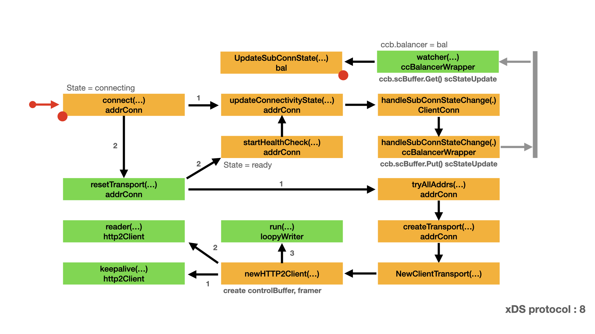
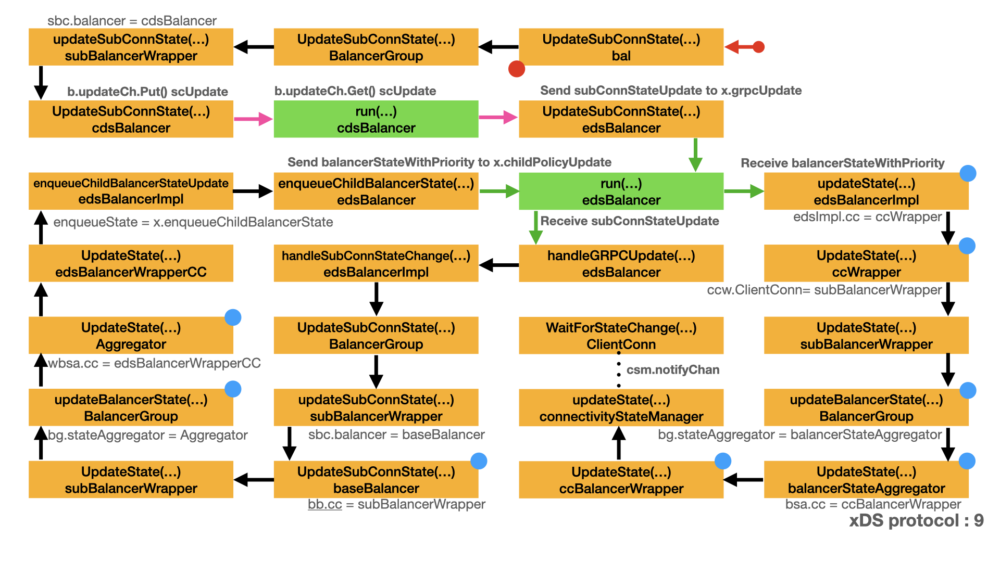

# xDS protocol - CDS/EDS

- [Connect to upstream server](conn.md#connect-to-upstream-server)
  - [Add sub balancer](conn.md#add-sub-balancer)
  - [Update connection state](conn.md#update-connection-state)
  - [Prepare for the sub-connection](conn.md#prepare-for-the-sub-connection)
  - [Start connection](conn.md#start-connection)
  - [Which balancer, which `ClientConn` ?](conn.md#which-balancer-which-clientconn-)
  - [Connect endpoint](#connect-endpoint)
  - [Update sub-connection state](#update-sub-connection-state)
  - [Update state](#update-state)
  - [Get notification](#get-notification)

## Connect to upstream server

### Connect endpoint

This is the third article of EDS processing. Please see [Start connection](conn.md#start-connection) to get more background about this stage. In this stage, we continue the discussion of xDS protocol: connect to upstream server. xDS will create the transport connection with endpoint and notify the connection state to gRPC core. Here is the map for this stage. In this map:

- Yellow box represents the important type and method/function.
- Green box represents a function run in a dedicated goroutine.
- Arrow represents the call direction and order.
- Grey bar and arrow represents the channel communication for `ccb.scBuffer`.
- Left red dot represents the box is a continue part from other map.
- Right red dot represents there is a extension map for that box.



xDS endpoint connect is very similar to [Dial process part II](dial.md#dial-process-part-ii). We will not repeat the similar process. The main difference of xDS endpoint connect is how `ccBalancerWrapper.watcher()` notify xDS. We will focus on this notification, that is the key point of this article.

You should remember the result of xDS endpoint connect. After the calling of `addrConn.Connect()`. `ac.resetTransport()` goroutine will run in the background and connect with the specified endpoint. The created connection is stored in `ac.transport` for later using.

- `ccBalancerWrapper.watcher()` is waiting on channel `ccb.scBuffer`.
- Upon receive a message, `ccBalancerWrapper.watcher()` calls `ccb.balancer.UpdateSubConnState()` to notify xDS.
- In this case, `ccb.balancer` is cluster manager. See [Create cluster manager](cds.md#create-cluster-manager) for detail.
- Which means `ccb.balancer.UpdateSubConnState()` is actually `bal.UpdateSubConnState()`.

Next, let's discuss `bal.UpdateSubConnState()` in detail.

```go
// connect starts creating a transport.
// It does nothing if the ac is not IDLE.
// TODO(bar) Move this to the addrConn section.
func (ac *addrConn) connect() error {
    ac.mu.Lock()
    if ac.state == connectivity.Shutdown {
        ac.mu.Unlock()
        return errConnClosing
    }
    if ac.state != connectivity.Idle {
        ac.mu.Unlock()
        return nil
    }
    // Update connectivity state within the lock to prevent subsequent or
    // concurrent calls from resetting the transport more than once.
    ac.updateConnectivityState(connectivity.Connecting, nil)
    ac.mu.Unlock()

    // Start a goroutine connecting to the server asynchronously.
    go ac.resetTransport()
    return nil
}

// watcher balancer functions sequentially, so the balancer can be implemented
// lock-free.
func (ccb *ccBalancerWrapper) watcher() {
    for {
        select {
        case t := <-ccb.scBuffer.Get():
            ccb.scBuffer.Load()
            if ccb.done.HasFired() {
                break
            }
            ccb.balancerMu.Lock()
            su := t.(*scStateUpdate)
            ccb.balancer.UpdateSubConnState(su.sc, balancer.SubConnState{ConnectivityState: su.state, ConnectionError: su.err})
            ccb.balancerMu.Unlock()
        case <-ccb.done.Done():
        }

        if ccb.done.HasFired() {
            ccb.balancer.Close()
            ccb.mu.Lock()
            scs := ccb.subConns
            ccb.subConns = nil
            ccb.mu.Unlock()
            for acbw := range scs {
                ccb.cc.removeAddrConn(acbw.getAddrConn(), errConnDrain)
            }
            ccb.UpdateState(balancer.State{ConnectivityState: connectivity.Connecting, Picker: nil})
            return
        }
    }
}
```

### Update sub-connection state

The cluster manager has a balancer group, which contains CDS balancers. Each CDS balancer has a EDS balancer. The EDS balancer also has a balancer group, which contains endpoint balancers. The connection state update will be very complex. All the above mentioned balancers and balancer group will get involved.

In this stage, xDS will notify the connection state to gRPC core. Here is the map for this stage. In this map:

- Yellow box represents the important type and method/function.
- Green box represents a function run in a dedicated goroutine.
- Arrow represents the call direction and order.
- Pink arrow represents the channel communication for `b.updateCh`.
- Green arrow represents the channel communication for `x.childPolicyUpdate` and `x.grpcUpdate`.
- Left red dot represents the box is a continue part from other map.
- Right red dot represents there is a extension map for that box.



- `bal.UpdateSubConnState()` calls `b.bg.UpdateSubConnState()`, Here `b.bg` is the EDS balancer group.
- `b.bg.UpdateSubConnState()` is actually `BalancerGroup.UpdateSubConnState()`.
- `BalancerGroup.UpdateSubConnState()` calls `config.updateSubConnState()`, which is actually `subBalancerWrapper.updateSubConnState()`.
- `subBalancerWrapper.updateSubConnState()` calls `b.UpdateSubConnState()`, where `b := sbc.balancer`.
- Remember this is the CDS balancer group, `sbc.balancer` is `cdsBalancer`. Which means `cdsBalancer.UpdateSubConnState()` will be called.
- `cdsBalancer.UpdateSubConnState()` sends `scUpdate` message to `b.updateCh`.
- `cdsBalancer.run()` waits for the channel `b.updateCh.Get()`, upon receives the `scUpdate` message, calls `b.edsLB.UpdateSubConnState()`.
- `b.edsLB` is EDS balancer `edsBalancer`, which means `b.edsLB.UpdateSubConnState()` is actually `edsBalancer.UpdateSubConnState()`.
- `edsBalancer.UpdateSubConnState()` wraps the parameters into `subConnStateUpdate` and sends it to channel `x.grpcUpdate`.

```go
func (b *bal) UpdateSubConnState(sc balancer.SubConn, state balancer.SubConnState) {
    b.bg.UpdateSubConnState(sc, state)
}

// Following are actions from the parent grpc.ClientConn, forward to sub-balancers.

// UpdateSubConnState handles the state for the subconn. It finds the
// corresponding balancer and forwards the update.
func (bg *BalancerGroup) UpdateSubConnState(sc balancer.SubConn, state balancer.SubConnState) {
    bg.incomingMu.Lock()
    config, ok := bg.scToSubBalancer[sc]
    if !ok {
        bg.incomingMu.Unlock()
        return
    }
    if state.ConnectivityState == connectivity.Shutdown {
        // Only delete sc from the map when state changed to Shutdown.
        delete(bg.scToSubBalancer, sc)
    }
    bg.incomingMu.Unlock()

    bg.outgoingMu.Lock()
    config.updateSubConnState(sc, state)
    bg.outgoingMu.Unlock()
}

func (sbc *subBalancerWrapper) updateSubConnState(sc balancer.SubConn, state balancer.SubConnState) {
    b := sbc.balancer
    if b == nil {
        // This sub-balancer was closed. This can happen when EDS removes a
        // locality. The balancer for this locality was already closed, and the
        // SubConns are being deleted. But SubConn state change can still
        // happen.
        return
    }
    b.UpdateSubConnState(sc, state)
}

// UpdateSubConnState handles subConn updates from gRPC.
func (b *cdsBalancer) UpdateSubConnState(sc balancer.SubConn, state balancer.SubConnState) {
    if b.closed.HasFired() {
        b.logger.Warningf("xds: received subConn update {%v, %v} after cdsBalancer was closed", sc, state)
        return
    }
    b.updateCh.Put(&scUpdate{subConn: sc, state: state})
}

// run is a long-running goroutine which handles all updates from gRPC. All
// methods which are invoked directly by gRPC or xdsClient simply push an
// update onto a channel which is read and acted upon right here.
func (b *cdsBalancer) run() {
    for {
        select {
        case u := <-b.updateCh.Get():
            b.updateCh.Load()
            switch update := u.(type) {
            case *ccUpdate:
                b.handleClientConnUpdate(update)
            case *scUpdate:
                // SubConn updates are passthrough and are simply handed over to
                // the underlying edsBalancer.
                if b.edsLB == nil {
                    b.logger.Errorf("xds: received scUpdate {%+v} with no edsBalancer", update)
                    break
                }
                b.edsLB.UpdateSubConnState(update.subConn, update.state)
            case *watchUpdate:
                b.handleWatchUpdate(update)
            }

        // Close results in cancellation of the CDS watch and closing of the
        // underlying edsBalancer and is the only way to exit this goroutine.
        case <-b.closed.Done():
            b.cancelWatch()
            b.cancelWatch = func() {}

            if b.edsLB != nil {
                b.edsLB.Close()
                b.edsLB = nil
            }
            // This is the *ONLY* point of return from this function.
            b.logger.Infof("Shutdown")
            return
        }
    }
}

func (x *edsBalancer) UpdateSubConnState(sc balancer.SubConn, state balancer.SubConnState) {
    update := &subConnStateUpdate{
        sc:    sc,
        state: state,
    }
    select {
    case x.grpcUpdate <- update:
    case <-x.closed.Done():
    }
}
```

- `edsBalancer.run()` waits for the channel `x.grpcUpdate`, upon receives `subConnStateUpdate` message, calls `x.handleGRPCUpdate()`.
- `x.handleGRPCUpdate()` is actually `edsBalancer.handleGRPCUpdate()`. `edsBalancer.handleGRPCUpdate()` calls `x.edsImpl.handleSubConnStateChange()`.
- `x.edsImpl.handleSubConnStateChange()` is actually `edsBalancerImpl.handleSubConnStateChange()`.
- `edsBalancerImpl.handleSubConnStateChange()` calls `bg.UpdateSubConnState()`.
- `bg := bgwc.bg`, here the `bgwc` is the EDS balancer group. `bg.UpdateSubConnState()` is actually `BalancerGroup.UpdateSubConnState()`.
- `BalancerGroup.UpdateSubConnState()` calls `config.updateSubConnState()`, which is actually `subBalancerWrapper.updateSubConnState()`.
- `subBalancerWrapper.updateSubConnState()` calls `b.UpdateSubConnState()`, where `b := sbc.balancer`.
- Remember this is the EDS balancer group, `sbc.balancer` is `baseBalancer`. Which means `baseBalancer.UpdateSubConnState()` will be called.
- `baseBalancer.UpdateSubConnState()` calls `b.cc.UpdateState()`. Here `b.cc` is `subBalancerWrapper`.
- Which means `b.cc.UpdateState()` is actually `subBalancerWrapper.UpdateState()`.
- Please note from `baseBalancer.UpdateSubConnState()` the implementation is calling `UpdateState()`.
- `subBalancerWrapper.UpdateState()` calls `BalancerGroup.updateBalancerState()`.
- `BalancerGroup.updateBalancerState()` calls `bg.stateAggregator.UpdateState()`. Here `bg.stateAggregator` is belongs to EDS balancer group.
- `bg.stateAggregator` is `Aggregator`, which means `bg.stateAggregator.UpdateState()` is actually `Aggregator.UpdateState()`.
- `Aggregator.UpdateState()` calls `wbsa.cc.UpdateState()`. Here `wbsa.cc` is `edsBalancerWrapperCC`.
- Which means `wbsa.cc.UpdateState()` is actually `edsBalancerWrapperCC.UpdateState()`.
- `edsBalancerWrapperCC.UpdateState()` calls `ebwcc.parent.enqueueChildBalancerStateUpdate()`.
- `ebwcc.parent.enqueueChildBalancerStateUpdate` is a function field of `edsBalancerImpl`, which is actually `edsBalancerImpl.enqueueChildBalancerStateUpdate`.
- `edsBalancerImpl.enqueueChildBalancerStateUpdate` is assigned value `x.enqueueChildBalancerState`, `x` is `edsBalancer`.
- Which means `ebwcc.parent.enqueueChildBalancerStateUpdate()` is actually `edsBalancer.enqueueChildBalancerState()`.
- `edsBalancer.enqueueChildBalancerState()` simply sends `balancerStateWithPriority` message to channel `x.childPolicyUpdate`.

```go
// run gets executed in a goroutine once edsBalancer is created. It monitors
// updates from grpc, xdsClient and load balancer. It synchronizes the
// operations that happen inside edsBalancer. It exits when edsBalancer is
// closed.
func (x *edsBalancer) run() {
    for {
        select {
        case update := <-x.grpcUpdate:
            x.handleGRPCUpdate(update)
        case update := <-x.xdsClientUpdate:
            x.handleXDSClientUpdate(update)
        case update := <-x.childPolicyUpdate.Get():
            x.childPolicyUpdate.Load()
            u := update.(*balancerStateWithPriority)
            x.edsImpl.updateState(u.priority, u.s)
        case <-x.closed.Done():
            x.cancelWatch()
            x.xdsClient.Close()
            x.edsImpl.close()
            return
        }
    }
}

func (x *edsBalancer) handleGRPCUpdate(update interface{}) {
    switch u := update.(type) {
    case *subConnStateUpdate:
        x.edsImpl.handleSubConnStateChange(u.sc, u.state.ConnectivityState)
    case *balancer.ClientConnState:
+-- 23 lines: x.logger.Infof("Receive update from resolver, balancer config: %+v", u.BalancerConfig)··············································
    case error:
        x.handleErrorFromUpdate(u, true)
    default:
        // unreachable path
        x.logger.Errorf("wrong update type: %T", update)
    }
}

// handleSubConnStateChange handles the state change and update pickers accordingly.
func (edsImpl *edsBalancerImpl) handleSubConnStateChange(sc balancer.SubConn, s connectivity.State) {
    edsImpl.subConnMu.Lock()
    var bgwc *balancerGroupWithConfig
    if p, ok := edsImpl.subConnToPriority[sc]; ok {
        if s == connectivity.Shutdown {
            // Only delete sc from the map when state changed to Shutdown.
            delete(edsImpl.subConnToPriority, sc)
        }
        bgwc = edsImpl.priorityToLocalities[p]
    }
    edsImpl.subConnMu.Unlock()
    if bgwc == nil {
        edsImpl.logger.Infof("edsBalancerImpl: priority not found for sc state change")
        return
    }
    if bg := bgwc.bg; bg != nil {
        bg.UpdateSubConnState(sc, balancer.SubConnState{ConnectivityState: s})
    }
}

func (b *baseBalancer) UpdateSubConnState(sc balancer.SubConn, state balancer.SubConnState) {
    s := state.ConnectivityState
    if logger.V(2) {
        logger.Infof("base.baseBalancer: handle SubConn state change: %p, %v", sc, s)
    }
    oldS, ok := b.scStates[sc]
    if !ok {
        if logger.V(2) {
            logger.Infof("base.baseBalancer: got state changes for an unknown SubConn: %p, %v", sc, s)
        }
        return
    }
    if oldS == connectivity.TransientFailure && s == connectivity.Connecting {
        // Once a subconn enters TRANSIENT_FAILURE, ignore subsequent
        // CONNECTING transitions to prevent the aggregated state from being
        // always CONNECTING when many backends exist but are all down.
        return
    }
    b.scStates[sc] = s
    switch s {
    case connectivity.Idle:
        sc.Connect()
    case connectivity.Shutdown:
        // When an address was removed by resolver, b called RemoveSubConn but
        // kept the sc's state in scStates. Remove state for this sc here.
        delete(b.scStates, sc)
    case connectivity.TransientFailure:
        // Save error to be reported via picker.
        b.connErr = state.ConnectionError
    }

    b.state = b.csEvltr.RecordTransition(oldS, s)

    // Regenerate picker when one of the following happens:
    //  - this sc entered or left ready
    //  - the aggregated state of balancer is TransientFailure
    if (s == connectivity.Ready) != (oldS == connectivity.Ready) ||
        b.state == connectivity.TransientFailure {
        b.regeneratePicker()
    }

    b.cc.UpdateState(balancer.State{ConnectivityState: b.state, Picker: b.picker})
}

// UpdateState overrides balancer.ClientConn, to keep state and picker.
func (sbc *subBalancerWrapper) UpdateState(state balancer.State) {
    sbc.mu.Lock()
    sbc.state = state
    sbc.group.updateBalancerState(sbc.id, state)
    sbc.mu.Unlock()
}

// updateBalancerState: forward the new state to balancer state aggregator. The
// aggregator will create an aggregated picker and an aggregated connectivity
// state, then forward to ClientConn.
func (bg *BalancerGroup) updateBalancerState(id string, state balancer.State) {
    bg.logger.Infof("Balancer state update from locality %v, new state: %+v", id, state)
    if bg.loadStore != nil {
        // Only wrap the picker to do load reporting if loadStore was set.
        state.Picker = newLoadReportPicker(state.Picker, id, bg.loadStore)
    }
 
    // Send new state to the aggregator, without holding the incomingMu.
    // incomingMu is to protect all calls to the parent ClientConn, this update
    // doesn't necessary trigger a call to ClientConn, and should already be
    // protected by aggregator's mutex if necessary.
    if bg.stateAggregator != nil {
        bg.stateAggregator.UpdateState(id, state)
    }
}

// UpdateState is called to report a balancer state change from sub-balancer.
// It's usually called by the balancer group.
//
// It calls parent ClientConn's UpdateState with the new aggregated state.
func (wbsa *Aggregator) UpdateState(id string, newState balancer.State) {
    wbsa.mu.Lock()
    defer wbsa.mu.Unlock()
    oldState, ok := wbsa.idToPickerState[id]
    if !ok {
        // All state starts with an entry in pickStateMap. If ID is not in map,
        // it's either removed, or never existed.
        return
    }
    if !(oldState.state.ConnectivityState == connectivity.TransientFailure && newState.ConnectivityState == connectivity.Connecting) {
        // If old state is TransientFailure, and new state is Connecting, don't
        // update the state, to prevent the aggregated state from being always
        // CONNECTING. Otherwise, stateToAggregate is the same as
        // state.ConnectivityState.
        oldState.stateToAggregate = newState.ConnectivityState
    }
    oldState.state = newState

    if !wbsa.started {
        return
    }
    wbsa.cc.UpdateState(wbsa.build())
}

func (ebwcc *edsBalancerWrapperCC) UpdateState(state balancer.State) {
    ebwcc.parent.enqueueChildBalancerStateUpdate(ebwcc.priority, state)
}

// Build helps implement the balancer.Builder interface.
func (b *edsBalancerBuilder) Build(cc balancer.ClientConn, opts balancer.BuildOptions) balancer.Balancer {
    x := &edsBalancer{
        cc:                cc,
        closed:            grpcsync.NewEvent(),
        grpcUpdate:        make(chan interface{}),
        xdsClientUpdate:   make(chan *edsUpdate),
        childPolicyUpdate: buffer.NewUnbounded(),
        lsw:               &loadStoreWrapper{},
        config:            &EDSConfig{},
    }
    x.logger = prefixLogger(x)

    client, err := newXDSClient()
    if err != nil {
        x.logger.Errorf("xds: failed to create xds-client: %v", err)
        return nil
    }

    x.xdsClient = client
    x.edsImpl = newEDSBalancer(x.cc, opts, x.enqueueChildBalancerState, x.lsw, x.logger)
    x.logger.Infof("Created")
    go x.run()
    return x
}

var (
    newEDSBalancer = func(cc balancer.ClientConn, opts balancer.BuildOptions, enqueueState func(priorityType, balancer.State), lw load.PerClusterReporter, logger *grpclog.PrefixLogger) edsBalancerImplInterface {
        return newEDSBalancerImpl(cc, opts, enqueueState, lw, logger)
    }
    newXDSClient = func() (xdsClientInterface, error) { return xdsclient.New() }
)


// newEDSBalancerImpl create a new edsBalancerImpl.
func newEDSBalancerImpl(cc balancer.ClientConn, bOpts balancer.BuildOptions, enqueueState func(priorityType, balancer.State), lr load.PerClusterReporter, log      ger *grpclog.PrefixLogger) *edsBalancerImpl {
    edsImpl := &edsBalancerImpl{
        cc:                 cc,
        buildOpts:          bOpts,
        logger:             logger,
        subBalancerBuilder: balancer.Get(roundrobin.Name),
        loadReporter:       lr,

        enqueueChildBalancerStateUpdate: enqueueState,

        priorityToLocalities:   make(map[priorityType]*balancerGroupWithConfig),
        priorityToState:        make(map[priorityType]*balancer.State),
        subConnToPriority:      make(map[balancer.SubConn]priorityType),
        serviceRequestCountMax: defaultServiceRequestCountMax,
    }
    // Don't start balancer group here. Start it when handling the first EDS
    // response. Otherwise the balancer group will be started with round-robin,
    // and if users specify a different sub-balancer, all balancers in balancer
    // group will be closed and recreated when sub-balancer update happens.
    return edsImpl
}

func (x *edsBalancer) enqueueChildBalancerState(p priorityType, s balancer.State) {
    x.childPolicyUpdate.Put(&balancerStateWithPriority{
        priority: p,
        s:        s,
    })
}
```

### Update state

- `edsBalancer.run()` is waiting for the channel `x.childPolicyUpdate.Get()`.
- Upon receives `balancerStateWithPriority` message, `edsBalancer.run()` calls `x.edsImpl.updateState()`.
- `x.edsImpl.updateState()` is actually `edsBalancerImpl.updateState()`.
- `edsBalancerImpl.updateState()` calls `edsImpl.handlePriorityWithNewState()` to start/close priorities based on the connectivity.
  - In `edsImpl.handlePriorityWithNewState()`, if `s.ConnectivityState` is `connectivity.Ready`, calls `edsImpl.handlePriorityWithNewStateReady()`.
    - `edsImpl.handlePriorityWithNewStateReady()` handles state Ready and decides whether to forward update or not.
    - We will not discuss other state. For now, `connectivity.Ready` state is our focus.
- If `edsImpl.handlePriorityWithNewState()` returns true, `edsBalancerImpl.updateState()` calls `edsImpl.cc.UpdateState()`.
- `edsImpl.cc` is `ccWrapper`, which means `edsImpl.cc.UpdateState()` is actually `ccWrapper.UpdateState()`.
- `ccWrapper.UpdateState()` creates a new `loadReportPicker` and calls `ccw.ClientConn.UpdateState()` with the picker.
- `ccw.ClientConn` is `subBalancerWrapper`, which means `ccw.ClientConn.UpdateState()` is actually `subBalancerWrapper.UpdateState()`.
- `subBalancerWrapper.UpdateState()` calls `BalancerGroup.updateBalancerState()`.
- `BalancerGroup.updateBalancerState()` calls `bg.stateAggregator.UpdateState()`, Here `bg.stateAggregator` belongs to CDS balancer group.
- `bg.stateAggregator` is `balancerStateAggregator`, which means `bg.stateAggregator.UpdateState()` is actually `balancerStateAggregator.UpdateState()`.
- `balancerStateAggregator.UpdateState()` calls `bsa.build()` to combines sub-states into one.
- `balancerStateAggregator.UpdateState()` calls `bsa.cc.UpdateState()` to propagate the update message.
- In `builder.Build()` (the cluster manager builder),
  - `b.stateAggregator` get the value of `newBalancerStateAggregator(cc, b.logger)`, which returns `balancerStateAggregator`.
  - In `newBalancerStateAggregator()`, the `cc` field is the same as cluster manager. Which means `bsa.cc` is `ccBalancerWrapper`.
- According to the above information, `bsa.cc.UpdateState()` is actually `ccBalancerWrapper.UpdateState()`.
- `ccBalancerWrapper.UpdateState()` updates the picker via calling `ccb.cc.blockingpicker.updatePicker()`.
- `ccBalancerWrapper.UpdateState()` calls `ccb.cc.csMgr.updateState()` to propagate the update message to gRPC core.
- `ccb.cc.csMgr.updateState()` is actually `connectivityStateManager.updateState()`

Next, let's discuss `connectivityStateManager.updateState()` in detail.

```go
// run gets executed in a goroutine once edsBalancer is created. It monitors
// updates from grpc, xdsClient and load balancer. It synchronizes the
// operations that happen inside edsBalancer. It exits when edsBalancer is
// closed.
func (x *edsBalancer) run() {
    for {
        select {
        case update := <-x.grpcUpdate:
            x.handleGRPCUpdate(update)
        case update := <-x.xdsClientUpdate:
            x.handleXDSClientUpdate(update)
        case update := <-x.childPolicyUpdate.Get():
            x.childPolicyUpdate.Load()
            u := update.(*balancerStateWithPriority)
            x.edsImpl.updateState(u.priority, u.s)
        case <-x.closed.Done():
            x.cancelWatch()
            x.xdsClient.Close()
            x.edsImpl.close()
            return
        }
    }
}

// updateState first handles priority, and then wraps picker in a drop picker
// before forwarding the update.
func (edsImpl *edsBalancerImpl) uupdateStatepdateState(priority priorityType, s balancer.State) {
    _, ok := edsImpl.priorityToLocalities[priority]
    if !ok {
        edsImpl.logger.Infof("eds: received picker update from unknown priority")
        return
    }

    if edsImpl.handlePriorityWithNewState(priority, s) {
        edsImpl.pickerMu.Lock()
        defer edsImpl.pickerMu.Unlock()
        edsImpl.innerState = s
        // Don't reset drops when it's a state change.
        edsImpl.cc.UpdateState(balancer.State{ConnectivityState: s.ConnectivityState, Picker: newDropPicker(s.Picker, edsImpl.drops, edsImpl.loadReporter, edsImpl.serviceRequestsCounter, edsImpl.serviceRequestCountMax)})
    }
}

// handlePriorityWithNewState start/close priorities based on the connectivity
// state. It returns whether the state should be forwarded to parent ClientConn.
func (edsImpl *edsBalancerImpl) handlePriorityWithNewState(priority priorityType, s balancer.State) bool {
    edsImpl.priorityMu.Lock()
    defer edsImpl.priorityMu.Unlock()

    if !edsImpl.priorityInUse.isSet() {
        edsImpl.logger.Infof("eds: received picker update when no priority is in use (EDS returned an empty list)")
        return false
    }

    if edsImpl.priorityInUse.higherThan(priority) {
        // Lower priorities should all be closed, this is an unexpected update.
        edsImpl.logger.Infof("eds: received picker update from priority lower then priorityInUse")
        return false
    }

    bState, ok := edsImpl.priorityToState[priority]
    if !ok {
        bState = &balancer.State{}
        edsImpl.priorityToState[priority] = bState
    }
    oldState := bState.ConnectivityState
    *bState = s

    switch s.ConnectivityState {
    case connectivity.Ready:
        return edsImpl.handlePriorityWithNewStateReady(priority)
    case connectivity.TransientFailure:
        return edsImpl.handlePriorityWithNewStateTransientFailure(priority)
    case connectivity.Connecting:
        return edsImpl.handlePriorityWithNewStateConnecting(priority, oldState)
    default:
        // New state is Idle, should never happen. Don't forward.
        return false
    }
}

// handlePriorityWithNewStateReady handles state Ready and decides whether to
// forward update or not.
//
// An update with state Ready:
// - If it's from higher priority:
//   - Forward the update
//   - Set the priority as priorityInUse
//   - Close all priorities lower than this one
// - If it's from priorityInUse:
//   - Forward and do nothing else
//
// Caller must make sure priorityInUse is not higher than priority.
//
// Caller must hold priorityMu.
func (edsImpl *edsBalancerImpl) handlePriorityWithNewStateReady(priority priorityType) bool {
    // If one priority higher or equal to priorityInUse goes Ready, stop the
    // init timer. If update is from higher than priorityInUse,
    // priorityInUse will be closed, and the init timer will become useless.
    if timer := edsImpl.priorityInitTimer; timer != nil {
        timer.Stop()
        edsImpl.priorityInitTimer = nil
    }

    if edsImpl.priorityInUse.lowerThan(priority) {
        edsImpl.logger.Infof("Switching priority from %v to %v, because latter became Ready", edsImpl.priorityInUse, priority)
        edsImpl.priorityInUse = priority
        for i := priority.nextLower(); !i.lowerThan(edsImpl.priorityLowest); i = i.nextLower() {
            bgwc := edsImpl.priorityToLocalities[i]
            bgwc.stateAggregator.Stop()
            bgwc.bg.Close()
        }
        return true
    }
    return true
}

func (ccw *ccWrapper) UpdateState(s balancer.State) {
    s.Picker = newLoadReportPicker(s.Picker, ccw.localityIDJSON, ccw.loadStore)
    ccw.ClientConn.UpdateState(s)
}

// UpdateState is called to report a balancer state change from sub-balancer.
// It's usually called by the balancer group.
//
// It calls parent ClientConn's UpdateState with the new aggregated state.
func (bsa *balancerStateAggregator) UpdateState(id string, state balancer.State) {
    bsa.mu.Lock()
    defer bsa.mu.Unlock()
    pickerSt, ok := bsa.idToPickerState[id]
    if !ok {
        // All state starts with an entry in pickStateMap. If ID is not in map,
        // it's either removed, or never existed.
        return
    }
    if !(pickerSt.state.ConnectivityState == connectivity.TransientFailure && state.ConnectivityState == connectivity.Connecting) {
        // If old state is TransientFailure, and new state is Connecting, don't
        // update the state, to prevent the aggregated state from being always
        // CONNECTING. Otherwise, stateToAggregate is the same as
        // state.ConnectivityState.
        pickerSt.stateToAggregate = state.ConnectivityState
    }
    pickerSt.state = state

    if !bsa.started {
        return
    }
    bsa.cc.UpdateState(bsa.build())
}

// build combines sub-states into one. The picker will do a child pick.
//
// Caller must hold bsa.mu.
func (bsa *balancerStateAggregator) build() balancer.State {
    // TODO: the majority of this function (and UpdateState) is exactly the same
    // as weighted_target's state aggregator. Try to make a general utility
    // function/struct to handle the logic.
    //
    // One option: make a SubBalancerState that handles Update(State), including
    // handling the special connecting after ready, as in UpdateState(). Then a
    // function to calculate the aggregated connectivity state as in this
    // function.
    var readyN, connectingN int
    for _, ps := range bsa.idToPickerState {
        switch ps.stateToAggregate {
        case connectivity.Ready:
            readyN++
        case connectivity.Connecting:
            connectingN++
        }
    }
    var aggregatedState connectivity.State
    switch {
    case readyN > 0:
        aggregatedState = connectivity.Ready
    case connectingN > 0:
        aggregatedState = connectivity.Connecting
    default:
        aggregatedState = connectivity.TransientFailure
    }

    // The picker's return error might not be consistent with the
    // aggregatedState. Because for this LB policy, we want to always build
    // picker with all sub-pickers (not only ready sub-pickers), so even if the
    // overall state is Ready, pick for certain RPCs can behave like Connecting
    // or TransientFailure.
    bsa.logger.Infof("Child pickers: %+v", bsa.idToPickerState)
    return balancer.State{
        ConnectivityState: aggregatedState,
        Picker:            newPickerGroup(bsa.idToPickerState),
    }
}

func newBalancerStateAggregator(cc balancer.ClientConn, logger *grpclog.PrefixLogger) *balancerStateAggregator {
    return &balancerStateAggregator{
        cc:              cc,
        logger:          logger,
        idToPickerState: make(map[string]*subBalancerState),
    }
}

type builder struct{}

func (builder) Build(cc balancer.ClientConn, opts balancer.BuildOptions) balancer.Balancer {
    b := &bal{}
    b.logger = prefixLogger(b)
    b.stateAggregator = newBalancerStateAggregator(cc, b.logger)
    b.stateAggregator.start()
    b.bg = balancergroup.New(cc, opts, b.stateAggregator, nil, b.logger)
    b.bg.Start()
    b.logger.Infof("Created")
    return b
}

func (ccb *ccBalancerWrapper) UpdateState(s balancer.State) {
    ccb.mu.Lock()
    defer ccb.mu.Unlock()
    if ccb.subConns == nil {
        return
    }
    // Update picker before updating state.  Even though the ordering here does
    // not matter, it can lead to multiple calls of Pick in the common start-up
    // case where we wait for ready and then perform an RPC.  If the picker is
    // updated later, we could call the "connecting" picker when the state is
    // updated, and then call the "ready" picker after the picker gets updated.
    ccb.cc.blockingpicker.updatePicker(s.Picker)
    ccb.cc.csMgr.updateState(s.ConnectivityState)
}

```

### Get notification

- `connectivityStateManager.updateState()` updates the connectivity.State of `ClientConn`.
- `connectivityStateManager.updateState()` notify `ClientConn` by `close(csm.notifyChan)`.
- `ClientConn.WaitForStateChange()` waits until the `connectivity.State` of `ClientConn` changes from `sourceState` or context expires.
- `ClientConn.WaitForStateChange()` communicates with `connectivityStateManager.updateState()` through channel `csm.notifyChan`.
- Calling `connectivityStateManager.getNotifyChan()` returns `csm.notifyChan`.

```go
// updateState updates the connectivity.State of ClientConn.
// If there's a change it notifies goroutines waiting on state change to
// happen.
func (csm *connectivityStateManager) updateState(state connectivity.State) {
    csm.mu.Lock()
    defer csm.mu.Unlock()
    if csm.state == connectivity.Shutdown {
        return
    }
    if csm.state == state {
        return
    }
    csm.state = state
    channelz.Infof(logger, csm.channelzID, "Channel Connectivity change to %v", state)
    if csm.notifyChan != nil {
        // There are other goroutines waiting on this channel.
        close(csm.notifyChan)
        csm.notifyChan = nil
    }
}

func (csm *connectivityStateManager) getState() connectivity.State {
    csm.mu.Lock()
    defer csm.mu.Unlock()
    return csm.state
}

func (csm *connectivityStateManager) getNotifyChan() <-chan struct{} {
    csm.mu.Lock()
    defer csm.mu.Unlock()
    if csm.notifyChan == nil {
        csm.notifyChan = make(chan struct{})
    }
    return csm.notifyChan
}

// WaitForStateChange waits until the connectivity.State of ClientConn changes from sourceState or
// ctx expires. A true value is returned in former case and false in latter.
//
// Experimental
//
// Notice: This API is EXPERIMENTAL and may be changed or removed in a
// later release.
func (cc *ClientConn) WaitForStateChange(ctx context.Context, sourceState connectivity.State) bool {
    ch := cc.csMgr.getNotifyChan()
    if cc.csMgr.getState() != sourceState {
        return true
    }
    select {
    case <-ctx.Done():
        return false
    case <-ch:
        return true
    }
}

```
