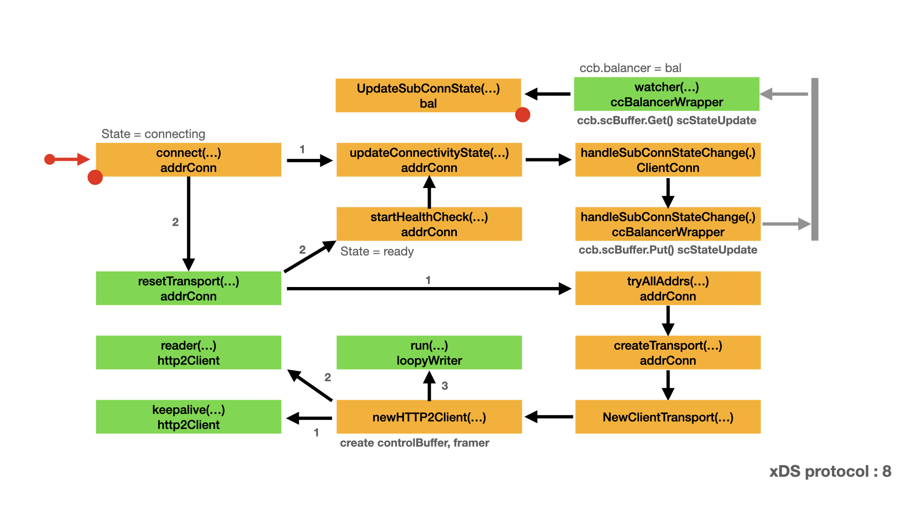

# Load Balancing - xDS protocol

- [Connect endpoint](#connect-endpoint)
- [Update sub-connection state](#update-sub-connection-state)

## Initialize endpoints

This is the third article of initialize endpoints. Please see [Start connection](#start-connection) to get more background about this stage. In this stage, we continue the discussion of xDS protocol: initialize endpoints. xDS will create the transport connection with endpoint and notify the connection state to gRPC core. Here is the map for this stage. In this map:

- Yellow box represents the important type and method/function.
- Green box represents a function run in a dedicated goroutine.
- Arrow represents the call direction and order.
- Grey bar and arrow represents the channel communication for `ccb.scBuffer`.
- Left red dot represents the box is a continue part from other map.
- Right red dot represents there is a extension map for that box.



### Connect endpoint

xDS endpoint connect is very similar to [Dial process part II](dial.md#dial-process-part-ii). We will not repeat the similar process. The main difference of xDS endpoint connect is how `ccBalancerWrapper.watcher()` notify xDS. We will focus on this notification, that is the key point of this article.

You should remember the result of xDS endpoint connect. After the calling of `addrConn.Connect()`. `ac.resetTransport()` goroutine will run in the background and connect with the specified endpoint. The created connection is stored in `ac.transport` for later using.

- `ccBalancerWrapper.watcher()` is waiting on channel `ccb.scBuffer`.
- Upon receive a message, `ccBalancerWrapper.watcher()` calls `ccb.balancer.UpdateSubConnState()` to notify xDS.
- In this case, `ccb.balancer` is cluster manager. See [Create cluster manager](cds.md#create-cluster-manager) for detail.
- Which means `ccb.balancer.UpdateSubConnState()` is actually `bal.UpdateSubConnState()`.

Next, let's discuss `bal.UpdateSubConnState()` in detail.

```go
// connect starts creating a transport.
// It does nothing if the ac is not IDLE.
// TODO(bar) Move this to the addrConn section.
func (ac *addrConn) connect() error {
    ac.mu.Lock()
    if ac.state == connectivity.Shutdown {
        ac.mu.Unlock()
        return errConnClosing
    }
    if ac.state != connectivity.Idle {
        ac.mu.Unlock()
        return nil
    }
    // Update connectivity state within the lock to prevent subsequent or
    // concurrent calls from resetting the transport more than once.
    ac.updateConnectivityState(connectivity.Connecting, nil)
    ac.mu.Unlock()

    // Start a goroutine connecting to the server asynchronously.
    go ac.resetTransport()
    return nil
}

// watcher balancer functions sequentially, so the balancer can be implemented
// lock-free.
func (ccb *ccBalancerWrapper) watcher() {
    for {
        select {
        case t := <-ccb.scBuffer.Get():
            ccb.scBuffer.Load()
            if ccb.done.HasFired() {
                break
            }
            ccb.balancerMu.Lock()
            su := t.(*scStateUpdate)
            ccb.balancer.UpdateSubConnState(su.sc, balancer.SubConnState{ConnectivityState: su.state, ConnectionError: su.err})
            ccb.balancerMu.Unlock()
        case <-ccb.done.Done():
        }

        if ccb.done.HasFired() {
            ccb.balancer.Close()
            ccb.mu.Lock()
            scs := ccb.subConns
            ccb.subConns = nil
            ccb.mu.Unlock()
            for acbw := range scs {
                ccb.cc.removeAddrConn(acbw.getAddrConn(), errConnDrain)
            }
            ccb.UpdateState(balancer.State{ConnectivityState: connectivity.Connecting, Picker: nil})
            return
        }
    }
}
```

### Update sub-connection state

The cluster mananger has a balancer group, which contains CDS balancers. Each CDS balancer has a EDS balancer. The EDS balancer also has a balancer group, which contains endpoint balancers. The connection state update will be very complex. All the above mentioned balancers and balancer group will get involved.

In this stage, xDS will notify the connection state to gRPC core. Here is the map for this stage. In this map:

- Yellow box represents the important type and method/function.
- Green box represents a function run in a dedicated goroutine.
- Arrow represents the call direction and order.
- Pink arrow represents the channel communication for `b.updateCh`.
- Green arrow represents the channel communication for `x.childPolicyUpdate` and `x.grpcUpdate`.
- Left red dot represents the box is a continue part from other map.
- Right red dot represents there is a extension map for that box.


`bal.UpdateSubConnState()`Here.

```go
func (b *bal) UpdateSubConnState(sc balancer.SubConn, state balancer.SubConnState) {
    b.bg.UpdateSubConnState(sc, state)
}
```
