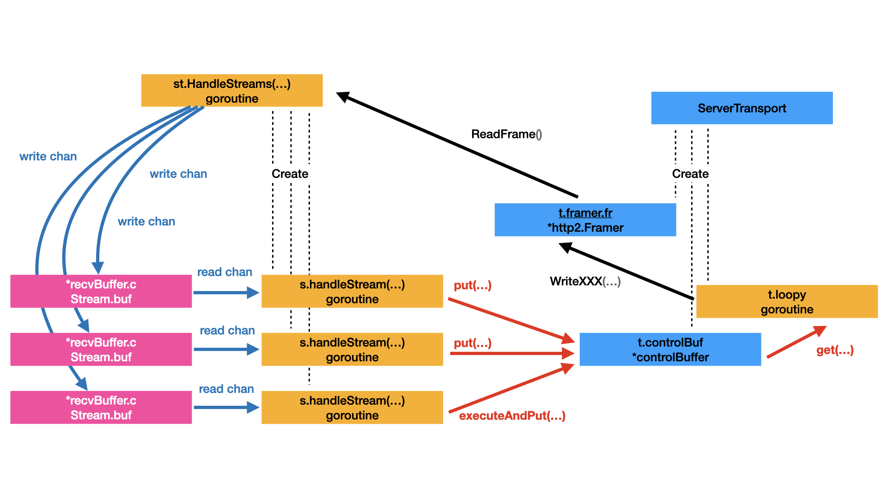

# controlBuffer, loopyWriter and framer
* [The bigger picture](#the-bigger-picture)
* [controlBuffer](#controlbuffer)
  * [Component](#component)
  * [Get and Put](#get-and-put)
  * [Threshold](#threshold)
* [loopyWriter](#loopywriter)
  * [Component](#component-1)
  * [handle](#handle)
  * [processData](#processdata)
  * [run](#run)
* [framer](#framer)

In [Send Response](response.md) and [Send Request](request.md), we mentioned ```t.controlBuffer``` several times. How does it works? It's not easy to answer that question. I found that we need the bigger picture to describe the process of gRPC call reply. Without the bigger picture it's hard to understand ```t.controlBuffer```'s responsibility, the role it plays and the relationship with other parts. Without it it's hard to answer the question correctly. 

It's the typical case: answer one question lead to more questions. If you can answer that question, you will know better about gRPC than before.

And gRPC is a full featured framework. Without the bigger picture, it's easy to get lost in the sea of code.

## The bigger picture
The following is the bigger picture of the server side gRPC call. Compare with client side gRPC call, the server side is more complicated. It's notable that some of the concept are the same for the client side. 

The following diagram discribe the most important goroutines, objects and the interaction between them. In the diagram: 
* yellow box represent goroutine, 
* blue box represent an object, 
* pink box represent a go channel,
* dot line represent relationship between two objects,
* arrow line and text represent the action and data flow.



To better understand the diagram, I added the following explaination: 

* for each client connection, gRPC server create one ```ServerTransport``` object and start one ```st.HandleStreams()``` goroutine. 
  * ```ServerTransport``` is an interface, the implemention is ```*http2Server```,
  * if you have more client connections, there will be more ```ServerTransport``` and ```st.HandleStreams()```,
  * See [Code Snippet 01](#code-snippet-01) for detail.
* for eache stream, ```st.HandleStreams()``` goroutine create one ```Stream``` object and start one ```s.handleStream()``` goroutine. 
  * each ```Stream``` object contains a ```buf``` field,
  * the ```buf``` field is of type ```*recvBuffer```, which contains a ```c chan recvMsg``` field,  
  * ```Stream``` object and ```s.handleStream()``` goroutine are created according to gRPC call reqeust,
  * if one client make several gRPC call reqeusts simultaneously, you will get several ```Stream``` and ```s.handleStream()``` pairs. 
  * See [Code Snippet 01](#code-snippet-01) and [Code Snippet 02](#code-snippet-02) for detail.
* at initilization stage, ```ServerTransport``` create one ```t.controlBuf``` object and one ```t.framer.fr``` object and start one ```t.loopy``` goroutine. 
  * Those objects are created per connection and working together to respond to the request.
  * See [Code Snippet 03](#code-snippet-03) for detail.
* ```st.HandleStreams()``` uses ```t.framer.fr``` to read http 2 frames from the connection.
  * if a header frame is read,  ```st.HandleStreams()``` goroutine create one ```Stream``` object and start ```s.handleStream()``` goroutine.
  * if a data frame is read, ```st.HandleStreams()``` try to write the data frame to ```Stream.buf.c``` channel
  * See [Code Snippet 01](#code-snippet-01) for detail.
  * See [Request Parameters](parameters.md) for detail.
* at the same time, ```s.handleStream()``` is processing the header frame and try to read reqeust parameters from channel ```Stream.buf.c```. 
  * there might be several gRPC request calls simultaneously, in this case, multiple ```s.handleStream()``` goroutines will be started,
  * See [Request Parameters](parameters.md) for detail.
* if ```s.handleStreams()``` goroutine want to send gRPC call response. it need to work with ```t.controlBuf```
  * both ```t.controlBuf.put()``` and ```t.controlBuf.executeAndPut()``` can be called to send response.
  * ```*controlBuffer``` is thread safe.
  * ```*controlBuffer``` is a buffer, it will hold the message temporally until ```t.loopy``` get it.
  * See [controlBuffer](#controlbuffer) for detail.
* ```t.loopy``` goroutine get response from ```t.controlBuf``` and send it back via ```t.framer.fr``` 
  * via ```get()``` provided by ```t.controlBuf```, ```t.loopy``` read respnse from  ```t.controlBuf``` ,
  * via ```WriteXXX()``` provided by ```t.framer.fr```, ```t.loopy``` encode the response and send it back to client ,
  * See [loopWriter](#loopwriter) for detail.
* ```t.framer.fr``` is in charge of read/write http 2 frames from/to the wire.
  * it's get initilized when the connection is created.
  * ```Framer``` is of type ```*http2.Framer```. 
  * See [Frame](#frame) for detail.


### Code snippet 01
Upon receive a connection request, gRPC create a ```ServerTransport``` object ```st``` and start a goroutine ```s.serveStreams(st)``` to serve it.
```go

// handleRawConn forks a goroutine to handle a just-accepted connection that
// has not had any I/O performed on it yet.
func (s *Server) handleRawConn(rawConn net.Conn) {
    if s.quit.HasFired() {
        rawConn.Close()
        return
    }
    rawConn.SetDeadline(time.Now().Add(s.opts.connectionTimeout))
    conn, authInfo, err := s.useTransportAuthenticator(rawConn)
    if err != nil {
+-- 11 lines: ErrConnDispatched means that the connection was dispatched away from················································································
    }                                                  
                                                 
    // Finish handshaking (HTTP2)
    st := s.newHTTP2Transport(conn, authInfo)                                    
    if st == nil {       
        return                                                                                                                                        
    }                      
         
    rawConn.SetDeadline(time.Time{})    
    if !s.addConn(st) {
        return
    }
    go func() {                  
        s.serveStreams(st)
        s.removeConn(st)
    }()
}
```

```s.serveStreams()``` calls ```st.HandleStreams()``` to do th job. The for loop of ```st.HandleStreams()``` will last until the connection close or some error happens. 

```go
func (s *Server) serveStreams(st transport.ServerTransport) {
    defer st.Close()
    var wg sync.WaitGroup

    var roundRobinCounter uint32
    st.HandleStreams(func(stream *transport.Stream) {
        wg.Add(1)
        if s.opts.numServerWorkers > 0 {
            data := &serverWorkerData{st: st, wg: &wg, stream: stream}
            select {             
            case s.serverWorkerChannels[atomic.AddUint32(&roundRobinCounter, 1)%s.opts.numServerWorkers] <- data:
            default:    
                // If all stream workers are busy, fallback to the default code path.
                go func() {
                    s.handleStream(st, stream, s.traceInfo(st, stream))
                    wg.Done()                             
                }()                                          
            }                                                                                            
        } else {                      
            go func() {                                    
                defer wg.Done()         
                s.handleStream(st, stream, s.traceInfo(st, stream))
            }()
        }
    }, func(ctx context.Context, method string) context.Context {
        if !EnableTracing {
            return ctx
        }
        tr := trace.New("grpc.Recv."+methodFamily(method), method)
        return trace.NewContext(ctx, tr)
    })
    wg.Wait()
}

// HandleStreams receives incoming streams using the given handler. This is
// typically run in a separate goroutine.
// traceCtx attaches trace to ctx and returns the new context.
func (t *http2Server) HandleStreams(handle func(*Stream), traceCtx func(context.Context, string) context.Context) {
    defer close(t.readerDone)                                    
    for {                                                                    
        t.controlBuf.throttle()                         
        frame, err := t.framer.fr.ReadFrame()     
        atomic.StoreInt64(&t.lastRead, time.Now().UnixNano())    
        if err != nil {                         
+-- 28 lines: if se, ok := err.(http2.StreamError); ok {··········································································································
        }                                                        
        switch frame := frame.(type) {                                                                           
        case *http2.MetaHeadersFrame:                                        
            if t.operateHeaders(frame, handle, traceCtx) {
                t.Close()                         
                break                                                 
            }                                                           
        case *http2.DataFrame:                                          
            t.handleData(frame)                  
        case *http2.RSTStreamFrame:                            
            t.handleRSTStream(frame)                           
        case *http2.SettingsFrame:                  
            t.handleSettings(frame)       
        case *http2.PingFrame:              
            t.handlePing(frame)
        case *http2.WindowUpdateFrame:
            t.handleWindowUpdate(frame)
        case *http2.GoAwayFrame:
            // TODO: Handle GoAway from the client appropriately.
        default:         
            if logger.V(logLevel) {
                logger.Errorf("transport: http2Server.HandleStreams found unhandled frame type %v.", frame)
            }                      
        }                                                                                            
    }        
}                    
 
```
### Code snippet 02
Upon receive the gRPC call request header, ```HandleStreams()``` calls ```t.operateHeaders()```, which create the ```Stream``` object ```s``` and start a goroutine ```s.handleStream()``` to process that stream. 

In ```newRecvBuffer()``` , a ```*recvBuffer``` will be created and assigned to ```Stream.buf```. ```*recvBuffer``` has a field ```c chan recvMsg```. 

```go
// operateHeader takes action on the decoded headers.
func (t *http2Server) operateHeaders(frame *http2.MetaHeadersFrame, handle func(*Stream), traceCtx func(context.Context, string) context.Context) (fatal bool) {
    streamID := frame.Header().StreamID
    state := &decodeState{
        serverSide: true,
    }
    if h2code, err := state.decodeHeader(frame); err != nil {
+--  9 lines: if _, ok := status.FromError(err); ok {·············································································································
    }

    buf := newRecvBuffer()
    s := &Stream{
        id:             streamID,
        st:             t,
        buf:            buf,
        fc:             &inFlow{limit: uint32(t.initialWindowSize)},
        recvCompress:   state.data.encoding,
        method:         state.data.method,
        contentSubtype: state.data.contentSubtype,
    }
+-- 73 lines: if frame.StreamEnded() {····························································································································
    t.maxStreamID = streamID                
    t.activeStreams[streamID] = s
    if len(t.activeStreams) == 1 {
        t.idle = time.Time{}                         
    }                               
+--  5 lines: t.mu.Unlock()·······································································································································
    s.requestRead = func(n int) {
        t.adjustWindow(s, uint32(n))                
    }                                                                            
+-- 13 lines: s.ctx = traceCtx(s.ctx, s.method)···················································································································
    s.ctxDone = s.ctx.Done()     
    s.wq = newWriteQuota(defaultWriteQuota, s.ctxDone)                            
    s.trReader = &transportReader{  
        reader: &recvBufferReader{   
            ctx:        s.ctx,
            ctxDone:    s.ctxDone,
            recv:       s.buf,
            freeBuffer: t.bufferPool.put,
        },
        windowHandler: func(n int) {
            t.updateWindow(s, uint32(n))
        },
    }
    // Register the stream with loopy.
    t.controlBuf.put(&registerStream{
        streamID: s.id,
        wq:       s.wq,
    })
    handle(s)
    return false
}

// recvBuffer is an unbounded channel of recvMsg structs.
//                                                            
// Note: recvBuffer differs from buffer.Unbounded only in the fact that it
// holds a channel of recvMsg structs instead of objects implementing "item"
// interface. recvBuffer is written to much more often and using strict recvMsg
// structs helps avoid allocation in "recvBuffer.put"
type recvBuffer struct {
    c       chan recvMsg          
    mu      sync.Mutex     
    backlog []recvMsg        
    err     error                                                    
}                                            
                                           
func newRecvBuffer() *recvBuffer {                 
    b := &recvBuffer{
        c: make(chan recvMsg, 1),
    }                                        
    return b                      
}

```
### Code snippet 03
```newHTTP2Transport()``` calls  ```transport.NewServerTransport()```, which calls ```newHTTP2Server()```. 
* In ```newHTTP2Server()```, ```newFramer()``` create a ```framer``` and assign it to ```http2Server.framer```.  
* In ```newHTTP2Server()```, ```newControlBuffer()``` create a ```*controlBuffer``` and assign it to ```http2Server.controlBuf```.  
* In ```newFramer()```, ```t.framer.fr``` is initilized by ```http2.NewFramer()```.
* At the end of ```newHTTP2Transport()```, it creates ```t.loopy``` with ```newLoopyWriter()``` and start a ```t.loopy``` goroutine.

```go
// newHTTP2Transport sets up a http/2 transport (using the                                                                                                   
// gRPC http2 server transport in transport/http2_server.go).                                                                                           
func (s *Server) newHTTP2Transport(c net.Conn, authInfo credentials.AuthInfo) transport.ServerTransport {                                         
    config := &transport.ServerConfig{                                                                                                           
        MaxStreams:            s.opts.maxConcurrentStreams,                                                              
        AuthInfo:              authInfo,                                                                                 
        InTapHandle:           s.opts.inTapHandle,                                                                       
        StatsHandler:          s.opts.statsHandler,                                                                      
        KeepaliveParams:       s.opts.keepaliveParams,                                                                   
        KeepalivePolicy:       s.opts.keepalivePolicy,                                                                   
        InitialWindowSize:     s.opts.initialWindowSize,                                                                 
        InitialConnWindowSize: s.opts.initialConnWindowSize,                                                             
        WriteBufferSize:       s.opts.writeBufferSize,                                                                   
        ReadBufferSize:        s.opts.readBufferSize,                                                                                            
        ChannelzParentID:      s.channelzID,                                                                             
        MaxHeaderListSize:     s.opts.maxHeaderListSize,                                                                 
        HeaderTableSize:       s.opts.headerTableSize,                                                                                                  
    }                                                                                                                    
    st, err := transport.NewServerTransport("http2", c, config)                                                                                             
    if err != nil {                                                                                                                                         
        s.mu.Lock()                                                                                                                                
        s.errorf("NewServerTransport(%q) failed: %v", c.RemoteAddr(), err)                                                                             
        s.mu.Unlock()                                                                                                                               
        c.Close()                                                                                                                                   
        channelz.Warning(logger, s.channelzID, "grpc: Server.Serve failed to create ServerTransport: ", err)                                      
        return nil                                                                                                                                  
                                                                                                                                                               
    return st                                                                                                                         
}                                                                                                                                              

// NewServerTransport creates a ServerTransport with conn or non-nil error                                                
// if it fails.                                                                                                           
func NewServerTransport(protocol string, conn net.Conn, config *ServerConfig) (ServerTransport, error) {                                          
    return newHTTP2Server(conn, config)                                                                                   
}                                                                                                                         

// newHTTP2Server constructs a ServerTransport based on HTTP2. ConnectionError is
// returned if something goes wrong.
func newHTTP2Server(conn net.Conn, config *ServerConfig) (_ ServerTransport, err error) {
    writeBufSize := config.WriteBufferSize
    readBufSize := config.ReadBufferSize
    maxHeaderListSize := defaultServerMaxHeaderListSize
    if config.MaxHeaderListSize != nil {
        maxHeaderListSize = *config.MaxHeaderListSize
    }
    framer := newFramer(conn, writeBufSize, readBufSize, maxHeaderListSize)
    // Send initial settings as connection preface to client.
    isettings := []http2.Setting{{
        ID:  http2.SettingMaxFrameSize,
        Val: http2MaxFrameLen,
    }}
    // TODO(zhaoq): Have a better way to signal "no limit" because 0 is
    // permitted in the HTTP2 spec.
+-- 37 lines: maxStreams := config.MaxStreams·····················································································································
    if err := framer.fr.WriteSettings(isettings...); err != nil {
        return nil, connectionErrorf(false, err, "transport: %v", err)
    }
+-- 28 lines: Adjust the connection flow control window if needed.································································································
    done := make(chan struct{})
    t := &http2Server{
        ctx:               context.Background(),
        done:              done,
        conn:              conn,
        remoteAddr:        conn.RemoteAddr(),
        localAddr:         conn.LocalAddr(),
        authInfo:          config.AuthInfo,
        framer:            framer,
        readerDone:        make(chan struct{}),
        writerDone:        make(chan struct{}),
        maxStreams:        maxStreams,
        inTapHandle:       config.InTapHandle,
        fc:                &trInFlow{limit: uint32(icwz)},
        state:             reachable,
        activeStreams:     make(map[uint32]*Stream),
        stats:             config.StatsHandler,
        kp:                kp,
        idle:              time.Now(),
        kep:               kep,
         initialWindowSize: iwz,
        czData:            new(channelzData),
        bufferPool:        newBufferPool(),
    }
    t.controlBuf = newControlBuffer(t.done)
+-- 27 lines: if dynamicWindow {··································································································································

    // Check the validity of client preface.
    preface := make([]byte, len(clientPreface))
+-- 19 lines: if _, err := io.ReadFull(t.conn, preface); err != nil {·····························································································
    t.handleSettings(sf)

    go func() {
        t.loopy = newLoopyWriter(serverSide, t.framer, t.controlBuf, t.bdpEst)
        t.loopy.ssGoAwayHandler = t.outgoingGoAwayHandler
        if err := t.loopy.run(); err != nil {
            if logger.V(logLevel) {
            }                                                                      
        }
        t.conn.Close()
        close(t.writerDone)
    }()
    go t.keepalive()
    return t, nil
}

func newFramer(conn net.Conn, writeBufferSize, readBufferSize int, maxHeaderListSize uint32) *framer {
    if writeBufferSize < 0 {                                                                                                      
        writeBufferSize = 0      
    }                            
    var r io.Reader = conn                    
    if readBufferSize > 0 {                  
        r = bufio.NewReaderSize(r, readBufferSize)
    }                              
    w := newBufWriter(conn, writeBufferSize)    
    f := &framer{                               
        writer: w,                     
        fr:     http2.NewFramer(w, r),         
    }                                                      
    f.fr.SetMaxReadFrameSize(http2MaxFrameLen)
    // Opt-in to Frame reuse API on framer to reduce garbage.
    // Frames aren't safe to read from after a subsequent call to ReadFrame.
    f.fr.SetReuseFrames()      
    f.fr.MaxHeaderListSize = maxHeaderListSize
    f.fr.ReadMetaHeaders = hpack.NewDecoder(http2InitHeaderTableSize, nil)
    return f                    
}                                             
```
## controlBuffer
From the bigger picture, the ```controlBuffer``` is the buffer when you wan to send message to ```loopy```. Specifically speaking the buffer is the ```list *itemList```. ```controlBuffer``` can be initilized by ```newControlBuffer()```. 

### Component
* ```mu sync.Mutex``` is used to protect the ```list *itemList```
* ```list *itemList``` is a normal linked list. It's the buffer to temporally store the message.
* ```ch chan struct{}``` and ```consumerWaiting bool``` is used for the bloking read mode. see [Get and Put](#get-and-put) for detail.
* ```done <-chan struct{}``` is used for the stop operation.
* ```transportResponseFrames int``` and ```trfChan atomic.Value``` is used for threshold. see [Threshold](#threshold) for detail.
* ```atomic.Value``` provides an atomic load and store of a consistently typed value. see [official doc](https://golang.org/pkg/sync/atomic/#Value) for detail.

```go
// controlBuffer is a way to pass information to loopy.                                                                    
// Information is passed as specific struct types called control frames.                                                                           
// A control frame not only represents data, messages or headers to be sent out                                                        
// but can also be used to instruct loopy to update its internal state.                                                                  
// It shouldn't be confused with an HTTP2 frame, although some of the control frames                                                                 
// like dataFrame and headerFrame do go out on wire as HTTP2 frames.                                                                       
type controlBuffer struct {                                                                                                               
    ch              chan struct{}                                                                                                              
    done            <-chan struct{}                                                                                                           
    mu              sync.Mutex                                                                                                                              
    consumerWaiting bool                                                                                                                             
    list            *itemList                                                                                                           
    err             error                                                                                                 
                                                                                                                          
    // transportResponseFrames counts the number of queued items that represent                                                        
    // the response of an action initiated by the peer.  trfChan is created                                               
    // when transportResponseFrames >= maxQueuedTransportResponseFrames and is                                                                       
    // closed and nilled when transportResponseFrames drops below the                                                                    
    // threshold.  Both fields are protected by mu.                                                                                       
    transportResponseFrames int                                                                                           
    trfChan                 atomic.Value // *chan struct{}                                                                 
}                                                                                                                                              
                                                                                                                                       
func newControlBuffer(done <-chan struct{}) *controlBuffer {                                                                             
    return &controlBuffer{                                                                                                                     
        ch:   make(chan struct{}, 1),                                                                                                    
        list: &itemList{},                                                                                                                         
        done: done,                                                                                                                             
    }
}

type itemNode struct {
    it   interface{}
    next *itemNode
}                                                                                                                         
                                                                                                                          
type itemList struct {                                                                                                                 
    head *itemNode                                                                                                        
    tail *itemNode                                                                                                                                   
}                                                                                                                                        
                                                                                                                                          
func (il *itemList) enqueue(i interface{}) {                                                                              
    n := &itemNode{it: i}                                                                                                  
    if il.tail == nil {                                                                                                                        
        il.head, il.tail = n, n                                                                                                        
        return                                                                                                                           
    }                                                                                                                                          
    il.tail.next = n                                                                                                                     
    il.tail = n                                                                                                                                    
}                                                                                                                                               
     
// peek returns the first item in the list without removing it from the
// list.
func (il *itemList) peek() interface{} {                                       
    return il.head.it
}                                   
                                              
func (il *itemList) dequeue() interface{} {
    if il.head == nil {
        return nil
    }
    i := il.head.it
    il.head = il.head.next
    if il.head == nil {
        il.tail = nil
    }
    return i
}
```

### Get and Put
Under the protection of ```mu```, ```put()``` and ```executeAndPut()``` store the item in buffer ```c.list```.
* counts ```c.transportResponseFrames```, if the buffer size exceed ```maxQueuedTransportResponseFrames```, create a throttling channel, 
* compare with ```put()```, ```executeAndPut()``` add a extra step: try to execute the ```f func(it interface{}) bool``` before the put action,
* if ```c.consumerWaiting``` is true,  send the the signal (```struct{}{}```) to ```c.ch```, to wake up the get operation. After that the blocked read operation can continue now.

Also under the protection of ```mu```, ```get()``` fetch the item from buffer ```c.list```.
* count down ```c.transportResponseFrames```, if the buffer size less than ```maxQueuedTransportResponseFrames```, close the throttling channel,
* if run in blocking mode, ```block``` parameter is true, if the buffer is empty, ```get()``` will wait signal from ```c.ch```, until ```put()``` send the signal.

In general, ```*controlBuffer``` is thread safe. 

```go
// maxQueuedTransportResponseFrames is the most queued "transport response"
// frames we will buffer before preventing new reads from occurring on the
// transport.  These are control frames sent in response to client requests,
// such as RST_STREAM due to bad headers or settings acks.
const maxQueuedTransportResponseFrames = 50
 
type cbItem interface {
    isTransportResponseFrame() bool                                                          
}                  

func (c *controlBuffer) put(it cbItem) error {
    _, err := c.executeAndPut(nil, it)
    return err
}

func (c *controlBuffer) executeAndPut(f func(it interface{}) bool, it cbItem) (bool, error) {
    var wakeUp bool
    c.mu.Lock()
    if c.err != nil {
        c.mu.Unlock()
        return false, c.err
    }
    if f != nil {
        if !f(it) { // f wasn't successful
            c.mu.Unlock()
            return false, nil
        }
    }
    if c.consumerWaiting {
        wakeUp = true
        c.consumerWaiting = false
    }
    c.list.enqueue(it)
    if it.isTransportResponseFrame() {
        c.transportResponseFrames++
        if c.transportResponseFrames == maxQueuedTransportResponseFrames {
            // We are adding the frame that puts us over the threshold; create
            // a throttling channel.
            ch := make(chan struct{})
            c.trfChan.Store(&ch)
        }
    }
    c.mu.Unlock()
    if wakeUp {
        select {
        case c.ch <- struct{}{}:
        default:
        }
    }
    return true, nil
}
 
func (c *controlBuffer) get(block bool) (interface{}, error) {                                                                                                  
    for {                                                                                                                                            
        c.mu.Lock()                                                                                                                                            
        if c.err != nil {                                                                                                                  
            c.mu.Unlock()                                                                                                                        
            return nil, c.err                                                                                                                      
        }                                                                                                                                                   
        if !c.list.isEmpty() {                                                                                                                                  
            h := c.list.dequeue().(cbItem)                                                                                                        
            if h.isTransportResponseFrame() {                                                                             
                if c.transportResponseFrames == maxQueuedTransportResponseFrames {                                        
                    // We are removing the frame that put us over the                                                                          
                    // threshold; close and clear the throttling channel.                                                 
                    ch := c.trfChan.Load().(*chan struct{})                                                                                          
                    close(*ch)                                                                                                                        
                    c.trfChan.Store((*chan struct{})(nil))                                                                                             
                }                                                                                                         
                c.transportResponseFrames--                                                                                                                     
            }                                                                                                                                      
            c.mu.Unlock()                                                                                                                          
            return h, nil                                                                                                                     
        }                                                                                                                                      
        if !block {                                                                                                                                  
            c.mu.Unlock()                                                                                                                          
            return nil, nil                                                                                                                     
        }                                                                                                                                        
        c.consumerWaiting = true                                                                                                                                
        c.mu.Unlock()                                                                                                                                        
        select {                                                                                                                                     
        case <-c.ch:                                                                                                                                
        case <-c.done:                                                                                                                         
            c.finish()                                                                                                                                            
            return nil, ErrConnClosing                                                                                                           
        }                                                                                                                                          
    }                                                                                                                                                
}

// Note argument f should never be nil.
func (c *controlBuffer) execute(f func(it interface{}) bool, it interface{}) (bool, error) {
    c.mu.Lock()
    if c.err != nil {
        c.mu.Unlock()
        return false, c.err
    }
    if !f(it) { // f wasn't successful
        c.mu.Unlock()
        return false, nil
    }
    c.mu.Unlock()
    return true, nil
}
``` 

### Threshold

User of ```controlBuffer``` need to explicitly call ```throttle()``` to make the threshold control work. if ```c.trfChan``` is not nil, ```throttle()``` will wait, until the threshhold released. 

Here we show some code snippet from ```HandleStreams()```. It's the typical use case for ```t.controlBuf.throttle() ```.

```go
// throttle blocks if there are too many incomingSettings/cleanupStreams in the
// controlbuf.
func (c *controlBuffer) throttle() {
    ch, _ := c.trfChan.Load().(*chan struct{})
    if ch != nil {
        select {
        case <-*ch:
        case <-c.done:
        }
    }
}

// HandleStreams receives incoming streams using the given handler. This is                                                                    
// typically run in a separate goroutine.                                                                                                   
// traceCtx attaches trace to ctx and returns the new context.                                                                                
func (t *http2Server) HandleStreams(handle func(*Stream), traceCtx func(context.Context, string) context.Context) {                           
    defer close(t.readerDone)                                                                                                                                 
    for {                                                                                                                                              
        t.controlBuf.throttle()                                                                                                                                
        frame, err := t.framer.fr.ReadFrame()                                                                                                                
        atomic.StoreInt64(&t.lastRead, time.Now().UnixNano())                                                                                       
    ...
    }
    ...
}

```
## loopyWriter
From the bigger picture, the ```loopyWriter``` is the goroutine which is incharge of the sending data back to client. It is one ```loopyWriter``` goroutine per connection. ```loopyWriter``` get HTTP frames from ```*controlBuffer``` and send them to client via ```framer```. 

In ```*controlBuffer``` frames just stored in a buffer list, while in ```loopyWriter``` frames are grouped by stream ID and saved in the sending order

```loopyWriter``` is initialized by ```newLoopyWriter()```, which is called in ```newHTTP2Server()```.

### Component
* ```cbuf``` is the ```*controlBuffer```, which is used to read frames. see [controlBuffer](#controlbuffer) for more detail.
* ```framer``` is the ```*framer```, which is used to send data back to client. see [framer](#framer) for more detail.
* ```estdStreams``` is map of all established streams that are not cleaned-up yet. see bellow for detail.
* ```activeStreams``` is a linked-list of all streams that have data to send and some stream-level flow control quota. see bellow for detail.
* ```outStream``` and ```outStreamList``` are normal data structure for streams grouping.
* the above fields are the focus of our discussion. others are not touched.
* ```side``` is used to identify loopy is run in client mode or server mode.
* ```sendQuota``` and ```oiws``` and ```bdpEst``` are used for flow control (stream-level and connection-level).
* ```hBuf``` and ```hEnc``` are used for HPACK encoding.
* ```ssGoAwayHandler``` and ```draining``` are used for stream close.

```go
// Loopy receives frames from the control buffer.
// Each frame is handled individually; most of the work done by loopy goes
// into handling data frames. Loopy maintains a queue of active streams, and each
// stream maintains a queue of data frames; as loopy receives data frames
// it gets added to the queue of the relevant stream.
// Loopy goes over this list of active streams by processing one node every iteration,
// thereby closely resemebling to a round-robin scheduling over all streams. While
// processing a stream, loopy writes out data bytes from this stream capped by the min
// of http2MaxFrameLen, connection-level flow control and stream-level flow control.
type loopyWriter struct {                                                                                                                                         
    side      side                                                                                                                             
    cbuf      *controlBuffer                                                                                                                                   
    sendQuota uint32                                                                                                                                         
    oiws      uint32 // outbound initial window size.                                                                                                 
    // estdStreams is map of all established streams that are not cleaned-up yet.                                                               
    // On client-side, this is all streams whose headers were sent out.                                                                        
    // On server-side, this is all streams whose headers were received.                                                                                        
    estdStreams map[uint32]*outStream // Established streams.                                                                              
    // activeStreams is a linked-list of all streams that have data to send and some                                                             
    // stream-level flow control quota.                                                                                                            
    // Each of these streams internally have a list of data items(and perhaps trailers                                                                       
    // on the server-side) to be sent out.                                                                                                                 
    activeStreams *outStreamList                                                                                                                    
    framer        *framer                                                                                                                                 
    hBuf          *bytes.Buffer  // The buffer for HPACK encoding.                                                                                                
    hEnc          *hpack.Encoder // HPACK encoder.                                                                                             
    bdpEst        *bdpEstimator                                                                                                                    
    draining      bool                                                                                                                                         
                                                                                                                                                      
    // Side-specific handlers                                                                                                                    
    ssGoAwayHandler func(*goAway) (bool, error)                                                                                                                
}                                                                                                                         
                                                                                                                                                 
func newLoopyWriter(s side, fr *framer, cbuf *controlBuffer, bdpEst *bdpEstimator) *loopyWriter {                                                                 
    var buf bytes.Buffer                                                                                                  
    l := &loopyWriter{                                                                                                                                         
        side:          s,                                                                                                                                   
        cbuf:          cbuf,                                                                                              
        sendQuota:     defaultWindowSize,
        oiws:          defaultWindowSize,
        estdStreams:   make(map[uint32]*outStream),
        activeStreams: newOutStreamList(),
        framer:        fr,
        hBuf:          &buf,
        hEnc:          hpack.NewEncoder(&buf),
        bdpEst:        bdpEst,
    }
    return l
}

// newHTTP2Server constructs a ServerTransport based on HTTP2. ConnectionError is                                        
// returned if something goes wrong.                                                                                                                           
func newHTTP2Server(conn net.Conn, config *ServerConfig) (_ ServerTransport, err error) {                                
    ...
    go func() {                                                                                                                                            
        t.loopy = newLoopyWriter(serverSide, t.framer, t.controlBuf, t.bdpEst)                                           
        t.loopy.ssGoAwayHandler = t.outgoingGoAwayHandler
        if err := t.loopy.run(); err != nil {
            if logger.V(logLevel) {               
                logger.Errorf("transport: loopyWriter.run returning. Err: %v", err)
            }
        }                                       
        t.conn.Close()                       
        close(t.writerDone)  
    }()
    ...
}

type outStreamState int                                                                                                   
                                                                                                                                                          
const (                                                                                                                   
    active outStreamState = iota                                                                                                                                
    empty                                                                                                                 
    waitingOnStreamQuota                                                                                                                              
)                                                                                                                         
                                                                                                                                                     
type outStream struct {                                                                                                                                        
    id               uint32                                                                                                                          
    state            outStreamState                                                                                                                 
    itl              *itemList                                                                                                                                  
    bytesOutStanding int                                                                                                                                          
    wq               *writeQuota                                                                                                                   
                                                                                                                                                   
    next *outStream                                                                                                                                 
    prev *outStream                                                                                                                                  
}                                                                                                                                                    
                                                                                                                                                    
func (s *outStream) deleteSelf() {                                                                                                              
    if s.prev != nil {                                                                                                                                            
        s.prev.next = s.next                                                                                                                                      
    }                                                                                                                                                
    if s.next != nil {                                                                                                                                          
        s.next.prev = s.prev                                                                                                                          
    }                                                                                                                                              
    s.next, s.prev = nil, nil                                                                                                                      
}                                                                                                                                        
                                                                                                                                                                
type outStreamList struct {
    // Following are sentinel objects that mark the
    // beginning and end of the list. They do not
    // contain any item lists. All valid objects are
    // inserted in between them.
    // This is needed so that an outStream object can
    // deleteSelf() in O(1) time without knowing which
    // list it belongs to.
    head *outStream
    tail *outStream
}

func newOutStreamList() *outStreamList {
    head, tail := new(outStream), new(outStream)
    head.next = tail
    tail.prev = head
    return &outStreamList{
        head: head,
        tail: tail,
    }
}

func (l *outStreamList) enqueue(s *outStream) {
    e := l.tail.prev
    e.next = s
    s.prev = e
    s.next = l.tail
    l.tail.prev = s
}

// remove from the beginning of the list.
func (l *outStreamList) dequeue() *outStream {
    b := l.head.next
    if b == l.tail {
        return nil
    }
    b.deleteSelf()
    return b
}
```

### handle 

```handle``` is a frame classifier. Every individual frame is processed by type. Let's discuss the processing of some important frame type. We will discuss 

* ```registerStream```, ```cleanupStream```, ```headerFrame``` - these frame type are related with ```estdStreams```, 
* ```dataFrame```, ```incomingSettings``` and ```incomingWindowUpdate``` - these frame type are related with ```activeStreams```,

Other frame type is not our focus. We will not touch them. Let's begin: 

* ```registerStream```:
  * this is a special frame used for ```loopyWriter``` internal state.
  * ```l.registerStreamHandler()``` create an ```outStream``` object and add it to ```l.estdStreams```.
  * that means ```l.registerStreamHandler()``` register this stream in ```l.estdStreams```. It's ready for process the upcomming stream frames.
* ```cleanupStream```:
  * this is a special frame used for ```loopyWriter``` internal state. 
  * ```l.cleanupStreamHandler()``` remove and delete the spcified stream from ```l.estdStreams```.
  * if needed it also writes a RST_STREAM frame to the client by call ```l.framer.fr.WriteRSTStream()````.

there is still more frame type discussion, see bellow.

```go
func (l *loopyWriter) handle(i interface{}) error {                                                                       
    switch i := i.(type) {                                                                                                
    case *incomingWindowUpdate:                                                                                           
        return l.incomingWindowUpdateHandler(i)                                                                                                            
    case *outgoingWindowUpdate:                                                                                           
        return l.outgoingWindowUpdateHandler(i)                                                                                                           
    case *incomingSettings:                                                                                               
        return l.incomingSettingsHandler(i)                                                                                                 
    case *outgoingSettings:                                                                                               
        return l.outgoingSettingsHandler(i)                                                                                               
    case *headerFrame:                                                                                                    
        return l.headerHandler(i)                                                                                          
    case *registerStream:                                                                                                                                      
        return l.registerStreamHandler(i)                                                                                              
    case *cleanupStream:                                                                                                                         
        return l.cleanupStreamHandler(i)                                                                                                
    case *incomingGoAway:                                                                                                                                       
        return l.incomingGoAwayHandler(i)                                                                                  
    case *dataFrame:                                                                                                                           
        return l.preprocessData(i)                                                                                                     
    case *ping:                                                                                                                                      
        return l.pingHandler(i)                                                                                                           
    case *goAway:                                                                                                                             
        return l.goAwayHandler(i)                                                                                                               
    case *outFlowControlSizeRequest:                                                                                                            
        return l.outFlowControlSizeRequestHandler(i)                                                                                                 
    default:                                                                                                                                   
        return fmt.Errorf("transport: unknown control message type %T", i)                                                              
    }                                                                                                                                      
}                                                                                                                          

func (l *loopyWriter) registerStreamHandler(h *registerStream) error {                                                                                          
    str := &outStream{                                                                                                     
        id:    h.streamID,                                                                                                                     
        state: empty,                                                                                                                  
        itl:   &itemList{},                                                                                                                          
        wq:    h.wq,                                                                                                                      
    }                                                                                                                                         
    l.estdStreams[h.streamID] = str                                                                                                             
    return nil                                                                                                                                  
}                                                                                                                                                    

func (l *loopyWriter) cleanupStreamHandler(c *cleanupStream) error {                                                                                            
    c.onWrite()                                                                                                            
    if str, ok := l.estdStreams[c.streamID]; ok {                                                                                              
        // On the server side it could be a trailers-only response or                                                                  
        // a RST_STREAM before stream initialization thus the stream might                                                                           
        // not be established yet.                                                                                                        
        delete(l.estdStreams, c.streamID)                                                                                                     
        str.deleteSelf()                                                                                                                        
    }                                                                                                                                           
    if c.rst { // If RST_STREAM needs to be sent.                                                                                                    
        if err := l.framer.fr.WriteRSTStream(c.streamID, c.rstCode); err != nil {                                                              
            return err                                                                                                                  
        }                                                                                                                                  
    }                                                                                                                      
    if l.side == clientSide && l.draining && len(l.estdStreams) == 0 {                                                                             
        return ErrConnClosing                                                                                                          
    }                                                                                                                                           
    return nil       
}                                                              

```
* ```headerFrame```:
  * this is the response header frame. ```*http2Server.writeHeaderLocked()``` can send the ```headerFrame``` to ``` t.controlBuf```
  * in ```l.headerHandler()``` we only discuss the server side behavior to keep our focus.
  * ```l.headerHandler()``` find the stream form ```l.estdStreams``` by stream ID.
  * if it's the first response header frame, call ```l.writeHeader()``` to write the frame back to client.  
    * ```l.writeHeader()``` will write HTTP header frame and continuation frames to meet the HTTP frame size limitation. 
    * ```l.writeHeader()``` uses ```l.hBuf```, ```l.hEnc``` to perform HPACK encoding.
    * ```l.writeHeader()``` uses ```l.framer.fr.WriteHeaders()``` and ```l.framer.fr.WriteContinuation()``` to write header and continuation frames.
  * if it's the trailer frame and stream state is not empty, ```l.headerHandler()``` puts it in stream sending queue (```str.itl.enqueue(h)```).
  * if the stream state is empty, ```l.headerHandler()``` call ```l.writeHeader()``` to write the frame back to client. 
  * if the stream state is empty, call ```l.cleanupStreamHandler``` to clean the stream.

there is still more type discussion, see bellow.

```go
func (l *loopyWriter) headerHandler(h *headerFrame) error {                                                                                                     
    if l.side == serverSide {                                                                                              
        str, ok := l.estdStreams[h.streamID]                                                                                                   
        if !ok {                                                                                                                       
            if logger.V(logLevel) {                                                                                                                  
                logger.Warningf("transport: loopy doesn't recognize the stream: %d", h.streamID)                                          
            }                                                                                                                                 
            return nil                                                                                                                          
        }                                                                                                                                       
        // Case 1.A: Server is responding back with headers.                                                                                         
        if !h.endStream {                                                                                                                      
            return l.writeHeader(h.streamID, h.endStream, h.hf, h.onWrite)                                                              
        }                                                                                                                                  
        // else:  Case 1.B: Server wants to close stream.                                                                  
                                                                                                                                                   
        if str.state != empty { // either active or waiting on stream quota.                                                           
            // add it str's list of items.                                                                                                      
            str.itl.enqueue(h)
            return nil                                         
        }                                   
        if err := l.writeHeader(h.streamID, h.endStream, h.hf, h.onWrite); err != nil {
            return err                      
        }
        return l.cleanupStreamHandler(h.cleanup)
    }
    // Case 2: Client wants to originate stream.
    str := &outStream{
        id:    h.streamID,
        state: empty,
        itl:   &itemList{},
        wq:    h.wq,
    }
    str.itl.enqueue(h)
    return l.originateStream(str)
}

func (l *loopyWriter) writeHeader(streamID uint32, endStream bool, hf []hpack.HeaderField, onWrite func()) error {
    if onWrite != nil {
        onWrite()
    }
    l.hBuf.Reset()
    for _, f := range hf {
        if err := l.hEnc.WriteField(f); err != nil {
            if logger.V(logLevel) {
                logger.Warningf("transport: loopyWriter.writeHeader encountered error while encoding headers: %v", err)
            }
        }
    }
    var (
        err               error
        endHeaders, first bool
    )
    first = true
    for !endHeaders {
        size := l.hBuf.Len()
        if size > http2MaxFrameLen {
            size = http2MaxFrameLen
        } else {
            endHeaders = true
        }
        if first {
            first = false
            err = l.framer.fr.WriteHeaders(http2.HeadersFrameParam{
                StreamID:      streamID,
                BlockFragment: l.hBuf.Next(size),
                EndStream:     endStream,
                EndHeaders:    endHeaders,
            })
        } else {
            err = l.framer.fr.WriteContinuation(
                streamID,
                endHeaders,
                l.hBuf.Next(size),
            )
        }
        if err != nil {
            return err
        }
    }
    return nil
}

func (t *http2Server) writeHeaderLocked(s *Stream) error {                                                               
    // TODO(mmukhi): Benchmark if the performance gets better if count the metadata and other header fields                                  
    // first and create a slice of that exact size.                                                                                  
    headerFields := make([]hpack.HeaderField, 0, 2) // at least :status, content-type will be there if none else.        
    headerFields = append(headerFields, hpack.HeaderField{Name: ":status", Value: "200"})                                                               
    headerFields = append(headerFields, hpack.HeaderField{Name: "content-type", Value: grpcutil.ContentType(s.contentSubtype)})            
    if s.sendCompress != "" {                                                                                                                              
        headerFields = append(headerFields, hpack.HeaderField{Name: "grpc-encoding", Value: s.sendCompress})
    }
    headerFields = appendHeaderFieldsFromMD(headerFields, s.header)
    success, err := t.controlBuf.executeAndPut(t.checkForHeaderListSize, &headerFrame{                                                                         
        streamID:  s.id,
        hf:        headerFields,
        endStream: false,
        onWrite:   t.setResetPingStrikes,
    })
    if !success {                                                                                                                                       
        if err != nil {
            return err                                                                                                                                      
        }                                                                                                                                                   
        t.closeStream(s, true, http2.ErrCodeInternal, false)
        return ErrHeaderListSizeLimitViolation
    }
    if t.stats != nil {                                                                                                                  
        // Note: Headers are compressed with hpack after this call returns.
        // No WireLength field is set here.
        outHeader := &stats.OutHeader{                                                                                                             
            Header:      s.header.Copy(),                                                                                                                
            Compression: s.sendCompress,                                                                                                                       
        }
        t.stats.HandleRPC(s.Context(), outHeader)                                                                         
    }                                                                                                                                
    return nil
}

func (h *headerFrame) isTransportResponseFrame() bool {                                                                                                              
        return h.cleanup != nil && h.cleanup.rst // Results in a RST_STREAM
}                                                                                   

// headerFrame is also used to register stream on the client-side.                                                
type headerFrame struct {                                                         
    streamID   uint32                                                                            
    hf         []hpack.HeaderField             
    endStream  bool               // Valid on server side.                                                                   
    initStream func(uint32) error // Used only on the client side.                
    onWrite    func()                                                                 
    wq         *writeQuota    // write quota for the stream created.                 
    cleanup    *cleanupStream // Valid on the server side.                                                                                          
    onOrphaned func(error)    // Valid on client-side                 
}                                                                                                             
  
```

* ```dataFrame```:
  * this is the response data frame. ```*http2Server.Write()``` can send the ```dataFrame``` to ``` t.controlBuf```
  * ```preprocessData()``` finds the stream from ```l.estdStreams```
  * ```preprocessData()``` puts it in stream sending queue: ```str.itl.enqueue(df)```. 
  * if the stream state is ```empty```, change it to ```active``` and put the steram in the active stream queue ```l.activeStreams.enqueue(str)```

there is still more type discussion, see bellow.

```go
func (l *loopyWriter) preprocessData(df *dataFrame) error {    
    str, ok := l.estdStreams[df.streamID]   
    if !ok {                                                                           
        return nil                          
    }                                   
    // If we got data for a stream it means that
    // stream was originated and the headers were sent out.
    str.itl.enqueue(df)                         
    if str.state == empty {       
        str.state = active
        l.activeStreams.enqueue(str)
    }                      
    return nil                   
}                                   

// Write converts the data into HTTP2 data frame and sends it out. Non-nil error
// is returns if it fails (e.g., framing error, transport error).
func (t *http2Server) Write(s *Stream, hdr []byte, data []byte, opts *Options) error {
    if !s.isHeaderSent() { // Headers haven't been written yet.
        if err := t.WriteHeader(s, nil); err != nil {
            if _, ok := err.(ConnectionError); ok {
                return err                    
            }               
            // TODO(mmukhi, dfawley): Make sure this is the right code to return.
            return status.Errorf(codes.Internal, "transport: %v", err)
        }                                 
    } else {                                
        // Writing headers checks for this condition.
        if s.getState() == streamDone {
            // TODO(mmukhi, dfawley): Should the server write also return io.EOF?
            s.cancel()                        
            select {                   
            case <-t.done:                    
                return ErrConnClosing   
            default:                      
            }                                     
            return ContextErr(s.ctx.Err())
        }                     
    }
    df := &dataFrame{                              
        streamID:    s.id,                                                                      
        h:           hdr,                     
        d:           data,
        onEachWrite: t.setResetPingStrikes,                                      
    }                                     
    if err := s.wq.get(int32(len(hdr) + len(data))); err != nil {                                   
        select {                                                                                     
        case <-t.done:                           
            return ErrConnClosing
        default:
        }
        return ContextErr(s.ctx.Err())
    }
    return t.controlBuf.put(df)
}

type dataFrame struct {                                                                                                                                              
        streamID  uint32                                          
        endStream bool                                                         
        h         []byte                     
        d         []byte                                 
        // onEachWrite is called every time                 
        // a part of d is written out.                                                                          
        onEachWrite func()                                                                           
}

func (*dataFrame) isTransportResponseFrame() bool { return false }                                                                                                   
```

* ```incomingSettings```:
  * when gRPC receive the ```http2.SettingsFrame```, ```*http2Server.handleSettings()``` send the ```incomingSettings``` frame to ```t.controlBuf```
  * upon receive ```incomingSettings```, ```incomingSettingsHandler()``` first apply the settings via call ```l.applySettings()```
  * ```l.applySettings()``` will change the stream state to active, if the new limit is greater than current value.
  * then ```incomingSettingsHandler()``` call ```l.framer.fr.WriteSettingsAck()``` to write an empty SETTINGS frame with the ACK bit set.

there is still more type discussion, see bellow.

```go
func (l *loopyWriter) incomingSettingsHandler(s *incomingSettings) error {
    if err := l.applySettings(s.ss); err != nil {                                                                         
        return err                                                                                                        
    }                                                                                                                     
    return l.framer.fr.WriteSettingsAck()                                                                                 
}                                                                                                                         

func (t *http2Server) handleSettings(f *http2.SettingsFrame) {
    if f.IsAck() {
        return                                    
    }                                         
    var ss []http2.Setting                    
    var updateFuncs []func()                      
    f.ForeachSetting(func(s http2.Setting) error {
        switch s.ID {                         
        case http2.SettingMaxHeaderListSize:          
            updateFuncs = append(updateFuncs, func() {
                t.maxSendHeaderListSize = new(uint32)
                *t.maxSendHeaderListSize = s.Val
            })                                      
        default:                              
            ss = append(ss, s)                           
        }                                             
        return nil                               
    })                                                 
    t.controlBuf.executeAndPut(func(interface{}) bool {
        for _, f := range updateFuncs {                                                                                                           
            f()                    
        }                          
        return true      
    }, &incomingSettings{
        ss: ss,                                       
    })
}

type incomingSettings struct {                                                                                                                                       
        ss []http2.Setting                               
}                                                           

func (*incomingSettings) isTransportResponseFrame() bool { return true } // Results in a settings ACK                          

func (l *loopyWriter) applySettings(ss []http2.Setting) error {                   
    for _, s := range ss {                                                                                                
        switch s.ID {                                                                                                     
        case http2.SettingInitialWindowSize:                                                                              
            o := l.oiws                                                                                                   
            l.oiws = s.Val                                                                                                
            if o < l.oiws {                                                                                               
                // If the new limit is greater make all depleted streams active.                                          
                for _, stream := range l.estdStreams {                                                                                                     
                    if stream.state == waitingOnStreamQuota {                                                             
                        stream.state = active                                                                                                             
                        l.activeStreams.enqueue(stream)                                                                   
                    }                                                                                                                       
                }                                                                                                         
            }                                                                                                                                  
        case http2.SettingHeaderTableSize:                                                                                
            updateHeaderTblSize(l.hEnc, s.Val)                                                                                                              
        }                                                                                                                                                      
    }                                                                                                                                   
    return nil                                                                                                                                                  
}                                                                                                                                       
```
* ```incomingWindowUpdate```:
  * when gRPC receive the ```http2.WindowUpdateFrame```, ```*http2Server.handleWindowUpdate()``` send the ```incomingWindowUpdate``` frame to ```t.controlBuf```
  * upon receive ```incomingWindowUpdate```, if stream id is 0, then ```incomingWindowUpdateHandler()``` update the quota,
  * otherwise ```incomingWindowUpdateHandler()``` find the stream and update the stream state. 

Now you understand what does ```handle()``` do. Let's move our focus to active stream proccessing.

```go
func (l *loopyWriter) incomingWindowUpdateHandler(w *incomingWindowUpdate) error {
    // Otherwise update the quota.                                                                                        
    if w.streamID == 0 {                                                                                                  
        l.sendQuota += w.increment                                                                                        
        return nil                                                                                                        
    }                                                                                                                     
    // Find the stream and update it.                                                                                     
    if str, ok := l.estdStreams[w.streamID]; ok {                                                                         
        str.bytesOutStanding -= int(w.increment)                                                                                                           
        if strQuota := int(l.oiws) - str.bytesOutStanding; strQuota > 0 && str.state == waitingOnStreamQuota {            
            str.state = active                                                                                                                            
            l.activeStreams.enqueue(str)                                                                                  
            return nil                                                                                                                      
        }                                                                                                                 
    }                                                                                                                                          
    return nil                                                                                                            
}                                                                                                                                                           

func (t *http2Server) handleWindowUpdate(f *http2.WindowUpdateFrame) {         
        t.controlBuf.put(&incomingWindowUpdate{                                                                                                                      
                streamID:  f.Header().StreamID,          
                increment: f.Increment,                     
        })                                                                                                      
}                                                         

type incomingWindowUpdate struct {                                                                                                                                   
        streamID  uint32                                 
        increment uint32                                    
}                                                                                                               

func (*incomingWindowUpdate) isTransportResponseFrame() bool { return false }      

```

### processData

```processData()``` focus on the processing of ```activeStreams```. The comments for ```processData()``` is correct but a simple version. Let's show the full version
* first check the connection level send quota, if quota is 0, nothing to do except return.
* if the ```activeStreams``` is empty, means no active stream, then nothing to do except return.
* ```l.activeStreams.dequeue()``` remove the first stream from  ```activeStreams``` and assign the stream to ```str```,
* ```peek()``` the first ```dataItem``` (here use peek to avoid partial send case, in that case, we still need to send the ramains parts)
* for empty data frame, ```len(dataItem.h) == 0 && len(dataItem.d) == 0``` is true
  * use ```l.framer.fr.WriteData()``` to send the data back, then remove the empty data item from stream. in this case, ```peek()``` is useless.
  * if the ```str.itl.isEmpty()``` is ture, set the ```str.state = empty```
  * if the next ```peek()``` is trailers, call ```l.writeHeader()``` to send the trailer back. then call ```l.cleanupStreamHandler()``` to clear the stream,
  * if ```str.itl.isEmpty()``` is false and next frame is not trailer, that means if there's still more data, puts ```str``` at the end of activeStreams. 
* for non-empty data frame
  * figure out the maximum size we can send. consider the stream-level flow control and connection-level flow control, compute the ```maxSize``` 
  * compute how much of the header and data we can send. ```hSzie``` is the send header size, ```dSize``` is the data size, ```buf``` is the data we can send.
  * call ```l.framer.fr.WriteData()``` to send ```buf[:size]``` data.
  * compute the ```str.bytesOutStanding``` and ```l.sendQuota```, remove the sent part data: including ```dataItem.h``` and ```dataItem.d```
  * if all the whole ```dataItem``` is sent, remove it via ```str.itl.dequeue() ```
  * if the ```str.itl.isEmpty()``` is ture, set the ```str.state = empty``` 
  * if the next ```peek()``` is trailers, call ```l.writeHeader()``` to send the trailer back. then call ```l.cleanupStreamHandler()``` to clear the stream, 
  * if run out of stream quota ``` int(l.oiws)-str.bytesOutStanding <= 0``` , then set set stream state to ```waitingOnStreamQuota```
  * otherwise add the ```str``` back to the list of active streams ```l.activeStreams.enqueue(str)```

Let's see the comments of ```processData()```. Now you can fully understand what it means.

```go
// processData removes the first stream from active streams, writes out at most 16KB                                                                              
// of its data and then puts it at the end of activeStreams if there's still more data                                    
// to be sent and stream has some stream-level flow control.                                                                                                   
func (l *loopyWriter) processData() (bool, error) {                                                                                                             
    if l.sendQuota == 0 {                                                                                                 
        return true, nil                                                                                                  
    }                                                                                                                     
    str := l.activeStreams.dequeue() // Remove the first stream.                                                          
    if str == nil {                                                                                                       
        return true, nil                                                                                                  
    }                                                                                                                     
    dataItem := str.itl.peek().(*dataFrame) // Peek at the first data item this stream.                                   
    // A data item is represented by a dataFrame, since it later translates into                                                                           
    // multiple HTTP2 data frames.                                                                                        
    // Every dataFrame has two buffers; h that keeps grpc-message header and d that is acutal data.                                                       
    // As an optimization to keep wire traffic low, data from d is copied to h to make as big as the                      
    // maximum possilbe HTTP2 frame size.                                                                                                   
                                                                                                                          
    if len(dataItem.h) == 0 && len(dataItem.d) == 0 { // Empty data frame                                                                 
        // Client sends out empty data frame with endStream = true                                                        
        if err := l.framer.fr.WriteData(dataItem.streamID, dataItem.endStream, nil); err != nil {                                                    
            return false, err                                                                                                                                  
        }                                                                                                                                 
        str.itl.dequeue() // remove the empty data item from stream                                                                              
        if str.itl.isEmpty() {                                                                                                          
            str.state = empty
        } else if trailer, ok := str.itl.peek().(*headerFrame); ok { // the next item is trailers.
            if err := l.writeHeader(trailer.streamID, trailer.endStream, trailer.hf, trailer.onWrite); err != nil {
                return false, err
            }
            if err := l.cleanupStreamHandler(trailer.cleanup); err != nil {
                return false, nil
            }
        } else {
            l.activeStreams.enqueue(str)
        }
        return false, nil
    }
    var (
        buf []byte
    )
    // Figure out the maximum size we can send
    maxSize := http2MaxFrameLen
    if strQuota := int(l.oiws) - str.bytesOutStanding; strQuota <= 0 { // stream-level flow control.
        str.state = waitingOnStreamQuota
        return false, nil
    } else if maxSize > strQuota {
        maxSize = strQuota
    }
    if maxSize > int(l.sendQuota) { // connection-level flow control.
        maxSize = int(l.sendQuota)
    }
    // Compute how much of the header and data we can send within quota and max frame length
    hSize := min(maxSize, len(dataItem.h))
    dSize := min(maxSize-hSize, len(dataItem.d))
    if hSize != 0 {
        if dSize == 0 {
            buf = dataItem.h
        } else {
            // We can add some data to grpc message header to distribute bytes more equally across frames.
            // Copy on the stack to avoid generating garbage
            var localBuf [http2MaxFrameLen]byte
            copy(localBuf[:hSize], dataItem.h)
            copy(localBuf[hSize:], dataItem.d[:dSize])
            buf = localBuf[:hSize+dSize]
        }
    } else {
        buf = dataItem.d
    }

    size := hSize + dSize

    // Now that outgoing flow controls are checked we can replenish str's write quota
    str.wq.replenish(size)
    var endStream bool
    // If this is the last data message on this stream and all of it can be written in this iteration.
    if dataItem.endStream && len(dataItem.h)+len(dataItem.d) <= size {
        endStream = true
    }
    if dataItem.onEachWrite != nil {
         dataItem.onEachWrite()
    }
    if err := l.framer.fr.WriteData(dataItem.streamID, endStream, buf[:size]); err != nil {
        return false, err
    }
    str.bytesOutStanding += size
    l.sendQuota -= uint32(size)
    dataItem.h = dataItem.h[hSize:]
    dataItem.d = dataItem.d[dSize:]

    if len(dataItem.h) == 0 && len(dataItem.d) == 0 { // All the data from that message was written out.
        str.itl.dequeue()
    }
    if str.itl.isEmpty() {
        str.state = empty
    } else if trailer, ok := str.itl.peek().(*headerFrame); ok { // The next item is trailers.
        if err := l.writeHeader(trailer.streamID, trailer.endStream, trailer.hf, trailer.onWrite); err != nil {
            return false, err
        }
        if err := l.cleanupStreamHandler(trailer.cleanup); err != nil {
            return false, err
        }
    } else if int(l.oiws)-str.bytesOutStanding <= 0 { // Ran out of stream quota.
        str.state = waitingOnStreamQuota
    } else { // Otherwise add it back to the list of active streams.
        l.activeStreams.enqueue(str)
    }
    return false, nil
}
```
### run

Now we have discussed the features of [handle](#handle) and [processData](#processdata). It's time to put them together. ```run()``` is the core of ```loopyWriter``` goroutine. The following code comment is good enough to understand. There are several things deserved to mention. It can help you to fully understand ```run()```
* for block read ```get(true)``` and non-block read ```get(false)```, plesse refer to [Get and Put](#get-and-put)
* in [handle](#handle), we mentioned that ```dataFrame```, ```incomingSettings``` and ```incomingWindowUpdate``` are related with active streams. 
  * that is why we introduce these control frames, please see them again to known how to change the active stream list.
  * please note [processData](#processdata) itself also changed active stream list
* the return value of ```processData()```, if ```isEmpty``` is ture, means ```processdata()``` do nothing to the active stream.
  * we already cover it in the head of [processData](#processdata)
* ```loopyWriter``` share its life with ```controlBuf``` and ```http2Server```, 
  * both of them share the same ```done``` channel. see [Code snippet 02](#code-snippet-03) ```newHTTP2Server()``` for done channel initilization,   
  * when receive signal from ```done``` channel, block read ```get(true)``` will stop and return ```ErrConnClosing```, see [Get and Put](#get-and-put) for detail. 
  * after receive the ```ErrConnClosing```, ```run()``` stops.
  * plase note the difference between ```break hasdata``` and ```continue hasdata```.

```go
// run should be run in a separate goroutine.
// It reads control frames from controlBuf and processes them by:
// 1. Updating loopy's internal state, or/and
// 2. Writing out HTTP2 frames on the wire.
//
// Loopy keeps all active streams with data to send in a linked-list.
// All streams in the activeStreams linked-list must have both:
// 1. Data to send, and
// 2. Stream level flow control quota available.
//
// In each iteration of run loop, other than processing the incoming control
// frame, loopy calls processData, which processes one node from the activeStreams linked-list.
// This results in writing of HTTP2 frames into an underlying write buffer.
// When there's no more control frames to read from controlBuf, loopy flushes the write buffer.
// As an optimization, to increase the batch size for each flush, loopy yields the processor, once
// if the batch size is too low to give stream goroutines a chance to fill it up.
func (l *loopyWriter) run() (err error) {
    defer func() {                
        if err == ErrConnClosing {                               
            // Don't log ErrConnClosing as error since it happens         
            // 1. When the connection is closed by some other known issue.
            // 2. User closed the connection.    
            // 3. A graceful close of connection.
            if logger.V(logLevel) {                                          
                logger.Infof("transport: loopyWriter.run returning. %v", err)
            }        
            err = nil
        }
    }()
    for {
        it, err := l.cbuf.get(true)
        if err != nil {
            return err
        }
        if err = l.handle(it); err != nil {
            return err
        }
        if _, err = l.processData(); err != nil {
            return err
        }
        gosched := true
    hasdata:
        for {
            it, err := l.cbuf.get(false)
            if err != nil {
                return err
            }
            if it != nil {
                if err = l.handle(it); err != nil {
                    return err
                }
                if _, err = l.processData(); err != nil {
                    return err
                }
                continue hasdata
            }
            isEmpty, err := l.processData()
            if err != nil {
                return err
            }
            if !isEmpty {
                continue hasdata
            }
            if gosched {
                gosched = false
                if l.framer.writer.offset < minBatchSize {
                    runtime.Gosched()
                    continue hasdata
                }
            }
            l.framer.writer.Flush()
            break hasdata

        }
    }
}

```

## framer
```framer``` is a struct. ```newFramer``` builds a ```*framer``` object. I think it decorates the ```http2.NewFramer()``` by add read/write buffer capability. 

From the function body of ```newFramer``` you can understand what it is:
* use ```bufio.NewReaderSize()``` and ```conn``` to build a ```r``` object, thus add the buffer capability to ```conn```,
* use ```newBufWriter()``` and ```conn``` to build a ```w``` object, thus add the buffer capability to ```conn```,
* ```*bufWriter``` is a simple buffer writer, it implements ```io.Writer``` interface. with addtional ```Flush()``` method,
* ```fr``` is initilized by ```http2.NewFramer()```, using the just created ```w``` and ```r```, which means ```fr``` is using the bufferd ```Reader``` and ```Writer```
* actually, the most functionality of ```framer``` is provided by ```http2.Framer```. It provides a lot of method to read/write frame data. Such as ```WriteHeaders()```, ```WriteData()```, ```ReadFrame()``` etc.
* we will not discuss the implementation of ```http2.NewFramer()```, it's out of our scope. see [offical document](https://pkg.go.dev/golang.org/x/net/http2) for more detail.

The only limitation of ```framer``` is the user need to call ```framer.writer.Flush()``` to clean the writer buffer. 

There are two questions confuse me:
* ```http2.NewFramer()``` already has the read buffer ```readBuf  []byte``` , why use ```bufio.Reader```? 
* ```http2.NewFramer()``` also has the write buffer ```wbuf []byte```, why use ```bufWriter```?

Anyway, the buffered ```w``` and ```r``` are still working. That's the most important.

```go
type framer struct {                                                                                                                                  
    writer *bufWriter                                                                                                                                 
    fr     *http2.Framer                                                                                                                        
}                                                                                                                                             
                                                                                                                                              
func newFramer(conn net.Conn, writeBufferSize, readBufferSize int, maxHeaderListSize uint32) *framer {                                          
    if writeBufferSize < 0 {                                                                                                                
        writeBufferSize = 0                                                                                                                               
    }                                                                                                                                         
    var r io.Reader = conn                                                                                                                         
    if readBufferSize > 0 {                                                                                                                         
        r = bufio.NewReaderSize(r, readBufferSize)                                                                                               
    }                                                                                                                                             
    w := newBufWriter(conn, writeBufferSize)                                                                                                             
    f := &framer{                                                                                                                                     
        writer: w,                                                                                                                              
        fr:     http2.NewFramer(w, r),                                                                                     
    }                                                                                                                                           
    f.fr.SetMaxReadFrameSize(http2MaxFrameLen)                                                                             
    // Opt-in to Frame reuse API on framer to reduce garbage.                                                                         
    // Frames aren't safe to read from after a subsequent call to ReadFrame.                                              
    f.fr.SetReuseFrames()                                                                                                 
    f.fr.MaxHeaderListSize = maxHeaderListSize                                                                            
    f.fr.ReadMetaHeaders = hpack.NewDecoder(http2InitHeaderTableSize, nil)                                                                                         
    return f                                                                                                              
}                                                                                                                                                                

type bufWriter struct {
    buf       []byte
    offset    int     
    batchSize int  
    conn      net.Conn
    err       error
                                                            
    onFlush func()                           
}                                                           
                             
func newBufWriter(conn net.Conn, batchSize int) *bufWriter {
    return &bufWriter{       
        buf:       make([]byte, batchSize*2),
        batchSize: batchSize,
        conn:      conn,                                
    }                  
}                                                       
                     
func (w *bufWriter) Write(b []byte) (n int, err error) {
    if w.err != nil {         
        return 0, w.err                               
    }                         
    if w.batchSize == 0 { // Buffer has been disabled.
        return w.conn.Write(b)
    }                                  
    for len(b) > 0 {
        nn := copy(w.buf[w.offset:], b)
        b = b[nn:]         
        w.offset += nn              
        n += nn            
        if w.offset >= w.batchSize {
            err = w.Flush()        
        }            
    }                              
    return n, err
}

func (w *bufWriter) Flush() error {
    if w.err != nil {
        return w.err
    }
    if w.offset == 0 {
        return nil
    }
    if w.onFlush != nil {
        w.onFlush()
    }
    _, w.err = w.conn.Write(w.buf[:w.offset])
    w.offset = 0
    return w.err
}
```
