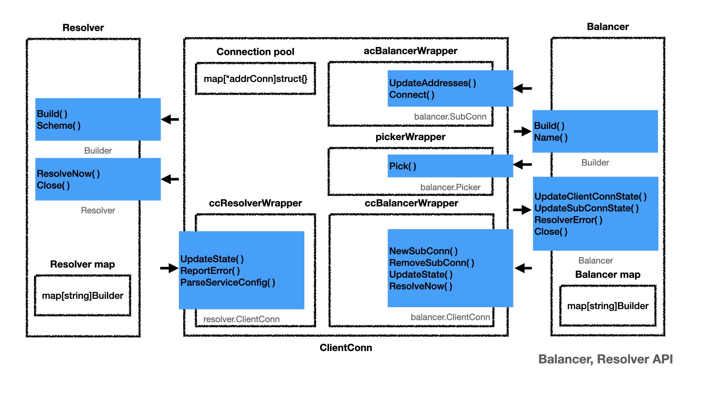
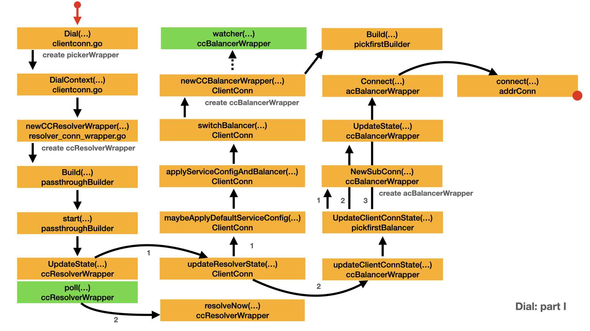

# Client Dial

- [Balancer and Resolver API](#balancer-and-resolver-api)
- [Dial process part I](#dial-process-part-i)
  - [Determine resolver builder](#determine-resolver-builder)
  - [Create resolver](#create-resolver)
  - [Apply service config](#apply-service-config)
  - [Initialize balancer](#initialize-balancer)
  - [Update client connection](#update-client-connection)
- [Dial process part II](#dial-process-part-ii)
  - [Update connectivity state](#update-connectivity-state)
  - [Create transport](#create-transport)

Client dial is the process to establish the connection with the target server. Client dial is a necessary step before any RPC happens.

In the following discussion, we use the `passthrough` resolver and `pickfirst` balancer. They are the default resolver and balancer. The simple resolver and balancer can help you to understand the dial process quickly. For other resolver and balancer, The dial process is similar with little difference.

## Balancer and Resolver API

There is an [official design document](https://github.com/grpc/proposal/blob/master/L9-go-resolver-balancer-API.md) about the resolver and balancer API. But it's a little bit older than the code. The following diagram is made from the recent source code.

`Resolver` watches for the updates on the specified target. Updates include address updates and service config updates.

- `resolver.ClientConn` interface which contains the callbacks for resolver to notify any updates to the gRPC.
- `resolver.Builder` interface creates resolver.
- There is a resolver map stores all the registered resolver builders.

`Balancer` takes input from gRPC, manages `SubConn`, collects and aggregates the connectivity states. It also generates and updates the Picker used by gRPC to pick `SubConn` for RPCs.

- `balancer.ClientConn` interface represents a balancer view of `ClientConn`.
- `balancer.Builder` interface helps to creates a balancer.
- `balancer.Picker` interface is used by gRPC to pick a `SubConn` to send an RPC.
- `balancer.SubConn` interface represents a gRPC sub connection.
- There is a balancer map stores all the registered balancer builders.

Balancer is expected to generate a new picker from its snapshot every time its internal state has changed. The pickers used by gRPC can be updated by `ClientConn.UpdateState()`.

`ClientConn` represents a virtual connection to a conceptual endpoint, to perform RPCs. A `ClientConn` is free to have zero or more actual connections to the endpoint based on configuration, load, etc. It is also free to determine which actual endpoints to use and may change it every RPC, permitting client-side load balancing.

- `ClientConn` has a connection pool to store all the connections.
- `ccResolverWrapper` implements `resolver.ClientConn`.
- `ccBalancerWrapper` implements `balancer.ClientConn`.
- `acBalancerWrapper` implements `balancer.SubConn`.
- `pickerWrapper` implements `balancer.Picker`.

`Dial()` uses most parts of this diagram. You can verify this diagram from the following dial example.



## Dial process part I

`Dial` is a complex process. The following diagram is a map to prevent you from lost in a mass of code. I did lost many times. And this is part I. Yes, there is part II.



- yellow box represents the important type and method/function.
- green box represents a function run in a dedicated goroutine.
- arrow represents the call direction and order.
- Left red dot represents the box is a continue part from other diagram.
- Right red dot represents there is a extension diagram for that box.

Here is the client [application code](https://github.com/grpc/grpc-go/blob/master/examples/features/authentication/client/main.go). Please note `addr` default value is `localhost:50051`. `grpc.Dial()` tries to create a connection to the target server.

```go
var addr = flag.String("addr", "localhost:50051", "the address to connect to")

func main() {
    flag.Parse()

    // Set up the credentials for the connection.
    perRPC := oauth.NewOauthAccess(fetchToken())
    creds, err := credentials.NewClientTLSFromFile(data.Path("x509/ca_cert.pem"), "x.test.example.com")
    if err != nil {
        log.Fatalf("failed to load credentials: %v", err)
    }
    opts := []grpc.DialOption{
        // In addition to the following grpc.DialOption, callers may also use
        // the grpc.CallOption grpc.PerRPCCredentials with the RPC invocation
        // itself.
        // See: https://godoc.org/google.golang.org/grpc#PerRPCCredentials
        grpc.WithPerRPCCredentials(perRPC),
        // oauth.NewOauthAccess requires the configuration of transport
        // credentials.
        grpc.WithTransportCredentials(creds),
    }

    opts = append(opts, grpc.WithBlock())
    conn, err := grpc.Dial(*addr, opts...)
    if err != nil {
        log.Fatalf("did not connect: %v", err)
    }
    defer conn.Close()
    rgc := ecpb.NewEchoClient(conn)

    callUnaryEcho(rgc, "hello world")
}

func callUnaryEcho(client ecpb.EchoClient, message string) {
    ctx, cancel := context.WithTimeout(context.Background(), 10*time.Second)
    defer cancel()
    resp, err := client.UnaryEcho(ctx, &ecpb.EchoRequest{Message: message})
    if err != nil {
        log.Fatalf("client.UnaryEcho(_) = _, %v: ", err)
    }
    fmt.Println("UnaryEcho: ", resp.Message)
}
```

### newCCResolverWrapper()

### Determine resolver builder

- Client application calls `Dial()`.
- `Dial()` calls `DialContext()`.
- In our case, the default resolver is `passthrough`.
  - Because the `cc.parsedTarget.Scheme` is empty string. `resolverBuilder` is nil.
  - In this case, the default scheme is used, which is `passthrough`.
- `DialContext()` calls `newCCResolverWrapper()` to create the resolver.
  - gRPC provides `dns` resolver, `unix` resolver, `passthrough` resolver, `xds` resolver.
  - By default, gRPC registers three resolvers: `dns`, `unix` and `passthrough` resolver.
  - In this case, `resolverBuilder` is `passthroughBuilder`.
- After creates the `ccResolverWrapper`, `DialContext()` can just return for non-blocking dial, or wait the state changing for blocking dial.
  - For blocking dial, `cc.GetState()` and `cc.WaitForStateChange()` working together to monitor the state of connection.
  - The for loop stops until `s == connectivity.Ready`.

Let's continue the discussion of `newCCResolverWrapper()`

```go
// Dial creates a client connection to the given target.
func Dial(target string, opts ...DialOption) (*ClientConn, error) {
    return DialContext(context.Background(), target, opts...)
}

// DialContext creates a client connection to the given target. By default, it's
// a non-blocking dial (the function won't wait for connections to be
// established, and connecting happens in the background). To make it a blocking
// dial, use WithBlock() dial option.
//
// In the non-blocking case, the ctx does not act against the connection. It
// only controls the setup steps.
//
// In the blocking case, ctx can be used to cancel or expire the pending
// connection. Once this function returns, the cancellation and expiration of
// ctx will be noop. Users should call ClientConn.Close to terminate all the
// pending operations after this function returns.
//
// The target name syntax is defined in
// https://github.com/grpc/grpc/blob/master/doc/naming.md.
// e.g. to use dns resolver, a "dns:///" prefix should be applied to the target.
func DialContext(ctx context.Context, target string, opts ...DialOption) (conn *ClientConn, err error) {
    cc := &ClientConn{
        target:            target,
        csMgr:             &connectivityStateManager{},
        conns:             make(map[*addrConn]struct{}),
        dopts:             defaultDialOptions(),
        blockingpicker:    newPickerWrapper(),
        czData:            new(channelzData),
        firstResolveEvent: grpcsync.NewEvent(),
    }
    cc.retryThrottler.Store((*retryThrottler)(nil))
    cc.ctx, cc.cancel = context.WithCancel(context.Background())

    for _, opt := range opts {
        opt.apply(&cc.dopts)
    }

+-- 96 lines: chainUnaryClientInterceptors(cc)··············································································································

    // Determine the resolver to use.
    cc.parsedTarget = grpcutil.ParseTarget(cc.target, cc.dopts.copts.Dialer != nil)
    channelz.Infof(logger, cc.channelzID, "parsed scheme: %q", cc.parsedTarget.Scheme)
    resolverBuilder := cc.getResolver(cc.parsedTarget.Scheme)
    if resolverBuilder == nil {
        // If resolver builder is still nil, the parsed target's scheme is
        // not registered. Fallback to default resolver and set Endpoint to
        // the original target.
        channelz.Infof(logger, cc.channelzID, "scheme %q not registered, fallback to default scheme", cc.parsedTarget.Scheme)
        cc.parsedTarget = resolver.Target{
            Scheme:   resolver.GetDefaultScheme(),
            Endpoint: target,
        }
        resolverBuilder = cc.getResolver(cc.parsedTarget.Scheme)
        if resolverBuilder == nil {
            return nil, fmt.Errorf("could not get resolver for default scheme: %q", cc.parsedTarget.Scheme)
        }
    }

+-- 43 lines: creds := cc.dopts.copts.TransportCredentials··································································································

    // Build the resolver.
    rWrapper, err := newCCResolverWrapper(cc, resolverBuilder)
    if err != nil {
        return nil, fmt.Errorf("failed to build resolver: %v", err)
    }
    cc.mu.Lock()
    cc.resolverWrapper = rWrapper
    cc.mu.Unlock()

    // A blocking dial blocks until the clientConn is ready.
    if cc.dopts.block {
        for {
            s := cc.GetState()
            if s == connectivity.Ready {
                break
            } else if cc.dopts.copts.FailOnNonTempDialError && s == connectivity.TransientFailure {
                if err = cc.connectionError(); err != nil {
                    terr, ok := err.(interface {
                        Temporary() bool
                    })
                    if ok && !terr.Temporary() {
                        return nil, err
                    }
                }
            }
            if !cc.WaitForStateChange(ctx, s) {
                // ctx got timeout or canceled.
                if err = cc.connectionError(); err != nil && cc.dopts.returnLastError {
                    return nil, err
                }
                return nil, ctx.Err()
            }
        }
    }

    return cc, nil
}
```

### ccResolverWrapper.UpdateState()

### Create resolver

- `newCCResolverWrapper()` calls `resolver.Build()` to build the resolver
  - `ccResolverWrapper` is a wrapper on top of `cc` for resolvers.
  - `ccResolverWrapper` implements `resolver.ClientConn` interface.
  - `resolver.ClientConn` contains the callbacks for resolver to notify any updates to the gRPC `ClientConn`.

- For `resolver.Build()`, the `passthroughBuilder.Build()` will be called.
  - `Build()` creates `passthroughResolver` and calls its `r.start()` method.
  - `r.start()` calls `r.cc.UpdateState()` method with the new `State` parameter.
  - the new `State` parameter only contains `State.Addresses=[]resolver.Address{{Addr: "localhost:50051"}}`

- `r.cc.UpdateState()` is actually `ccResolverWrapper.UpdateState()`.
  - please note the difference between `ClientConn` struct and `resolver.ClientConn` interface.
  - `UpdateState()` sets `ccr.curState` use the new `State` parameter.
  - `UpdateState()` calls `ccr.cc.updateResolverState()`. It's our next focus.
  - `UpdateState()` calls `ccr.poll()` to start a goroutine.

In `ccr.poll()`,

- `ccr.resolveNow()` will be called to send a signal to resolver.
- `ccr.resolveNow()` calls `ccr.resolver.ResolveNow()`, which actually calls `passthroughResolver.ResolveNow()`.
- In fact, `passthroughResolver.ResolveNow()` do nothing at all.
- `ccr.poll()` will be paused by the `Timer`. After the `Timer` is up, a new `Timer` will start again.
- `ccr.poll()` stops if `ccr.polling` is closed or `ccr.done.Done()` is closed.
- one way to stop `ccr.poll()` is to call `ccr.poll()` again with the `balancer.ErrBadResolverState` parameter.
- In this way the `ccr.poll()` will be stopped by the `ccr.polling` channel.

In our case, `ccr.poll()` seems useless. That is true for the `passthroughResolver`. If the resolver is `dnsResolver`, `dnsResolver` will resolve the DNS name upon receive the signal from `ccr.resolver.ResolveNow()`. Then `dnsResolver` will notify gRPC via `cc.UpdateState()`.

Let's continue the discussion of `ccr.cc.updateResolverState()`.

```go
// newCCResolverWrapper uses the resolver.Builder to build a Resolver and
// returns a ccResolverWrapper object which wraps the newly built resolver.
func newCCResolverWrapper(cc *ClientConn, rb resolver.Builder) (*ccResolverWrapper, error) {
    ccr := &ccResolverWrapper{
        cc:   cc,
        done: grpcsync.NewEvent(),
    }

    var credsClone credentials.TransportCredentials
    if creds := cc.dopts.copts.TransportCredentials; creds != nil {
        credsClone = creds.Clone()
    }
    rbo := resolver.BuildOptions{
        DisableServiceConfig: cc.dopts.disableServiceConfig,
        DialCreds:            credsClone,
        CredsBundle:          cc.dopts.copts.CredsBundle,
        Dialer:               cc.dopts.copts.Dialer,
    }

    var err error
    // We need to hold the lock here while we assign to the ccr.resolver field
    // to guard against a data race caused by the following code path,
    // rb.Build-->ccr.ReportError-->ccr.poll-->ccr.resolveNow, would end up
    // accessing ccr.resolver which is being assigned here.
    ccr.resolverMu.Lock()
    defer ccr.resolverMu.Unlock()
    ccr.resolver, err = rb.Build(cc.parsedTarget, ccr, rbo)
    if err != nil {
        return nil, err
    }
    return ccr, nil
} 

const scheme = "passthrough"

type passthroughBuilder struct{}

func (*passthroughBuilder) Build(target resolver.Target, cc resolver.ClientConn, opts resolver.BuildOptions) (resolver.Resolver, error) {
    r := &passthroughResolver{
        target: target,
        cc:     cc,
    }
    r.start()
    return r, nil
}

func (*passthroughBuilder) Scheme() string {
    return scheme
}

type passthroughResolver struct {
    target resolver.Target
    cc     resolver.ClientConn
}

func (r *passthroughResolver) start() {
    r.cc.UpdateState(resolver.State{Addresses: []resolver.Address{{Addr: r.target.Endpoint}}})
}

func (*passthroughResolver) ResolveNow(o resolver.ResolveNowOptions) {}

func (*passthroughResolver) Close() {}

func init() {
    resolver.Register(&passthroughBuilder{})
}

func (ccr *ccResolverWrapper) resolveNow(o resolver.ResolveNowOptions) {
    ccr.resolverMu.Lock()
    if !ccr.done.HasFired() {
        ccr.resolver.ResolveNow(o)
    }
    ccr.resolverMu.Unlock()
}

// poll begins or ends asynchronous polling of the resolver based on whether
// err is ErrBadResolverState.
func (ccr *ccResolverWrapper) poll(err error) {
    ccr.pollingMu.Lock()
    defer ccr.pollingMu.Unlock()
    if err != balancer.ErrBadResolverState {
        // stop polling
        if ccr.polling != nil {
            close(ccr.polling)
            ccr.polling = nil
        }
        return
    }
    if ccr.polling != nil {
        // already polling
        return
    }
    p := make(chan struct{})
    ccr.polling = p
    go func() {
        for i := 0; ; i++ {
            ccr.resolveNow(resolver.ResolveNowOptions{})
            t := time.NewTimer(ccr.cc.dopts.resolveNowBackoff(i))
            select {
            case <-p:
                t.Stop()
                return
            case <-ccr.done.Done():
                // Resolver has been closed.
                t.Stop()
                return
            case <-t.C:
                select {
                case <-p:
                    return
                default:
                }
                // Timer expired; re-resolve.
            }
        }
    }()
}

func (ccr *ccResolverWrapper) UpdateState(s resolver.State) {
    if ccr.done.HasFired() {
        return
    }
    channelz.Infof(logger, ccr.cc.channelzID, "ccResolverWrapper: sending update to cc: %v", s)
    if channelz.IsOn() {
        ccr.addChannelzTraceEvent(s)
    }
    ccr.curState = s
    ccr.poll(ccr.cc.updateResolverState(ccr.curState, nil))
}
```

### ClientConn.updateResolverState()

### Apply service config

- `ccr.cc.updateResolverState()` belongs to `ClientConn` which is the core of gRPC.
- `ccr.cc.updateResolverState()` is actually `ClientConn.updateResolverState()`, which starts the initialization of balancer.
- In our case, `err` is nil. `cc.dopts.disableServiceConfig` is false. `s.ServiceConfig` is nil.
- The second `cc.maybeApplyDefaultServiceConfig()` is called.
  - In this case, `cc.sc` is nil, `cc.dopts.defaultServiceConfig` is also nil.
  - `cc.applyServiceConfigAndBalancer()` is called with the `emptyServiceConfig`, `defaultConfigSelector{emptyServiceConfig}` and `addrs` as parameters.
  - In `cc.applyServiceConfigAndBalancer()`, the main purpose is determine the value of `newBalancerName`.
    - In this case, `cc.dopts.balancerBuilder` is nil.
    - The value of `newBalancerName` is `PickFirstBalancerName`, which is `pick_first`.
    - Next, `applyServiceConfigAndBalancer()` calls `cc.switchBalancer()` to initialize the balancer.
    - In `cc.switchBalancer()`, after `balancer.Get()` is called, the value of `builder` is `pickfirstBuilder`.
    - In `cc.switchBalancer()`, at last `newCCBalancerWrapper()` is called.
- Finally, `updateResolverState()` calls `bw.updateClientConnState()`, which actually calls `ccBalancerWrapper.updateClientConnState()`.

Let's discuss `newCCBalancerWrapper()` first. We will discuss `ccBalancerWrapper.updateClientConnState()` later.

```go
func (cc *ClientConn) updateResolverState(s resolver.State, err error) error {
    defer cc.firstResolveEvent.Fire()
    cc.mu.Lock()
    // Check if the ClientConn is already closed. Some fields (e.g.
    // balancerWrapper) are set to nil when closing the ClientConn, and could
    // cause nil pointer panic if we don't have this check.
    if cc.conns == nil {
        cc.mu.Unlock()
        return nil
    }

    if err != nil {
        // May need to apply the initial service config in case the resolver
        // doesn't support service configs, or doesn't provide a service config
        // with the new addresses.
        cc.maybeApplyDefaultServiceConfig(nil)

        if cc.balancerWrapper != nil {
            cc.balancerWrapper.resolverError(err)
        }

        // No addresses are valid with err set; return early.
        cc.mu.Unlock()
        return balancer.ErrBadResolverState
    }

    var ret error
    if cc.dopts.disableServiceConfig || s.ServiceConfig == nil {
        cc.maybeApplyDefaultServiceConfig(s.Addresses)
        // TODO: do we need to apply a failing LB policy if there is no
        // default, per the error handling design?
    } else {
        if sc, ok := s.ServiceConfig.Config.(*ServiceConfig); s.ServiceConfig.Err == nil && ok {
            configSelector := iresolver.GetConfigSelector(s)
            if configSelector != nil {
                if len(s.ServiceConfig.Config.(*ServiceConfig).Methods) != 0 {
                    channelz.Infof(logger, cc.channelzID, "method configs in service config will be ignored due to presence of config selector")
                }
            } else {
                configSelector = &defaultConfigSelector{sc}
            }
            cc.applyServiceConfigAndBalancer(sc, configSelector, s.Addresses)
        } else {
            ret = balancer.ErrBadResolverState
            if cc.balancerWrapper == nil {
                var err error
                if s.ServiceConfig.Err != nil {
                    err = status.Errorf(codes.Unavailable, "error parsing service config: %v", s.ServiceConfig.Err)
                } else {
                    err = status.Errorf(codes.Unavailable, "illegal service config type: %T", s.ServiceConfig.Config)
                }
                cc.safeConfigSelector.UpdateConfigSelector(&defaultConfigSelector{cc.sc})
                cc.blockingpicker.updatePicker(base.NewErrPicker(err))
                cc.csMgr.updateState(connectivity.TransientFailure)
                cc.mu.Unlock()
                return ret
            }
        }
    }

    var balCfg serviceconfig.LoadBalancingConfig
    if cc.dopts.balancerBuilder == nil && cc.sc != nil && cc.sc.lbConfig != nil {
        balCfg = cc.sc.lbConfig.cfg
    }

    cbn := cc.curBalancerName
    bw := cc.balancerWrapper
    cc.mu.Unlock()
    if cbn != grpclbName {
        // Filter any grpclb addresses since we don't have the grpclb balancer.
        for i := 0; i < len(s.Addresses); {
            if s.Addresses[i].Type == resolver.GRPCLB {
                copy(s.Addresses[i:], s.Addresses[i+1:])
                s.Addresses = s.Addresses[:len(s.Addresses)-1]
                continue
            }
            i++
        }
    }
    uccsErr := bw.updateClientConnState(&balancer.ClientConnState{ResolverState: s, BalancerConfig: balCfg})
    if ret == nil {
        ret = uccsErr // prefer ErrBadResolver state since any other error is
        // currently meaningless to the caller.
    }
    return ret
}

func (cc *ClientConn) maybeApplyDefaultServiceConfig(addrs []resolver.Address) {
    if cc.sc != nil {
        cc.applyServiceConfigAndBalancer(cc.sc, nil, addrs)
        return
    }
    if cc.dopts.defaultServiceConfig != nil {
        cc.applyServiceConfigAndBalancer(cc.dopts.defaultServiceConfig, &defaultConfigSelector{cc.dopts.defaultServiceConfig}, addrs)
    } else {
        cc.applyServiceConfigAndBalancer(emptyServiceConfig, &defaultConfigSelector{emptyServiceConfig}, addrs)
    }
}

func (cc *ClientConn) applyServiceConfigAndBalancer(sc *ServiceConfig, configSelector iresolver.ConfigSelector, addrs []resolver.Address) {
    if sc == nil {
        // should never reach here.
        return
    }
    cc.sc = sc
    if configSelector != nil {
        cc.safeConfigSelector.UpdateConfigSelector(configSelector)
    }

    if cc.sc.retryThrottling != nil {
        newThrottler := &retryThrottler{
            tokens: cc.sc.retryThrottling.MaxTokens,
            max:    cc.sc.retryThrottling.MaxTokens,
            thresh: cc.sc.retryThrottling.MaxTokens / 2,
            ratio:  cc.sc.retryThrottling.TokenRatio,
        }
        cc.retryThrottler.Store(newThrottler)
    } else {
        cc.retryThrottler.Store((*retryThrottler)(nil))
    }

    if cc.dopts.balancerBuilder == nil {
        // Only look at balancer types and switch balancer if balancer dial
        // option is not set.
        var newBalancerName string
        if cc.sc != nil && cc.sc.lbConfig != nil {
            newBalancerName = cc.sc.lbConfig.name
        } else {
            var isGRPCLB bool
            for _, a := range addrs {
                if a.Type == resolver.GRPCLB {
                    isGRPCLB = true
                    break
                }
            }
            if isGRPCLB {
                newBalancerName = grpclbName
            } else if cc.sc != nil && cc.sc.LB != nil {
                newBalancerName = *cc.sc.LB
            } else {
                newBalancerName = PickFirstBalancerName
            }
        }
        cc.switchBalancer(newBalancerName)
    } else if cc.balancerWrapper == nil {
        // Balancer dial option was set, and this is the first time handling
        // resolved addresses. Build a balancer with dopts.balancerBuilder.
        cc.curBalancerName = cc.dopts.balancerBuilder.Name()
        cc.balancerWrapper = newCCBalancerWrapper(cc, cc.dopts.balancerBuilder, cc.balancerBuildOpts)
    }
}

// switchBalancer starts the switching from current balancer to the balancer
// with the given name.
//
// It will NOT send the current address list to the new balancer. If needed,
// caller of this function should send address list to the new balancer after
// this function returns.
//
// Caller must hold cc.mu.
func (cc *ClientConn) switchBalancer(name string) {
    if strings.EqualFold(cc.curBalancerName, name) {
        return
    }

    channelz.Infof(logger, cc.channelzID, "ClientConn switching balancer to %q", name)
    if cc.dopts.balancerBuilder != nil {
        channelz.Info(logger, cc.channelzID, "ignoring balancer switching: Balancer DialOption used instead")
        return
    }
    if cc.balancerWrapper != nil {
        cc.balancerWrapper.close()
    }

    builder := balancer.Get(name)
    if builder == nil {
        channelz.Warningf(logger, cc.channelzID, "Channel switches to new LB policy %q due to fallback from invalid balancer name", PickFirstBalancerName)
        channelz.Infof(logger, cc.channelzID, "failed to get balancer builder for: %v, using pick_first instead", name)
        builder = newPickfirstBuilder()
    } else {
        channelz.Infof(logger, cc.channelzID, "Channel switches to new LB policy %q", name)
    }

    cc.curBalancerName = builder.Name()
    cc.balancerWrapper = newCCBalancerWrapper(cc, builder, cc.balancerBuildOpts)
}
```

### newCCBalancerWrapper()

### Initialize balancer

- In our case, when `newCCBalancerWrapper()` is called, `builder` parameter is `pickfirstBuilder`.
- `newCCBalancerWrapper()` calls `b.Build()`, which is actually `pickfirstBuilder.Build()`.
  - `b.Build()` creates a new `pickfirstBalancer` object.
- `newCCBalancerWrapper()` starts a new goroutine `ccb.watcher()`.

```go
func newCCBalancerWrapper(cc *ClientConn, b balancer.Builder, bopts balancer.BuildOptions) *ccBalancerWrapper {
    ccb := &ccBalancerWrapper{
        cc:       cc,
        scBuffer: buffer.NewUnbounded(),
        done:     grpcsync.NewEvent(),
        subConns: make(map[*acBalancerWrapper]struct{}),
    }
    go ccb.watcher()
    ccb.balancer = b.Build(ccb, bopts)
    return ccb
}

// PickFirstBalancerName is the name of the pick_first balancer.
const PickFirstBalancerName = "pick_first"

func newPickfirstBuilder() balancer.Builder {
    return &pickfirstBuilder{}
}

type pickfirstBuilder struct{}

func (*pickfirstBuilder) Build(cc balancer.ClientConn, opt balancer.BuildOptions) balancer.Balancer {
    return &pickfirstBalancer{cc: cc}
}

func (*pickfirstBuilder) Name() string {
    return PickFirstBalancerName
}
```

`ccb.watcher()` waits and reads the connection state `t` from a channel `ccb.scBuffer.Get()`

- `t` is an object of type `scStateUpdate`
- `scStateUpdate` contains the `balancer.subConns` and the `connectivity.State`

`ccb.watcher()` calls `ccb.balancer.UpdateSubConnState()` to update the balancer connection state.

- `ccb.balancer.UpdateSubConnState()` is actually `pickfirstBalancer.UpdateSubConnState()`.
- In `pickfirstBalancer.UpdateSubConnState()`, `b.cc.UpdateState()` is called to forward the picker and state.
- `b.cc.UpdateState()` is actually `ccBalancerWrapper.UpdateState()`.

```go
// watcher balancer functions sequentially, so the balancer can be implemented
// lock-free.
func (ccb *ccBalancerWrapper) watcher() {
    for {
        select {
        case t := <-ccb.scBuffer.Get():
            ccb.scBuffer.Load()
            if ccb.done.HasFired() {
                break
            }
            ccb.balancerMu.Lock()
            su := t.(*scStateUpdate)
            ccb.balancer.UpdateSubConnState(su.sc, balancer.SubConnState{ConnectivityState: su.state, ConnectionError: su.err})
            ccb.balancerMu.Unlock()
        case <-ccb.done.Done():
        }

        if ccb.done.HasFired() {
            ccb.balancer.Close()
            ccb.mu.Lock()
            scs := ccb.subConns
            ccb.subConns = nil
            ccb.mu.Unlock()
            for acbw := range scs {
                ccb.cc.removeAddrConn(acbw.getAddrConn(), errConnDrain)
            }
            ccb.UpdateState(balancer.State{ConnectivityState: connectivity.Connecting, Picker: nil})
            return
        }
    }
}

func (b *pickfirstBalancer) UpdateSubConnState(sc balancer.SubConn, s balancer.SubConnState) {
    if logger.V(2) {
        logger.Infof("pickfirstBalancer: UpdateSubConnState: %p, %v", sc, s)
    }
    if b.sc != sc {
        if logger.V(2) {
            logger.Infof("pickfirstBalancer: ignored state change because sc is not recognized")
        }
        return
    }
    b.state = s.ConnectivityState
    if s.ConnectivityState == connectivity.Shutdown {
        b.sc = nil
        return
    }

    switch s.ConnectivityState {
    case connectivity.Ready, connectivity.Idle:
        b.cc.UpdateState(balancer.State{ConnectivityState: s.ConnectivityState, Picker: &picker{result: balancer.PickResult{SubConn: sc}}})
    case connectivity.Connecting:
        b.cc.UpdateState(balancer.State{ConnectivityState: s.ConnectivityState, Picker: &picker{err: balancer.ErrNoSubConnAvailable}})
    case connectivity.TransientFailure:
        b.cc.UpdateState(balancer.State{
            ConnectivityState: s.ConnectivityState,
            Picker:            &picker{err: s.ConnectionError},
        })
    }
}

```

In `ccBalancerWrapper.UpdateState()`,

- `ccb.cc.csMgr.updateState()` will be called to notify the new state to `connectivityStateManager`.
- `ccb.cc.blockingpicker.updatePicker()` will be called to update the `Picker`.

Next, Let's discuss `ccBalancerWrapper.updateClientConnState()`

```go
func (ccb *ccBalancerWrapper) UpdateState(s balancer.State) {
    ccb.mu.Lock()
    defer ccb.mu.Unlock()
    if ccb.subConns == nil {
        return
    }
    // Update picker before updating state.  Even though the ordering here does
    // not matter, it can lead to multiple calls of Pick in the common start-up
    // case where we wait for ready and then perform an RPC.  If the picker is
    // updated later, we could call the "connecting" picker when the state is
    // updated, and then call the "ready" picker after the picker gets updated.
    ccb.cc.blockingpicker.updatePicker(s.Picker)
    ccb.cc.csMgr.updateState(s.ConnectivityState)
}

// updateState updates the connectivity.State of ClientConn.
// If there's a change it notifies goroutines waiting on state change to
// happen.
func (csm *connectivityStateManager) updateState(state connectivity.State) {
    csm.mu.Lock()
    defer csm.mu.Unlock()
    if csm.state == connectivity.Shutdown {
        return
    }
    if csm.state == state {
        return
    }
    csm.state = state
    channelz.Infof(logger, csm.channelzID, "Channel Connectivity change to %v", state)
    if csm.notifyChan != nil {
        // There are other goroutines waiting on this channel.
        close(csm.notifyChan)
        csm.notifyChan = nil
    }
}

// updatePicker is called by UpdateBalancerState. It unblocks all blocked pick.
func (pw *pickerWrapper) updatePicker(p balancer.Picker) {
    pw.mu.Lock()
    if pw.done {
        pw.mu.Unlock()
        return
    }
    pw.picker = p
    // pw.blockingCh should never be nil.
    close(pw.blockingCh)
    pw.blockingCh = make(chan struct{})
    pw.mu.Unlock()
}
```

### ccBalancerWrapper.updateClientConnState()

### Update client connection

`ccBalancerWrapper.updateClientConnState()` calls `ccb.balancer.UpdateClientConnState()` to finish the job. In this case, `Balancer` is `pickfirstBalancer`. So `pickfirstBalancer.UpdateClientConnState()` will be called.

In `pickfirstBalancer.UpdateClientConnState()`, `b.sc` is nil.

- `UpdateClientConnState()` calls `b.cc.NewSubConn()`, which is actually `ccBalancerWrapper.NewSubConn()` to create sub connection.
- `UpdateClientConnState()` calls `b.cc.UpdateState()`, which is actually `ccBalancerWrapper.UpdateState()` to update the connection state to `Idle`.
  - We already discuss `ccBalancerWrapper.UpdateState()`  in previous section.
  - Balancer use `ccBalancerWrapper.UpdateState()` to notify gRPC the state of connectivity and change the `Picker`.
- `UpdateClientConnState()` calls `b.sc.Connect()`, which is actually `acBalancerWrapper.Connect()` to connect with the target server.
  - In our case, `b.sc` is assigned by the return value of `b.cc.NewSubConn()` which is `acBalancerWrapper`.

```go
func (ccb *ccBalancerWrapper) updateClientConnState(ccs *balancer.ClientConnState) error {
    ccb.balancerMu.Lock()
    defer ccb.balancerMu.Unlock()
    return ccb.balancer.UpdateClientConnState(*ccs)
}

func (b *pickfirstBalancer) UpdateClientConnState(cs balancer.ClientConnState) error {
    if len(cs.ResolverState.Addresses) == 0 {
        b.ResolverError(errors.New("produced zero addresses"))
        return balancer.ErrBadResolverState
    }
    if b.sc == nil {
        var err error
        b.sc, err = b.cc.NewSubConn(cs.ResolverState.Addresses, balancer.NewSubConnOptions{})
        if err != nil {
            if logger.V(2) {
                logger.Errorf("pickfirstBalancer: failed to NewSubConn: %v", err)
            }
            b.state = connectivity.TransientFailure
            b.cc.UpdateState(balancer.State{ConnectivityState: connectivity.TransientFailure,
                Picker: &picker{err: fmt.Errorf("error creating connection: %v", err)},
            })
            return balancer.ErrBadResolverState
        }
        b.state = connectivity.Idle
        b.cc.UpdateState(balancer.State{ConnectivityState: connectivity.Idle, Picker: &picker{result: balancer.PickResult{SubConn: b.sc}}})
        b.sc.Connect()
    } else {
        b.cc.UpdateAddresses(b.sc, cs.ResolverState.Addresses)
        b.sc.Connect()
    }
    return nil
}
```

`ccBalancerWrapper.NewSubConn()` calls `ccb.cc.newAddrConn()` to create `addrConn`.

- `ccb.cc.newAddrConn()` is actually `ClientConn.newAddrConn()`.
- `NewSubConn()` creates `acBalancerWrapper`, which implements `balancer.SubConn` interface.
- `ClientConn.newAddrConn()` stores the just created `addrConn` in connection pool `cc.conns[ac] = struct{}{}`.
- `addrConn` represents the real connection, right now `addrConn` does not connect to the target. gRPC will perform the connection later.

```go
func (ccb *ccBalancerWrapper) NewSubConn(addrs []resolver.Address, opts balancer.NewSubConnOptions) (balancer.SubConn, error) {
    if len(addrs) <= 0 {
        return nil, fmt.Errorf("grpc: cannot create SubConn with empty address list")
    }
    ccb.mu.Lock()
    defer ccb.mu.Unlock()
    if ccb.subConns == nil {
        return nil, fmt.Errorf("grpc: ClientConn balancer wrapper was closed")
    }
    ac, err := ccb.cc.newAddrConn(addrs, opts)
    if err != nil {
        return nil, err
    }
    acbw := &acBalancerWrapper{ac: ac}
    acbw.ac.mu.Lock()
    ac.acbw = acbw
    acbw.ac.mu.Unlock()
    ccb.subConns[acbw] = struct{}{}
    return acbw, nil
}

// newAddrConn creates an addrConn for addrs and adds it to cc.conns.
//
// Caller needs to make sure len(addrs) > 0.
func (cc *ClientConn) newAddrConn(addrs []resolver.Address, opts balancer.NewSubConnOptions) (*addrConn, error) {
    ac := &addrConn{
        state:        connectivity.Idle,
        cc:           cc,
        addrs:        addrs,
        scopts:       opts,
        dopts:        cc.dopts,
        czData:       new(channelzData),
        resetBackoff: make(chan struct{}),
    }
    ac.ctx, ac.cancel = context.WithCancel(cc.ctx)
    // Track ac in cc. This needs to be done before any getTransport(...) is called.
    cc.mu.Lock()
    if cc.conns == nil {
        cc.mu.Unlock()
        return nil, ErrClientConnClosing
    }
    if channelz.IsOn() {
        ac.channelzID = channelz.RegisterSubChannel(ac, cc.channelzID, "")
        channelz.AddTraceEvent(logger, ac.channelzID, 0, &channelz.TraceEventDesc{
            Desc:     "Subchannel Created",
            Severity: channelz.CtInfo,
            Parent: &channelz.TraceEventDesc{
                Desc:     fmt.Sprintf("Subchannel(id:%d) created", ac.channelzID),
                Severity: channelz.CtInfo,
            },
        })
    }
    cc.conns[ac] = struct{}{}
    cc.mu.Unlock()
    return ac, nil
}
```

`ccBalancerWrapper.UpdateState()` calls `acbw.ac.connect()`, which is `addrConn.connect()` to finish its job. We will continue the discussion of `addrConn.connect()` in next section.

```go

func (acbw *acBalancerWrapper) Connect() {
    acbw.mu.Lock()
    defer acbw.mu.Unlock()
    acbw.ac.connect()
}
```

## Dial process part II

It's time to show the Dial process part II. Part II focus on establishing transport connection with the target server.


- yellow box represents the important type and method/function.
- green box represents a function run in a dedicated goroutine.
- arrow represents the call direction and order.
- Left red dot represents the box is a continue part from other diagram.
- Right red dot represents there is a extension diagram for that box.

### addrConn.connect()

### Update connectivity state

`addrConn.connect()` calls `ac.updateConnectivityState()` to update the connectivity state.

- `ac.updateConnectivityState()` is `addrConn.updateConnectivityState()`.
- Here, the connectivity state is `connectivity.Connecting`.

`addrConn.connect()` calls `ac.resetTransport()` to connect with the target server. We will discuss `ac.resetTransport()` in next section

```go
// connect starts creating a transport.
// It does nothing if the ac is not IDLE.
// TODO(bar) Move this to the addrConn section.
func (ac *addrConn) connect() error {
    ac.mu.Lock()
    if ac.state == connectivity.Shutdown {
        ac.mu.Unlock()
        return errConnClosing
    }
    if ac.state != connectivity.Idle {
        ac.mu.Unlock()
        return nil
    }
    // Update connectivity state within the lock to prevent subsequent or
    // concurrent calls from resetting the transport more than once.
    ac.updateConnectivityState(connectivity.Connecting, nil)
    ac.mu.Unlock()

    // Start a goroutine connecting to the server asynchronously.
    go ac.resetTransport()
    return nil
}
```

`ac.updateConnectivityState()` upstates `ac.state` and calls `ac.cc.handleSubConnStateChange()` to finish the job.

- `ac.cc.handleSubConnStateChange()` is `ClientConn.handleSubConnStateChange()`.
- Note the `connectivity.State` is forwarded to `ClientConn.handleSubConnStateChange()`.

```go
// Note: this requires a lock on ac.mu.
func (ac *addrConn) updateConnectivityState(s connectivity.State, lastErr error) {
    if ac.state == s {
        return
    }
    ac.state = s
    channelz.Infof(logger, ac.channelzID, "Subchannel Connectivity change to %v", s)
    ac.cc.handleSubConnStateChange(ac.acbw, s, lastErr)
}
```

`ClientConn.handleSubConnStateChange()` calls `cc.balancerWrapper.handleSubConnStateChange()` to finish the job.

- `cc.balancerWrapper.handleSubConnStateChange()` is `ccBalancerWrapper.handleSubConnStateChange()`.
- Note the `connectivity.State` is forwarded to `ccBalancerWrapper.handleSubConnStateChange()`.

```go
func (cc *ClientConn) handleSubConnStateChange(sc balancer.SubConn, s connectivity.State, err error) {
    cc.mu.Lock()
    if cc.conns == nil {
        cc.mu.Unlock()
        return
    }
    // TODO(bar switching) send updates to all balancer wrappers when balancer
    // gracefully switching is supported.
    cc.balancerWrapper.handleSubConnStateChange(sc, s, err)
    cc.mu.Unlock()
}
```

`cc.balancerWrapper.handleSubConnStateChange()` creates `scStateUpdate` and calls `ccb.scBuffer.Put()` to send the state update message to `ccb.watcher()`.

- `ccb.scBuffer` is an object of type `buffer.Unbounded`. `ccb.scBuffer.Put()` is actually `Unbounded.Put()`.
- `Unbounded.Put()` sends the message to a channel in `Unbounded` struct.
- `ccb.watcher()` reads the message from the same channel in `Unbounded` struct.

Please refer to [Initialize balancer](#initialize-balancer) for the detail of `ccb.watcher()`.

```go
func (ccb *ccBalancerWrapper) handleSubConnStateChange(sc balancer.SubConn, s connectivity.State, err error) {
    // When updating addresses for a SubConn, if the address in use is not in
    // the new addresses, the old ac will be tearDown() and a new ac will be
    // created. tearDown() generates a state change with Shutdown state, we
    // don't want the balancer to receive this state change. So before
    // tearDown() on the old ac, ac.acbw (acWrapper) will be set to nil, and
    // this function will be called with (nil, Shutdown). We don't need to call
    // balancer method in this case.
    if sc == nil {
        return
    }
    ccb.scBuffer.Put(&scStateUpdate{
        sc:    sc,
        state: s,
        err:   err,
    })
}

// ccBalancerWrapper is a wrapper on top of cc for balancers.
// It implements balancer.ClientConn interface.
type ccBalancerWrapper struct {
    cc         *ClientConn
    balancerMu sync.Mutex // synchronizes calls to the balancer
    balancer   balancer.Balancer
    scBuffer   *buffer.Unbounded
    done       *grpcsync.Event

    mu       sync.Mutex
    subConns map[*acBalancerWrapper]struct{}
}

// Put adds t to the unbounded buffer.
func (b *Unbounded) Put(t interface{}) {
    b.mu.Lock()
    if len(b.backlog) == 0 {
        select {
        case b.c <- t:
            b.mu.Unlock()
            return
        default:
        }
    }
    b.backlog = append(b.backlog, t)
    b.mu.Unlock()
}

// scStateUpdate contains the subConn and the new state it changed to.
type scStateUpdate struct {
    sc    balancer.SubConn
    state connectivity.State
    err   error
}
```

### addrConn.resetTransport()

### Create transport

In the last step of `addrConn.connect()`, `addrConn.resetTransport()` will be called to connect to the server asynchronously.

- `resetTransport()` calls `ac.tryAllAddrs()`, which is `addrConn.tryAllAddrs()`.
- If `ac.tryAllAddrs()` returned successfully, `resetTransport()` calls `ac.startHealthCheck()`.

Next we discuss `ac.startHealthCheck()` first. `addrConn.tryAllAddrs()`  will be the last one to discuss.

```go
func (ac *addrConn) resetTransport() {
    for i := 0; ; i++ {
        if i > 0 {
            ac.cc.resolveNow(resolver.ResolveNowOptions{})
        }

        ac.mu.Lock()
        if ac.state == connectivity.Shutdown {
            ac.mu.Unlock()
            return
        }

        addrs := ac.addrs
        backoffFor := ac.dopts.bs.Backoff(ac.backoffIdx)
        // This will be the duration that dial gets to finish.
        dialDuration := minConnectTimeout
        if ac.dopts.minConnectTimeout != nil {
            dialDuration = ac.dopts.minConnectTimeout()
        }

        if dialDuration < backoffFor {
            // Give dial more time as we keep failing to connect.
            dialDuration = backoffFor
        }
        // We can potentially spend all the time trying the first address, and
        // if the server accepts the connection and then hangs, the following
        // addresses will never be tried.
        //
        // The spec doesn't mention what should be done for multiple addresses.
        // https://github.com/grpc/grpc/blob/master/doc/connection-backoff.md#proposed-backoff-algorithm
        connectDeadline := time.Now().Add(dialDuration)

        ac.updateConnectivityState(connectivity.Connecting, nil)
        ac.transport = nil
        ac.mu.Unlock()

        newTr, addr, reconnect, err := ac.tryAllAddrs(addrs, connectDeadline)
        if err != nil {
            // After exhausting all addresses, the addrConn enters
            // TRANSIENT_FAILURE.
            ac.mu.Lock()
            if ac.state == connectivity.Shutdown {
                ac.mu.Unlock()
                return
            }
            ac.updateConnectivityState(connectivity.TransientFailure, err)

            // Backoff.
            b := ac.resetBackoff
            ac.mu.Unlock()

            timer := time.NewTimer(backoffFor)
            select {
            case <-timer.C:
                ac.mu.Lock()
                ac.backoffIdx++
                ac.mu.Unlock()
            case <-b:
                timer.Stop()
            case <-ac.ctx.Done():
                timer.Stop()
                return
            }
            continue
        }

        ac.mu.Lock()
        if ac.state == connectivity.Shutdown {
            ac.mu.Unlock()
            newTr.Close()
            return
        }
        ac.curAddr = addr
        ac.transport = newTr
        ac.backoffIdx = 0

        hctx, hcancel := context.WithCancel(ac.ctx)
        ac.startHealthCheck(hctx)
        ac.mu.Unlock()

        // Block until the created transport is down. And when this happens,
        // we restart from the top of the addr list.
        <-reconnect.Done()
        hcancel()
        // restart connecting - the top of the loop will set state to
        // CONNECTING.  This is against the current connectivity semantics doc,
        // however it allows for graceful behavior for RPCs not yet dispatched
        // - unfortunate timing would otherwise lead to the RPC failing even
        // though the TRANSIENT_FAILURE state (called for by the doc) would be
        // instantaneous.
        //
        // Ideally we should transition to Idle here and block until there is
        // RPC activity that leads to the balancer requesting a reconnect of
        // the associated SubConn.
    }
}
```

In `startHealthCheck()`, the defer function will call `ac.updateConnectivityState()` to set the connectivity state to ready.

- Please refer to [Update connectivity state](#update-connectivity-state) for detail.
- In our case, health check is disabled. Here we will not go deeper into health checking system.

```go
// startHealthCheck starts the health checking stream (RPC) to watch the health
// stats of this connection if health checking is requested and configured.
//
// LB channel health checking is enabled when all requirements below are met:
// 1. it is not disabled by the user with the WithDisableHealthCheck DialOption
// 2. internal.HealthCheckFunc is set by importing the grpc/health package
// 3. a service config with non-empty healthCheckConfig field is provided
// 4. the load balancer requests it
//
// It sets addrConn to READY if the health checking stream is not started.
//
// Caller must hold ac.mu.
func (ac *addrConn) startHealthCheck(ctx context.Context) {
    var healthcheckManagingState bool
    defer func() {
        if !healthcheckManagingState {
            ac.updateConnectivityState(connectivity.Ready, nil)
        }
    }()

    if ac.cc.dopts.disableHealthCheck {
        return
    }
    healthCheckConfig := ac.cc.healthCheckConfig()
    if healthCheckConfig == nil {
        return
    }
    if !ac.scopts.HealthCheckEnabled {
        return
    }
+-- 30 lines: healthCheckFunc := ac.cc.dopts.healthCheckFunc······························································································
    // Start the health checking stream.
    go func() {
        err := ac.cc.dopts.healthCheckFunc(ctx, newStream, setConnectivityState, healthCheckConfig.ServiceName)
        if err != nil {
            if status.Code(err) == codes.Unimplemented {
                channelz.Error(logger, ac.channelzID, "Subchannel health check is unimplemented at server side, thus health check is disabled")
            } else {
                channelz.Errorf(logger, ac.channelzID, "HealthCheckFunc exits with unexpected error %v", err)
            }
        }
    }()
}
```

`tryAllAddrs()` is called with the specified `connectDeadline` parameter.

- `tryAllAddrs()` calls `ac.createTransport()`, which is actually `addrConn.createTransport()`.
- Note the `connectDeadline` parameter is also passed to `ac.createTransport()`.

```go
// tryAllAddrs tries to creates a connection to the addresses, and stop when at the
// first successful one. It returns the transport, the address and a Event in
// the successful case. The Event fires when the returned transport disconnects.
func (ac *addrConn) tryAllAddrs(addrs []resolver.Address, connectDeadline time.Time) (transport.ClientTransport, resolver.Address, *grpcsync.Event, error) {
    var firstConnErr error
    for _, addr := range addrs {
        ac.mu.Lock()
        if ac.state == connectivity.Shutdown {
            ac.mu.Unlock()
            return nil, resolver.Address{}, nil, errConnClosing
        }

        ac.cc.mu.RLock()
        ac.dopts.copts.KeepaliveParams = ac.cc.mkp
        ac.cc.mu.RUnlock()

        copts := ac.dopts.copts
        if ac.scopts.CredsBundle != nil {
            copts.CredsBundle = ac.scopts.CredsBundle
        }
        ac.mu.Unlock()

        channelz.Infof(logger, ac.channelzID, "Subchannel picks a new address %q to connect", addr.Addr)

        newTr, reconnect, err := ac.createTransport(addr, copts, connectDeadline)
        if err == nil {
            return newTr, addr, reconnect, nil
        }
        if firstConnErr == nil {
            firstConnErr = err
        }
        ac.cc.updateConnectionError(err)
    }

    // Couldn't connect to any address.
    return nil, resolver.Address{}, nil, firstConnErr
}
```

`createTransport()` calls `transport.NewClientTransport()` to connect to target server.

- On successful `transport.NewClientTransport()` returns, `prefaceReceived` channel will receive a hint.

```go
// createTransport creates a connection to addr. It returns the transport and a
// Event in the successful case. The Event fires when the returned transport
// disconnects.
func (ac *addrConn) createTransport(addr resolver.Address, copts transport.ConnectOptions, connectDeadline time.Time) (transport.ClientTransport, *grpcsync.Event, error) {
    prefaceReceived := make(chan struct{})
    onCloseCalled := make(chan struct{})
    reconnect := grpcsync.NewEvent()

    // addr.ServerName takes precedent over ClientConn authority, if present.
    if addr.ServerName == "" {
        addr.ServerName = ac.cc.authority
    }

    once := sync.Once{}
    onGoAway := func(r transport.GoAwayReason) {
        ac.mu.Lock()
        ac.adjustParams(r)
        once.Do(func() {
            if ac.state == connectivity.Ready {
                // Prevent this SubConn from being used for new RPCs by setting its
                // state to Connecting.
                //
                // TODO: this should be Idle when grpc-go properly supports it.
                ac.updateConnectivityState(connectivity.Connecting, nil)
            }
        })
        ac.mu.Unlock()
        reconnect.Fire()
    }

    onClose := func() {
        ac.mu.Lock()
        once.Do(func() {
            if ac.state == connectivity.Ready {
                // Prevent this SubConn from being used for new RPCs by setting its
                // state to Connecting.
                //
                // TODO: this should be Idle when grpc-go properly supports it.
                ac.updateConnectivityState(connectivity.Connecting, nil)
            }
        })
        ac.mu.Unlock()
        close(onCloseCalled)
        reconnect.Fire()
    }

    onPrefaceReceipt := func() {
        close(prefaceReceived)
    }

    connectCtx, cancel := context.WithDeadline(ac.ctx, connectDeadline)
    defer cancel()
    if channelz.IsOn() {
        copts.ChannelzParentID = ac.channelzID
    }

    newTr, err := transport.NewClientTransport(connectCtx, ac.cc.ctx, addr, copts, onPrefaceReceipt, onGoAway, onClose)
    if err != nil {
        // newTr is either nil, or closed.
        channelz.Warningf(logger, ac.channelzID, "grpc: addrConn.createTransport failed to connect to %v. Err: %v. Reconnecting...", addr, err)
        return nil, nil, err
    }

    select {
    case <-time.After(time.Until(connectDeadline)):
        // We didn't get the preface in time.
        newTr.Close()
        channelz.Warningf(logger, ac.channelzID, "grpc: addrConn.createTransport failed to connect to %v: didn't receive server preface in time. Reconnecting...", addr)
        return nil, nil, errors.New("timed out waiting for server handshake")
    case <-prefaceReceived:
        // We got the preface - huzzah! things are good.
    case <-onCloseCalled:
        // The transport has already closed - noop.
        return nil, nil, errors.New("connection closed")
        // TODO(deklerk) this should bail on ac.ctx.Done(). Add a test and fix.
    }
    return newTr, reconnect, nil
}
```

`NewClientTransport()` calls `newHTTP2Client()` to finish the job.

- `newHTTP2Client()` calls `dial()` to establish the transport connection.
- If `transportCreds` is set, `newHTTP2Client()` calls `transportCreds.ClientHandshake()` to perform the TLS handshake.
- `newHTTP2Client()` calls `newFramer()` to create`framer`.
- `newHTTP2Client()` calls `newControlBuffer()` to create `controlBuffer`.
- If `t.keepaliveEnabled` is set, `newHTTP2Client()` starts a new goroutine `t.keepalive()`.
- `newHTTP2Client()` starts a new goroutine `t.reader()` which in charge of reading data from network connection.
- Finally `newHTTP2Client()` starts a new goroutine `t.loopy.run()` which will reads control frames from `controlBuffer` and processes them.

There is a dedicated chapter to introduce [controlBuffer, loopyWriter and framer](control.md), which provide more detail about their design.

There is also a [Client transport](transport.md#client-transport), which discuss more about transport layer.

```go
// NewClientTransport establishes the transport with the required ConnectOptions
// and returns it to the caller.
func NewClientTransport(connectCtx, ctx context.Context, addr resolver.Address, opts ConnectOptions, onPrefaceReceipt func(), onGoAway func(GoAwayReason), on      Close func()) (ClientTransport, error) {
    return newHTTP2Client(connectCtx, ctx, addr, opts, onPrefaceReceipt, onGoAway, onClose)
}

// newHTTP2Client constructs a connected ClientTransport to addr based on HTTP2
// and starts to receive messages on it. Non-nil error returns if construction
// fails.
func newHTTP2Client(connectCtx, ctx context.Context, addr resolver.Address, opts ConnectOptions, onPrefaceReceipt func(), onGoAway func(GoAwayReason), onClose func()) (_ *http2Client, err error) {
    scheme := "http"
    ctx, cancel := context.WithCancel(ctx)
    defer func() {
        if err != nil {
            cancel()
        }
    }()

    conn, err := dial(connectCtx, opts.Dialer, addr, opts.UseProxy, opts.UserAgent)
    if err != nil {
        if opts.FailOnNonTempDialError {
            return nil, connectionErrorf(isTemporary(err), err, "transport: error while dialing: %v", err)
        }
        return nil, connectionErrorf(true, err, "transport: Error while dialing %v", err)
    }
    // Any further errors will close the underlying connection
    defer func(conn net.Conn) {
        if err != nil {
            conn.Close()
        }
    }(conn)
    kp := opts.KeepaliveParams
    // Validate keepalive parameters.
    if kp.Time == 0 {
        kp.Time = defaultClientKeepaliveTime
    }
    if kp.Timeout == 0 {
        kp.Timeout = defaultClientKeepaliveTimeout
    }
    keepaliveEnabled := false
    if kp.Time != infinity {
        if err = syscall.SetTCPUserTimeout(conn, kp.Timeout); err != nil {
            return nil, connectionErrorf(false, err, "transport: failed to set TCP_USER_TIMEOUT: %v", err)
        }
        keepaliveEnabled = true
    }
    var (
        isSecure bool
        authInfo credentials.AuthInfo
    )
    transportCreds := opts.TransportCredentials
    perRPCCreds := opts.PerRPCCredentials

    if b := opts.CredsBundle; b != nil {
        if t := b.TransportCredentials(); t != nil {
            transportCreds = t
        }
        if t := b.PerRPCCredentials(); t != nil {
            perRPCCreds = append(perRPCCreds, t)
        }
    }
    if transportCreds != nil {
        // gRPC, resolver, balancer etc. can specify arbitrary data in the
        // Attributes field of resolver.Address, which is shoved into connectCtx
        // and passed to the credential handshaker. This makes it possible for
        // address specific arbitrary data to reach the credential handshaker.
        contextWithHandshakeInfo := internal.NewClientHandshakeInfoContext.(func(context.Context, credentials.ClientHandshakeInfo) context.Context)
        connectCtx = contextWithHandshakeInfo(connectCtx, credentials.ClientHandshakeInfo{Attributes: addr.Attributes})
        conn, authInfo, err = transportCreds.ClientHandshake(connectCtx, addr.ServerName, conn)
        if err != nil {
            return nil, connectionErrorf(isTemporary(err), err, "transport: authentication handshake failed: %v", err)
        }
        for _, cd := range perRPCCreds {
            if cd.RequireTransportSecurity() {
                if ci, ok := authInfo.(interface {
                    GetCommonAuthInfo() credentials.CommonAuthInfo
                }); ok {
                    secLevel := ci.GetCommonAuthInfo().SecurityLevel
                    if secLevel != credentials.InvalidSecurityLevel && secLevel < credentials.PrivacyAndIntegrity {
                        return nil, connectionErrorf(true, nil, "transport: cannot send secure credentials on an insecure connection")
                    }
                }
            }
        }
        isSecure = true
        if transportCreds.Info().SecurityProtocol == "tls" {
            scheme = "https"
            scheme = "https"
        }
    }
    dynamicWindow := true
    icwz := int32(initialWindowSize)
    if opts.InitialConnWindowSize >= defaultWindowSize {
        icwz = opts.InitialConnWindowSize
        dynamicWindow = false
    }
    writeBufSize := opts.WriteBufferSize
    readBufSize := opts.ReadBufferSize
    maxHeaderListSize := defaultClientMaxHeaderListSize
    if opts.MaxHeaderListSize != nil {
        maxHeaderListSize = *opts.MaxHeaderListSize
    }
    t := &http2Client{
        ctx:                   ctx,
        ctxDone:               ctx.Done(), // Cache Done chan.
        cancel:                cancel,
        userAgent:             opts.UserAgent,
        conn:                  conn,
        remoteAddr:            conn.RemoteAddr(),
        localAddr:             conn.LocalAddr(),
        authInfo:              authInfo,
        readerDone:            make(chan struct{}),
        writerDone:            make(chan struct{}),
        goAway:                make(chan struct{}),
        framer:                newFramer(conn, writeBufSize, readBufSize, maxHeaderListSize),
        fc:                    &trInFlow{limit: uint32(icwz)},
        scheme:                scheme,
        activeStreams:         make(map[uint32]*Stream),
        isSecure:              isSecure,
        perRPCCreds:           perRPCCreds,
        kp:                    kp,
        statsHandler:          opts.StatsHandler,
        initialWindowSize:     initialWindowSize,
        onPrefaceReceipt:      onPrefaceReceipt,
        nextID:                1,
        maxConcurrentStreams:  defaultMaxStreamsClient,
        streamQuota:           defaultMaxStreamsClient,
        streamsQuotaAvailable: make(chan struct{}, 1),
        czData:                new(channelzData),
        onGoAway:              onGoAway,
        onClose:               onClose,
        keepaliveEnabled:      keepaliveEnabled,
        bufferPool:            newBufferPool(),
    }

    if md, ok := addr.Metadata.(*metadata.MD); ok {
        t.md = *md
    } else if md := imetadata.Get(addr); md != nil {
        t.md = md
    }
    t.controlBuf = newControlBuffer(t.ctxDone)
    if opts.InitialWindowSize >= defaultWindowSize {
        t.initialWindowSize = opts.InitialWindowSize
        dynamicWindow = false
    }
    if dynamicWindow {
        t.bdpEst = &bdpEstimator{
            bdp:               initialWindowSize,
            updateFlowControl: t.updateFlowControl,
        }
    }
    if t.statsHandler != nil {
        t.ctx = t.statsHandler.TagConn(t.ctx, &stats.ConnTagInfo{
            RemoteAddr: t.remoteAddr,
            LocalAddr:  t.localAddr,
        })
        connBegin := &stats.ConnBegin{
            Client: true,
        }
        t.statsHandler.HandleConn(t.ctx, connBegin)
    }
    if channelz.IsOn() {
        t.channelzID = channelz.RegisterNormalSocket(t, opts.ChannelzParentID, fmt.Sprintf("%s -> %s", t.localAddr, t.remoteAddr))
    }
    if t.keepaliveEnabled {
        t.kpDormancyCond = sync.NewCond(&t.mu)
        go t.keepalive()
    }
    // Start the reader goroutine for incoming message. Each transport has
    // a dedicated goroutine which reads HTTP2 frame from network. Then it
    // dispatches the frame to the corresponding stream entity.
    go t.reader()

    // Send connection preface to server.
    n, err := t.conn.Write(clientPreface)
    if err != nil {
        t.Close()
        return nil, connectionErrorf(true, err, "transport: failed to write client preface: %v", err)
    }
    if n != len(clientPreface) {
        t.Close()
        return nil, connectionErrorf(true, err, "transport: preface mismatch, wrote %d bytes; want %d", n, len(clientPreface))
    }
    var ss []http2.Setting

    if t.initialWindowSize != defaultWindowSize {
        ss = append(ss, http2.Setting{
            ID:  http2.SettingInitialWindowSize,
            Val: uint32(t.initialWindowSize),
        })
    }
    if opts.MaxHeaderListSize != nil {
        ss = append(ss, http2.Setting{
            ID:  http2.SettingMaxHeaderListSize,
            Val: *opts.MaxHeaderListSize,
        })
    }
    err = t.framer.fr.WriteSettings(ss...)
    if err != nil {
        t.Close()
        return nil, connectionErrorf(true, err, "transport: failed to write initial settings frame: %v", err)
    }
    // Adjust the connection flow control window if needed.
    if delta := uint32(icwz - defaultWindowSize); delta > 0 {
        if err := t.framer.fr.WriteWindowUpdate(0, delta); err != nil {
            t.Close()
            return nil, connectionErrorf(true, err, "transport: failed to write window update: %v", err)
        }
    }

    t.connectionID = atomic.AddUint64(&clientConnectionCounter, 1)

    if err := t.framer.writer.Flush(); err != nil {
        return nil, err
    }
    go func() {
        t.loopy = newLoopyWriter(clientSide, t.framer, t.controlBuf, t.bdpEst)
        err := t.loopy.run()
        if err != nil {
            if logger.V(logLevel) {
                logger.Errorf("transport: loopyWriter.run returning. Err: %v", err)
            }
        }
        // If it's a connection error, let reader goroutine handle it
        // since there might be data in the buffers.
        if _, ok := err.(net.Error); !ok {
            t.conn.Close()
        }
        close(t.writerDone)
    }()
    return t, nil
}

func dial(ctx context.Context, fn func(context.Context, string) (net.Conn, error), addr resolver.Address, useProxy bool, grpcUA string) (net.Conn, error) {
    address := addr.Addr
    networkType, ok := networktype.Get(addr)
    if fn != nil {
        if networkType == "unix" && !strings.HasPrefix(address, "\x00") {
            // For backward compatibility, if the user dialed "unix:///path",
            // the passthrough resolver would be used and the user's custom
            // dialer would see "unix:///path". Since the unix resolver is used
            // and the address is now "/path", prepend "unix://" so the user's
            // custom dialer sees the same address.
            return fn(ctx, "unix://"+address)
        }
        return fn(ctx, address)
    }
    if !ok {
        networkType, address = parseDialTarget(address)
    }
    if networkType == "tcp" && useProxy {
        return proxyDial(ctx, address, grpcUA)
    }
    return (&net.Dialer{}).DialContext(ctx, networkType, address)
}
```
