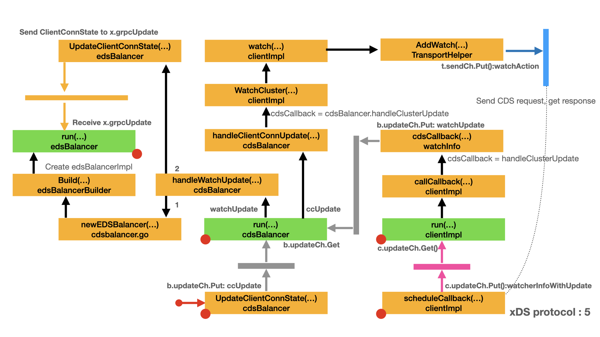

# xDS protocol - CDS/EDS

- [Initialize EDS balancer](#initialize-eds-balancer)
  - [Send CDS request](#send-cds-request)
  - [Process CDS response](#process-cds-response)
  - [CDS callback](#cds-callback)
  - [Create EDS balancer](#create-eds-balancer)

In the previous article [Initialize CDS balancer](cds.md#initialize-cds-balancer), we discussed how to initialize CDS balancer and the cluster manager. In this article we will discuss the CDS balancer and CDS request. Load Balancing in xDS is a powerful, flexible and complex tool. There will be more articles to discuss this topic.

## Initialize EDS balancer

In this stage, we continue the discussion of xDS protocol: CDS request and response. Now the CDS balancer got the cluster name. It's the time to Send the CDS request. Here is the map for this stage. In this map:

- Yellow box represents the important type and method/function.
- Green box represents a function run in a dedicated goroutine.
- Arrow represents the call direction and order.
- Grey bar and arrow represents the channel communication for `b.updateCh`.
- Blue bar and arrow represents the channel communication for `t.sendCh`.
- Yellow bar and arrow represents the channel communication for `x.grpcUpdate`.
- Dot line represents the indirect relationship between two boxes.
- Left red dot represents the box is a continue part from other map.
- Right red dot represents there is a extension map for that box.



### Send CDS request

In [Notify CDS balancer](cds.md#notify-cds-balancer), `UpdateClientConnState()` sends the `&ccUpdate{clusterName: lbCfg.ClusterName}` to `b.updateCh`. `cdsBalancer.run()` is waiting for the message from `b.updateCh.Get()`.

Upon receive the `ccUpdate` message, `b.handleClientConnUpdate()` is called to process the new message.

- `b.handleClientConnUpdate()` is actually `cdsBalancer.handleClientConnUpdate()`.
- `handleClientConnUpdate()` calls `b.xdsClient.WatchCluster()` to start watching on resource name `update.clusterName`.
- Please note that `cdsCallback` is `b.handleClusterUpdate`, which is actually `cdsBalancer.handleClusterUpdate()`.
- Please refer to [Communicate with xDS server](xds.md#communicate-with-xds-server) to understand how to start resource watching.
- `WatchCluster()` sends a CDS request to xDS server through `TransportHelper.send()`.
- `TransportHelper.recv()` receives CDS response and calls `handleCDSResponse()` to pre-process the raw CDS response.

Next, we continue the discussion with `handleCDSResponse()`.

```go
// run is a long-running goroutine which handles all updates from gRPC. All
// methods which are invoked directly by gRPC or xdsClient simply push an
// update onto a channel which is read and acted upon right here.
func (b *cdsBalancer) run() {
    for {
        select {
        case u := <-b.updateCh.Get():
            b.updateCh.Load()
            switch update := u.(type) {
            case *ccUpdate:
                b.handleClientConnUpdate(update)
            case *scUpdate:
                // SubConn updates are passthrough and are simply handed over to
                // the underlying edsBalancer.
                if b.edsLB == nil {
                    b.logger.Errorf("xds: received scUpdate {%+v} with no edsBalancer", update)
                    break
                }
                b.edsLB.UpdateSubConnState(update.subConn, update.state)
            case *watchUpdate:
                b.handleWatchUpdate(update)
            }

        // Close results in cancellation of the CDS watch and closing of the
        // underlying edsBalancer and is the only way to exit this goroutine.
        case <-b.closed.Done():
            b.cancelWatch()
            b.cancelWatch = func() {}

            if b.edsLB != nil {
                b.edsLB.Close()
                b.edsLB = nil
            }
            // This is the *ONLY* point of return from this function.
            b.logger.Infof("Shutdown")
            return
        }
    }
}

// handleClientConnUpdate handles a ClientConnUpdate received from gRPC. Good
// updates lead to registration of a CDS watch. Updates with error lead to
// cancellation of existing watch and propagation of the same error to the
// edsBalancer.
func (b *cdsBalancer) handleClientConnUpdate(update *ccUpdate) {
    // We first handle errors, if any, and then proceed with handling the
    // update, only if the status quo has changed.
    if err := update.err; err != nil {
        b.handleErrorFromUpdate(err, true)
    }
    if b.clusterToWatch == update.clusterName {
        return
    }
    if update.clusterName != "" {
        cancelWatch := b.xdsClient.WatchCluster(update.clusterName, b.handleClusterUpdate)
        b.logger.Infof("Watch started on resource name %v with xds-client %p", update.clusterName, b.xdsClient)
        b.cancelWatch = func() {
            cancelWatch()
            b.logger.Infof("Watch cancelled on resource name %v with xds-client %p", update.clusterName, b.xdsClient)
        }
        b.clusterToWatch = update.clusterName
    }
}

// WatchCluster uses CDS to discover information about the provided
// clusterName.
//
// WatchCluster can be called multiple times, with same or different
// clusterNames. Each call will start an independent watcher for the resource.
//
// Note that during race (e.g. an xDS response is received while the user is
// calling cancel()), there's a small window where the callback can be called
// after the watcher is canceled. The caller needs to handle this case.
func (c *clientImpl) WatchCluster(clusterName string, cb func(ClusterUpdate, error)) (cancel func()) {
    wi := &watchInfo{
        c:           c,
        rType:       ClusterResource,
        target:      clusterName,
        cdsCallback: cb,
    }

    wi.expiryTimer = time.AfterFunc(c.watchExpiryTimeout, func() {
        wi.timeout()
    })
    return c.watch(wi)
}

// handleClusterUpdate is the CDS watch API callback. It simply pushes the
// received information on to the update channel for run() to pick it up.
func (b *cdsBalancer) handleClusterUpdate(cu xdsclient.ClusterUpdate, err error) {
    if b.closed.HasFired() {
        b.logger.Warningf("xds: received cluster update {%+v} after cdsBalancer was closed", cu)
        return
    }
    b.updateCh.Put(&watchUpdate{cds: cu, err: err})
}
```

### Process CDS response

`handleCDSResponse()` calls `xdsclient.UnmarshalCluster()` to transform CDS `DiscoveryResponse` into `ClusterUpdate`.

- `UnmarshalCluster()` calls `proto.Unmarshal()` to unmarshal the `DiscoveryResponse` response.
- `UnmarshalCluster()` calls `validateCluster()` to extract supported fields from the `Cluster` object.
  - Please refer to [config.cluster.v3.Cluster](https://github.com/envoyproxy/envoy/blob/b77157803df9a1e6dff53cc616b32ddbf79f83f2/api/envoy/config/cluster/v3/cluster.proto#L43) to understand the meaning of the following fields.
  - `validateCluster()` checks that the `type` field must be [EDS](https://github.com/envoyproxy/envoy/blob/b77157803df9a1e6dff53cc616b32ddbf79f83f2/api/envoy/config/cluster/v3/cluster.proto#L48)
  - `validateCluster()` checks that the `eds_cluster_config` field should be [ADS](https://github.com/envoyproxy/envoy/blob/b77157803df9a1e6dff53cc616b32ddbf79f83f2/api/envoy/config/core/v3/config_source.proto#L151).
  - `validateCluster()` checks that the `lb_policy` field should be [ROUND_ROBIN](https://github.com/envoyproxy/envoy/blob/b77157803df9a1e6dff53cc616b32ddbf79f83f2/api/envoy/config/cluster/v3/cluster.proto#L75).
  - `validateCluster()` calls `securityConfigFromCluster()` to build the `SecurityConfig` object from the [transport_socket](https://www.envoyproxy.io/docs/envoy/latest/api-v3/config/core/v3/base.proto#envoy-v3-api-msg-config-core-v3-transportsocket) field.
  - `SecurityConfig` is custom transport socket implementation to use for upstream connections.
  - `validateCluster()` calls `circuitBreakersFromCluster()` to extract the [max_requests](https://www.envoyproxy.io/docs/envoy/latest/api-v3/config/cluster/v3/circuit_breaker.proto#envoy-v3-api-msg-config-cluster-v3-circuitbreakers-thresholds) from the [circuit_breakers
](https://www.envoyproxy.io/docs/envoy/latest/api-v3/config/cluster/v3/circuit_breaker.proto#envoy-v3-api-msg-config-cluster-v3-circuitbreakers) field
  - `validateCluster()` checks that the `eds_config` field of [eds_cluster_config](https://www.envoyproxy.io/docs/envoy/latest/api-v3/config/cluster/v3/cluster.proto#envoy-v3-api-msg-config-cluster-v3-cluster-edsclusterconfig) may has a optional `service_name`. That name is used as the `ServiceName` in `ClusterUpdate`.
  - `validateCluster()` checks that the `lrs_server` field is set. If set, the `EnableLRS` field in `ClusterUpdate` is true.
  - Please note that the `lrs_server` is not implemented at the time of writing this chapter, at least for envoy proxy.
- If the Cluster message in the CDS response did not contain a `serviceName`, just use the `clusterName` for EDS.
- `handleCDSResponse()` calls `v3c.parent.NewClusters`, which is actually `clientImpl.NewClusters()` method.
  - For each `ClusterUpdate`, `NewClusters()` checks if it exists in `c.cdsWatchers`, if it does exist, calls `wi.newUpdate()` and add it to `c.cdsCache`.
    - `wi.newUpdate()` updates the `wi.state`, stops the `wi.expiryTimer` and calls `wi.c.scheduleCallback()`.
  - If resource exists in cache, but not in the new update, delete it from cache and call `wi.resourceNotFound()`.
    - `wi.resourceNotFound()` updates the `wi.state`, stops the `wi.expiryTimer.Stop` and calls `wi.sendErrorLocked()`.
    - `wi.sendErrorLocked()` clears the `update` object and calls `wi.c.scheduleCallback()`.
  - `scheduleCallback()` sends `watcherInfoWithUpdate` message to channel `c.updateCh`.

Now the `watcherInfoWithUpdate` has been sent to channel `c.updateCh`. Let's discuss the receiving part in next chapter.

```go
// handleCDSResponse processes an CDS response received from the management
// server. On receipt of a good response, it also invokes the registered watcher
// callback.
func (v3c *client) handleCDSResponse(resp *v3discoverypb.DiscoveryResponse) error {
    update, err := xdsclient.UnmarshalCluster(resp.GetResources(), v3c.logger)
    if err != nil {
        return err
    }
    v3c.parent.NewClusters(update)
    return nil
}

// UnmarshalCluster processes resources received in an CDS response, validates
// them, and transforms them into a native struct which contains only fields we
// are interested in.
func UnmarshalCluster(resources []*anypb.Any, logger *grpclog.PrefixLogger) (map[string]ClusterUpdate, error) {
    update := make(map[string]ClusterUpdate)
    for _, r := range resources {
        if !IsClusterResource(r.GetTypeUrl()) {
            return nil, fmt.Errorf("xds: unexpected resource type: %q in CDS response", r.GetTypeUrl())
        }

        cluster := &v3clusterpb.Cluster{}
        if err := proto.Unmarshal(r.GetValue(), cluster); err != nil {
            return nil, fmt.Errorf("xds: failed to unmarshal resource in CDS response: %v", err)
        }
        logger.Infof("Resource with name: %v, type: %T, contains: %v", cluster.GetName(), cluster, cluster)
        cu, err := validateCluster(cluster)
        if err != nil {
            return nil, err
        }

        // If the Cluster message in the CDS response did not contain a
        // serviceName, we will just use the clusterName for EDS.
        if cu.ServiceName == "" {
            cu.ServiceName = cluster.GetName()
        }
        logger.Debugf("Resource with name %v, value %+v added to cache", cluster.GetName(), cu)
        update[cluster.GetName()] = cu
    }
    return update, nil
}

func validateCluster(cluster *v3clusterpb.Cluster) (ClusterUpdate, error) {
    emptyUpdate := ClusterUpdate{ServiceName: "", EnableLRS: false}
    switch {
    case cluster.GetType() != v3clusterpb.Cluster_EDS:
        return emptyUpdate, fmt.Errorf("xds: unexpected cluster type %v in response: %+v", cluster.GetType(), cluster)
    case cluster.GetEdsClusterConfig().GetEdsConfig().GetAds() == nil:
        return emptyUpdate, fmt.Errorf("xds: unexpected edsConfig in response: %+v", cluster)
    case cluster.GetLbPolicy() != v3clusterpb.Cluster_ROUND_ROBIN:
        return emptyUpdate, fmt.Errorf("xds: unexpected lbPolicy %v in response: %+v", cluster.GetLbPolicy(), cluster)
    }

    sc, err := securityConfigFromCluster(cluster)
    if err != nil {
        return emptyUpdate, err
    }
    return ClusterUpdate{
        ServiceName: cluster.GetEdsClusterConfig().GetServiceName(),
        EnableLRS:   cluster.GetLrsServer().GetSelf() != nil,
        SecurityCfg: sc,
        MaxRequests: circuitBreakersFromCluster(cluster),
    }, nil
}

// securityConfigFromCluster extracts the relevant security configuration from
// the received Cluster resource.
func securityConfigFromCluster(cluster *v3clusterpb.Cluster) (*SecurityConfig, error) {
    // The Cluster resource contains a `transport_socket` field, which contains
    // a oneof `typed_config` field of type `protobuf.Any`. The any proto
    // contains a marshaled representation of an `UpstreamTlsContext` message.
    ts := cluster.GetTransportSocket()
    if ts == nil {
        return nil, nil
    }
    if name := ts.GetName(); name != transportSocketName {
        return nil, fmt.Errorf("xds: transport_socket field has unexpected name: %s", name)
    }
    any := ts.GetTypedConfig()
    if any == nil || any.TypeUrl != version.V3UpstreamTLSContextURL {
        return nil, fmt.Errorf("xds: transport_socket field has unexpected typeURL: %s", any.TypeUrl)
    }
    upstreamCtx := &v3tlspb.UpstreamTlsContext{}
    if err := proto.Unmarshal(any.GetValue(), upstreamCtx); err != nil {
        return nil, fmt.Errorf("xds: failed to unmarshal UpstreamTlsContext in CDS response: %v", err)
    }
    if upstreamCtx.GetCommonTlsContext() == nil {
        return nil, errors.New("xds: UpstreamTlsContext in CDS response does not contain a CommonTlsContext")
    }

    sc, err := securityConfigFromCommonTLSContext(upstreamCtx.GetCommonTlsContext())
    if err != nil {
        return nil, err
    }
    if sc.RootInstanceName == "" {
        return nil, errors.New("security configuration on the client-side does not contain root certificate provider instance name")
    }
    return sc, nil
}

// circuitBreakersFromCluster extracts the circuit breakers configuration from
// the received cluster resource. Returns nil if no CircuitBreakers or no
// Thresholds in CircuitBreakers.
func circuitBreakersFromCluster(cluster *v3clusterpb.Cluster) *uint32 {
    if !env.CircuitBreakingSupport {
        return nil
    }
    for _, threshold := range cluster.GetCircuitBreakers().GetThresholds() {
        if threshold.GetPriority() != v3corepb.RoutingPriority_DEFAULT {
            continue
        }
        maxRequestsPb := threshold.GetMaxRequests()
        if maxRequestsPb == nil {
            return nil
        }
        maxRequests := maxRequestsPb.GetValue()
        return &maxRequests
    }
    return nil
}

// NewClusters is called by the underlying xdsAPIClient when it receives an xDS
// response.
//
// A response can contain multiple resources. They will be parsed and put in a
// map from resource name to the resource content.
func (c *clientImpl) NewClusters(updates map[string]ClusterUpdate) {
    c.mu.Lock()
    defer c.mu.Unlock()

    for name, update := range updates {
        if s, ok := c.cdsWatchers[name]; ok {
            for wi := range s {
                wi.newUpdate(update)
            }
            // Sync cache.
            c.logger.Debugf("CDS resource with name %v, value %+v added to cache", name, update)
            c.cdsCache[name] = update
        }
    }
    for name := range c.cdsCache {
        if _, ok := updates[name]; !ok {
            // If resource exists in cache, but not in the new update, delete it
            // from cache, and also send an resource not found error to indicate
            // resource removed.
            delete(c.cdsCache, name)
            for wi := range c.cdsWatchers[name] {
                wi.resourceNotFound()
            }
        }
    }
    // When CDS resource is removed, we don't delete corresponding EDS cached
    // data. The EDS watch will be canceled, and cache entry is removed when the
    // last watch is canceled.
}
```

### CDS callback

Now we got a message in channel `c.updateCh`, It's time to consume it. From [xDS callback](xds.md#xds-callback), we know the following process will happen:

- `clientImpl.run()` calls `c.callCallback()` with the incoming `watcherInfoWithUpdate` as parameter.
- In our case, the message's `wi.rType` field is `ClusterResource`.
- `callCallback()` will call `cdsCallback()`, which actually calls `cdsBalancer.handleClusterUpdate()`.
- `handleClusterUpdate()` just wraps the `xdsclient.ClusterUpdate` object in `&watchUpdate{cds: cu, err: err}` and sends `watchUpdate` to `b.updateCh`.

```go
// handleClusterUpdate is the CDS watch API callback. It simply pushes the
// received information on to the update channel for run() to pick it up.
func (b *cdsBalancer) handleClusterUpdate(cu xdsclient.ClusterUpdate, err error) {
    if b.closed.HasFired() {
        b.logger.Warningf("xds: received cluster update {%+v} after cdsBalancer was closed", cu)
        return
    }
    b.updateCh.Put(&watchUpdate{cds: cu, err: err})
}
```

### Create EDS balancer

`cdsBalancer.run()` is waiting on the channel `b.updateCh`. Upon receives `watchUpdate` message:

- `run()` calls `b.handleWatchUpdate`, which is actually `cdsBalancer.handleWatchUpdate()`.
- `handleWatchUpdate()` calls `b.handleSecurityConfig()` to prepare for the connection with upstream server.
- `handleWatchUpdate()` calls `client.SetMaxRequests()` to update the max requests for a service's counter.
- `handleWatchUpdate()` calls `newEDSBalancer()` create the EDS balancer.
  - `newEDSBalancer()` gets the builder by name `eds_experimental` and calls `builder.Build()` to build the EDS balancer.
  - `builder.Build()` is actually `edsBalancerBuilder.Build)()`.
    - `Build()` creates `edsBalancer` object and calls `newXDSClient()` to get the singleton `XDSClient`.
    - `Build()` calls `newEDSBalancer()` to initializes `x.edsImpl`.
    - `Build()` starts EDS goroutine `x.run()`.
- `handleWatchUpdate()` calls `b.edsLB.UpdateClientConnState()` to notify the EDS balancer.
  - `b.edsLB.UpdateClientConnState()` is actually `edsBalancer.UpdateClientConnState()`
  - `UpdateClientConnState()` uses `ccState` as parameter, which is of type `balancer.ClientConnState`.
  - `balancer.ClientConnState` has a field `BalancerConfig`, which uses `edsbalancer.EDSConfig` as value.
  - `edsbalancer.EDSConfig` uses `update.cds.ServiceName` as the value of `EDSServiceName` field. `update.cds.ServiceName` gets value from CDS response.
  - `UpdateClientConnState()` sends `ccState` message to channel `x.grpcUpdate`, which is of type `grpcUpdate chan interface{}`

Now the EDS balancer is created and running. The EDS balancer also got a message on channel `x.grpcUpdate`. Please read [Initialize endpoints](eds2.md) for the next stage process.

```go
// handleWatchUpdate handles a watch update from the xDS Client. Good updates
// lead to clientConn updates being invoked on the underlying edsBalancer.
func (b *cdsBalancer) handleWatchUpdate(update *watchUpdate) {
    if err := update.err; err != nil {
        b.logger.Warningf("Watch error from xds-client %p: %v", b.xdsClient, err)
        b.handleErrorFromUpdate(err, false)
        return
    }

    b.logger.Infof("Watch update from xds-client %p, content: %+v", b.xdsClient, update.cds)

    // Process the security config from the received update before building the
    // child policy or forwarding the update to it. We do this because the child
    // policy may try to create a new subConn inline. Processing the security
    // configuration here and setting up the handshakeInfo will make sure that
    // such attempts are handled properly.
    if err := b.handleSecurityConfig(update.cds.SecurityCfg); err != nil {
        // If the security config is invalid, for example, if the provider
        // instance is not found in the bootstrap config, we need to put the
        // channel in transient failure.
        b.logger.Warningf("Invalid security config update from xds-client %p: %v", b.xdsClient, err)
        b.handleErrorFromUpdate(err, false)
        return
    }

    client.SetMaxRequests(update.cds.ServiceName, update.cds.MaxRequests)

    // The first good update from the watch API leads to the instantiation of an
    // edsBalancer. Further updates/errors are propagated to the existing
    // edsBalancer.
    if b.edsLB == nil {
        edsLB, err := newEDSBalancer(b.ccw, b.bOpts)
        if err != nil {
            b.logger.Errorf("Failed to create child policy of type %s, %v", edsName, err)
            return
        }
        b.edsLB = edsLB
        b.logger.Infof("Created child policy %p of type %s", b.edsLB, edsName)
    }
    lbCfg := &edsbalancer.EDSConfig{EDSServiceName: update.cds.ServiceName}
    if update.cds.EnableLRS {
        // An empty string here indicates that the edsBalancer should use the
        // same xDS server for load reporting as it does for EDS
        // requests/responses.
        lbCfg.LrsLoadReportingServerName = new(string)

    }
    ccState := balancer.ClientConnState{
        BalancerConfig: lbCfg,
    }
    if err := b.edsLB.UpdateClientConnState(ccState); err != nil {
        b.logger.Errorf("xds: edsBalancer.UpdateClientConnState(%+v) returned error: %v", ccState, err)
    }
}

// handleSecurityConfig processes the security configuration received from the
// management server, creates appropriate certificate provider plugins, and
// updates the HandhakeInfo which is added as an address attribute in
// NewSubConn() calls.
func (b *cdsBalancer) handleSecurityConfig(config *xdsclient.SecurityConfig) error {
    // If xdsCredentials are not in use, i.e, the user did not want to get
    // security configuration from an xDS server, we should not be acting on the
    // received security config here. Doing so poses a security threat.
    if !b.xdsCredsInUse {
        return nil
    }

    // Security config being nil is a valid case where the management server has
    // not sent any security configuration. The xdsCredentials implementation
    // handles this by delegating to its fallback credentials.
    if config == nil {
        // We need to explicitly set the fields to nil here since this might be
        // a case of switching from a good security configuration to an empty
        // one where fallback credentials are to be used.
        b.xdsHI.SetRootCertProvider(nil)
        b.xdsHI.SetIdentityCertProvider(nil)
        b.xdsHI.SetAcceptedSANs(nil)
        return nil
    }

    bc := b.xdsClient.BootstrapConfig()
    if bc == nil || bc.CertProviderConfigs == nil {
        // Bootstrap did not find any certificate provider configs, but the user
        // has specified xdsCredentials and the management server has sent down
        // security configuration.
        return errors.New("xds: certificate_providers config missing in bootstrap file")
    }
    cpc := bc.CertProviderConfigs

    // A root provider is required whether we are using TLS or mTLS.
    rootProvider, err := buildProvider(cpc, config.RootInstanceName, config.RootCertName, false, true)
    if err != nil {
        return err
    }

    // The identity provider is only present when using mTLS.
    var identityProvider certprovider.Provider
    if name, cert := config.IdentityInstanceName, config.IdentityCertName; name != "" {
        var err error
        identityProvider, err = buildProvider(cpc, name, cert, true, false)
        if err != nil {
            return err
        }
    }

    // Close the old providers and cache the new ones.
    if b.cachedRoot != nil {
        b.cachedRoot.Close()
    }
    if b.cachedIdentity != nil {
        b.cachedIdentity.Close()
    }
    b.cachedRoot = rootProvider
    b.cachedIdentity = identityProvider

    // We set all fields here, even if some of them are nil, since they
    // could have been non-nil earlier.
    b.xdsHI.SetRootCertProvider(rootProvider)
    b.xdsHI.SetIdentityCertProvider(identityProvider)
    b.xdsHI.SetAcceptedSANs(config.AcceptedSANs)
    return nil
}

// SetMaxRequests updates the max requests for a service's counter.
func SetMaxRequests(serviceName string, maxRequests *uint32) {
    src.mu.Lock()
    defer src.mu.Unlock()
    c, ok := src.services[serviceName]
    if !ok {
        c = &ServiceRequestsCounter{ServiceName: serviceName}
        src.services[serviceName] = c
    }
    if maxRequests != nil {
        c.maxRequests = *maxRequests
    } else {
        c.maxRequests = defaultMaxRequests
    }
}

var (                        
    errBalancerClosed = errors.New("cdsBalancer is closed")
                                        
    // newEDSBalancer is a helper function to build a new edsBalancer and will be
    // overridden in unittests.
    newEDSBalancer = func(cc balancer.ClientConn, opts balancer.BuildOptions) (balancer.Balancer, error) {
        builder := balancer.Get(edsName)                                                               
        if builder == nil { 
            return nil, fmt.Errorf("xds: no balancer builder with name %v", edsName)
        }
        // We directly pass the parent clientConn to the                   
        // underlying edsBalancer because the cdsBalancer does           
        // not deal with subConns.                               
        return builder.Build(cc, opts), nil
    }                             
    newXDSClient  = func() (xdsClientInterface, error) { return xdsclient.New() }
    buildProvider = buildProviderFunc
)                            

type edsBalancerBuilder struct{}

// Build helps implement the balancer.Builder interface.
func (b *edsBalancerBuilder) Build(cc balancer.ClientConn, _ balancer.BuildOptions) balancer.Balancer {
    x := &edsBalancer{
        cc:                cc,
        closed:            grpcsync.NewEvent(),
        grpcUpdate:        make(chan interface{}),
        xdsClientUpdate:   make(chan *edsUpdate),
        childPolicyUpdate: buffer.NewUnbounded(),
        lsw:               &loadStoreWrapper{},
        config:            &EDSConfig{},
    }
    x.logger = prefixLogger(x)

    client, err := newXDSClient()
    if err != nil {
        x.logger.Errorf("xds: failed to create xds-client: %v", err)
        return nil
    }

    x.xdsClient = client
    x.edsImpl = newEDSBalancer(x.cc, x.enqueueChildBalancerState, x.lsw, x.logger)
    x.logger.Infof("Created")
    go x.run()
    return x
}

var (
    newEDSBalancer = func(cc balancer.ClientConn, enqueueState func(priorityType, balancer.State), lw load.PerClusterReporter, logger *grpclog.PrefixLogger ) edsBalancerImplInterface {
        return newEDSBalancerImpl(cc, enqueueState, lw, logger)
    }
    newXDSClient = func() (xdsClientInterface, error) { return xdsclient.New() }
)

// newEDSBalancerImpl create a new edsBalancerImpl.
func newEDSBalancerImpl(cc balancer.ClientConn, enqueueState func(priorityType, balancer.State), lr load.PerClusterReporter, logger *grpclog.PrefixLogger) *edsBalancerImpl {
    edsImpl := &edsBalancerImpl{
        cc:                 cc,
        logger:             logger,
        subBalancerBuilder: balancer.Get(roundrobin.Name),
        loadReporter:       lr,

        enqueueChildBalancerStateUpdate: enqueueState,

        priorityToLocalities: make(map[priorityType]*balancerGroupWithConfig),
        priorityToState:      make(map[priorityType]*balancer.State),
        subConnToPriority:    make(map[balancer.SubConn]priorityType),
    }
    // Don't start balancer group here. Start it when handling the first EDS
    // response. Otherwise the balancer group will be started with round-robin,
    // and if users specify a different sub-balancer, all balancers in balancer
    // group will be closed and recreated when sub-balancer update happens.
    return edsImpl
}

// ClientConnState describes the state of a ClientConn relevant to the
// balancer.
type ClientConnState struct {
    ResolverState resolver.State
    // The parsed load balancing configuration returned by the builder's
    // ParseConfig method, if implemented.
    BalancerConfig serviceconfig.LoadBalancingConfig
}

// EDSConfig represents the loadBalancingConfig section of the service config
// for EDS balancers.
type EDSConfig struct {                 
    serviceconfig.LoadBalancingConfig
    // ChildPolicy represents the load balancing config for the child   
    // policy.                                                    
    ChildPolicy *loadBalancingConfig                                                                   
    // FallBackPolicy represents the load balancing config for the
    // fallback.
    FallBackPolicy *loadBalancingConfig                                      
    // Name to use in EDS query.  If not present, defaults to the server   
    // name from the target URI.                                         
    EDSServiceName string                                        
    // LRS server to send load reports to.  If not present, load reporting      
    // will be disabled.  If set to the empty string, load reporting will
    // be sent to the same server that we obtained CDS data from.
    LrsLoadReportingServerName *string
}                                       

func (x *edsBalancer) UpdateClientConnState(s balancer.ClientConnState) error {
    select {
    case x.grpcUpdate <- &s:
    case <-x.closed.Done():
    }
    return nil
}
```
