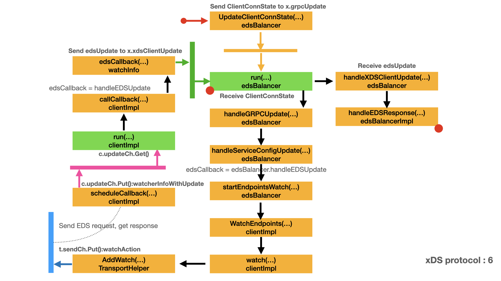

# Load Balancing - xDS protocol

- [Initialize endpoints](#initialize-endpoints)
  - [Incoming message](#incoming-message)
  - [Send EDS request](#send-eds-request)
  - [Process EDS response](#process-eds-response)

In the previous article [Initialize EDS balancer](eds.md#initialize-eds-balancer), we discussed how to initialize EDS balancer. In this article we will discuss the EDS balancer and EDS request. Load Balancing in xDS is a powerful, flexible and complex tool. This should be the last article for this topic.

## Initialize endpoints

In this stage, we continue the discussion of xDS protocol: EDS request and response. Now the EDS balancer got the message on channel `x.grpcUpdate`. It's the time to receive that message. Here is the map for this stage. In this map:

- Yellow box represents the important type and method/function.
- Green box represents a function run in a dedicated goroutine.
- Arrow represents the call direction and order.
- Pink bar and arrow represents the channel communication for `c.updateCh`.
- Blue bar and arrow represents the channel communication for `t.sendCh`.
- Yellow bar and arrow represents the channel communication for `x.grpcUpdate`.
- Green bar and arrow represents the channel communication for `x.xdsClientUpdate`.
- Dot line represents the indirect relationship between two boxes.
- Left red dot represents the box is a continue part from other map.
- Right red dot represents there is a extension map for that box.



### Incoming message

In [Create EDS balancer](eds.md#create-eds-balancer), `edsBalancer.UpdateClientConnState()` sent `ccState` message to channel `x.grpcUpdate`.

- `ccState` is of type `balancer.ClientConnState`.
- The `BalancerConfig` field of `ccState` is assigned the value of `edsbalancer.EDSConfig{EDSServiceName: update.cds.ServiceName}`.
- `update` is of type `*watchUpdate`. `update.cds` is of type `ClusterUpdate`.
- `update.cds.ServiceName` comes from the `service_name` field of [EdsClusterConfig](https://www.envoyproxy.io/docs/envoy/latest/api-v3/config/cluster/v3/cluster.proto#envoy-v3-api-msg-config-cluster-v3-cluster-edsclusterconfig), See [Process CDS response](#eds.md#process-cds-response) for detail.

```go
// ClientConnState describes the state of a ClientConn relevant to the
// balancer.
type ClientConnState struct {
    ResolverState resolver.State
    // The parsed load balancing configuration returned by the builder's
    // ParseConfig method, if implemented.
    BalancerConfig serviceconfig.LoadBalancingConfig
}

// EDSConfig represents the loadBalancingConfig section of the service config
// for EDS balancers.
type EDSConfig struct {
    serviceconfig.LoadBalancingConfig
    // ChildPolicy represents the load balancing config for the child
    // policy.
    ChildPolicy *loadBalancingConfig
    // FallBackPolicy represents the load balancing config for the
    // fallback.
    FallBackPolicy *loadBalancingConfig
    // Name to use in EDS query.  If not present, defaults to the server
    // name from the target URI.
    EDSServiceName string
    // LRS server to send load reports to.  If not present, load reporting
    // will be disabled.  If set to the empty string, load reporting will
    // be sent to the same server that we obtained CDS data from.
    LrsLoadReportingServerName *string
}

// watchUpdate wraps the information received from a registered CDS watcher. A
// non-nil error is propagated to the underlying edsBalancer. A valid update
// results in creating a new edsBalancer (if one doesn't already exist) and
// pushing the update to it.
type watchUpdate struct {
    cds xdsclient.ClusterUpdate
    err error
}

// ClusterUpdate contains information from a received CDS response, which is of
// interest to the registered CDS watcher.
type ClusterUpdate struct {
    // ServiceName is the service name corresponding to the clusterName which
    // is being watched for through CDS.
    ServiceName string
    // EnableLRS indicates whether or not load should be reported through LRS.
    EnableLRS bool
    // SecurityCfg contains security configuration sent by the control plane.
    SecurityCfg *SecurityConfig
    // MaxRequests for circuit breaking, if any (otherwise nil).
    MaxRequests *uint32
}
```

### Send EDS request

Upon receive the `ccState` message on channel `x.grpcUpdate`, `edsBalancer.run()` calls `x.handleGRPCUpdate()` to process it.

- `handleGRPCUpdate()` calls `x.handleServiceConfigUpdate()` to process the `EDSConfig`.
  - `handleServiceConfigUpdate()` calls `x.startEndpointsWatch()` to restart EDS watch when the `edsServiceName` has changed.
  - For the time being, we will focus on EDS. The remain part of `handleServiceConfigUpdate()` is about load reporting service. We will not discuss it.
  - `x.startEndpointsWatch()` is actually `edsBalancer.startEndpointsWatch()`.
  - `startEndpointsWatch()` calls `x.xdsClient.WatchEndpoints()`, which is actually `clientImpl.WatchEndpoints()`
  - `clientImpl.WatchEndpoints()` starts a EDS resource request: `x.edsServiceName`.
  - Please note that `edsCallback` is a anonymous function which wraps `x.handleEDSUpdate()`. You can think `edsCallback` is `edsBalancer.handleEDSUpdate`.
  - Please refer to [Communicate with xDS server](xds.md#communicate-with-xds-server) to understand how to start xDS resource request.
  - `WatchEndpoints()` calls `c.watch()` to send EDS request to xDS server through `TransportHelper.send()`.
  - `TransportHelper.recv()` receives EDS response and calls `handleEDSResponse()` to pre-process the raw EDS response.
- `handleGRPCUpdate()` calls `x.edsImpl.updateServiceRequestsCounter()` to update the service requests counter.TODO?
- Next, In our case, `handleGRPCUpdate()` update the `edsImpl` by calling `x.edsImpl.handleChildPolicy()` with the new `roundrobin.Name` as parameter.TODO?

Next, we continue the discussion of `handleEDSResponse()`

```go
// run gets executed in a goroutine once edsBalancer is created. It monitors
// updates from grpc, xdsClient and load balancer. It synchronizes the
// operations that happen inside edsBalancer. It exits when edsBalancer is
// closed.
func (x *edsBalancer) run() {
    for {
        select {
        case update := <-x.grpcUpdate:
            x.handleGRPCUpdate(update)
        case update := <-x.xdsClientUpdate:
            x.handleXDSClientUpdate(update)
        case update := <-x.childPolicyUpdate.Get():
            x.childPolicyUpdate.Load()
            u := update.(*balancerStateWithPriority)
            x.edsImpl.updateState(u.priority, u.s)
        case <-x.closed.Done():
            x.cancelWatch()
            x.xdsClient.Close()
            x.edsImpl.close()
            return
        }
    }
}

func (x *edsBalancer) handleGRPCUpdate(update interface{}) {
    switch u := update.(type) {
    case *subConnStateUpdate:
        x.edsImpl.handleSubConnStateChange(u.sc, u.state.ConnectivityState)
    case *balancer.ClientConnState:
        x.logger.Infof("Receive update from resolver, balancer config: %+v", u.BalancerConfig)
        cfg, _ := u.BalancerConfig.(*EDSConfig)
        if cfg == nil {
            // service config parsing failed. should never happen.
            return
        }

        if err := x.handleServiceConfigUpdate(cfg); err != nil {
            x.logger.Warningf("failed to update xDS client: %v", err)
        }

        x.edsImpl.updateServiceRequestsCounter(cfg.EDSServiceName)

        // We will update the edsImpl with the new child policy, if we got a
        // different one.
        if !cmp.Equal(cfg.ChildPolicy, x.config.ChildPolicy, cmpopts.EquateEmpty()) {
            if cfg.ChildPolicy != nil {
                x.edsImpl.handleChildPolicy(cfg.ChildPolicy.Name, cfg.ChildPolicy.Config)
            } else {
                x.edsImpl.handleChildPolicy(roundrobin.Name, nil)
            }
        }
        x.config = cfg
    case error:
        x.handleErrorFromUpdate(u, true)
    default:
        // unreachable path
        x.logger.Errorf("wrong update type: %T", update)
    }
}

// handleServiceConfigUpdate applies the service config update, watching a new
// EDS service name and restarting LRS stream, as required.
func (x *edsBalancer) handleServiceConfigUpdate(config *EDSConfig) error {
    // Restart EDS watch when the edsServiceName has changed.
    if x.edsServiceName != config.EDSServiceName {
        x.edsServiceName = config.EDSServiceName
        x.startEndpointsWatch()
        // TODO: this update for the LRS service name is too early. It should
        // only apply to the new EDS response. But this is applied to the RPCs
        // before the new EDS response. To fully fix this, the EDS balancer
        // needs to do a graceful switch to another EDS implementation.
        //
        // This is OK for now, because we don't actually expect edsServiceName
        // to change. Fix this (a bigger change) will happen later.
        x.lsw.updateServiceName(x.edsServiceName)
    }

    // Restart load reporting when the loadReportServer name has changed.
    if !equalStringPointers(x.loadReportServer, config.LrsLoadReportingServerName) {
        loadStore := x.startLoadReport(config.LrsLoadReportingServerName)
        x.lsw.updateLoadStore(loadStore)
    }

    return nil
}

// startEndpointsWatch starts the EDS watch.
//
// This usually means load report needs to be restarted, but this function does
// NOT do that. Caller needs to call startLoadReport separately.
func (x *edsBalancer) startEndpointsWatch() {
    if x.cancelEndpointsWatch != nil {
        x.cancelEndpointsWatch()
    }
    cancelEDSWatch := x.xdsClient.WatchEndpoints(x.edsServiceName, func(update xdsclient.EndpointsUpdate, err error) {
        x.logger.Infof("Watch update from xds-client %p, content: %+v", x.xdsClient, update)
        x.handleEDSUpdate(update, err)
    })
    x.logger.Infof("Watch started on resource name %v with xds-client %p", x.edsServiceName, x.xdsClient)
    x.cancelEndpointsWatch = func() {
        cancelEDSWatch()
        x.logger.Infof("Watch cancelled on resource name %v with xds-client %p", x.edsServiceName, x.xdsClient)
    }
}

// WatchEndpoints uses EDS to discover endpoints in the provided clusterName.
//
// WatchEndpoints can be called multiple times, with same or different
// clusterNames. Each call will start an independent watcher for the resource.
//
// Note that during race (e.g. an xDS response is received while the user is
// calling cancel()), there's a small window where the callback can be called
// after the watcher is canceled. The caller needs to handle this case.
func (c *clientImpl) WatchEndpoints(clusterName string, cb func(EndpointsUpdate, error)) (cancel func()) {
    wi := &watchInfo{
        c:           c,
        rType:       EndpointsResource,
        target:      clusterName,
        edsCallback: cb,
    }

    wi.expiryTimer = time.AfterFunc(c.watchExpiryTimeout, func() {
        wi.timeout()
    })
    return c.watch(wi)
}

```

### Process EDS response

`handleEDSResponse()` calls `xdsclient.UnmarshalEndpoints()` to transform EDS `DiscoveryResponse` into `EndpointsUpdate`.

- `UnmarshalEndpoints()` calls `proto.Unmarshal()` to unmarshal the `DiscoveryResponse` response.
- Please note that the EDS resource is of type `ClusterLoadAssignment`.
- `UnmarshalEndpoints()` calls `parseEDSRespProto()` to extract the supported fields from `ClusterLoadAssignment`.
  - Please refer to [config.endpoint.v3.ClusterLoadAssignment](https://github.com/envoyproxy/envoy/blob/b77157803df9a1e6dff53cc616b32ddbf79f83f2/api/envoy/config/endpoint/v3/endpoint.proto#L32) to understand the meaning of the following fields.
  - `parseEDSRespProto()` extract the `policy.drop_overloads` to get the `DropOverload` object.
  - `DropOverload` is the configuration action to trim the overall incoming traffic to protect the upstream hosts.
  - Please note `DropOverload` is not implemented at the time of writing this chapter.
  - For each `DropOverload`, `parseEDSRespProto()` calls `parseDropPolicy()` to build the `OverloadDropConfig` object.
  - For each `endpoint`, `parseEDSRespProto()` transforms `locality` field into `Locality.ID`.
  - For each `endpoint`, `parseEDSRespProto()` calls `parseEndpoints()` to transform `lb_endpoints` field into `Locality.Endpoints`.
  - For each `endpoint`, `parseEDSRespProto()` extracts the `load_balancing_weight` field into `Locality.Weight`.
  - For each `endpoint`, `parseEDSRespProto()` extracts the `priority` field into `Locality.Priority`.
- `UnmarshalEndpoints()` builds `map[string]EndpointsUpdate` for each `ClusterLoadAssignment`, the key is the value of `cluster_name` field, the value is `EndpointsUpdate` built by `parseEDSRespProto()`.

`handleEDSResponse()` calls `v3c.parent.NewEndpoints()` to update the EDS watch list.

- `v3c.parent.NewEndpoints()` is actually `clientImpl.NewEndpoints()`
- For each `EndpointsUpdate`, `NewEndpoints()` checks if it exists in `c.edsWatchers`, if it does exist, calls `wi.newUpdate` and add it to `c.edsCache`.
- `wi.newUpdate()` updates the `wi.state`, stops the `wi.expiryTimer` and calls `wi.c.scheduleCallback()`.
- `scheduleCallback()` sends `watcherInfoWithUpdate` message to channel `c.updateCh`.

Now the `watcherInfoWithUpdate` has been sent to channel `c.updateCh`. Let's discuss the receiving part in next section.

```go
func (v3c *client) handleEDSResponse(resp *v3discoverypb.DiscoveryResponse) error {
    update, err := xdsclient.UnmarshalEndpoints(resp.GetResources(), v3c.logger)
    if err != nil {
        return err
    }
    v3c.parent.NewEndpoints(update)
    return nil
}

// UnmarshalEndpoints processes resources received in an EDS response,
// validates them, and transforms them into a native struct which contains only
// fields we are interested in.
func UnmarshalEndpoints(resources []*anypb.Any, logger *grpclog.PrefixLogger) (map[string]EndpointsUpdate, error) {
    update := make(map[string]EndpointsUpdate)
    for _, r := range resources {
        if !IsEndpointsResource(r.GetTypeUrl()) {
            return nil, fmt.Errorf("xds: unexpected resource type: %q in EDS response", r.GetTypeUrl())
        }

        cla := &v3endpointpb.ClusterLoadAssignment{}
        if err := proto.Unmarshal(r.GetValue(), cla); err != nil {
            return nil, fmt.Errorf("xds: failed to unmarshal resource in EDS response: %v", err)
        }
        logger.Infof("Resource with name: %v, type: %T, contains: %v", cla.GetClusterName(), cla, cla)

        u, err := parseEDSRespProto(cla)
        if err != nil {
            return nil, err
        }
        update[cla.GetClusterName()] = u
    }
    return update, nil
}

func parseEDSRespProto(m *v3endpointpb.ClusterLoadAssignment) (EndpointsUpdate, error) {
    ret := EndpointsUpdate{}
    for _, dropPolicy := range m.GetPolicy().GetDropOverloads() {
        ret.Drops = append(ret.Drops, parseDropPolicy(dropPolicy))
    }
    priorities := make(map[uint32]struct{})
    for _, locality := range m.Endpoints {
        l := locality.GetLocality()
        if l == nil {
            return EndpointsUpdate{}, fmt.Errorf("EDS response contains a locality without ID, locality: %+v", locality)
        }
        lid := internal.LocalityID{
            Region:  l.Region,
            Zone:    l.Zone,
            SubZone: l.SubZone,
        }
        priority := locality.GetPriority()
        priorities[priority] = struct{}{}
        ret.Localities = append(ret.Localities, Locality{
            ID:        lid,
            Endpoints: parseEndpoints(locality.GetLbEndpoints()),
            Weight:    locality.GetLoadBalancingWeight().GetValue(),
            Priority:  priority,
        })
    }
    for i := 0; i < len(priorities); i++ {
        if _, ok := priorities[uint32(i)]; !ok {
            return EndpointsUpdate{}, fmt.Errorf("priority %v missing (with different priorities %v received)", i, priorities)
        }
    }
    return ret, nil
}

func parseDropPolicy(dropPolicy *v3endpointpb.ClusterLoadAssignment_Policy_DropOverload) OverloadDropConfig {
    percentage := dropPolicy.GetDropPercentage()
    var (
        numerator   = percentage.GetNumerator()
        denominator uint32
    )
    switch percentage.GetDenominator() {
    case v3typepb.FractionalPercent_HUNDRED:
        denominator = 100
    case v3typepb.FractionalPercent_TEN_THOUSAND:
        denominator = 10000
    case v3typepb.FractionalPercent_MILLION:
        denominator = 1000000
    }
    return OverloadDropConfig{
        Category:    dropPolicy.GetCategory(),
        Numerator:   numerator,
        Denominator: denominator,
    }
}

func parseEndpoints(lbEndpoints []*v3endpointpb.LbEndpoint) []Endpoint {
    endpoints := make([]Endpoint, 0, len(lbEndpoints))
    for _, lbEndpoint := range lbEndpoints {
        endpoints = append(endpoints, Endpoint{
            HealthStatus: EndpointHealthStatus(lbEndpoint.GetHealthStatus()),
            Address:      parseAddress(lbEndpoint.GetEndpoint().GetAddress().GetSocketAddress()),
            Weight:       lbEndpoint.GetLoadBalancingWeight().GetValue(),
        })
    }
    return endpoints
}

// OverloadDropConfig contains the config to drop overloads.
type OverloadDropConfig struct {
    Category    string
    Numerator   uint32
    Denominator uint32
}

// LocalityID is xds.Locality without XXX fields, so it can be used as map
// keys.
//
// xds.Locality cannot be map keys because one of the XXX fields is a slice.
type LocalityID struct {
    Region  string `json:"region,omitempty"`
    Zone    string `json:"zone,omitempty"`
    SubZone string `json:"subZone,omitempty"`
}

// Endpoint contains information of an endpoint.
type Endpoint struct {
    Address      string
    HealthStatus EndpointHealthStatus
    Weight       uint32
}

// Locality contains information of a locality.
type Locality struct {
    Endpoints []Endpoint
    ID        internal.LocalityID
    Priority  uint32
    Weight    uint32
}

// EndpointsUpdate contains an EDS update.
type EndpointsUpdate struct {
    Drops      []OverloadDropConfig
    Localities []Locality
}

// NewEndpoints is called by the underlying xdsAPIClient when it receives an
// xDS response.
//
// A response can contain multiple resources. They will be parsed and put in a
// map from resource name to the resource content.
func (c *clientImpl) NewEndpoints(updates map[string]EndpointsUpdate) {
    c.mu.Lock()
    defer c.mu.Unlock()

    for name, update := range updates {
        if s, ok := c.edsWatchers[name]; ok {
            for wi := range s {
                wi.newUpdate(update)
            }
            // Sync cache.
            c.logger.Debugf("EDS resource with name %v, value %+v added to cache", name, update)
            c.edsCache[name] = update
        }
    }
}

```
