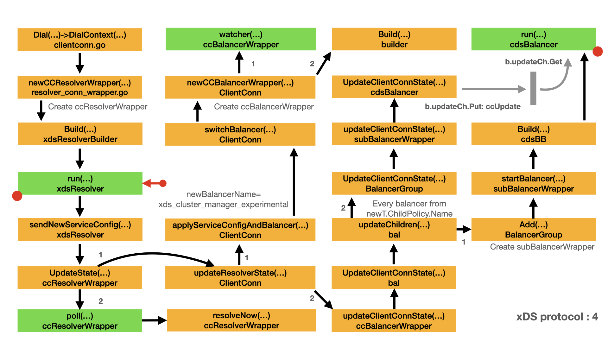

# Load Balancing - xDS protocol

In the previous article [xDS protocol support](xds.md), we discussed the xDS resolver and LDS/RDS. In this article we will discuss the xDS balancer and CDS/EDS. In my guess: RDS returns a group of cluster name based on the domain matched `Route`. Try to find every entries in cluster name via CDS/EDS is not a efficient way. The following is the example service config produced by `serviceConfigJSON()`. In [Build `ServiceConfig`](xds.md#build-serviceconfig), `sendNewServiceConfig()` produces the similar service config file.

```json
{
  "loadBalancingConfig": [
    {
      "xds_cluster_manager_experimental": {
        "children": {
          "cds:cluster_1": {
            "childPolicy": [
              {
                "cds_experimental": {
                  "cluster": "cluster_1"
                }
              }
            ]
          },
          "weighted:cluster_1_cluster_2_1": {
            "childPolicy": [
              {
                "weighted_target_experimental": {
                  "targets": {
                    "cluster_1": {
                      "weight": 75,
                      "childPolicy": [
                        {
                          "cds_experimental": {
                            "cluster": "cluster_1"
                          }
                        }
                      ]
                    },
                    "cluster_2": {
                      "weight": 25,
                      "childPolicy": [
                        {
                          "cds_experimental": {
                            "cluster": "cluster_2"
                          }
                        }
                      ]
                    }
                  }
                }
              }
            ]
          },
          "weighted:cluster_1_cluster_3_1": {
            "childPolicy": [
              {
                "weighted_target_experimental": {
                  "targets": {
                    "cluster_1": {
                      "weight": 99,
                      "childPolicy": [
                        {
                          "cds_experimental": {
                            "cluster": "cluster_1"
                          }
                        }
                      ]
                    },
                    "cluster_3": {
                      "weight": 1,
                      "childPolicy": [
                        {
                          "cds_experimental": {
                            "cluster": "cluster_3"
                          }
                        }
                      ]
                    }
                  }
                }
              }
            ]
          }
        }
      }
    }
  ]
}
```

```go
    r := &xdsResolver{activeClusters: map[string]*clusterInfo{
        "zero": {refCount: 0},
        "one":  {refCount: 1},
        "two":  {refCount: 2},
    }}

    // to service config
    result, err := serviceConfigJSON(r.activeClusters)
```

```json
{
  "loadBalancingConfig": [
    {
      "xds_cluster_manager_experimental": {
        "children": {
          "one": {
            "childPolicy": [
              {
                "cds_experimental": {
                  "cluster": "one"
                }
              }
            ]
          },
          "two": {
            "childPolicy": [
              {
                "cds_experimental": {
                  "cluster": "two"
                }
              }
            ]
          },
          "zero": {
            "childPolicy": [
              {
                "cds_experimental": {
                  "cluster": "zero"
                }
              }
            ]
          }
        }
      }
    }
  ]
}
```

In [Build `ServiceConfig`](xds.md#build-serviceconfig), `r.cc.UpdateState()` will be called in `xdsResolver.sendNewServiceConfig()` once RDS response is processed. `r.cc.UpdateState()` is actually `ccResolverWrapper.UpdateState()`. The parameter of `r.cc.UpdateState()` is `resolver.State`, which is a struct, resolver uses this struct to notifiy the gRPC core. For xDS, `resolver.State` contains the following fields:

- The `Addresses` field: NOT used by xDS resolver.
- The `ServiceConfig` field: `xdsResolver.sendNewServiceConfig()` builds `ServiceConfig` based on `xdsResolver.activeClusters`.
- The `Attributes` field: `xdsResolver.sendNewServiceConfig()` sets a key/value pair in `Attributes`field.
  - The key is `"grpc.internal.resolver.configSelector"`.
  - The value is `configSelector` which is built by `xdsResolver.newConfigSelector()`.
  - Please refer to [Build `ServiceConfig`](xds.md#build-serviceconfig) for detail.

```go
// State contains the current Resolver state relevant to the ClientConn.
type State struct {
    // Addresses is the latest set of resolved addresses for the target.
    Addresses []Address

    // ServiceConfig contains the result from parsing the latest service
    // config.  If it is nil, it indicates no service config is present or the
    // resolver does not provide service configs.
    ServiceConfig *serviceconfig.ParseResult

    // Attributes contains arbitrary data about the resolver intended for
    // consumption by the load balancing policy.
    Attributes *attributes.Attributes
}

// sendNewServiceConfig prunes active clusters, generates a new service config
// based on the current set of active clusters, and sends an update to the
// channel with that service config and the provided config selector.  Returns
// false if an error occurs while generating the service config and the update
// cannot be sent.
func (r *xdsResolver) sendNewServiceConfig(cs *configSelector) bool {
    // Delete entries from r.activeClusters with zero references;
    // otherwise serviceConfigJSON will generate a config including
    // them.
    r.pruneActiveClusters()

    if cs == nil && len(r.activeClusters) == 0 {
        // There are no clusters and we are sending a failing configSelector.
        // Send an empty config, which picks pick-first, with no address, and
        // puts the ClientConn into transient failure.
        r.cc.UpdateState(resolver.State{ServiceConfig: r.cc.ParseServiceConfig("{}")})
        return true
    }

    // Produce the service config.
    sc, err := serviceConfigJSON(r.activeClusters)
    if err != nil {
        // JSON marshal error; should never happen.
        r.logger.Errorf("%v", err)
        r.cc.ReportError(err)
        return false
    }
    r.logger.Infof("Received update on resource %v from xds-client %p, generated service config: %v", r.target.Endpoint, r.client, sc)

    // Send the update to the ClientConn.
    state := iresolver.SetConfigSelector(resolver.State{
        ServiceConfig: r.cc.ParseServiceConfig(sc),
    }, cs)
    r.cc.UpdateState(state)
    return true
}

const csKey = csKeyType("grpc.internal.resolver.configSelector")

// SetConfigSelector sets the config selector in state and returns the new
// state.
func SetConfigSelector(state resolver.State, cs ConfigSelector) resolver.State {
    state.Attributes = state.Attributes.WithValues(csKey, cs)
    return state
}
```

## Initialize CDS balancer

In this stage, we will continue the discussion of xDS protocol: CDS part. With the previous service config in hands, it's the time to initialize the xds balancer. Here is the map for this stage. In this map:

- Yellow box represents the important type and method/function.
- Green box represents a function run in a dedicated goroutine.
- Arrow represents the call direction and order.
- Grey bar and arrow represents the channel communication for `b.updateCh`.
- Dot arrow represents the indirect relationship between two boxes.
- Left red dot means the box is a continue part from other map.
- Right red dot means there is another map for that box.



### UpdateState

In `sendNewServiceConfig()`, resolver calls `r.cc.UpdateState()` to notify gRPC core the resolver state.

- `ccResolverWrapper.UpdateState()` calls `ClientConn.updateResolverState()` with parameter `resolver.State`.
- In `updateResolverState()`, in this case, the `s.ServiceConfig.Config` field of `resolver.State` is not nil,
  - First, `iresolver.GetConfigSelector()` will be called to get the `ConfigSelector` from `State.Attributes`.
  - Then `cc.applyServiceConfigAndBalancer()` will be called to initialize the cluster manager: a special kind of balancer.
  - At last, `bw.updateClientConnState()` will be called to initialize the xDS balancer.
- `ccResolverWrapper.UpdateState()` calls `ccr.poll()` to polling the resolver by calling the `ResolveNow()` method of resolver. In our case, `ccr.poll()` do nothing at all. the `ResolveNow()` method of xDS resolver do nothing.

Let's continue the discussion of `cc.applyServiceConfigAndBalancer()` in next.

```go
func (ccr *ccResolverWrapper) UpdateState(s resolver.State) {
    if ccr.done.HasFired() {
        return
    }
    channelz.Infof(logger, ccr.cc.channelzID, "ccResolverWrapper: sending update to cc: %v", s)
    if channelz.IsOn() {
        ccr.addChannelzTraceEvent(s)
    }
    ccr.curState = s
    ccr.poll(ccr.cc.updateResolverState(ccr.curState, nil))
}

func (cc *ClientConn) updateResolverState(s resolver.State, err error) error {
    defer cc.firstResolveEvent.Fire()
    cc.mu.Lock()
    // Check if the ClientConn is already closed. Some fields (e.g.
    // balancerWrapper) are set to nil when closing the ClientConn, and could
    // cause nil pointer panic if we don't have this check.
    if cc.conns == nil {
        cc.mu.Unlock()
        return nil
    }

    if err != nil {
        // May need to apply the initial service config in case the resolver
        // doesn't support service configs, or doesn't provide a service config
        // with the new addresses.
        cc.maybeApplyDefaultServiceConfig(nil)

        if cc.balancerWrapper != nil {
            cc.balancerWrapper.resolverError(err)
        }

        // No addresses are valid with err set; return early.
        cc.mu.Unlock()
        return balancer.ErrBadResolverState
    }

    var ret error
    if cc.dopts.disableServiceConfig || s.ServiceConfig == nil {
        cc.maybeApplyDefaultServiceConfig(s.Addresses)
        // TODO: do we need to apply a failing LB policy if there is no
        // default, per the error handling design?
    } else {
        if sc, ok := s.ServiceConfig.Config.(*ServiceConfig); s.ServiceConfig.Err == nil && ok {
            configSelector := iresolver.GetConfigSelector(s)
            if configSelector != nil {
                if len(s.ServiceConfig.Config.(*ServiceConfig).Methods) != 0 {
                    channelz.Infof(logger, cc.channelzID, "method configs in service config will be ignored due to presence of config selector")
                }
            } else {
                configSelector = &defaultConfigSelector{sc}
            }
            cc.applyServiceConfigAndBalancer(sc, configSelector, s.Addresses)
        } else {
            ret = balancer.ErrBadResolverState
            if cc.balancerWrapper == nil {
                var err error
                if s.ServiceConfig.Err != nil {
                    err = status.Errorf(codes.Unavailable, "error parsing service config: %v", s.ServiceConfig.Err)
                } else {
                    err = status.Errorf(codes.Unavailable, "illegal service config type: %T", s.ServiceConfig.Config)
                }
                cc.safeConfigSelector.UpdateConfigSelector(&defaultConfigSelector{cc.sc})
                cc.blockingpicker.updatePicker(base.NewErrPicker(err))
                cc.csMgr.updateState(connectivity.TransientFailure)
                cc.mu.Unlock()
                return ret
            }
        }
    }

    var balCfg serviceconfig.LoadBalancingConfig
    if cc.dopts.balancerBuilder == nil && cc.sc != nil && cc.sc.lbConfig != nil {
        balCfg = cc.sc.lbConfig.cfg
    }

    cbn := cc.curBalancerName
    bw := cc.balancerWrapper
    cc.mu.Unlock()
    if cbn != grpclbName {
        // Filter any grpclb addresses since we don't have the grpclb balancer.
        for i := 0; i < len(s.Addresses); {
            if s.Addresses[i].Type == resolver.GRPCLB {
                copy(s.Addresses[i:], s.Addresses[i+1:])
                s.Addresses = s.Addresses[:len(s.Addresses)-1]
                continue
            }
            i++
        }
    }
    uccsErr := bw.updateClientConnState(&balancer.ClientConnState{ResolverState: s, BalancerConfig: balCfg})
    if ret == nil {
        ret = uccsErr // prefer ErrBadResolver state since any other error is
        // currently meaningless to the caller.
    }
    return ret
}
```

### Create balancer manager

In `applyServiceConfigAndBalancer()`:

- `ServiceConfig` is assigned to `cc.sc`. `configSelector` is also assigned to `cc.safeConfigSelector`.
- The most important step is to determine the value of `newBalancerName`.
- In our case, the value of `newBalancerName` is `cc.sc.lbConfig.name`, which is actually `"xds_cluster_manager_experimental"` based on the previous service config example.
- `switchBalancer()` will be called to prepare the new balancer:
  - calls `balancer.Get()` to get the builder of `"xds_cluster_manager_experimental"`.
  - calls `newCCBalancerWrapper()` to create the `cc.balancerWrapper` and build the new balancer mananger.
    - In `newCCBalancerWrapper()`, `ccBalancerWrapper` is created.
    - Starts a new goroutine `ccb.watcher()`. `watcher()` waits for the `ccb.scBuffer.Get()` channel. Unpon receive the `scStateUpdate` message, `watcher()` calls `ccb.balancer.UpdateSubConnState()`
    - Create the new balncer `ccb.balancer` by calling `Build()`. For `"xds_cluster_manager_experimental"` balancer. `builder.Build()` will be called to create the xDS balancer manager. It's a special kind of balancer. It's a balancer to manage the children balancers.

```go
func (cc *ClientConn) applyServiceConfigAndBalancer(sc *ServiceConfig, configSelector iresolver.ConfigSelector, addrs []resolver.Address) {
    if sc == nil {
        // should never reach here.
        return
    }
    cc.sc = sc
    if configSelector != nil {
        cc.safeConfigSelector.UpdateConfigSelector(configSelector)
    }

    if cc.sc.retryThrottling != nil {
        newThrottler := &retryThrottler{
            tokens: cc.sc.retryThrottling.MaxTokens,
            max:    cc.sc.retryThrottling.MaxTokens,
            thresh: cc.sc.retryThrottling.MaxTokens / 2,
            ratio:  cc.sc.retryThrottling.TokenRatio,
        }
        cc.retryThrottler.Store(newThrottler)
    } else {
        cc.retryThrottler.Store((*retryThrottler)(nil))
    }

    if cc.dopts.balancerBuilder == nil {
        // Only look at balancer types and switch balancer if balancer dial
        // option is not set.
        var newBalancerName string
        if cc.sc != nil && cc.sc.lbConfig != nil {
            newBalancerName = cc.sc.lbConfig.name
        } else {
            var isGRPCLB bool
            for _, a := range addrs {
                if a.Type == resolver.GRPCLB {
                    isGRPCLB = true
                    break
                }
            }
            if isGRPCLB {
                newBalancerName = grpclbName
            } else if cc.sc != nil && cc.sc.LB != nil {
                newBalancerName = *cc.sc.LB
            } else {
                newBalancerName = PickFirstBalancerName
            }
        }
        cc.switchBalancer(newBalancerName)
    } else if cc.balancerWrapper == nil {
        // Balancer dial option was set, and this is the first time handling
        // resolved addresses. Build a balancer with dopts.balancerBuilder.
        cc.curBalancerName = cc.dopts.balancerBuilder.Name()
        cc.balancerWrapper = newCCBalancerWrapper(cc, cc.dopts.balancerBuilder, cc.balancerBuildOpts)
    }
}

// switchBalancer starts the switching from current balancer to the balancer
// with the given name.
//
// It will NOT send the current address list to the new balancer. If needed,
// caller of this function should send address list to the new balancer after
// this function returns.
//
// Caller must hold cc.mu.
func (cc *ClientConn) switchBalancer(name string) {
    if strings.EqualFold(cc.curBalancerName, name) {
        return
    }

    channelz.Infof(logger, cc.channelzID, "ClientConn switching balancer to %q", name)
    if cc.dopts.balancerBuilder != nil {
        channelz.Info(logger, cc.channelzID, "ignoring balancer switching: Balancer DialOption used instead")
        return
    }
    if cc.balancerWrapper != nil {
        cc.balancerWrapper.close()
    }

    builder := balancer.Get(name)
    if builder == nil {
        channelz.Warningf(logger, cc.channelzID, "Channel switches to new LB policy %q due to fallback from invalid balancer name", PickFirstBalancerName)
        channelz.Infof(logger, cc.channelzID, "failed to get balancer builder for: %v, using pick_first instead", name)
        builder = newPickfirstBuilder()
    } else {
        channelz.Infof(logger, cc.channelzID, "Channel switches to new LB policy %q", name)
    }

    cc.curBalancerName = builder.Name()
    cc.balancerWrapper = newCCBalancerWrapper(cc, builder, cc.balancerBuildOpts)
}

func newCCBalancerWrapper(cc *ClientConn, b balancer.Builder, bopts balancer.BuildOptions) *ccBalancerWrapper {
    ccb := &ccBalancerWrapper{
        cc:       cc,
        scBuffer: buffer.NewUnbounded(),
        done:     grpcsync.NewEvent(),
        subConns: make(map[*acBalancerWrapper]struct{}),
    }
    go ccb.watcher()
    ccb.balancer = b.Build(ccb, bopts)
    return ccb
}

// watcher balancer functions sequentially, so the balancer can be implemented
// lock-free.
func (ccb *ccBalancerWrapper) watcher() {
    for {
        select {
        case t := <-ccb.scBuffer.Get():
            ccb.scBuffer.Load()
            if ccb.done.HasFired() {
                break
            }
            ccb.balancerMu.Lock()
            su := t.(*scStateUpdate)
            ccb.balancer.UpdateSubConnState(su.sc, balancer.SubConnState{ConnectivityState: su.state, ConnectionError: su.err})
            ccb.balancerMu.Unlock()
        case <-ccb.done.Done():
        }

        if ccb.done.HasFired() {
            ccb.balancer.Close()
            ccb.mu.Lock()
            scs := ccb.subConns
            ccb.subConns = nil
            ccb.mu.Unlock()
            for acbw := range scs {
                ccb.cc.removeAddrConn(acbw.getAddrConn(), errConnDrain)
            }
            ccb.UpdateState(balancer.State{ConnectivityState: connectivity.Connecting, Picker: nil})
            return
        }
    }
}

const balancerName = "xds_cluster_manager_experimental"

func init() {
    balancer.Register(builder{})
}

type builder struct{}

func (builder) Build(cc balancer.ClientConn, _ balancer.BuildOptions) balancer.Balancer {
    b := &bal{}
    b.logger = prefixLogger(b)
    b.stateAggregator = newBalancerStateAggregator(cc, b.logger)
    b.stateAggregator.start()
    b.bg = balancergroup.New(cc, b.stateAggregator, nil, b.logger)
    b.bg.Start()
    b.logger.Infof("Created")
    return b
}

func (builder) Name() string {
    return balancerName
}
```

### updateClientConnState

`updateClientConnState()` is called with the parameter, `balancer.ClientConnState`:

- the `ResolverState` field of `balancer.ClientConnState` is same as parameter of `resolver.State`.
- the `BalancerConfig` field of `balancer.ClientConnState` is `cc.sc.lbConfig.cfg`. which is actually `children` object of our sample service config file.

`updateResolverState()` calls `ccBalancerWrapper.updateClientConnState()`.

- `updateClientConnState()` calls `ccb.balancer.UpdateClientConnState()`, which is actually `bal.UpdateClientConnState()`
- `UpdateClientConnState()` calls `b.updateChildren()` with the same parameter `resolver.State` and `cc.sc.lbConfig.cfg`.

```go
func (ccb *ccBalancerWrapper) updateClientConnState(ccs *balancer.ClientConnState) error {
    ccb.balancerMu.Lock()
    defer ccb.balancerMu.Unlock()
    return ccb.balancer.UpdateClientConnState(*ccs)
}

func (b *bal) UpdateClientConnState(s balancer.ClientConnState) error {
    newConfig, ok := s.BalancerConfig.(*lbConfig)
    if !ok {
        return fmt.Errorf("unexpected balancer config with type: %T", s.BalancerConfig)
    }
    b.logger.Infof("update with config %+v, resolver state %+v", s.BalancerConfig, s.ResolverState)

    b.updateChildren(s, newConfig)
    return nil
}
```

