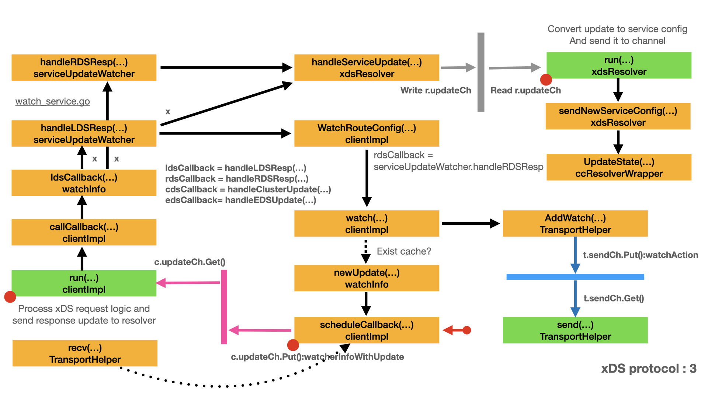

# xDS picker

- [Build config selector](#build-config-selector)
- [Initialize config selector](#initialize-config-selector)
- [Match cluster name](#match-cluster-name)
- [Pick a connection](#pick-a-connection)
  - [Picker group](#picker-group)
  - [Drop picker](#drop-picker)
  - [Weighted picker group](#weighted-picker-group)
  - [Load report picker](#load-report-picker)
  - [Round-robin picker](#round-robin-picker)

Through the discussion from [xDS protocol - LDS/RDS](lds.md) and [xDS protocol - CDS/EDS](cds.md), we have connected with the upstream server. There is a key question need to answer: For each RPC request which connection will be used ? Who decide it?

During the discussion, you can refer to [xDS wrappers](wrappers.md#xds-wrappers) to find the invocation target.

## Build config selector



After RDS response is received, in [Build service config](lds.md#build-serviceconfig), `xdsResolver.run()` is waiting on the channel `r.updateCh`. Upon receive the `suWithError` message:

- `xdsResolver.run()` calls `r.newConfigSelector()` to create the config selector for this update.
- `xdsResolver.run()` calls `r.sendNewServiceConfig()` to produce the service config and send the update.
- `xdsResolver.run()` sets `r.curConfigSelector` to be the new config selector.
- Please note `r.curConfigSelector` is of type `*configSelector`.

```go
// run is a long running goroutine which blocks on receiving service updates
// and passes it on the ClientConn.
func (r *xdsResolver) run() {
    for {
        select {
        case <-r.closed.Done():
            return
        case update := <-r.updateCh:
            if update.err != nil {
                r.logger.Warningf("Watch error on resource %v from xds-client %p, %v", r.target.Endpoint, r.client, update.err)
                if xdsclient.ErrType(update.err) == xdsclient.ErrorTypeResourceNotFound {
                    // If error is resource-not-found, it means the LDS
                    // resource was removed. Ultimately send an empty service
                    // config, which picks pick-first, with no address, and
                    // puts the ClientConn into transient failure.  Before we
                    // can do that, we may need to send a normal service config
                    // along with an erroring (nil) config selector.
                    r.sendNewServiceConfig(nil)
                    // Stop and dereference the active config selector, if one exists.
                    r.curConfigSelector.stop()
                    r.curConfigSelector = nil
                    continue
                }
                // Send error to ClientConn, and balancers, if error is not
                // resource not found.  No need to update resolver state if we
                // can keep using the old config.
                r.cc.ReportError(update.err)
                continue
            }
            if update.emptyUpdate {
                r.sendNewServiceConfig(r.curConfigSelector)
                continue
            }

            // Create the config selector for this update.
            cs, err := r.newConfigSelector(update.su)
            if err != nil {
                r.logger.Warningf("Error parsing update on resource %v from xds-client %p: %v", r.target.Endpoint, r.client, err)
                r.cc.ReportError(err)
                continue
            }

            if !r.sendNewServiceConfig(cs) {
                // JSON error creating the service config (unexpected); erase
                // this config selector and ignore this update, continuing with
                // the previous config selector.
                cs.stop()
                continue
            }

            // Decrement references to the old config selector and assign the
            // new one as the current one.
            r.curConfigSelector.stop()
            r.curConfigSelector = cs
        }
    }
}
```

`xdsResolver.newConfigSelector()` builds the `configSelector` based on the parameter `serviceUpdate`.

```go
// newConfigSelector creates the config selector for su; may add entries to
// r.activeClusters for previously-unseen clusters.
func (r *xdsResolver) newConfigSelector(su serviceUpdate) (*configSelector, error) {
    cs := &configSelector{
        r:                r,
        virtualHost:      virtualHost{httpFilterConfigOverride: su.virtualHost.HTTPFilterConfigOverride},
        routes:           make([]route, len(su.virtualHost.Routes)),
        clusters:         make(map[string]*clusterInfo),
        httpFilterConfig: su.ldsConfig.httpFilterConfig,
    }

    for i, rt := range su.virtualHost.Routes {
        clusters := newWRR()
        for cluster, wc := range rt.WeightedClusters {
            clusters.Add(&routeCluster{
                name:                     cluster,
                httpFilterConfigOverride: wc.HTTPFilterConfigOverride,
            }, int64(wc.Weight))

            // Initialize entries in cs.clusters map, creating entries in
            // r.activeClusters as necessary.  Set to zero as they will be
            // incremented by incRefs.
            ci := r.activeClusters[cluster]
            if ci == nil {
                ci = &clusterInfo{refCount: 0}
                r.activeClusters[cluster] = ci
            }
            cs.clusters[cluster] = ci
        }
        cs.routes[i].clusters = clusters

        var err error
        cs.routes[i].m, err = routeToMatcher(rt)
        if err != nil {
            return nil, err
        }
        if rt.MaxStreamDuration == nil {
            cs.routes[i].maxStreamDuration = su.ldsConfig.maxStreamDuration
        } else {
            cs.routes[i].maxStreamDuration = *rt.MaxStreamDuration
        }

        cs.routes[i].httpFilterConfigOverride = rt.HTTPFilterConfigOverride
    }

    // Account for this config selector's clusters.  Do this after no further
    // errors may occur.  Note: cs.clusters are pointers to entries in
    // activeClusters.
    for _, ci := range cs.clusters {
        atomic.AddInt32(&ci.refCount, 1)
    }

    return cs, nil
}

type configSelector struct {
    r                *xdsResolver
    virtualHost      virtualHost
    routes           []route
    clusters         map[string]*clusterInfo
    httpFilterConfig []xdsclient.HTTPFilter
}
```

`xdsResolver.sendNewServiceConfig()` generates a new service config based on the current set of active clusters, and sends an update to the channel with that service config and the provided config selector.

- `xdsResolver.sendNewServiceConfig()` calls `serviceConfigJSON()` to generate a new service config.
- `xdsResolver.sendNewServiceConfig()` calls `iresolver.SetConfigSelector()` to set the config selector in `state.Attributes`.
- `xdsResolver.sendNewServiceConfig()` calls `r.cc.UpdateState()` to send the update to the `ClientConn`.
- `r.cc.UpdateState()` returns when the cluster manager balancer and CDS balancer is created.
- Please note `ConfigSelector` is an interface, `configSelector` implements `ConfigSelector`.

```go
// sendNewServiceConfig prunes active clusters, generates a new service config
// based on the current set of active clusters, and sends an update to the
// channel with that service config and the provided config selector.  Returns
// false if an error occurs while generating the service config and the update
// cannot be sent.
func (r *xdsResolver) sendNewServiceConfig(cs *configSelector) bool {
    // Delete entries from r.activeClusters with zero references;
    // otherwise serviceConfigJSON will generate a config including
    // them.
    r.pruneActiveClusters()

    if cs == nil && len(r.activeClusters) == 0 {
        // There are no clusters and we are sending a failing configSelector.
        // Send an empty config, which picks pick-first, with no address, and
        // puts the ClientConn into transient failure.
        r.cc.UpdateState(resolver.State{ServiceConfig: r.cc.ParseServiceConfig("{}")})
        return true
    }

    // Produce the service config.
    sc, err := serviceConfigJSON(r.activeClusters)
    if err != nil {
        // JSON marshal error; should never happen.
        r.logger.Errorf("%v", err)
        r.cc.ReportError(err)
        return false
    }
    r.logger.Infof("Received update on resource %v from xds-client %p, generated service config: %v", r.target.Endpoint, r.client, sc)

    // Send the update to the ClientConn.
    state := iresolver.SetConfigSelector(resolver.State{
        ServiceConfig: r.cc.ParseServiceConfig(sc),
    }, cs)
    r.cc.UpdateState(state)
    return true
}

// SetConfigSelector sets the config selector in state and returns the new
// state.
func SetConfigSelector(state resolver.State, cs ConfigSelector) resolver.State {
    state.Attributes = state.Attributes.WithValues(csKey, cs)
    return state
}

// ConfigSelector controls what configuration to use for every RPC.
type ConfigSelector interface {
    // Selects the configuration for the RPC, or terminates it using the error.
    // This error will be converted by the gRPC library to a status error with
    // code UNKNOWN if it is not returned as a status error.
    SelectConfig(RPCInfo) (*RPCConfig, error)
}
```

## Initialize config selector


In [Initialize CDS balancer](cds.md#initialize-cds-balancer) section, `ClientConn.updateResolverState()` is called to create the `ccBalancerWrapper`, cluster manager balancer and CDS balancer.

- In `ClientConn.updateResolverState()`, `s.ServiceConfig` is not nil.
- `ClientConn.updateResolverState()` calls `iresolver.GetConfigSelector()` to extract `ConfigSelector` from `state.Attributes`.
- `ClientConn.updateResolverState()` calls `cc.applyServiceConfigAndBalancer()` to apply the service config and config selector.

```go
func (cc *ClientConn) updateResolverState(s resolver.State, err error) error {
    defer cc.firstResolveEvent.Fire()
    cc.mu.Lock()
    // Check if the ClientConn is already closed. Some fields (e.g.
    // balancerWrapper) are set to nil when closing the ClientConn, and could
    // cause nil pointer panic if we don't have this check.
    if cc.conns == nil {
        cc.mu.Unlock()
        return nil
    }

    if err != nil {
        // May need to apply the initial service config in case the resolver
        // doesn't support service configs, or doesn't provide a service config
        // with the new addresses.
        cc.maybeApplyDefaultServiceConfig(nil)

        if cc.balancerWrapper != nil {
            cc.balancerWrapper.resolverError(err)
        }

        // No addresses are valid with err set; return early.
        cc.mu.Unlock()
        return balancer.ErrBadResolverState
    }

    var ret error
    if cc.dopts.disableServiceConfig || s.ServiceConfig == nil {
        cc.maybeApplyDefaultServiceConfig(s.Addresses)
        // TODO: do we need to apply a failing LB policy if there is no
        // default, per the error handling design?
    } else {
        if sc, ok := s.ServiceConfig.Config.(*ServiceConfig); s.ServiceConfig.Err == nil && ok {
            configSelector := iresolver.GetConfigSelector(s)
            if configSelector != nil {
                if len(s.ServiceConfig.Config.(*ServiceConfig).Methods) != 0 {
                    channelz.Infof(logger, cc.channelzID, "method configs in service config will be ignored due to presence of config selector")
                }
            } else {
                configSelector = &defaultConfigSelector{sc}
            }
            cc.applyServiceConfigAndBalancer(sc, configSelector, s.Addresses)
        } else {
            ret = balancer.ErrBadResolverState
            if cc.balancerWrapper == nil {
                var err error
                if s.ServiceConfig.Err != nil {
                    err = status.Errorf(codes.Unavailable, "error parsing service config: %v", s.ServiceConfig.Err)
                } else {
                    err = status.Errorf(codes.Unavailable, "illegal service config type: %T", s.ServiceConfig.Config)
                }
                cc.safeConfigSelector.UpdateConfigSelector(&defaultConfigSelector{cc.sc})
                cc.blockingpicker.updatePicker(base.NewErrPicker(err))
                cc.csMgr.updateState(connectivity.TransientFailure)
                cc.mu.Unlock()
                return ret
            }
        }
    }

    var balCfg serviceconfig.LoadBalancingConfig
    if cc.dopts.balancerBuilder == nil && cc.sc != nil && cc.sc.lbConfig != nil {
        balCfg = cc.sc.lbConfig.cfg
    }

    cbn := cc.curBalancerName
    bw := cc.balancerWrapper
    cc.mu.Unlock()
    if cbn != grpclbName {
        // Filter any grpclb addresses since we don't have the grpclb balancer.
        for i := 0; i < len(s.Addresses); {
            if s.Addresses[i].Type == resolver.GRPCLB {
                copy(s.Addresses[i:], s.Addresses[i+1:])
                s.Addresses = s.Addresses[:len(s.Addresses)-1]
                continue
            }
            i++
        }
    }
    uccsErr := bw.updateClientConnState(&balancer.ClientConnState{ResolverState: s, BalancerConfig: balCfg})
    if ret == nil {
        ret = uccsErr // prefer ErrBadResolver state since any other error is
        // currently meaningless to the caller.
    }
    return ret
}

// GetConfigSelector retrieves the config selector from state, if present, and
// returns it or nil if absent.
func GetConfigSelector(state resolver.State) ConfigSelector {
    cs, _ := state.Attributes.Value(csKey).(ConfigSelector)
    return cs
}
```

- `ClientConn.applyServiceConfigAndBalancer()` calls `cc.safeConfigSelector.UpdateConfigSelector()` to update the `cc.safeConfigSelector`.
- `ClientConn.applyServiceConfigAndBalancer()` initializes the `ccBalancerWrapper`, cluster manager balancer. See [Create cluster manager](cds.md#create-cluster-manager) for detail.

Please note `ClientConn.safeConfigSelector` has a `xdsResolver.curConfigSelector`.

```go
func (cc *ClientConn) applyServiceConfigAndBalancer(sc *ServiceConfig, configSelector iresolver.ConfigSelector, addrs []resolver.Address) {
    if sc == nil {
        // should never reach here.
        return
    }
    cc.sc = sc
    if configSelector != nil {
        cc.safeConfigSelector.UpdateConfigSelector(configSelector)
    }

    if cc.sc.retryThrottling != nil {
        newThrottler := &retryThrottler{
            tokens: cc.sc.retryThrottling.MaxTokens,
            max:    cc.sc.retryThrottling.MaxTokens,
            thresh: cc.sc.retryThrottling.MaxTokens / 2,
            ratio:  cc.sc.retryThrottling.TokenRatio,
        }
        cc.retryThrottler.Store(newThrottler)
    } else {
        cc.retryThrottler.Store((*retryThrottler)(nil))
    }

    if cc.dopts.balancerBuilder == nil {
        // Only look at balancer types and switch balancer if balancer dial
        // option is not set.
        var newBalancerName string
        if cc.sc != nil && cc.sc.lbConfig != nil {
            newBalancerName = cc.sc.lbConfig.name
        } else {
            var isGRPCLB bool
            for _, a := range addrs {
                if a.Type == resolver.GRPCLB {
                    isGRPCLB = true
                    break
                }
            }
            if isGRPCLB {
                newBalancerName = grpclbName
            } else if cc.sc != nil && cc.sc.LB != nil {
                newBalancerName = *cc.sc.LB
            } else {
                newBalancerName = PickFirstBalancerName
            }
        }
        cc.switchBalancer(newBalancerName)
    } else if cc.balancerWrapper == nil {
        // Balancer dial option was set, and this is the first time handling
        // resolved addresses. Build a balancer with dopts.balancerBuilder.
        cc.curBalancerName = cc.dopts.balancerBuilder.Name()
        cc.balancerWrapper = newCCBalancerWrapper(cc, cc.dopts.balancerBuilder, cc.balancerBuildOpts)
    }
}

// SafeConfigSelector allows for safe switching of ConfigSelector
// implementations such that previous values are guaranteed to not be in use
// when UpdateConfigSelector returns.
type SafeConfigSelector struct {
    mu sync.RWMutex
    cs ConfigSelector
}

// UpdateConfigSelector swaps to the provided ConfigSelector and blocks until
// all uses of the previous ConfigSelector have completed.
func (scs *SafeConfigSelector) UpdateConfigSelector(cs ConfigSelector) {
    scs.mu.Lock()
    defer scs.mu.Unlock()
    scs.cs = cs
}

```

## Match cluster name


Let's assume the connection to upstream server is ready. The client can send the PRC request now. During [Send request](request.md), the request need a stream. In [Pick stream transport](request.md#pick-stream-transport) section,

- `newClientStream` calls `cc.safeConfigSelector.SelectConfig()` to prepare for the `rpcConfig`.
  - For `helloworld` example, `method` parameter is `"/helloworld.Greeter/SayHello"`.
- `newClientStream` calls `newStream()`.
  - In our case, we discuss the no interceptor version. `newStream()` forwards to `newClientStreamWithParams()`.

Let's discuss `cc.safeConfigSelector.SelectConfig()` first.

```go
func newClientStream(ctx context.Context, desc *StreamDesc, cc *ClientConn, method string, opts ...CallOption) (_ ClientStream, err error) {
    if channelz.IsOn() {
        cc.incrCallsStarted()
        defer func() {
            if err != nil {
                cc.incrCallsFailed()
            }
        }()
    }
    // Provide an opportunity for the first RPC to see the first service config
    // provided by the resolver.
    if err := cc.waitForResolvedAddrs(ctx); err != nil {
        return nil, err
    }

    var mc serviceconfig.MethodConfig
    var onCommit func()
    var newStream = func(ctx context.Context, done func()) (iresolver.ClientStream, error) {
        return newClientStreamWithParams(ctx, desc, cc, method, mc, onCommit, done, opts...)
    }

    rpcInfo := iresolver.RPCInfo{Context: ctx, Method: method}
    rpcConfig, err := cc.safeConfigSelector.SelectConfig(rpcInfo)
    if err != nil {
        return nil, toRPCErr(err)
    }

    if rpcConfig != nil {
        if rpcConfig.Context != nil {
            ctx = rpcConfig.Context
        }
        mc = rpcConfig.MethodConfig
        onCommit = rpcConfig.OnCommitted
        if rpcConfig.Interceptor != nil {
            rpcInfo.Context = nil
            ns := newStream
            newStream = func(ctx context.Context, done func()) (iresolver.ClientStream, error) {
                cs, err := rpcConfig.Interceptor.NewStream(ctx, rpcInfo, done, ns)
                if err != nil {
                    return nil, toRPCErr(err)
                }
                return cs, nil
            }
        }
    }

    return newStream(ctx, func() {})
}
```

`SafeConfigSelector` provides `SelectConfig()` method, which calls `scs.cs.SelectConfig()`. That means `cc.safeConfigSelector.SelectConfig()` will eventually calls `configSelector.SelectConfig()`.

- `configSelector.SelectConfig()` loops through routes in order and select first match.
- `configSelector.SelectConfig()` picks up a `routeCluster` from the matched route.
- `configSelector.SelectConfig()` calls `cs.newInterceptor` to build the RPC `interceptor`.
- `configSelector.SelectConfig()` calls `clustermanager.SetPickedCluster()` to add the `cluster.name` to the context.
- `configSelector.SelectConfig()` generates the `RPCConfig`.
- `configSelector.SelectConfig()` sets `config.MethodConfig.Timeout`.

Please note `clustermanager.SetPickedCluster()` is the most important step in `configSelector.SelectConfig()`. It sets the matched cluster name in the context of `RPCConfig`.

- Before RPC, `configSelector.SelectConfig()` adds a ref to the selected cluster, as this RPC needs this cluster until it is committed.
- When the RPC is committed, the cluster is no longer required. Decrease its ref. It's done by `OnCommitted` function.

We will not go deeper to discuss `cs.newInterceptor`. Let's focus on picker right now.

```go
// SelectConfig defers to the current ConfigSelector in scs.
func (scs *SafeConfigSelector) SelectConfig(r RPCInfo) (*RPCConfig, error) {
    scs.mu.RLock()
    defer scs.mu.RUnlock()
    return scs.cs.SelectConfig(r)
}

func (cs *configSelector) SelectConfig(rpcInfo iresolver.RPCInfo) (*iresolver.RPCConfig, error) {
    if cs == nil {
        return nil, status.Errorf(codes.Unavailable, "no valid clusters")
    }
    var rt *route
    // Loop through routes in order and select first match.
    for _, r := range cs.routes {
        if r.m.match(rpcInfo) {
            rt = &r
            break
        }
    }
    if rt == nil || rt.clusters == nil {
        return nil, errNoMatchedRouteFound
    }
    cluster, ok := rt.clusters.Next().(*routeCluster)
    if !ok {
        return nil, status.Errorf(codes.Internal, "error retrieving cluster for match: %v (%T)", cluster, cluster)
    }
    // Add a ref to the selected cluster, as this RPC needs this cluster until
    // it is committed.
    ref := &cs.clusters[cluster.name].refCount
    atomic.AddInt32(ref, 1)

    interceptor, err := cs.newInterceptor(rt, cluster)
    if err != nil {
        return nil, err
    }

    config := &iresolver.RPCConfig{
        // Communicate to the LB policy the chosen cluster.
        Context: clustermanager.SetPickedCluster(rpcInfo.Context, cluster.name),
        OnCommitted: func() {
            // When the RPC is committed, the cluster is no longer required.
            // Decrease its ref.
            if v := atomic.AddInt32(ref, -1); v == 0 {
                // This entry will be removed from activeClusters when
                // producing the service config for the empty update.
                select {
                case cs.r.updateCh <- suWithError{emptyUpdate: true}:
                default:
                }
            }
        },
        Interceptor: interceptor,
    }

    if env.TimeoutSupport && rt.maxStreamDuration != 0 {
        config.MethodConfig.Timeout = &rt.maxStreamDuration
    }

    return config, nil
}

// RPCInfo contains RPC information needed by a ConfigSelector.
type RPCInfo struct {
    // Context is the user's context for the RPC and contains headers and
    // application timeout.  It is passed for interception purposes and for
    // efficiency reasons.  SelectConfig should not be blocking.
    Context context.Context
    Method  string // i.e. "/Service/Method"
}

// RPCConfig describes the configuration to use for each RPC.
type RPCConfig struct {
    // The context to use for the remainder of the RPC; can pass info to LB
    // policy or affect timeout or metadata.
    Context      context.Context
    MethodConfig serviceconfig.MethodConfig // configuration to use for this RPC
    OnCommitted  func()                     // Called when the RPC has been committed (retries no longer possible)
    Interceptor  ClientInterceptor
}

type clusterKey struct{}

func getPickedCluster(ctx context.Context) string {
    cluster, _ := ctx.Value(clusterKey{}).(string)
    return cluster
}

// SetPickedCluster adds the selected cluster to the context for the
// xds_cluster_manager LB policy to pick.
func SetPickedCluster(ctx context.Context, cluster string) context.Context {
    return context.WithValue(ctx, clusterKey{}, cluster)
}
```

Let's back to discuss `newClientStreamWithParams()`.

- `newClientStreamWithParams()` generates `clientStream`, note the `ctx` parameter is assigned to `clientStream.ctx` field.
- Remember the `ctx` parameter contains the cluster name.
- `newClientStreamWithParams()` calls `cs.newAttemptLocked()`.
- `newClientStreamWithParams()` calls `cs.withRetry()`.

Next we will discuss `cs.newAttemptLocked()`.

```go
func newClientStreamWithParams(ctx context.Context, desc *StreamDesc, cc *ClientConn, method string, mc serviceconfig.MethodConfig, onCommit, doneFunc func(), opts ...CallOption) (_ iresolver.ClientStream, err error) {
    c := defaultCallInfo()
    if mc.WaitForReady != nil {
        c.failFast = !*mc.WaitForReady
    }

    // Possible context leak:
    // The cancel function for the child context we create will only be called
    // when RecvMsg returns a non-nil error, if the ClientConn is closed, or if
    // an error is generated by SendMsg.
    // https://github.com/grpc/grpc-go/issues/1818.
    var cancel context.CancelFunc
    if mc.Timeout != nil && *mc.Timeout >= 0 {
        ctx, cancel = context.WithTimeout(ctx, *mc.Timeout)
    } else {
        ctx, cancel = context.WithCancel(ctx)
    }
    defer func() {
        if err != nil {
            cancel()
        }
    }()

    for _, o := range opts {
        if err := o.before(c); err != nil {
            return nil, toRPCErr(err)
        }
    }
    c.maxSendMessageSize = getMaxSize(mc.MaxReqSize, c.maxSendMessageSize, defaultClientMaxSendMessageSize)
    c.maxReceiveMessageSize = getMaxSize(mc.MaxRespSize, c.maxReceiveMessageSize, defaultClientMaxReceiveMessageSize)
    if err := setCallInfoCodec(c); err != nil {
        return nil, err
    }

    callHdr := &transport.CallHdr{
        Host:           cc.authority,
        Method:         method,
        ContentSubtype: c.contentSubtype,
        DoneFunc:       doneFunc,
    }

    // Set our outgoing compression according to the UseCompressor CallOption, if
    // set.  In that case, also find the compressor from the encoding package.
    // Otherwise, use the compressor configured by the WithCompressor DialOption,
    // if set.
    var cp Compressor
    var comp encoding.Compressor
    if ct := c.compressorType; ct != "" {
        callHdr.SendCompress = ct
        if ct != encoding.Identity {
            comp = encoding.GetCompressor(ct)
            if comp == nil {
                return nil, status.Errorf(codes.Internal, "grpc: Compressor is not installed for requested grpc-encoding %q", ct)
            }
        }
    } else if cc.dopts.cp != nil {
        callHdr.SendCompress = cc.dopts.cp.Type()
        cp = cc.dopts.cp
    }
    if c.creds != nil {
        callHdr.Creds = c.creds
    }
    var trInfo *traceInfo
    if EnableTracing {
        trInfo = &traceInfo{
            tr: trace.New("grpc.Sent."+methodFamily(method), method),
            firstLine: firstLine{
                client: true,
            },
        }
        if deadline, ok := ctx.Deadline(); ok {
            trInfo.firstLine.deadline = time.Until(deadline)
        }
        trInfo.tr.LazyLog(&trInfo.firstLine, false)
        ctx = trace.NewContext(ctx, trInfo.tr)
    }
    ctx = newContextWithRPCInfo(ctx, c.failFast, c.codec, cp, comp)
    sh := cc.dopts.copts.StatsHandler
    var beginTime time.Time
    if sh != nil {
        ctx = sh.TagRPC(ctx, &stats.RPCTagInfo{FullMethodName: method, FailFast: c.failFast})
        beginTime = time.Now()
        begin := &stats.Begin{
            Client:    true,
            BeginTime: beginTime,
            FailFast:  c.failFast,
        }
        sh.HandleRPC(ctx, begin)
    }

    cs := &clientStream{
        callHdr:      callHdr,
        ctx:          ctx,
        methodConfig: &mc,
        opts:         opts,
        callInfo:     c,
        cc:           cc,
        desc:         desc,
        codec:        c.codec,
        cp:           cp,
        comp:         comp,
        cancel:       cancel,
        beginTime:    beginTime,
        firstAttempt: true,
        onCommit:     onCommit,
    }
    if !cc.dopts.disableRetry {
        cs.retryThrottler = cc.retryThrottler.Load().(*retryThrottler)
    }
    cs.binlog = binarylog.GetMethodLogger(method)

    // Only this initial attempt has stats/tracing.
    // TODO(dfawley): move to newAttempt when per-attempt stats are implemented.
    if err := cs.newAttemptLocked(sh, trInfo); err != nil {
        cs.finish(err)
        return nil, err
    }

    op := func(a *csAttempt) error { return a.newStream() }
    if err := cs.withRetry(op, func() { cs.bufferForRetryLocked(0, op) }); err != nil {
        cs.finish(err)
        return nil, err
    }

    if cs.binlog != nil {
        md, _ := metadata.FromOutgoingContext(ctx)
        logEntry := &binarylog.ClientHeader{
            OnClientSide: true,
            Header:       md,
            MethodName:   method,
            Authority:    cs.cc.authority,
        }
        if deadline, ok := ctx.Deadline(); ok {
            logEntry.Timeout = time.Until(deadline)
            if logEntry.Timeout < 0 {
                logEntry.Timeout = 0
            }
        }
        cs.binlog.Log(logEntry)
    }

    if desc != unaryStreamDesc {
        // Listen on cc and stream contexts to cleanup when the user closes the
        // ClientConn or cancels the stream context.  In all other cases, an error
        // should already be injected into the recv buffer by the transport, which
        // the client will eventually receive, and then we will cancel the stream's
        // context in clientStream.finish.
        go func() {
            select {
            case <-cc.ctx.Done():
                cs.finish(ErrClientConnClosing)
            case <-ctx.Done():
                cs.finish(toRPCErr(ctx.Err()))
            }
        }()
    }
    return cs, nil
}
```

`clientStream.newAttemptLocked()` creates a new attempt with a transport.

- `clientStream.newAttemptLocked()` uses the `cs.ctx` to call `cs.cc.getTransport()`.
- If it succeeds, `clientStream.newAttemptLocked()` replaces `cs.attempt` with this new attempt.

```go
// newAttemptLocked creates a new attempt with a transport.
// If it succeeds, then it replaces clientStream's attempt with this new attempt.
func (cs *clientStream) newAttemptLocked(sh stats.Handler, trInfo *traceInfo) (retErr error) {
    newAttempt := &csAttempt{
        cs:           cs,
        dc:           cs.cc.dopts.dc,
        statsHandler: sh,
        trInfo:       trInfo,
    }
    defer func() {
        if retErr != nil {
            // This attempt is not set in the clientStream, so it's finish won't
            // be called. Call it here for stats and trace in case they are not
            // nil.
            newAttempt.finish(retErr)
        }
    }()

    if err := cs.ctx.Err(); err != nil {
        return toRPCErr(err)
    }

    ctx := cs.ctx
    if cs.cc.parsedTarget.Scheme == "xds" {
        // Add extra metadata (metadata that will be added by transport) to context
        // so the balancer can see them.
        ctx = grpcutil.WithExtraMetadata(cs.ctx, metadata.Pairs(
            "content-type", grpcutil.ContentType(cs.callHdr.ContentSubtype),
        ))
    }
    t, done, err := cs.cc.getTransport(ctx, cs.callInfo.failFast, cs.callHdr.Method)
    if err != nil {
        return err
    }
    if trInfo != nil {
        trInfo.firstLine.SetRemoteAddr(t.RemoteAddr())
    }
    newAttempt.t = t
    newAttempt.done = done
    cs.attempt = newAttempt
    return nil
}
```

`ClientConn.getTransport()` calls `cc.blockingpicker.pick()` to pick a connection for this steam.

```go
func (cc *ClientConn) getTransport(ctx context.Context, failfast bool, method string) (transport.ClientTransport, func(balancer.DoneInfo), error) {
    t, done, err := cc.blockingpicker.pick(ctx, failfast, balancer.PickInfo{
        Ctx:            ctx,
        FullMethodName: method,
    })
    if err != nil {
        return nil, nil, toRPCErr(err)
    }
    return t, done, nil
}
```

## Pick a connection


- Yellow box represents important type and main field, "::" represents the field name.
- Blue line represents the most important relationship between two types.
- `1   *` represents one to many relationship.
- Red line highlights path of `ClientConn`.
- Black line and text represents the significant relationship between tow types.

Combine the information from [Update sub-connection state](conn2.md#update-sub-connection-state) and [Update state](conn2.md#update-state). We get the above xDS picker stack diagram.

`cc.blockingpicker` is `pickerWrapper`. `cc.blockingpicker.pick()` is `pickerWrapper.pick()`.

- The `pickerWrapper.picker` is set by `ccBalancerWrapper.UpdateState()`. Please see [Prepare for picker](conn2.md#prepare-for-picker).
- `pickerWrapper.pick()` calls `p.Pick()`, which is actually `pickerWrapper.picker.Pick()`.
- From the above xDS picker stack we know that a picker stack will be called by `pickerWrapper.picker.Pick()`.

Next we will discuss the picker stack one by one.

```go
// pick returns the transport that will be used for the RPC.
// It may block in the following cases:
// - there's no picker
// - the current picker returns ErrNoSubConnAvailable
// - the current picker returns other errors and failfast is false.
// - the subConn returned by the current picker is not READY
// When one of these situations happens, pick blocks until the picker gets updated.
func (pw *pickerWrapper) pick(ctx context.Context, failfast bool, info balancer.PickInfo) (transport.ClientTransport, func(balancer.DoneInfo), error) {
    var ch chan struct{}

    var lastPickErr error
    for {
        pw.mu.Lock()
        if pw.done {
            pw.mu.Unlock()
            return nil, nil, ErrClientConnClosing
        }

        if pw.picker == nil {
            ch = pw.blockingCh
        }
        if ch == pw.blockingCh {
            // This could happen when either:
            // - pw.picker is nil (the previous if condition), or
            // - has called pick on the current picker.
            pw.mu.Unlock()
            select {
            case <-ctx.Done():
                var errStr string
                if lastPickErr != nil {
                    errStr = "latest balancer error: " + lastPickErr.Error()
                } else {
                    errStr = ctx.Err().Error()
                }
                switch ctx.Err() {
                case context.DeadlineExceeded:
                    return nil, nil, status.Error(codes.DeadlineExceeded, errStr)
                case context.Canceled:
                    return nil, nil, status.Error(codes.Canceled, errStr)
                }
            case <-ch:
            }
            continue
        }

        ch = pw.blockingCh
        p := pw.picker
        pw.mu.Unlock()

        pickResult, err := p.Pick(info)

        if err != nil {
            if err == balancer.ErrNoSubConnAvailable {
                continue
            }
            if _, ok := status.FromError(err); ok {
                // Status error: end the RPC unconditionally with this status.
                return nil, nil, err
            }
            // For all other errors, wait for ready RPCs should block and other
            // RPCs should fail with unavailable.
            if !failfast {
                lastPickErr = err
                continue
            }
            return nil, nil, status.Error(codes.Unavailable, err.Error())
        }

        acw, ok := pickResult.SubConn.(*acBalancerWrapper)
        if !ok {
            logger.Error("subconn returned from pick is not *acBalancerWrapper")
            continue
        }
        if t, ok := acw.getAddrConn().getReadyTransport(); ok {
            if channelz.IsOn() {
                return t, doneChannelzWrapper(acw, pickResult.Done), nil
            }
            return t, pickResult.Done, nil
        }
        if pickResult.Done != nil {
            // Calling done with nil error, no bytes sent and no bytes received.
            // DoneInfo with default value works.
            pickResult.Done(balancer.DoneInfo{})
        }
        logger.Infof("blockingPicker: the picked transport is not ready, loop back to repick")
        // If ok == false, ac.state is not READY.
        // A valid picker always returns READY subConn. This means the state of ac
        // just changed, and picker will be updated shortly.
        // continue back to the beginning of the for loop to repick.
    }
}
```

### Picker group

The first picker is `pickerGroup`, Please refer to [Picker group](conn2.md#picker-group) for how to generate this picker.

`pickerWrapper.picker.Pick()` calls `pickerGroup.Pick()`.

- `pickerGroup.Pick()` calls `getPickedCluster()` to extract the cluster name from `info.Ctx`.
- `pickerGroup.Pick()` uses the cluster name to find the right picker.
- `pickerGroup.Pick()` calls the next picker in the picker stack via `p.Pick()`.

```go
// pickerGroup contains a list of pickers. If the picker isn't ready, the pick
// will be queued.
type pickerGroup struct {
    pickers map[string]balancer.Picker
}

func newPickerGroup(idToPickerState map[string]*subBalancerState) *pickerGroup {
    pickers := make(map[string]balancer.Picker)
    for id, st := range idToPickerState {
        pickers[id] = st.state.Picker
    }
    return &pickerGroup{
        pickers: pickers,
    }
}

func (pg *pickerGroup) Pick(info balancer.PickInfo) (balancer.PickResult, error) {
    cluster := getPickedCluster(info.Ctx)
    if p := pg.pickers[cluster]; p != nil {
        return p.Pick(info)
    }
    return balancer.PickResult{}, status.Errorf(codes.Unavailable, "unknown cluster selected for RPC: %q", cluster)
}

type clusterKey struct{}

func getPickedCluster(ctx context.Context) string {
    cluster, _ := ctx.Value(clusterKey{}).(string)
    return cluster
}
```

### Drop picker

The second picker is `dropPicker`. Please refer to [Drop picker](conn2.md#drop-picker) for how to generate this picker.

- `dropPicker.Pick()` loop through `d.drops` to follow any drop policy.
- `dropPicker.Pick()` provides counter service for this RPC.
- `dropPicker.Pick()` calls the next picker in the picker stack via `d.p.Pick()`.

```go
type dropPicker struct {
    drops     []*dropper
    p         balancer.Picker
    loadStore load.PerClusterReporter
    counter   *client.ServiceRequestsCounter
    countMax  uint32
}

func newDropPicker(p balancer.Picker, drops []*dropper, loadStore load.PerClusterReporter, counter *client.ServiceRequestsCounter, countMax uint32) *dropPicker {
    return &dropPicker{
        drops:     drops,
        p:         p,
        loadStore: loadStore,
        counter:   counter,
        countMax:  countMax,
    }
}

func (d *dropPicker) Pick(info balancer.PickInfo) (balancer.PickResult, error) {
    var (
        drop     bool
        category string
    )
    for _, dp := range d.drops {
        if dp.drop() {
            drop = true
            category = dp.c.Category
            break
        }
    }
    if drop {
        if d.loadStore != nil {
            d.loadStore.CallDropped(category)
        }
        return balancer.PickResult{}, status.Errorf(codes.Unavailable, "RPC is dropped")
    }
    if d.counter != nil {
        if err := d.counter.StartRequest(d.countMax); err != nil {
            // Drops by circuit breaking are reported with empty category. They
            // will be reported only in total drops, but not in per category.
            if d.loadStore != nil {
                d.loadStore.CallDropped("")
            }
            return balancer.PickResult{}, status.Errorf(codes.Unavailable, err.Error())
        }
        pr, err := d.p.Pick(info)
        if err != nil {
            d.counter.EndRequest()
            return pr, err
        }
        oldDone := pr.Done
        pr.Done = func(doneInfo balancer.DoneInfo) {
            d.counter.EndRequest()
            if oldDone != nil {
                oldDone(doneInfo)
            }
        }
        return pr, err
    }
    // TODO: (eds) don't drop unless the inner picker is READY. Similar to
    // https://github.com/grpc/grpc-go/issues/2622.
    return d.p.Pick(info)
}
```

### Weighted picker group

The third picker is `weightedPickerGroup`. Please refer to [Weighted picker group](conn2.md#weighted-picker-group) for how to generate this picker.

- `weightedPickerGroup.Pick()` calls `pg.w.Next()` to randomly choose the weighted picker.
- `weightedPickerGroup.Pick()` calls the next picker in the picker stack via `p.Pick()`.

```go
type weightedPickerGroup struct {
    w wrr.WRR
}

// newWeightedPickerGroup takes pickers with weights, and groups them into one
// picker.
//
// Note it only takes ready pickers. The map shouldn't contain non-ready
// pickers.
func newWeightedPickerGroup(readyWeightedPickers []weightedPickerState, newWRR func() wrr.WRR) *weightedPickerGroup {
    w := newWRR()
    for _, ps := range readyWeightedPickers {
        w.Add(ps.state.Picker, int64(ps.weight))
    }

    return &weightedPickerGroup{
        w: w,
    }
}

func (pg *weightedPickerGroup) Pick(info balancer.PickInfo) (balancer.PickResult, error) {
    p, ok := pg.w.Next().(balancer.Picker)
    if !ok {
        return balancer.PickResult{}, balancer.ErrNoSubConnAvailable
    }
    return p.Pick(info)
}

// WRR defines an interface that implements weighted round robin.
type WRR interface {
    // Add adds an item with weight to the WRR set.
    //
    // Add and Next need to be thread safe.
    Add(item interface{}, weight int64)
    // Next returns the next picked item.
    //
    // Add and Next need to be thread safe.
    Next() interface{}
}

// randomWRR is a struct that contains weighted items implement weighted random algorithm.
type randomWRR struct {
    mu           sync.RWMutex
    items        []*weightedItem
    sumOfWeights int64
}

// NewRandom creates a new WRR with random.
func NewRandom() WRR {
    return &randomWRR{}
}

var grpcrandInt63n = grpcrand.Int63n

func (rw *randomWRR) Next() (item interface{}) {
    rw.mu.RLock()
    defer rw.mu.RUnlock()
    if rw.sumOfWeights == 0 {
        return nil
    }
    // Random number in [0, sum).
    randomWeight := grpcrandInt63n(rw.sumOfWeights)
    for _, item := range rw.items {
        randomWeight = randomWeight - item.Weight
        if randomWeight < 0 {
            return item.Item
        }
    }

    return rw.items[len(rw.items)-1].Item
}
```

### Load report picker

The fourth picker is `loadReportPicker`. Please refer to [Load report picker](conn2.md#load-report-picker) for how to generate this picker.

- `loadReportPicker.Pick()` calls the next picker in the picker stack via `lrp.p.Pick()`.
- `loadReportPicker.Pick()` performs load reporting before successfully return.

```go
type loadReportPicker struct {
    p balancer.Picker

    locality  string
    loadStore load.PerClusterReporter
}

func newLoadReportPicker(p balancer.Picker, id string, loadStore load.PerClusterReporter) *loadReportPicker {
    return &loadReportPicker{
        p:         p,
        locality:  id,
        loadStore: loadStore,
    }
}

func (lrp *loadReportPicker) Pick(info balancer.PickInfo) (balancer.PickResult, error) {
    res, err := lrp.p.Pick(info)
    if err != nil {
        return res, err
    }

    lrp.loadStore.CallStarted(lrp.locality)
    oldDone := res.Done
    res.Done = func(info balancer.DoneInfo) {
        if oldDone != nil {
            oldDone(info)
        }
        lrp.loadStore.CallFinished(lrp.locality, info.Err)

        load, ok := info.ServerLoad.(*orcapb.OrcaLoadReport)
        if !ok {
            return
        }
        lrp.loadStore.CallServerLoad(lrp.locality, serverLoadCPUName, load.CpuUtilization)
        lrp.loadStore.CallServerLoad(lrp.locality, serverLoadMemoryName, load.MemUtilization)
        for n, d := range load.RequestCost {
            lrp.loadStore.CallServerLoad(lrp.locality, n, d)
        }
        for n, d := range load.Utilization {
            lrp.loadStore.CallServerLoad(lrp.locality, n, d)
        }
    }
    return res, err
}
```

### Round-robin picker

The fifth picker is `rrPicker`. Please refer to [Round-robin picker](conn2.md#load-report-picker) for how to generate this picker.

- `rrPicker.Pick()` use round-robin policy to pick the `sc` from `p.subConns`.
- `rrPicker.Pick()` returns the `balancer.PickResult` with the selected `sc` inside.

```go
type rrPicker struct {
    // subConns is the snapshot of the roundrobin balancer when this picker was
    // created. The slice is immutable. Each Get() will do a round robin
    // selection from it and return the selected SubConn.
    subConns []balancer.SubConn

    mu   sync.Mutex
    next int
}

func (p *rrPicker) Pick(balancer.PickInfo) (balancer.PickResult, error) {
    p.mu.Lock()
    sc := p.subConns[p.next]
    p.next = (p.next + 1) % len(p.subConns)
    p.mu.Unlock()
    return balancer.PickResult{SubConn: sc}, nil
}

// State contains the balancer's state relevant to the gRPC ClientConn.
type State struct {
    // State contains the connectivity state of the balancer, which is used to
    // determine the state of the ClientConn.
    ConnectivityState connectivity.State
    // Picker is used to choose connections (SubConns) for RPCs.
    Picker Picker
}
```
