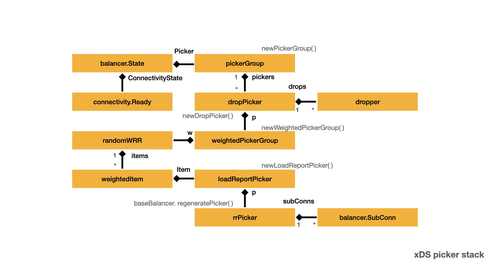

# xDS pick

- [Pick a connection](#pick-a-connection)

Through the discussion from [xDS protocol - LDS/RDS](lds.md) and [xDS protocol - CDS/EDS](cds.md), we have connected with the upstream server. There is a key question need to answer: For each RPC request which connection will be used ? Who decide it?

During the discussion, you can refer to [xDS wrappers](wrappers.md#xds-wrappers) to find the invocation target.

## Prepare config selector

## Initialize config selector

## Pick a connection

During [Send request](request.md), the request need a stream. In [Pick stream transport](request.md#pick-stream-transport) section,

- `newClientStream` calls `cc.safeConfigSelector.SelectConfig()` to prepare for the `rpcConfig`.
- `newClientStream` calls `cs.newAttemptLocked()` to create the `csAttempt`,
- `cs.newAttemptLocked()` will eventualy calls `pickerWrapper.pick()` to pick the connection.


- `ClientConn.updateResolverState()` calls
- `ClientConn.applyServiceConfigAndBalancer()` calls
- `cc.safeConfigSelector.UpdateConfigSelector()`

```go
func newClientStream(ctx context.Context, desc *StreamDesc, cc *ClientConn, method string, opts ...CallOption) (_ ClientStream, err error) {
    if channelz.IsOn() {
        cc.incrCallsStarted()
        defer func() {
            if err != nil {
                cc.incrCallsFailed()
            }
        }()
    }
    // Provide an opportunity for the first RPC to see the first service config
    // provided by the resolver.
    if err := cc.waitForResolvedAddrs(ctx); err != nil {
        return nil, err
    }

    var mc serviceconfig.MethodConfig
    var onCommit func()
    var newStream = func(ctx context.Context, done func()) (iresolver.ClientStream, error) {
        return newClientStreamWithParams(ctx, desc, cc, method, mc, onCommit, done, opts...)
    }

    rpcInfo := iresolver.RPCInfo{Context: ctx, Method: method}
    rpcConfig, err := cc.safeConfigSelector.SelectConfig(rpcInfo)
    if err != nil {
        return nil, toRPCErr(err)
    }

    if rpcConfig != nil {
        if rpcConfig.Context != nil {
            ctx = rpcConfig.Context
        }
        mc = rpcConfig.MethodConfig
        onCommit = rpcConfig.OnCommitted
        if rpcConfig.Interceptor != nil {
            rpcInfo.Context = nil
            ns := newStream
            newStream = func(ctx context.Context, done func()) (iresolver.ClientStream, error) {
                cs, err := rpcConfig.Interceptor.NewStream(ctx, rpcInfo, done, ns)
                if err != nil {
                    return nil, toRPCErr(err)
                }
                return cs, nil
            }
        }
    }

    return newStream(ctx, func() {})
}

```

Before send RPC request, [Pick stream transport](request.md#pick-stream-transport) uses `pickerWrapper.pick` to pick up one connection. Let's assume the connection to upstream server is ready pick up. See [Connect endpoint](conn2.md#connect-endpoint) for detail.

Now, combine the previous [Update sub-connection state](#update-sub-connection-state) and [Update state](#update-state). We get a xDS picker stack.



- Yellow box represents important type and main field, "::" represents the field name.
- Blue line represents the most important relationship between two types.
- `1   *` represents one to many relationship.
- Red line highlights path of `ClientConn`.
- Black line and text represents the significant relationship between tow types.
