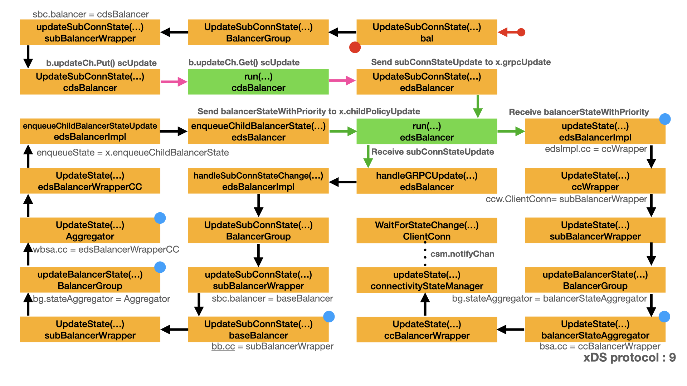

# xDS picker

- [Update sub-connection state](#update-sub-connection-state)
- [Update state](#update-state)
- [Pick connection](#pick-connection)

Through the discussion from [xDS protocol - LDS/RDS](lds.md) and [xDS protocol - CDS/EDS](cds.md), we have connected with the upstream server. There is a key question to answer: For each RPC request which connection will be used ? Who decide it?

There are three phases:

- `UpdateSubConnState()` is called by gRPC when the state of a `SubConn` changes.  
- `UpdateState()` notifies gRPC that the balancer's internal state has
- `Pick()` returns the connection to use for this RPC and related information.

Before send RPC request, [Pick stream transport](request.md#pick-stream-transport) uses `pickerWrapper.pick` to pick up one connection. Let's assume the connection to upstream server is ready pick up. See [Connect endpoint](conn2.md#connect-endpoint) for detail.

During the discussion, you can refer to [xDS wrappers](wrappers.md#xds-wrappers) to find the invocation target.

## Update sub-connection state


- `ccBalancerWrapper.watcher()` receives the `scStateUpdate` message.
- `watcher()` calls `ccb.balancer.UpdateSubConnState()` and passes the `SubConn` and `SubConnState`.

```go
// watcher balancer functions sequentially, so the balancer can be implemented
// lock-free.
func (ccb *ccBalancerWrapper) watcher() {
    for {
        select {
        case t := <-ccb.scBuffer.Get():
            ccb.scBuffer.Load()
            if ccb.done.HasFired() {
                break
            }
            ccb.balancerMu.Lock()
            su := t.(*scStateUpdate)
            ccb.balancer.UpdateSubConnState(su.sc, balancer.SubConnState{ConnectivityState: su.state, ConnectionError: su.err})
            ccb.balancerMu.Unlock()
        case <-ccb.done.Done():
        }

+-- 12 lines: if ccb.done.HasFired() {················································································································
    }
}

// scStateUpdate contains the subConn and the new state it changed to.
type scStateUpdate struct {
    sc    balancer.SubConn
    state connectivity.State
    err   error
}

// SubConnState describes the state of a SubConn.
type SubConnState struct {
    // ConnectivityState is the connectivity state of the SubConn.
    ConnectivityState connectivity.State
    // ConnectionError is set if the ConnectivityState is TransientFailure,
    // describing the reason the SubConn failed.  Otherwise, it is nil.
    ConnectionError error
}

// State indicates the state of connectivity.
// It can be the state of a ClientConn or SubConn.
type State int

+-- 17 lines: func (s State) String() string {···········································································································

const (
    // Idle indicates the ClientConn is idle.
    Idle State = iota
    // Connecting indicates the ClientConn is connecting.
    Connecting
    // Ready indicates the ClientConn is ready for work.
    Ready
    // TransientFailure indicates the ClientConn has seen a failure but expects to recover.
    TransientFailure
    // Shutdown indicates the ClientConn has started shutting down.
    Shutdown
)
```



- `bal.UpdateSubConnState()` calls `b.bg.UpdateSubConnState()` and forwards `SubConn` and `SubConnState`.
- `BalancerGroup.UpdateSubConnState()` calls `config.updateSubConnState()` and forwards `SubConn` and `SubConnState`.
- `subBalancerWrapper.updateSubConnState()` calls `b.UpdateSubConnState()` and forwards `SubConn` and `SubConnState`.  
- `cdsBalancer.UpdateSubConnState()` wraps `SubConn` and `SubConnState` into `scUpdate` and sends it to `cdsBalancer.run()`.

```go
// UpdateSubConnState handles subConn updates from gRPC.
func (b *cdsBalancer) UpdateSubConnState(sc balancer.SubConn, state balancer.SubConnState) {
    if b.closed.HasFired() {
        b.logger.Warningf("xds: received subConn update {%v, %v} after cdsBalancer was closed", sc, state)
        return
    }
    b.updateCh.Put(&scUpdate{subConn: sc, state: state})
}

// scUpdate wraps a subConn update received from gRPC. This is directly passed
// on to the edsBalancer.
type scUpdate struct {
    subConn balancer.SubConn
    state   balancer.SubConnState
}
```

- `cdsBalancer.run()` receives `scUpdate`, splits it into `SubConn` and `SubConnState` and calls `b.edsLB.UpdateSubConnState()`
- `edsBalancer.UpdateSubConnState()` sends `SubConn` and `SubConnState` to `edsBalancer.run()`.
  - Combines `SubConn` and `SubConnState` into `subConnStateUpdate`.

```go
type subConnStateUpdate struct {
    sc    balancer.SubConn
    state balancer.SubConnState
}

func (x *edsBalancer) UpdateSubConnState(sc balancer.SubConn, state balancer.SubConnState) {
    update := &subConnStateUpdate{
        sc:    sc,
        state: state,
    }
    select {
    case x.grpcUpdate <- update:
    case <-x.closed.Done():
    }
}
```

- `edsBalancer.run()` receives the `subConnStateUpdate` and calls `edsBalancer.handleGRPCUpdate()`.
- `edsBalancer.handleGRPCUpdate()` calls `x.edsImpl.handleSubConnStateChange()` and splits the message into `SubConn` and `connectivity.State`.
- `edsBalancerImpl.handleSubConnStateChange()` calls `bg.UpdateSubConnState()` with `SubConn` and `SubConnState` as parameters.
- `BalancerGroup.UpdateSubConnState()` calls `config.updateSubConnState()` with `SubConn` and `SubConnState` as parameters.
  - `UpdateSubConnState()` finds the `subBalancerWrapper` based on the `SubConn` parameter, and calls `updateSubConnState()`.
  - `UpdateSubConnState()` deletes sub-connection from the map when state changed to Shutdown.

```go
// Following are actions from the parent grpc.ClientConn, forward to sub-balancers.

// UpdateSubConnState handles the state for the subconn. It finds the
// corresponding balancer and forwards the update.
func (bg *BalancerGroup) UpdateSubConnState(sc balancer.SubConn, state balancer.SubConnState) {
    bg.incomingMu.Lock()
    config, ok := bg.scToSubBalancer[sc]
    if !ok {
        bg.incomingMu.Unlock()
        return
    }
    if state.ConnectivityState == connectivity.Shutdown {
        // Only delete sc from the map when state changed to Shutdown.
        delete(bg.scToSubBalancer, sc)
    }
    bg.incomingMu.Unlock()

    bg.outgoingMu.Lock()
    config.updateSubConnState(sc, state)
    bg.outgoingMu.Unlock()
}
```

- `subBalancerWrapper.updateSubConnState()` calls `b.UpdateSubConnState()` with `SubConn` and `SubConnState` as parameters.

```go
// UpdateState overrides balancer.ClientConn, to keep state and picker.
func (sbc *subBalancerWrapper) UpdateState(state balancer.State) {
    sbc.mu.Lock()
    sbc.state = state
    sbc.group.updateBalancerState(sbc.id, state)
    sbc.mu.Unlock()
}
```

`baseBalancer.UpdateSubConnState()` calls `b.regeneratePicker()` first.

- `regeneratePicker()` filters out all ready sub-connections.
- `regeneratePicker()` calls `b.pickerBuilder.Build()` to generates a picker.
- From [xDS wrappers](wrappers.md#xds-wrappers), we know `b.pickerBuilder` is `rrPickerBuilder`.
- `Build()` generates a `rrPicker`, which contains all read state sub-connection.
- `regeneratePicker()` assigns the `rrPicker` to `b.picker`.
- `rrPicker.Pick()` uses round-robin policy to decide which sub-connection is picked.

`baseBalancer.UpdateSubConnState()` calls `b.cc.UpdateState()` in the last step.

- Note the `SubConn` and `SubConnState` parameters is transformed into `balancer.State`.
- `balancer.State` contains only `ConnectivityState` and `Picker`.

`baseBalancer.UpdateSubConnState()` finishes the `UpdateSubConnState()` phase and starts the `UpdateState()` phase.

```go
func (b *baseBalancer) UpdateSubConnState(sc balancer.SubConn, state balancer.SubConnState) {
    s := state.ConnectivityState
    if logger.V(2) {
        logger.Infof("base.baseBalancer: handle SubConn state change: %p, %v", sc, s)
    }
    oldS, ok := b.scStates[sc]
    if !ok {
        if logger.V(2) {
            logger.Infof("base.baseBalancer: got state changes for an unknown SubConn: %p, %v", sc, s)
        }
        return
    }
    if oldS == connectivity.TransientFailure && s == connectivity.Connecting {
        // Once a subconn enters TRANSIENT_FAILURE, ignore subsequent
        // CONNECTING transitions to prevent the aggregated state from being
        // always CONNECTING when many backends exist but are all down.
        return
    }
    b.scStates[sc] = s
    switch s {
    case connectivity.Idle:
        sc.Connect()
    case connectivity.Shutdown:
        // When an address was removed by resolver, b called RemoveSubConn but
        // kept the sc's state in scStates. Remove state for this sc here.
        delete(b.scStates, sc)
    case connectivity.TransientFailure:
        // Save error to be reported via picker.
        b.connErr = state.ConnectionError
    }

    b.state = b.csEvltr.RecordTransition(oldS, s)

    // Regenerate picker when one of the following happens:
    //  - this sc entered or left ready
    //  - the aggregated state of balancer is TransientFailure
    //    (may need to update error message)
    if (s == connectivity.Ready) != (oldS == connectivity.Ready) ||
        b.state == connectivity.TransientFailure {
        b.regeneratePicker()
    }

    b.cc.UpdateState(balancer.State{ConnectivityState: b.state, Picker: b.picker})
}

// regeneratePicker takes a snapshot of the balancer, and generates a picker
// from it. The picker is
//  - errPicker if the balancer is in TransientFailure,
//  - built by the pickerBuilder with all READY SubConns otherwise.
func (b *baseBalancer) regeneratePicker() {
    if b.state == connectivity.TransientFailure {
        b.picker = NewErrPicker(b.mergeErrors())
        return
    }
    readySCs := make(map[balancer.SubConn]SubConnInfo)

    // Filter out all ready SCs from full subConn map.
    for addr, scInfo := range b.subConns {
        if st, ok := b.scStates[scInfo.subConn]; ok && st == connectivity.Ready {
            addr.Attributes = scInfo.attrs
            readySCs[scInfo.subConn] = SubConnInfo{Address: addr}
        }
    }
    b.picker = b.pickerBuilder.Build(PickerBuildInfo{ReadySCs: readySCs})
}

// PickerBuildInfo contains information needed by the picker builder to
// construct a picker.
type PickerBuildInfo struct {
    // ReadySCs is a map from all ready SubConns to the Addresses used to
    // create them.
    ReadySCs map[balancer.SubConn]SubConnInfo
}

// SubConnInfo contains information about a SubConn created by the base
// balancer.
type SubConnInfo struct {
    Address resolver.Address // the address used to create this SubConn
}

// PickerBuilder creates balancer.Picker.
type PickerBuilder interface {
    // Build returns a picker that will be used by gRPC to pick a SubConn.
    Build(info PickerBuildInfo) balancer.Picker
}

type rrPickerBuilder struct{}

func (*rrPickerBuilder) Build(info base.PickerBuildInfo) balancer.Picker {
    logger.Infof("roundrobinPicker: newPicker called with info: %v", info)
    if len(info.ReadySCs) == 0 {
        return base.NewErrPicker(balancer.ErrNoSubConnAvailable)
    }
    var scs []balancer.SubConn
    for sc := range info.ReadySCs {
        scs = append(scs, sc)
    }
    return &rrPicker{
        subConns: scs,
        // Start at a random index, as the same RR balancer rebuilds a new
        // picker when SubConn states change, and we don't want to apply excess
        // load to the first server in the list.
        next: grpcrand.Intn(len(scs)),
    }
}

type rrPicker struct {
    // subConns is the snapshot of the roundrobin balancer when this picker was
    // created. The slice is immutable. Each Get() will do a round robin
    // selection from it and return the selected SubConn.
    subConns []balancer.SubConn

    mu   sync.Mutex
    next int
}

func (p *rrPicker) Pick(balancer.PickInfo) (balancer.PickResult, error) {
    p.mu.Lock()
    sc := p.subConns[p.next]
    p.next = (p.next + 1) % len(p.subConns)
    p.mu.Unlock()
    return balancer.PickResult{SubConn: sc}, nil
}

// State contains the balancer's state relevant to the gRPC ClientConn.
type State struct {
    // State contains the connectivity state of the balancer, which is used to
    // determine the state of the ClientConn.
    ConnectivityState connectivity.State
    // Picker is used to choose connections (SubConns) for RPCs.
    Picker Picker
}

```

## Update state

`subBalancerWrapper.UpdateState()` calls `sbc.group.updateBalancerState()`, besides `balancer.State` parameter, it adds `sbc.id` as parameter.

```go
// UpdateState overrides balancer.ClientConn, to keep state and picker.
func (sbc *subBalancerWrapper) UpdateState(state balancer.State) {
    sbc.mu.Lock()
    sbc.state = state
    sbc.group.updateBalancerState(sbc.id, state)
    sbc.mu.Unlock()
}
```

`updateBalancerState()` wraps the picker to do load reporting if `loadStore` was set.

- `newLoadReportPicker()` generates `loadReportPicker`.
- `loadReportPicker.Pick()` calls `lrp.p.Pick()` to let the original `picker` does the job.
- `loadReportPicker.Pick()` perform load reporting job for this RPC. We will not discuss load reporting in this article.

`updateBalancerState()` calls `bg.stateAggregator.UpdateState()` to send new state to the `aggregator`.

```go
// updateBalancerState: forward the new state to balancer state aggregator. The
// aggregator will create an aggregated picker and an aggregated connectivity
// state, then forward to ClientConn.
func (bg *BalancerGroup) updateBalancerState(id string, state balancer.State) {
    bg.logger.Infof("Balancer state update from locality %v, new state: %+v", id, state)
    if bg.loadStore != nil {
        // Only wrap the picker to do load reporting if loadStore was set.
        state.Picker = newLoadReportPicker(state.Picker, id, bg.loadStore)
    }

    // Send new state to the aggregator, without holding the incomingMu.
    // incomingMu is to protect all calls to the parent ClientConn, this update
    // doesn't necessary trigger a call to ClientConn, and should already be
    // protected by aggregator's mutex if necessary.
    if bg.stateAggregator != nil {
        bg.stateAggregator.UpdateState(id, state)
    }
}

type loadReportPicker struct {
    p balancer.Picker

    locality  string
    loadStore load.PerClusterReporter
}

func newLoadReportPicker(p balancer.Picker, id string, loadStore load.PerClusterReporter) *loadReportPicker {
    return &loadReportPicker{
        p:         p,
        locality:  id,
        loadStore: loadStore,
    }
}

func (lrp *loadReportPicker) Pick(info balancer.PickInfo) (balancer.PickResult, error) {
    res, err := lrp.p.Pick(info)
    if err != nil {
        return res, err
    }

    lrp.loadStore.CallStarted(lrp.locality)
    oldDone := res.Done
    res.Done = func(info balancer.DoneInfo) {
        if oldDone != nil {
            oldDone(info)
        }
        lrp.loadStore.CallFinished(lrp.locality, info.Err)

        load, ok := info.ServerLoad.(*orcapb.OrcaLoadReport)
        if !ok {
            return
        }
        lrp.loadStore.CallServerLoad(lrp.locality, serverLoadCPUName, load.CpuUtilization)
        lrp.loadStore.CallServerLoad(lrp.locality, serverLoadMemoryName, load.MemUtilization)
        for n, d := range load.RequestCost {
            lrp.loadStore.CallServerLoad(lrp.locality, n, d)
        }
        for n, d := range load.Utilization {
            lrp.loadStore.CallServerLoad(lrp.locality, n, d)
        }
    }
    return res, err
}
```

- `Aggregator.UpdateState()` first updates the state in `wbsa.idToPickerState[id]`.
- `Aggregator.UpdateState()` calls `wbsa.build()` to update the `aggregator` state.
  - `wbsa.build()` iterates `wbsa.idToPickerState` to set `aggregatedState`.
  - `wbsa.build()` sets `picker` based on `aggregatedState`.
  - For `connectivity.Ready`, `wbsa.build()` calls `newWeightedPickerGroup()` to set the `picker`.
  - `wbsa.build()` generates `balancer.State` based on `aggregatedState` and `picker`.
- `Aggregator.UpdateState()` calls `wbsa.cc.UpdateState()` to propagate the state to next level.

Note the single sub-connection state is transformed into aggregated state after `Aggregator.UpdateState()`.

```go
// UpdateState is called to report a balancer state change from sub-balancer.
// It's usually called by the balancer group.
//
// It calls parent ClientConn's UpdateState with the new aggregated state.
func (wbsa *Aggregator) UpdateState(id string, newState balancer.State) {
    wbsa.mu.Lock()
    defer wbsa.mu.Unlock()
    oldState, ok := wbsa.idToPickerState[id]
    if !ok {
        // All state starts with an entry in pickStateMap. If ID is not in map,
        // it's either removed, or never existed.
        return
    }
    if !(oldState.state.ConnectivityState == connectivity.TransientFailure && newState.ConnectivityState == connectivity.Connecting) {
        // If old state is TransientFailure, and new state is Connecting, don't
        // update the state, to prevent the aggregated state from being always
        // CONNECTING. Otherwise, stateToAggregate is the same as
        // state.ConnectivityState.
        oldState.stateToAggregate = newState.ConnectivityState
    }
    oldState.state = newState

    if !wbsa.started {
        return
    }
    wbsa.cc.UpdateState(wbsa.build())
}

// build combines sub-states into one.
//
// Caller must hold wbsa.mu.
func (wbsa *Aggregator) build() balancer.State {
    wbsa.logger.Infof("Child pickers with config: %+v", wbsa.idToPickerState)
    m := wbsa.idToPickerState
    var readyN, connectingN int
    readyPickerWithWeights := make([]weightedPickerState, 0, len(m))
    for _, ps := range m {
        switch ps.stateToAggregate {
        case connectivity.Ready:
            readyN++
            readyPickerWithWeights = append(readyPickerWithWeights, *ps)
        case connectivity.Connecting:
            connectingN++
        }
    }
    var aggregatedState connectivity.State
    switch {
    case readyN > 0:
        aggregatedState = connectivity.Ready
    case connectingN > 0:
        aggregatedState = connectivity.Connecting
    default:
        aggregatedState = connectivity.TransientFailure
    }

    // Make sure picker's return error is consistent with the aggregatedState.
    var picker balancer.Picker
    switch aggregatedState {
    case connectivity.TransientFailure:
        picker = base.NewErrPicker(balancer.ErrTransientFailure)
    case connectivity.Connecting:
        picker = base.NewErrPicker(balancer.ErrNoSubConnAvailable)
    default:
        picker = newWeightedPickerGroup(readyPickerWithWeights, wbsa.newWRR)
    }
    return balancer.State{ConnectivityState: aggregatedState, Picker: picker}
}
```

- The `newWRR` parameter of `newWeightedPickerGroup()` is `wbsa.newWRR` field.
- `newWeightedPickerGroup()` creates a `weightedPickerGroup`.
- `weightedPickerGroup.Pick()` uses weighted round robin algorithm to return the pick result.

```go
type weightedPickerGroup struct {
    w wrr.WRR
}

// newWeightedPickerGroup takes pickers with weights, and groups them into one
// picker.
//
// Note it only takes ready pickers. The map shouldn't contain non-ready
// pickers.
func newWeightedPickerGroup(readyWeightedPickers []weightedPickerState, newWRR func() wrr.WRR) *weightedPickerGroup {
    w := newWRR()
    for _, ps := range readyWeightedPickers {
        w.Add(ps.state.Picker, int64(ps.weight))
    }

    return &weightedPickerGroup{
        w: w,
    }
}

func (pg *weightedPickerGroup) Pick(info balancer.PickInfo) (balancer.PickResult, error) {
    p, ok := pg.w.Next().(balancer.Picker)
    if !ok {
        return balancer.PickResult{}, balancer.ErrNoSubConnAvailable
    }
    return p.Pick(info)
}
```

- `wbsa.newWRR` is initialized in `New()`.
- `New()` is called in `edsBalancerImpl.handleEDSResponse()` with `newRandomWRR` as parameter.
- `newRandomWRR` is `wrr.NewRandom`.
- Which means `wbsa.newWRR` is actually `wrr.NewRandom`.
- `wrr.NewRandom()` generates `randomWRR`.
- `randomWRR` implements `WRR` interface.

```go
func New(cc balancer.ClientConn, logger *grpclog.PrefixLogger, newWRR func() wrr.WRR) *Aggregator {
    return &Aggregator{
        cc:              cc,
        logger:          logger,
        newWRR:          newWRR,
        idToPickerState: make(map[string]*weightedPickerState),
    }
}
func (edsImpl *edsBalancerImpl) handleEDSResponse(edsResp xdsclient.EndpointsUpdate) {
+-- 45 lines: TODO: Unhandled fields from EDS response:··································································································
    for priority, newLocalities := range newLocalitiesWithPriority {
        if !priorityLowest.isSet() || priorityLowest.higherThan(priority) {
            priorityLowest = priority
        }

        bgwc, ok := edsImpl.priorityToLocalities[priority]
        if !ok {
+--  4 lines: Create balancer group if it's never created (this is the first·············································································
            ccPriorityWrapper := edsImpl.ccWrapperWithPriority(priority)
            stateAggregator := weightedaggregator.New(ccPriorityWrapper, edsImpl.logger, newRandomWRR)
            bgwc = &balancerGroupWithConfig{
                bg:              balancergroup.New(ccPriorityWrapper, edsImpl.buildOpts, stateAggregator, edsImpl.loadReporter, edsImpl.logger),
                stateAggregator: stateAggregator,
                configs:         make(map[internal.LocalityID]*localityConfig),
            }
            edsImpl.priorityToLocalities[priority] = bgwc
            priorityChanged = true
            edsImpl.logger.Infof("New priority %v added", priority)
        }
        edsImpl.handleEDSResponsePerPriority(bgwc, newLocalities)
    }
+-- 20 lines: edsImpl.priorityLowest = priorityLowest····································································································
}

var newRandomWRR = wrr.NewRandom

// randomWRR is a struct that contains weighted items implement weighted random algorithm.
type randomWRR struct {
    mu           sync.RWMutex
    items        []*weightedItem
    sumOfWeights int64
}

// NewRandom creates a new WRR with random.
func NewRandom() WRR {
    return &randomWRR{}
}

var grpcrandInt63n = grpcrand.Int63n

func (rw *randomWRR) Next() (item interface{}) {
    rw.mu.RLock()
    defer rw.mu.RUnlock()
    if rw.sumOfWeights == 0 {
        return nil
    }
    // Random number in [0, sum).
    randomWeight := grpcrandInt63n(rw.sumOfWeights)
    for _, item := range rw.items {
        randomWeight = randomWeight - item.Weight
        if randomWeight < 0 {
            return item.Item
        }
    }

    return rw.items[len(rw.items)-1].Item
}

func (rw *randomWRR) Add(item interface{}, weight int64) {
    rw.mu.Lock()
    defer rw.mu.Unlock()
    rItem := &weightedItem{Item: item, Weight: weight}
    rw.items = append(rw.items, rItem)
    rw.sumOfWeights += weight
}

// WRR defines an interface that implements weighted round robin.
type WRR interface {
    // Add adds an item with weight to the WRR set.
    //
    // Add and Next need to be thread safe.
    Add(item interface{}, weight int64)
    // Next returns the next picked item.
    //
    // Add and Next need to be thread safe.
    Next() interface{}
}
```

Let's continue the discussion of `Aggregator.UpdateState()`. `Aggregator.UpdateState()` calls `wbsa.cc.UpdateState()`.

`edsBalancerWrapperCC.UpdateState()` calls `ebwcc.parent.enqueueChildBalancerStateUpdate()` and adds `ebwcc.priority` parameter besides `state` parameter

```go
func (ebwcc *edsBalancerWrapperCC) UpdateState(state balancer.State) {
    ebwcc.parent.enqueueChildBalancerStateUpdate(ebwcc.priority, state)
}

```

`ebwcc.parent.enqueueChildBalancerStateUpdate()` is initialized in `newEDSBalancerImpl()`.

```go
func newEDSBalancerImpl(cc balancer.ClientConn, bOpts balancer.BuildOptions, enqueueState func(priorityType, balancer.State), lr load.PerClusterReporter, logger *grpclog.PrefixLogger) *edsBalancerImpl {
    edsImpl := &edsBalancerImpl{
        cc:                 cc,
        buildOpts:          bOpts,
        logger:             logger,
        subBalancerBuilder: balancer.Get(roundrobin.Name),
        loadReporter:       lr,

        enqueueChildBalancerStateUpdate: enqueueState,

        priorityToLocalities:   make(map[priorityType]*balancerGroupWithConfig),
        priorityToState:        make(map[priorityType]*balancer.State),
        subConnToPriority:      make(map[balancer.SubConn]priorityType),
        serviceRequestCountMax: defaultServiceRequestCountMax,
    }
+--  4 lines: Don't start balancer group here. Start it when handling the first EDS··········································································
    return edsImpl
}
```

`enqueueState` parameter is initialized in `newEDSBalancer`.

```go
var (
    newEDSBalancer = func(cc balancer.ClientConn, opts balancer.BuildOptions, enqueueState func(priorityType, balancer.State), lw load.PerClusterReporter, logger *grpclog.PrefixLogger) edsBalancerImplInterface {
        return newEDSBalancerImpl(cc, opts, enqueueState, lw, logger)
    }
    newXDSClient = func() (xdsClientInterface, error) { return xdsclient.New() }
)
```

`enqueueState` parameter is initialized by `x.enqueueChildBalancerState` which is `edsBalancer.enqueueChildBalancerState`.

This means `ebwcc.parent.enqueueChildBalancerStateUpdate` is `edsBalancer.enqueueChildBalancerState`.

```go
// Build helps implement the balancer.Builder interface.
func (b *edsBalancerBuilder) Build(cc balancer.ClientConn, opts balancer.BuildOptions) balancer.Balancer {
    x := &edsBalancer{
        cc:                cc,
        closed:            grpcsync.NewEvent(),
        grpcUpdate:        make(chan interface{}),
        xdsClientUpdate:   make(chan *edsUpdate),
        childPolicyUpdate: buffer.NewUnbounded(),
        lsw:               &loadStoreWrapper{},
        config:            &EDSConfig{},
    }
    x.logger = prefixLogger(x)

    client, err := newXDSClient()
    if err != nil {
        x.logger.Errorf("xds: failed to create xds-client: %v", err)
        return nil
    }

    x.xdsClient = client
    x.edsImpl = newEDSBalancer(x.cc, opts, x.enqueueChildBalancerState, x.lsw, x.logger)
    x.logger.Infof("Created")
    go x.run()
    return x
}

func (x *edsBalancer) enqueueChildBalancerState(p priorityType, s balancer.State) {
    x.childPolicyUpdate.Put(&balancerStateWithPriority{
        priority: p,
        s:        s,
    })
}
```

`edsBalancer.enqueueChildBalancerState()` sends `balancerStateWithPriority`, which contains `priorityType` and `balancer.State`, to channel `x.childPolicyUpdate`.

```go
func (x *edsBalancer) enqueueChildBalancerState(p priorityType, s balancer.State) {
    x.childPolicyUpdate.Put(&balancerStateWithPriority{
        priority: p,
        s:        s,
    })
}
```

Upon receives `balancerStateWithPriority` from channel `x.childPolicyUpdate.Get()`, `edsBalancer.run()` calls `x.edsImpl.updateState()` to forward `priorityType` and `balancer.State`.

```go
// run gets executed in a goroutine once edsBalancer is created. It monitors
// updates from grpc, xdsClient and load balancer. It synchronizes the
// operations that happen inside edsBalancer. It exits when edsBalancer is
// closed.
func (x *edsBalancer) run() {
    for {
        select {
        case update := <-x.grpcUpdate:
            x.handleGRPCUpdate(update)
        case update := <-x.xdsClientUpdate:
            x.handleXDSClientUpdate(update)
        case update := <-x.childPolicyUpdate.Get():
            x.childPolicyUpdate.Load()
            u := update.(*balancerStateWithPriority)
            x.edsImpl.updateState(u.priority, u.s)
        case <-x.closed.Done():
            x.cancelWatch()
            x.xdsClient.Close()
            x.edsImpl.close()
            return
        }
    }
}
```

`edsBalancerImpl.updateState()` calls `edsImpl.handlePriorityWithNewState()` to start/close priorities based on the connectivity state. It returns whether the state should be forwarded to parent `ClientConn`. If `edsImpl.handlePriorityWithNewState()` returns true, `edsBalancerImpl.updateState()` forwards the state to `edsImpl.cc`.

- `edsImpl.handlePriorityWithNewState()` updates `edsImpl.priorityToState[priority]`.
- For `connectivity.Ready`, `edsImpl.handlePriorityWithNewState()` calls `edsImpl.handlePriorityWithNewStateReady()`.
- `edsImpl.handlePriorityWithNewStateReady()` handles state Ready and decides whether to forward update or not.

`edsBalancerImpl.updateState()` calls `newDropPicker()` to generates a `dropPicker`.

- `dropPicker` wraps the original `picker`.
- `dropPicker.Pick()` add drop connection functionality to the `picker`.
- Here we will not go deeper into drop.

`edsBalancerImpl.updateState()` calls `edsImpl.cc.UpdateState()` to forward the state and new drop picker to parent `ClientConn`.

```go
// updateState first handles priority, and then wraps picker in a drop picker
// before forwarding the update.
func (edsImpl *edsBalancerImpl) updateState(priority priorityType, s balancer.State) {
    _, ok := edsImpl.priorityToLocalities[priority]
    if !ok {
        edsImpl.logger.Infof("eds: received picker update from unknown priority")
        return
    }

    if edsImpl.handlePriorityWithNewState(priority, s) {
        edsImpl.pickerMu.Lock()
        defer edsImpl.pickerMu.Unlock()
        edsImpl.innerState = s
        // Don't reset drops when it's a state change.
        edsImpl.cc.UpdateState(balancer.State{ConnectivityState: s.ConnectivityState, Picker: newDropPicker(s.Picker, edsImpl.drops, edsImpl.loadReporter, edsImpl.serviceRequestsCounter, edsImpl.serviceRequestCountMax)})
    }
}

// handlePriorityWithNewState start/close priorities based on the connectivity
// state. It returns whether the state should be forwarded to parent ClientConn.
func (edsImpl *edsBalancerImpl) handlePriorityWithNewState(priority priorityType, s balancer.State) bool {
    edsImpl.priorityMu.Lock()
    defer edsImpl.priorityMu.Unlock()

    if !edsImpl.priorityInUse.isSet() {
        edsImpl.logger.Infof("eds: received picker update when no priority is in use (EDS returned an empty list)")
        return false
    }

    if edsImpl.priorityInUse.higherThan(priority) {
        // Lower priorities should all be closed, this is an unexpected update.
        edsImpl.logger.Infof("eds: received picker update from priority lower then priorityInUse")
        return false
    }

    bState, ok := edsImpl.priorityToState[priority]
    if !ok {
        bState = &balancer.State{}
        edsImpl.priorityToState[priority] = bState
    }
    oldState := bState.ConnectivityState
    *bState = s

    switch s.ConnectivityState {
    case connectivity.Ready:
        return edsImpl.handlePriorityWithNewStateReady(priority)
    case connectivity.TransientFailure:
        return edsImpl.handlePriorityWithNewStateTransientFailure(priority)
    case connectivity.Connecting:
        return edsImpl.handlePriorityWithNewStateConnecting(priority, oldState)
    default:
        // New state is Idle, should never happen. Don't forward.
        return false
    }
}

// handlePriorityWithNewStateReady handles state Ready and decides whether to
// forward update or not.
//
// An update with state Ready:
// - If it's from higher priority:
//   - Forward the update
//   - Set the priority as priorityInUse
//   - Close all priorities lower than this one
// - If it's from priorityInUse:
//   - Forward and do nothing else
//
// Caller must make sure priorityInUse is not higher than priority.
//
// Caller must hold priorityMu.
func (edsImpl *edsBalancerImpl) handlePriorityWithNewStateReady(priority priorityType) bool {
    // If one priority higher or equal to priorityInUse goes Ready, stop the
    // init timer. If update is from higher than priorityInUse,
    // priorityInUse will be closed, and the init timer will become useless.
    if timer := edsImpl.priorityInitTimer; timer != nil {
        timer.Stop()
        edsImpl.priorityInitTimer = nil
    }

    if edsImpl.priorityInUse.lowerThan(priority) {
        edsImpl.logger.Infof("Switching priority from %v to %v, because latter became Ready", edsImpl.priorityInUse, priority)
        edsImpl.priorityInUse = priority
        for i := priority.nextLower(); !i.lowerThan(edsImpl.priorityLowest); i = i.nextLower() {
            bgwc := edsImpl.priorityToLocalities[i]
            bgwc.stateAggregator.Stop()
            bgwc.bg.Close()
        }
        return true
    }
    return true
}

type dropPicker struct {
    drops     []*dropper
    p         balancer.Picker
    loadStore load.PerClusterReporter
    counter   *client.ServiceRequestsCounter
    countMax  uint32
}

func newDropPicker(p balancer.Picker, drops []*dropper, loadStore load.PerClusterReporter, counter *client.ServiceRequestsCounter, countMax uint32) *dropPicker {
    return &dropPicker{
        drops:     drops,
        p:         p,
        loadStore: loadStore,
        counter:   counter,
        countMax:  countMax,
    }
}

func (d *dropPicker) Pick(info balancer.PickInfo) (balancer.PickResult, error) {
    var (
        drop     bool
        category string
    )
    for _, dp := range d.drops {
        if dp.drop() {
            drop = true
            category = dp.c.Category
            break
        }
    }
    if drop {
        if d.loadStore != nil {
            d.loadStore.CallDropped(category)
        }
        return balancer.PickResult{}, status.Errorf(codes.Unavailable, "RPC is dropped")
    }
    if d.counter != nil {
        if err := d.counter.StartRequest(d.countMax); err != nil {
            // Drops by circuit breaking are reported with empty category. They
            // will be reported only in total drops, but not in per category.
            if d.loadStore != nil {
                d.loadStore.CallDropped("")
            }
            return balancer.PickResult{}, status.Errorf(codes.Unavailable, err.Error())
        }
        pr, err := d.p.Pick(info)
        if err != nil {
            d.counter.EndRequest()
            return pr, err
        }
        oldDone := pr.Done
        pr.Done = func(doneInfo balancer.DoneInfo) {
            d.counter.EndRequest()
            if oldDone != nil {
                oldDone(doneInfo)
            }
        }
        return pr, err
    }
    // TODO: (eds) don't drop unless the inner picker is READY. Similar to
    // https://github.com/grpc/grpc-go/issues/2622.
    return d.p.Pick(info)
}
```

`ccWrapper.UpdateState()` calls `newLoadReportPicker()` to wrap the `Picker` with `loadReportPicker`.

- `loadReportPicker.Pick()` adds load report action besides the original pick action.

`ccWrapper.UpdateState()` calls `ccw.ClientConn.UpdateState()` to forward the state to upper level.

```go
func (ccw *ccWrapper) UpdateState(s balancer.State) {
    s.Picker = newLoadReportPicker(s.Picker, ccw.localityIDJSON, ccw.loadStore)
    ccw.ClientConn.UpdateState(s)
}

// loadReporter wraps the methods from the loadStore that are used here.
type loadReporter interface {
    CallStarted(locality string)
    CallFinished(locality string, err error)
    CallServerLoad(locality, name string, val float64)
}

type loadReportPicker struct {
    p balancer.Picker

    locality  string
    loadStore loadReporter
}

func newLoadReportPicker(p balancer.Picker, id string, loadStore loadReporter) *loadReportPicker {
    return &loadReportPicker{
        p:         p,
        locality:  id,
        loadStore: loadStore,
    }
}

func (lrp *loadReportPicker) Pick(info balancer.PickInfo) (balancer.PickResult, error) {
    res, err := lrp.p.Pick(info)
    if err != nil {
        return res, err
    }

    if lrp.loadStore == nil {
        return res, err
    }

    lrp.loadStore.CallStarted(lrp.locality)
    oldDone := res.Done
    res.Done = func(info balancer.DoneInfo) {
        if oldDone != nil {
            oldDone(info)
        }
        lrp.loadStore.CallFinished(lrp.locality, info.Err)

        load, ok := info.ServerLoad.(*orcapb.OrcaLoadReport)
        if !ok {
            return
        }
        lrp.loadStore.CallServerLoad(lrp.locality, serverLoadCPUName, load.CpuUtilization)
        lrp.loadStore.CallServerLoad(lrp.locality, serverLoadMemoryName, load.MemUtilization)
        for n, d := range load.RequestCost {
            lrp.loadStore.CallServerLoad(lrp.locality, n, d)
        }
        for n, d := range load.Utilization {
            lrp.loadStore.CallServerLoad(lrp.locality, n, d)
        }
    }
    return res, err
}
```

- `subBalancerWrapper.UpdateState()` stores the state in `sbc.state`.
- `subBalancerWrapper.UpdateState()` calls `sbc.group.updateBalancerState()` to forward the state and `sbc.id` to `BalancerGroup`.

```go
// UpdateState overrides balancer.ClientConn, to keep state and picker.
func (sbc *subBalancerWrapper) UpdateState(state balancer.State) {
    sbc.mu.Lock()
    sbc.state = state
    sbc.group.updateBalancerState(sbc.id, state)
    sbc.mu.Unlock()
}
```

`updateBalancerState()` wraps the picker to do load reporting if `loadStore` was set.

- `newLoadReportPicker()` generates `loadReportPicker`.
- `loadReportPicker.Pick()` calls `lrp.p.Pick()` to let the original `picker` does the job.
- `loadReportPicker.Pick()` perform load reporting job for this RPC. We will not discuss load reporting in this article.

`updateBalancerState()` calls `bg.stateAggregator.UpdateState()` to send new state to the `aggregator`.

```go
// updateBalancerState: forward the new state to balancer state aggregator. The
// aggregator will create an aggregated picker and an aggregated connectivity
// state, then forward to ClientConn.
func (bg *BalancerGroup) updateBalancerState(id string, state balancer.State) {
    bg.logger.Infof("Balancer state update from locality %v, new state: %+v", id, state)
    if bg.loadStore != nil {
        // Only wrap the picker to do load reporting if loadStore was set.
        state.Picker = newLoadReportPicker(state.Picker, id, bg.loadStore)
    }

    // Send new state to the aggregator, without holding the incomingMu.
    // incomingMu is to protect all calls to the parent ClientConn, this update
    // doesn't necessary trigger a call to ClientConn, and should already be
    // protected by aggregator's mutex if necessary.
    if bg.stateAggregator != nil {
        bg.stateAggregator.UpdateState(id, state)
    }
}
```

- `balancerStateAggregator.UpdateState()` first updates the state in `bsa.idToPickerState[id]`.
- `balancerStateAggregator.UpdateState()` calls `bsa.build()` to update the state.
  - `bsa.build()` iterates `bsa.idToPickerState` to set `aggregatedState`.
  - `bsa.build()` calls `newPickerGroup()` to set `picker`.
  - `bsa.build()` generates `balancer.State` based on `aggregatedState` and `picker`.
- `balancerStateAggregator.UpdateState()` calls `bsa.cc.UpdateState()` to propagate the state to next level.

```go
// UpdateState is called to report a balancer state change from sub-balancer.
// It's usually called by the balancer group.
//
// It calls parent ClientConn's UpdateState with the new aggregated state.
func (bsa *balancerStateAggregator) UpdateState(id string, state balancer.State) {
    bsa.mu.Lock()
    defer bsa.mu.Unlock()
    pickerSt, ok := bsa.idToPickerState[id]
    if !ok {
        // All state starts with an entry in pickStateMap. If ID is not in map,
        // it's either removed, or never existed.
        return
    }
    if !(pickerSt.state.ConnectivityState == connectivity.TransientFailure && state.ConnectivityState == connectivity.Connecting) {
        // If old state is TransientFailure, and new state is Connecting, don't
        // update the state, to prevent the aggregated state from being always
        // CONNECTING. Otherwise, stateToAggregate is the same as
        // state.ConnectivityState.
        pickerSt.stateToAggregate = state.ConnectivityState
    }
    pickerSt.state = state

    if !bsa.started {
        return
    }
    bsa.cc.UpdateState(bsa.build())
}

// build combines sub-states into one. The picker will do a child pick.
//
// Caller must hold bsa.mu.
func (bsa *balancerStateAggregator) build() balancer.State {
    // TODO: the majority of this function (and UpdateState) is exactly the same
    // as weighted_target's state aggregator. Try to make a general utility
    // function/struct to handle the logic.
    //
    // One option: make a SubBalancerState that handles Update(State), including
    // handling the special connecting after ready, as in UpdateState(). Then a
    // function to calculate the aggregated connectivity state as in this
    // function.
    var readyN, connectingN int
    for _, ps := range bsa.idToPickerState {
        switch ps.stateToAggregate {
        case connectivity.Ready:
            readyN++
        case connectivity.Connecting:
            connectingN++
        }
    }
    var aggregatedState connectivity.State
    switch {
    case readyN > 0:
        aggregatedState = connectivity.Ready
    case connectingN > 0:
        aggregatedState = connectivity.Connecting
    default:
        aggregatedState = connectivity.TransientFailure
    }

    // The picker's return error might not be consistent with the
    // aggregatedState. Because for this LB policy, we want to always build
    // picker with all sub-pickers (not only ready sub-pickers), so even if the
    // overall state is Ready, pick for certain RPCs can behave like Connecting
    // or TransientFailure.
    bsa.logger.Infof("Child pickers: %+v", bsa.idToPickerState)
    return balancer.State{
        ConnectivityState: aggregatedState,
        Picker:            newPickerGroup(bsa.idToPickerState),
    }
}

// pickerGroup contains a list of pickers. If the picker isn't ready, the pick
// will be queued.
type pickerGroup struct {
    pickers map[string]balancer.Picker
}

func newPickerGroup(idToPickerState map[string]*subBalancerState) *pickerGroup {
    pickers := make(map[string]balancer.Picker)
    for id, st := range idToPickerState {
        pickers[id] = st.state.Picker
    }
    return &pickerGroup{
        pickers: pickers,
    }
}

func (pg *pickerGroup) Pick(info balancer.PickInfo) (balancer.PickResult, error) {
    cluster := getPickedCluster(info.Ctx)
    if p := pg.pickers[cluster]; p != nil {
        return p.Pick(info)
    }
    return balancer.PickResult{}, status.Errorf(codes.Unavailable, "unknown cluster selected for RPC: %q", cluster)
}

type clusterKey struct{}

func getPickedCluster(ctx context.Context) string {
    cluster, _ := ctx.Value(clusterKey{}).(string)
    return cluster
}
```

- `ccBalancerWrapper.UpdateState()` calls `ccb.cc.blockingpicker.updatePicker()` to set `s.Picker`.
- `ccBalancerWrapper.UpdateState()` calls `ccb.cc.csMgr.updateState()` to set the `s.ConnectivityState`.

Please refer to [Watch sub-connection update](dial.md#watch-sub-connection-update) for detail description.

```go
func (ccb *ccBalancerWrapper) UpdateState(s balancer.State) {
    ccb.mu.Lock()
    defer ccb.mu.Unlock()
    if ccb.subConns == nil {
        return
    }
    // Update picker before updating state.  Even though the ordering here does
    // not matter, it can lead to multiple calls of Pick in the common start-up
    // case where we wait for ready and then perform an RPC.  If the picker is
    // updated later, we could call the "connecting" picker when the state is
    // updated, and then call the "ready" picker after the picker gets updated.
    ccb.cc.blockingpicker.updatePicker(s.Picker)
    ccb.cc.csMgr.updateState(s.ConnectivityState)
}

// updatePicker is called by UpdateBalancerState. It unblocks all blocked pick.
func (pw *pickerWrapper) updatePicker(p balancer.Picker) {
    pw.mu.Lock()
    if pw.done {
        pw.mu.Unlock()
        return
    }
    pw.picker = p
    // pw.blockingCh should never be nil.
    close(pw.blockingCh)
    pw.blockingCh = make(chan struct{})
    pw.mu.Unlock()
}
```

## Pick connection

