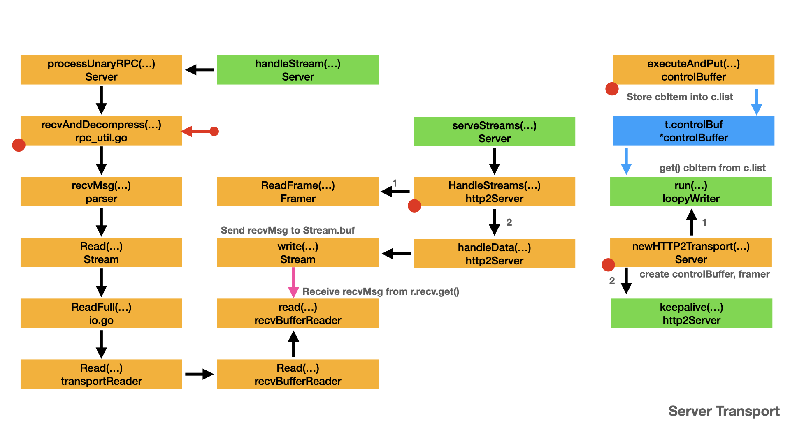

# The transport

- [Client transport](#client-transport)
  - [Client connection](#client-connection)
  - [Client send frames](#client-send-frames)
  - [Client receive frames](#client-receive-frames)
  - [Client receive message](#client-receive-message)
- [Server transport](#server-transport)
  - [Server connection](#server-connection)
  - [Server send frames](#server-send-frames)
  - [Server receive frames](#server-receive-frames)
  - [Server receive message](#server-receive-message)

gRPC hides the transport layer from the other parts. `controlBuffer`, `loopyWriter` and `framer` are important type to help gRPC to hide the transport. Here we will discuss the design of client transport and server transport.

## Client transport

From [Send request](request.md), we know the process of sending RPC request. To better understand the whole process, we need to understand the receive process.

Let's start our discussion from `newHTTP2Client()`.


- Yellow box represents the important type and method/function.
- Green box represents a function run in a dedicated goroutine.
- Blue box represents a placeholder for the specified type.
- Arrow represents the call direction and order.
- Pink arrow represents the channel communication of `Stream.buf`.
- Blue arrow represents the channel communication of `controlBuffer`.
- Right red dot represents there is another diagram for that box.
- Left red dot represents the box is a extension part from other diagram.

### Client connection

`newHTTP2Client()` establishes the connection between client and target server. For cluster cases, each cluster server need a connection. Load balancer will pick up the connection when the RPC is performed.

- `newHTTP2Client()` dials to the target server address. See [Dial process part II](dial.md#dial-process-part-ii) for detail.
- `newHTTP2Client()` calls `newFramer()` to initialize the `t.framer`.
- `newHTTP2Client()` calls `newControlBuffer()` to initialize the `t.controlBuf`
- If `keepaliveEnabled` is true, `newHTTP2Client()` calls `t.keepalive()` to start a goroutine.
- `newHTTP2Client()` calls `t.reader()` to start a goroutine.
- `newHTTP2Client()` calls an anonymous function to start a goroutine, which calls `newLoopyWriter()` to initialize `t.loopy`, then calls `t.loopy.run()`.

Each connection between client and server has a `ClientTransport`, which contains:

- At least two goroutine: one is `t.reader()`, the other is `t.loopy.run()`.
  - `t.reader()` uses `t.framer` to receive frames from server.
  - `t.loopy.run()` uses `t.controlBuf` and `t.framer` to send frames to server.
- One `controlBuffer`, that is `t.controlBuf`, which is the sending buffer.
- One `framer`, that is `t.framer`, which is used to send and receive frames.
- `t.reader()` will keep alive the connection.

```go
// newHTTP2Client constructs a connected ClientTransport to addr based on HTTP2
// and starts to receive messages on it. Non-nil error returns if construction
// fails.
func newHTTP2Client(connectCtx, ctx context.Context, addr resolver.Address, opts ConnectOptions, onPrefaceReceipt func(), onGoAway func(GoAwayReason), onClose fun       c()) (_ *http2Client, err error) {
+--  8 lines: scheme := "http"····································································································································
    conn, err := dial(connectCtx, opts.Dialer, addr, opts.UseProxy, opts.UserAgent)
+-- 82 lines: if err != nil {·····································································································································
    t := &http2Client{
        ctx:                   ctx,
        ctxDone:               ctx.Done(), // Cache Done chan.
        cancel:                cancel,
        userAgent:             opts.UserAgent,
        conn:                  conn,
        remoteAddr:            conn.RemoteAddr(),
        localAddr:             conn.LocalAddr(),
        authInfo:              authInfo,
        readerDone:            make(chan struct{}),
        writerDone:            make(chan struct{}),
        goAway:                make(chan struct{}),
        framer:                newFramer(conn, writeBufSize, readBufSize, maxHeaderListSize),
        fc:                    &trInFlow{limit: uint32(icwz)},
        scheme:                scheme,
        activeStreams:         make(map[uint32]*Stream),
        isSecure:              isSecure,
        perRPCCreds:           perRPCCreds,
        kp:                    kp,
        statsHandler:          opts.StatsHandler,
        initialWindowSize:     initialWindowSize,
        onPrefaceReceipt:      onPrefaceReceipt,
        nextID:                1,
        maxConcurrentStreams:  defaultMaxStreamsClient,
        streamQuota:           defaultMaxStreamsClient,
        streamsQuotaAvailable: make(chan struct{}, 1),
        czData:                new(channelzData),
        onGoAway:              onGoAway,
        onClose:               onClose,
        keepaliveEnabled:      keepaliveEnabled,
        bufferPool:            newBufferPool(),
    }

+--  5 lines: if md, ok := addr.Metadata.(*metadata.MD); ok {·····································································································
    t.controlBuf = newControlBuffer(t.ctxDone)
+--- 23 lines: if opts.InitialWindowSize >= defaultWindowSize {···································································································
    if t.keepaliveEnabled {
        t.kpDormancyCond = sync.NewCond(&t.mu)
        go t.keepalive()
    }
    // Start the reader goroutine for incoming message. Each transport has
    // a dedicated goroutine which reads HTTP2 frame from network. Then it
    // dispatches the frame to the corresponding stream entity.
    go t.reader()

+-- 42 lines: Send connection preface to server.··················································································································
    go func() {
        t.loopy = newLoopyWriter(clientSide, t.framer, t.controlBuf, t.bdpEst)
        err := t.loopy.run()
        if err != nil {
            if logger.V(logLevel) {
                logger.Errorf("transport: loopyWriter.run returning. Err: %v", err)
            }
        }
        // If it's a connection error, let reader goroutine handle it
        // since there might be data in the buffers.
        if _, ok := err.(net.Error); !ok {
            t.conn.Close()
        }
        close(t.writerDone)
    }()
    return t, nil
}
```

### Client send frames

gRPC calls `controlBuffer.executeAndPut()` to store control frames into `controlBuffer`. `loopyWriter.run()` reads control frames from `controlBuffer` and processes them by:

- Updating `loopy's` internal state, or/and
- Writing out HTTP2 frames on the wire.

`loopyWriter.run()` calls `loopyWriter.processData()` to write out HTTP2 frames. `loopyWriter.processData()` utilizes `framer` to send the frames. Please refer to [loopywriter](control.md#loopywriter) for detail.

```go
// run should be run in a separate goroutine.
// It reads control frames from controlBuf and processes them by:
// 1. Updating loopy's internal state, or/and
// 2. Writing out HTTP2 frames on the wire.
//
// Loopy keeps all active streams with data to send in a linked-list.
// All streams in the activeStreams linked-list must have both:
// 1. Data to send, and
// 2. Stream level flow control quota available.
//
// In each iteration of run loop, other than processing the incoming control
// frame, loopy calls processData, which processes one node from the activeStreams linked-list.
// This results in writing of HTTP2 frames into an underlying write buffer.
// When there's no more control frames to read from controlBuf, loopy flushes the write buffer.
// As an optimization, to increase the batch size for each flush, loopy yields the processor, once
// if the batch size is too low to give stream goroutines a chance to fill it up.
func (l *loopyWriter) run() (err error) {
    defer func() {
        if err == ErrConnClosing {
            // Don't log ErrConnClosing as error since it happens
            // 1. When the connection is closed by some other known issue.
            // 2. User closed the connection.
            // 3. A graceful close of connection.
            if logger.V(logLevel) {
                logger.Infof("transport: loopyWriter.run returning. %v", err)
            }
            err = nil
        }
    }()
    for {
        it, err := l.cbuf.get(true)
        if err != nil {
            return err
        }
        if err = l.handle(it); err != nil {
            return err
        }
        if _, err = l.processData(); err != nil {
            return err
        }
        gosched := true
    hasdata:
        for {
            it, err := l.cbuf.get(false)
            if err != nil {
                return err
            }
            if it != nil {
                if err = l.handle(it); err != nil {
                    return err
                }
                if _, err = l.processData(); err != nil {
                    return err
                }
                continue hasdata
            }
            isEmpty, err := l.processData()
            if err != nil {
                return err
            }
            if !isEmpty {
                continue hasdata
            }
            if gosched {
                gosched = false
                if l.framer.writer.offset < minBatchSize {
                    runtime.Gosched()
                    continue hasdata
                }
            }
            l.framer.writer.Flush()
            break hasdata

        }
    }
}
```

### Client receive frames

`http2Client.reader()` is in charge of reading data from wire and dispatches them to gRPC.

- `reader()` uses `t.framer` to receive frames from wire.
- Upon receive `MetaHeadersFrame`,
  - `reader()` calls `t.operateHeaders()` to process it.
  - For client, `t.operateHeaders()` just saves the header in `s.header`.
- Upon receive `DataFrame`,
  - `reader()` calls `t.handleData()` to process it.
  - `t.handleData()` calls `s.write()` to send the data to `Stream.buf`.
  - See [Message sender](parameters.md#message-sender) for detail.

Next, let's discuss how the client receive message.

```go
// reader runs as a separate goroutine in charge of reading data from network
// connection.
//
// TODO(zhaoq): currently one reader per transport. Investigate whether this is
// optimal.
// TODO(zhaoq): Check the validity of the incoming frame sequence.
func (t *http2Client) reader() {
    defer close(t.readerDone)
    // Check the validity of server preface.
    frame, err := t.framer.fr.ReadFrame()
    if err != nil {
        t.Close() // this kicks off resetTransport, so must be last before return
        return
    }
    t.conn.SetReadDeadline(time.Time{}) // reset deadline once we get the settings frame (we didn't time out, yay!)
    if t.keepaliveEnabled {
        atomic.StoreInt64(&t.lastRead, time.Now().UnixNano())
    }
    sf, ok := frame.(*http2.SettingsFrame)
    if !ok {
        t.Close() // this kicks off resetTransport, so must be last before return
        return
    }
    t.onPrefaceReceipt()
    t.handleSettings(sf, true)

    // loop to keep reading incoming messages on this transport.
    for {
        t.controlBuf.throttle()
        frame, err := t.framer.fr.ReadFrame()
        if t.keepaliveEnabled {
            atomic.StoreInt64(&t.lastRead, time.Now().UnixNano())
        }
        if err != nil {
            // Abort an active stream if the http2.Framer returns a
            // http2.StreamError. This can happen only if the server's response
            // is malformed http2.
            if se, ok := err.(http2.StreamError); ok {
                t.mu.Lock()
                s := t.activeStreams[se.StreamID]
                t.mu.Unlock()
                if s != nil {
                    // use error detail to provide better err message
                    code := http2ErrConvTab[se.Code]
                    errorDetail := t.framer.fr.ErrorDetail()
                    var msg string
                    if errorDetail != nil {
                        msg = errorDetail.Error()
                    } else {
                        msg = "received invalid frame"
                    }
                    t.closeStream(s, status.Error(code, msg), true, http2.ErrCodeProtocol, status.New(code, msg), nil, false)
                }
                continue
            } else {
                // Transport error.
                t.Close()
                return
            }
        }
        switch frame := frame.(type) {
        case *http2.MetaHeadersFrame:
            t.operateHeaders(frame)
        case *http2.DataFrame:
            t.handleData(frame)
        case *http2.RSTStreamFrame:
            t.handleRSTStream(frame)
        case *http2.SettingsFrame:
            t.handleSettings(frame, false)
        case *http2.PingFrame:
            t.handlePing(frame)
        case *http2.GoAwayFrame:
            t.handleGoAway(frame)
        case *http2.WindowUpdateFrame:
            t.handleWindowUpdate(frame)
        default:
            if logger.V(logLevel) {
                logger.Errorf("transport: http2Client.reader got unhandled frame type %v.", frame)
            }
        }
    }
}

func (t *http2Client) handleData(f *http2.DataFrame) {
    size := f.Header().Length
    var sendBDPPing bool
    if t.bdpEst != nil {
        sendBDPPing = t.bdpEst.add(size)
    }
    // Decouple connection's flow control from application's read.
    // An update on connection's flow control should not depend on
    // whether user application has read the data or not. Such a
    // restriction is already imposed on the stream's flow control,
    // and therefore the sender will be blocked anyways.
    // Decoupling the connection flow control will prevent other
    // active(fast) streams from starving in presence of slow or
    // inactive streams.
    //
    if w := t.fc.onData(size); w > 0 {
        t.controlBuf.put(&outgoingWindowUpdate{
            streamID:  0,
            increment: w,
        })
    }
    if sendBDPPing {
        // Avoid excessive ping detection (e.g. in an L7 proxy)
        // by sending a window update prior to the BDP ping.

        if w := t.fc.reset(); w > 0 {
            t.controlBuf.put(&outgoingWindowUpdate{
                streamID:  0,
                increment: w,
            })
        }

        t.controlBuf.put(bdpPing)
    }
    // Select the right stream to dispatch.
    s := t.getStream(f)
    if s == nil {
        return
    }
    if size > 0 {
        if err := s.fc.onData(size); err != nil {
            t.closeStream(s, io.EOF, true, http2.ErrCodeFlowControl, status.New(codes.Internal, err.Error()), nil, false)
            return
        }
        if f.Header().Flags.Has(http2.FlagDataPadded) {
            if w := s.fc.onRead(size - uint32(len(f.Data()))); w > 0 {
                t.controlBuf.put(&outgoingWindowUpdate{s.id, w})
            }
        }
        // TODO(bradfitz, zhaoq): A copy is required here because there is no
        // guarantee f.Data() is consumed before the arrival of next frame.
        // Can this copy be eliminated?
        if len(f.Data()) > 0 {
            buffer := t.bufferPool.get()
            buffer.Reset()
            buffer.Write(f.Data())
            s.write(recvMsg{buffer: buffer})
        }
    }
    // The server has closed the stream without sending trailers.  Record that
    // the read direction is closed, and set the status appropriately.
    if f.FrameHeader.Flags.Has(http2.FlagDataEndStream) {
        t.closeStream(s, io.EOF, false, http2.ErrCodeNo, status.New(codes.Internal, "server closed the stream without sending trailers"), nil, true)
    }
}

// operateHeaders takes action on the decoded headers.
func (t *http2Client) operateHeaders(frame *http2.MetaHeadersFrame) {
    s := t.getStream(frame)
    if s == nil {
        return
    }
    endStream := frame.StreamEnded()
    atomic.StoreUint32(&s.bytesReceived, 1)
    initialHeader := atomic.LoadUint32(&s.headerChanClosed) == 0

    if !initialHeader && !endStream {
        // As specified by gRPC over HTTP2, a HEADERS frame (and associated CONTINUATION frames) can only appear at the start or end of a stream. Therefore, second HEADERS frame must have EOS bit set.
        st := status.New(codes.Internal, "a HEADERS frame cannot appear in the middle of a stream")
        t.closeStream(s, st.Err(), true, http2.ErrCodeProtocol, st, nil, false)
        return
    }

    state := &decodeState{}
    // Initialize isGRPC value to be !initialHeader, since if a gRPC Response-Headers has already been received, then it means that the peer is speaking gRPC and we are in gRPC mode.
    state.data.isGRPC = !initialHeader
    if h2code, err := state.decodeHeader(frame); err != nil {
        t.closeStream(s, err, true, h2code, status.Convert(err), nil, endStream)
        return
    }

    isHeader := false
    defer func() {
        if t.statsHandler != nil {
            if isHeader {
                inHeader := &stats.InHeader{
                    Client:      true,
                    WireLength:  int(frame.Header().Length),
                    Header:      s.header.Copy(),
                    Compression: s.recvCompress,
                }
                t.statsHandler.HandleRPC(s.ctx, inHeader)
            } else {                 
                inTrailer := &stats.InTrailer{             
                    Client:     true,            
                    WireLength: int(frame.Header().Length),
                    Trailer:    s.trailer.Copy(),         
                }
                t.statsHandler.HandleRPC(s.ctx, inTrailer)
            }
        }
    }()

    // If headerChan hasn't been closed yet
    if atomic.CompareAndSwapUint32(&s.headerChanClosed, 0, 1) {
        s.headerValid = true
        if !endStream {
            // HEADERS frame block carries a Response-Headers.
            isHeader = true
            // These values can be set without any synchronization because
            // stream goroutine will read it only after seeing a closed
            // headerChan which we'll close after setting this.
            s.recvCompress = state.data.encoding
            if len(state.data.mdata) > 0 {
                s.header = state.data.mdata
            }
        } else {
            // HEADERS frame block carries a Trailers-Only.
            s.noHeaders = true
        }
        close(s.headerChan)
    }

    if !endStream {
        return
    }

    // if client received END_STREAM from server while stream was still active, send RST_STREAM
    rst := s.getState() == streamActive
    t.closeStream(s, io.EOF, rst, http2.ErrCodeNo, state.status(), state.data.mdata, true)
}

func (s *Stream) write(m recvMsg) {
    s.buf.put(m)
}
```

### Client receive message

In [Receive response](request.md#receive-response), we did not discuss the detail of `clientStream.RecvMsg()`. Now we have the above background knowledge. It's time to discuss it.

- `clientStream.RecvMsg()` calls `a.recvMsg()` to receive `recvInfo` and convert it into response type.
- Here you can see the `op` function and `cs.withRetry()` structure again.
  - `cs.withRetry()` is a mechanism to perform the "attempt" action with the predefined retry policy.
  - `op` is the "attempt" action.
  - There is an anonymous wrapper function for the `a.recvMsg()` method, where `a` is the `csAttempt`.
    - `a.recvMsg()` is called to receive the gRPC response.
    - `a.recvMsg()` is actually `csAttempt.recvMsg()`.

Next, let's discuss `csAttempt.recvMsg()`.

```go
func (cs *clientStream) RecvMsg(m interface{}) error {
    if cs.binlog != nil && !cs.serverHeaderBinlogged {
        // Call Header() to binary log header if it's not already logged.
        cs.Header()
    }
    var recvInfo *payloadInfo
    if cs.binlog != nil {
        recvInfo = &payloadInfo{}
    }
    err := cs.withRetry(func(a *csAttempt) error {
        return a.recvMsg(m, recvInfo)
    }, cs.commitAttemptLocked)
    if cs.binlog != nil && err == nil {
        cs.binlog.Log(&binarylog.ServerMessage{
            OnClientSide: true,
            Message:      recvInfo.uncompressedBytes,
        })
    }
    if err != nil || !cs.desc.ServerStreams {
        // err != nil or non-server-streaming indicates end of stream.
        cs.finish(err)

        if cs.binlog != nil {
            // finish will not log Trailer. Log Trailer here.
            logEntry := &binarylog.ServerTrailer{
                OnClientSide: true,
                Trailer:      cs.Trailer(),
                Err:          err,
            }
            if logEntry.Err == io.EOF {
                logEntry.Err = nil
            }
            if peer, ok := peer.FromContext(cs.Context()); ok {
                logEntry.PeerAddr = peer.Addr
            }
            cs.binlog.Log(logEntry)
        }
    }
    return err
}
```

In `csAttempt.recvMsg()`,

- `csAttempt.recvMsg()` calls `recv()` to receive the gRPC response payload and convert it into response type.
- `recv()` return `io.EOF` to indicates successful end of stream. Here the case is non-server streaming receive.

Next, let's discuss `recv()`.

```go
func (a *csAttempt) recvMsg(m interface{}, payInfo *payloadInfo) (err error) {
    cs := a.cs
    if a.statsHandler != nil && payInfo == nil {
        payInfo = &payloadInfo{}
    }

    if !a.decompSet {
        // Block until we receive headers containing received message encoding.
        if ct := a.s.RecvCompress(); ct != "" && ct != encoding.Identity {
            if a.dc == nil || a.dc.Type() != ct {
                // No configured decompressor, or it does not match the incoming
                // message encoding; attempt to find a registered compressor that does.
                a.dc = nil
                a.decomp = encoding.GetCompressor(ct)
            }
        } else {
            // No compression is used; disable our decompressor.
            a.dc = nil
        }                    
        // Only initialize this state once per stream.
        a.decompSet = true
    }
    err = recv(a.p, cs.codec, a.s, a.dc, m, *cs.callInfo.maxReceiveMessageSize, payInfo, a.decomp)
    if err != nil {
        if err == io.EOF {
            if statusErr := a.s.Status().Err(); statusErr != nil {
                return statusErr
            }
            return io.EOF // indicates successful end of stream.
        }
        return toRPCErr(err)
    }
    if a.trInfo != nil {
        a.mu.Lock()
        if a.trInfo.tr != nil {
            a.trInfo.tr.LazyLog(&payload{sent: false, msg: m}, true)
        }
        a.mu.Unlock()
    }
    if a.statsHandler != nil {
        a.statsHandler.HandleRPC(cs.ctx, &stats.InPayload{
            Client:   true,
            RecvTime: time.Now(),
            Payload:  m,
            // TODO truncate large payload.
            Data:       payInfo.uncompressedBytes,
            WireLength: payInfo.wireLength + headerLen,
            Length:     len(payInfo.uncompressedBytes),
        })
    }
    if channelz.IsOn() {
        a.t.IncrMsgRecv()
    }
    if cs.desc.ServerStreams {
        // Subsequent messages should be received by subsequent RecvMsg calls.
        return nil
    }
    // Special handling for non-server-stream rpcs.
    // This recv expects EOF or errors, so we don't collect inPayload.
    err = recv(a.p, cs.codec, a.s, a.dc, m, *cs.callInfo.maxReceiveMessageSize, nil, a.decomp)
    if err == nil {
        return toRPCErr(errors.New("grpc: client streaming protocol violation: get <nil>, want <EOF>"))
    }                        
    if err == io.EOF {
        return a.s.Status().Err() // non-server streaming Recv returns nil on success
    }
    return toRPCErr(err)
}
```

In `recv()`,

- `recv()` calls `recvAndDecompress()` to receive the decompressed data.
- `recv()` calls `c.Unmarshal()` to convert the data into the response type.

Next, let's discuss `recvAndDecompress()`.

```go
// For the two compressor parameters, both should not be set, but if they are,
// dc takes precedence over compressor.
// TODO(dfawley): wrap the old compressor/decompressor using the new API?
func recv(p *parser, c baseCodec, s *transport.Stream, dc Decompressor, m interface{}, maxReceiveMessageSize int, payInfo *payloadInfo, compressor encoding.Compressor) error {
    d, err := recvAndDecompress(p, s, dc, maxReceiveMessageSize, payInfo, compressor)
    if err != nil {
        return err
    }
    if err := c.Unmarshal(d, m); err != nil {
        return status.Errorf(codes.Internal, "grpc: failed to unmarshal the received message %v", err)
    }
    if payInfo != nil {
        payInfo.uncompressedBytes = d
    }
    return nil
}
```

In `recvAndDecompress()`,

- `p.recvMsg()` is called to read the request data,
- Then `recvAndDecompress()` checks the payload and decompresses the received data.

The `recvAndDecompress()` function, the `p.recvMsg()` method and the following method/function works for both client and server transport. There is a server side explanation in [Lock the method](parameters.md#lock-the-method). It is unnecessary to repeat the calling process for client transport. Please refer to it to see the call stack.

```go
func recvAndDecompress(p *parser, s *transport.Stream, dc Decompressor, maxReceiveMessageSize int, payInfo *payloadInfo, compressor encoding.Compressor) ([]byte, errr) {
    pf, d, err := p.recvMsg(maxReceiveMessageSize)
    if err != nil {
        return nil, err
    }
    if payInfo != nil {
        payInfo.wireLength = len(d)
    }

    if st := checkRecvPayload(pf, s.RecvCompress(), compressor != nil || dc != nil); st != nil {
        return nil, st.Err()
    }

    var size int
    if pf == compressionMade {
        // To match legacy behavior, if the decompressor is set by WithDecompressor or RPCDecompressor,
        // use this decompressor as the default.
        if dc != nil {
            d, err = dc.Do(bytes.NewReader(d))
            size = len(d)
        } else {
            d, size, err = decompress(compressor, d, maxReceiveMessageSize)
        }
        if err != nil {
            return nil, status.Errorf(codes.Internal, "grpc: failed to decompress the received message %v", err)
        }
    } else {
        size = len(d)
    }
    if size > maxReceiveMessageSize {
        // TODO: Revisit the error code. Currently keep it consistent with java
        // implementation.
        return nil, status.Errorf(codes.ResourceExhausted, "grpc: received message larger than max (%d vs. %d)", size, maxReceiveMessageSize)
    }
    return d, nil
}
```

## Server transport

In [Send Response](response.md), we only give the brief explanation about receive method parameters. Here we will give the detail explanation, which covers the whole server transport process.

Let's start our discussion from `newHTTP2Transport()`.



- Yellow box represents the important type and method/function.
- Green box represents a function run in a dedicated goroutine.
- Blue box represents a placeholder for the specified type.
- Arrow represents the call direction and order.
- Pink arrow represents the channel communication of `Stream.buf`.
- Blue arrow represents the channel communication of `controlBuffer`.
- Right red dot represents there is another diagram for that box.
- Left red dot represents the box is a extension part from other diagram.

### Server connection

`newHTTP2Transport()` is calls when the server is ready to accept a client connection request. In [Prepare for stream](response.md#prepare-for-stream), we give a long description about `newHTTP2Transport()`. Now we will show the view from transport layer.

`newHTTP2Server()` establishes the connection between client and server. Each connection between client and server has a `ServerTransport`, which is actually `http2Server`. `http2Server` contains:

- Two goroutine: one is `t.keepalive()`, the other is `t.loopy.run()`.
  - `t.loopy.run()` uses `t.controlBuf` and `t.framer` to send frames to client.
  - `t.keepalive()` keeps alive the connection.
- One `controlBuf`, that is `t.controlBuf`, which is the sending buffer.
- One `framer`, that is `t.framer`, which is used to send and receive frames.

```go
// newHTTP2Transport sets up a http/2 transport (using the
// gRPC http2 server transport in transport/http2_server.go).
func (s *Server) newHTTP2Transport(c net.Conn, authInfo credentials.AuthInfo) transport.ServerTransport {
    config := &transport.ServerConfig{
        MaxStreams:            s.opts.maxConcurrentStreams,
        AuthInfo:              authInfo,
        InTapHandle:           s.opts.inTapHandle,
        StatsHandler:          s.opts.statsHandler,
        KeepaliveParams:       s.opts.keepaliveParams,
        KeepalivePolicy:       s.opts.keepalivePolicy,
        InitialWindowSize:     s.opts.initialWindowSize,
        InitialConnWindowSize: s.opts.initialConnWindowSize,
        WriteBufferSize:       s.opts.writeBufferSize,
        ReadBufferSize:        s.opts.readBufferSize,
        ChannelzParentID:      s.channelzID,
        MaxHeaderListSize:     s.opts.maxHeaderListSize,
        HeaderTableSize:       s.opts.headerTableSize,
    }
    st, err := transport.NewServerTransport("http2", c, config)
    if err != nil {
        s.mu.Lock()
        s.errorf("NewServerTransport(%q) failed: %v", c.RemoteAddr(), err)
        s.mu.Unlock()
        c.Close()
        channelz.Warning(logger, s.channelzID, "grpc: Server.Serve failed to create ServerTransport: ", err)
        return nil
    }

    return st
}

// NewServerTransport creates a ServerTransport with conn or non-nil error
// if it fails.
func NewServerTransport(protocol string, conn net.Conn, config *ServerConfig) (ServerTransport, error) {
    return newHTTP2Server(conn, config)
}

// newHTTP2Server constructs a ServerTransport based on HTTP2. ConnectionError is
// returned if something goes wrong.
func newHTTP2Server(conn net.Conn, config *ServerConfig) (_ ServerTransport, err error) {
+--  6 lines: writeBufSize := config.WriteBufferSize···············································································································
    framer := newFramer(conn, writeBufSize, readBufSize, maxHeaderListSize)
+-- 76 lines: Send initial settings as connection preface to client.·······························································································
    t := &http2Server{
        ctx:               context.Background(),
        done:              done,
        conn:              conn,
        remoteAddr:        conn.RemoteAddr(),
        localAddr:         conn.LocalAddr(),
        authInfo:          config.AuthInfo,
        framer:            framer,
        readerDone:        make(chan struct{}),
        writerDone:        make(chan struct{}),
        maxStreams:        maxStreams,
        inTapHandle:       config.InTapHandle,
        fc:                &trInFlow{limit: uint32(icwz)},
        state:             reachable,
        activeStreams:     make(map[uint32]*Stream),
        stats:             config.StatsHandler,
        kp:                kp,
        idle:              time.Now(),
        kep:               kep,
        initialWindowSize: iwz,
        czData:            new(channelzData),
        bufferPool:        newBufferPool(),
    }
    t.controlBuf = newControlBuffer(t.done)
+-- 50 lines: if dynamicWindow {···································································································································

    go func() {
        t.loopy = newLoopyWriter(serverSide, t.framer, t.controlBuf, t.bdpEst)
        t.loopy.ssGoAwayHandler = t.outgoingGoAwayHandler
        if err := t.loopy.run(); err != nil {
            if logger.V(logLevel) {
                logger.Errorf("transport: loopyWriter.run returning. Err: %v", err)
            }
        }
        t.conn.Close()
        close(t.writerDone)
    }()
    go t.keepalive()
    return t, nil
}

```

### Server send frames

On the server side, sending frames uses the same design as the client side. `controlBuffer` is used as the temporary storage for sending frames. `loopyWriter` reads control frames from `controlBuffer` and process them.

Please refer to [Client send frames](#client-send-frames) for detail.

### Server receive frames

`HandleStreams()` receives incoming frames and dispatches them to gRPC.

- `HandleStreams()` uses `t.framer.fr.ReadFrame()` to receive frames from wire.
- Upon receive `MetaHeadersFrame`,
  - `HandleStreams()` calls `t.operateHeaders()` to process it.
  - `t.operateHeaders()` will start to serve the request. See [Decode header](response.md#decode-header).
- Upon receive `DataFrame`,
  - `HandleStreams()` calls `t.handleData()` to process it.
  - `t.handleData()` calls `s.write()` to send the data to `Stream.buf`.
  - See [Message sender](parameters.md#message-sender) for detail.

Next, let's discuss how the server receive message.

```go
// HandleStreams receives incoming streams using the given handler. This is
// typically run in a separate goroutine.
// traceCtx attaches trace to ctx and returns the new context.
func (t *http2Server) HandleStreams(handle func(*Stream), traceCtx func(context.Context, string) context.Context) {
    defer close(t.readerDone)
    for {
        t.controlBuf.throttle()
        frame, err := t.framer.fr.ReadFrame()
        atomic.StoreInt64(&t.lastRead, time.Now().UnixNano())
        if err != nil {
            if se, ok := err.(http2.StreamError); ok {
                if logger.V(logLevel) {
                    logger.Warningf("transport: http2Server.HandleStreams encountered http2.StreamError: %v", se)
                }
                t.mu.Lock()
                s := t.activeStreams[se.StreamID]
                t.mu.Unlock()
                if s != nil {
                    t.closeStream(s, true, se.Code, false)
                } else {
                    t.controlBuf.put(&cleanupStream{
                        streamID: se.StreamID,
                        rst:      true,
                        rstCode:  se.Code,
                        onWrite:  func() {},
                    })
                }
                continue
            }
            if err == io.EOF || err == io.ErrUnexpectedEOF {
                t.Close()
                return
            }
            if logger.V(logLevel) {
                logger.Warningf("transport: http2Server.HandleStreams failed to read frame: %v", err)
            }
            t.Close()
            return
        }
        switch frame := frame.(type) {
        case *http2.MetaHeadersFrame:
            if t.operateHeaders(frame, handle, traceCtx) {
                t.Close()
                break
            }
        case *http2.DataFrame:
            t.handleData(frame)
        case *http2.RSTStreamFrame:
            t.handleRSTStream(frame)
        case *http2.SettingsFrame:
            t.handleSettings(frame)
        case *http2.PingFrame:
            t.handlePing(frame)
        case *http2.WindowUpdateFrame:
            t.handleWindowUpdate(frame)
        case *http2.GoAwayFrame:
            // TODO: Handle GoAway from the client appropriately.
        default:
            if logger.V(logLevel) {
                logger.Errorf("transport: http2Server.HandleStreams found unhandled frame type %v.", frame)
            }
        }
    }
}

// operateHeader takes action on the decoded headers.
func (t *http2Server) operateHeaders(frame *http2.MetaHeadersFrame, handle func(*Stream), traceCtx func(context.Context, string) context.Context) (fatal bool) {
    streamID := frame.Header().StreamID
    state := &decodeState{
        serverSide: true,
    }
    if h2code, err := state.decodeHeader(frame); err != nil {
        if _, ok := status.FromError(err); ok {
            t.controlBuf.put(&cleanupStream{
                streamID: streamID,
                rst:      true,
                rstCode:  h2code,
                onWrite:  func() {},
            })
        }
        return false
    }

    buf := newRecvBuffer()
    s := &Stream{
        id:             streamID,
        st:             t,
        buf:            buf,
        fc:             &inFlow{limit: uint32(t.initialWindowSize)},
        recvCompress:   state.data.encoding,
        method:         state.data.method,
        contentSubtype: state.data.contentSubtype,
    }
    if frame.StreamEnded() {
        // s is just created by the caller. No lock needed.
        s.state = streamReadDone
    }
    if state.data.timeoutSet {
        s.ctx, s.cancel = context.WithTimeout(t.ctx, state.data.timeout)
    } else {
        s.ctx, s.cancel = context.WithCancel(t.ctx)
    }
    pr := &peer.Peer{
        Addr: t.remoteAddr,
    }
    // Attach Auth info if there is any.
    if t.authInfo != nil {
        pr.AuthInfo = t.authInfo
    }
    s.ctx = peer.NewContext(s.ctx, pr)
    // Attach the received metadata to the context.
    if len(state.data.mdata) > 0 {
        s.ctx = metadata.NewIncomingContext(s.ctx, state.data.mdata)
    }
    if state.data.statsTags != nil {
        s.ctx = stats.SetIncomingTags(s.ctx, state.data.statsTags)
    }
    if state.data.statsTrace != nil {
        s.ctx = stats.SetIncomingTrace(s.ctx, state.data.statsTrace)
    }
    if t.inTapHandle != nil {
        var err error
        info := &tap.Info{
            FullMethodName: state.data.method,
        }
        s.ctx, err = t.inTapHandle(s.ctx, info)
        if err != nil {
            if logger.V(logLevel) {
                logger.Warningf("transport: http2Server.operateHeaders got an error from InTapHandle: %v", err)
            }
            t.controlBuf.put(&cleanupStream{
                streamID: s.id,
                rst:      true,
                rstCode:  http2.ErrCodeRefusedStream,
                onWrite:  func() {},
            })
            s.cancel()
            return false
        }
    }
    t.mu.Lock()
    if t.state != reachable {
        t.mu.Unlock()
        s.cancel()
        return false
    }
    if uint32(len(t.activeStreams)) >= t.maxStreams {
        t.mu.Unlock()
        t.controlBuf.put(&cleanupStream{
            streamID: streamID,
            rst:      true,
            rstCode:  http2.ErrCodeRefusedStream,
            onWrite:  func() {},
        })
        s.cancel()
        return false
    }
    if streamID%2 != 1 || streamID <= t.maxStreamID {
        t.mu.Unlock()
        // illegal gRPC stream id.
        if logger.V(logLevel) {
            logger.Errorf("transport: http2Server.HandleStreams received an illegal stream id: %v", streamID)
        }
        s.cancel()
        return true
    }
    t.maxStreamID = streamID
    t.activeStreams[streamID] = s
    if len(t.activeStreams) == 1 {
        t.idle = time.Time{}
    }
    t.mu.Unlock()
    if channelz.IsOn() {
        atomic.AddInt64(&t.czData.streamsStarted, 1)
        atomic.StoreInt64(&t.czData.lastStreamCreatedTime, time.Now().UnixNano())
    }
    s.requestRead = func(n int) {
        t.adjustWindow(s, uint32(n))
    }
    s.ctx = traceCtx(s.ctx, s.method)
    if t.stats != nil {
        s.ctx = t.stats.TagRPC(s.ctx, &stats.RPCTagInfo{FullMethodName: s.method})
        inHeader := &stats.InHeader{
            FullMethod:  s.method,
            RemoteAddr:  t.remoteAddr,
            LocalAddr:   t.localAddr,
            Compression: s.recvCompress,
            WireLength:  int(frame.Header().Length),
            Header:      metadata.MD(state.data.mdata).Copy(),
        }
        t.stats.HandleRPC(s.ctx, inHeader)
    }
    s.ctxDone = s.ctx.Done()
    s.wq = newWriteQuota(defaultWriteQuota, s.ctxDone)
    s.trReader = &transportReader{
        reader: &recvBufferReader{
            ctx:        s.ctx,
            ctxDone:    s.ctxDone,
            recv:       s.buf,
            freeBuffer: t.bufferPool.put,
        },
        windowHandler: func(n int) {
            t.updateWindow(s, uint32(n))
        },
    }
    // Register the stream with loopy.
    t.controlBuf.put(&registerStream{
        streamID: s.id,
        wq:       s.wq,
    })
    handle(s)
    return false
}

func (t *http2Server) handleData(f *http2.DataFrame) {
    size := f.Header().Length
    var sendBDPPing bool
    if t.bdpEst != nil {
        sendBDPPing = t.bdpEst.add(size)
    }
    // Decouple connection's flow control from application's read.
    // An update on connection's flow control should not depend on
    // whether user application has read the data or not. Such a
    // restriction is already imposed on the stream's flow control,
    // and therefore the sender will be blocked anyways.
    // Decoupling the connection flow control will prevent other
    // active(fast) streams from starving in presence of slow or
    // inactive streams.
    if w := t.fc.onData(size); w > 0 {
        t.controlBuf.put(&outgoingWindowUpdate{
            streamID:  0,
            increment: w,
        })
    }
    if sendBDPPing {
        // Avoid excessive ping detection (e.g. in an L7 proxy)
        // by sending a window update prior to the BDP ping.
        if w := t.fc.reset(); w > 0 {
            t.controlBuf.put(&outgoingWindowUpdate{
                streamID:  0,
                increment: w,
            })
        }
        t.controlBuf.put(bdpPing)
    }
    // Select the right stream to dispatch.
    s, ok := t.getStream(f)
    if !ok {
        return
    }
    if s.getState() == streamReadDone {
        t.closeStream(s, true, http2.ErrCodeStreamClosed, false)
        return
    }
    if size > 0 {
        if err := s.fc.onData(size); err != nil {
            t.closeStream(s, true, http2.ErrCodeFlowControl, false)
            return
        }
        if f.Header().Flags.Has(http2.FlagDataPadded) {
            if w := s.fc.onRead(size - uint32(len(f.Data()))); w > 0 {
                t.controlBuf.put(&outgoingWindowUpdate{s.id, w})
            }
        }
        // TODO(bradfitz, zhaoq): A copy is required here because there is no
        // guarantee f.Data() is consumed before the arrival of next frame.
        // Can this copy be eliminated?
        if len(f.Data()) > 0 {
            buffer := t.bufferPool.get()
            buffer.Reset()
            buffer.Write(f.Data())
            s.write(recvMsg{buffer: buffer})
        }
    }
    if f.Header().Flags.Has(http2.FlagDataEndStream) {
        // Received the end of stream from the client.
        s.compareAndSwapState(streamActive, streamReadDone)
        s.write(recvMsg{err: io.EOF})
    }
}
```

### Server receive message

In [The clue](parameters.md#the-clue), we fully discussed how the server receive message from client. Please refer to that document in detail.
