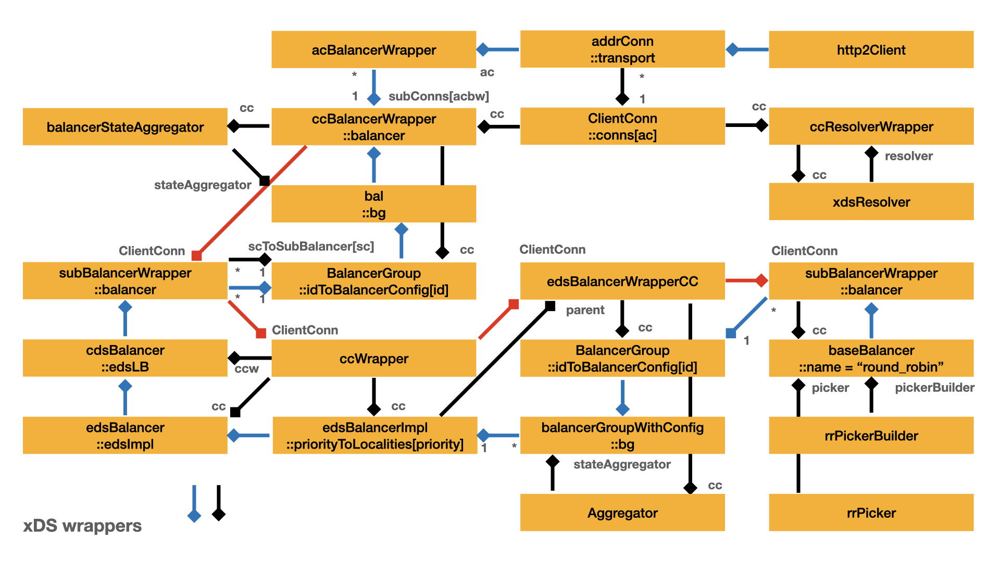
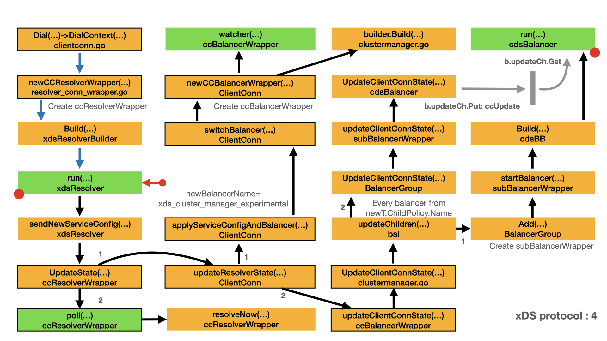
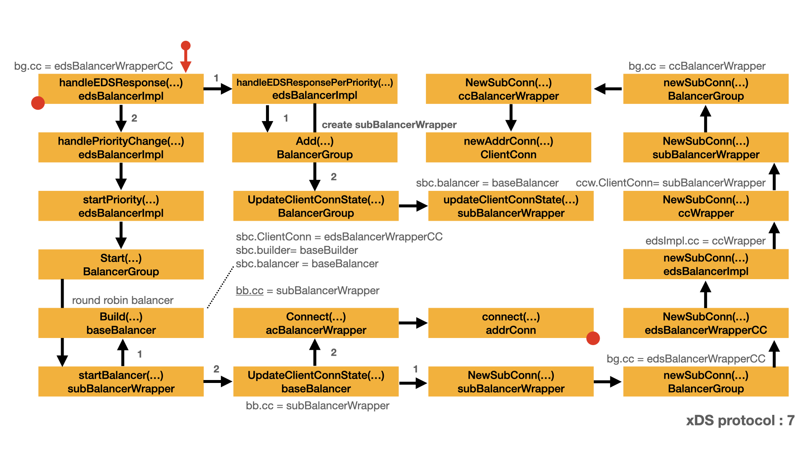

# xDS protocol - CDS/EDS

- [xDS wrappers](#xds-wrappers)
  - [Resolver](#resolver)
  - [Cluster Manager](#cluster-manager)
  - [CDS balancer](#cds-balancer)
  - [EDS balancer](#eds-balancer)
  - [Priority locality balancer](#priority-locality-balancer)

## xDS wrappers

xDS use a lot of interfaces and wrappers. E.g. `balancer.ClientConn` represents a gRPC `ClientConn`. In gRPC, different module uses different wrapper which implements the same interface. `ccBalancerWrapper` and `subBalancerWrapper` are typical wrappers. They implement the same interface with different behavior. If you want to understand the source code of xDS, it is better to find out the interface is implemented by which wrappers.

The following diagram is the quick answer for the above questions. The following sections describe how this diagram is formed.



- Yellow box represents important type and main field, "::" represents the field name.
- Blue line represents the most important relationship between two types.
- `1   *` represents one to many relationship.
- Red line highlights path of `ClientConn`.
- Black line and text represents the significant relationship between tow types.

### Resolver

For each connection, there is one resolver. Each resolver is wrapped by `ccResolverWrapper`.

- `ccResolverWrapper.cc` field is of struct type `ClientConn`.
- `ccResolverWrapper.resolver` field is of type `xdsResolver`.

```go
// ccResolverWrapper is a wrapper on top of cc for resolvers.
// It implements resolver.ClientConn interface.
type ccResolverWrapper struct {
    cc         *ClientConn
    resolverMu sync.Mutex
    resolver   resolver.Resolver
    done       *grpcsync.Event
    curState   resolver.State

    pollingMu sync.Mutex
    polling   chan struct{}
}

// newCCResolverWrapper uses the resolver.Builder to build a Resolver and
// returns a ccResolverWrapper object which wraps the newly built resolver.
func newCCResolverWrapper(cc *ClientConn, rb resolver.Builder) (*ccResolverWrapper, error) {
    ccr := &ccResolverWrapper{
        cc:   cc,
        done: grpcsync.NewEvent(),
    }

    var credsClone credentials.TransportCredentials
    if creds := cc.dopts.copts.TransportCredentials; creds != nil {
        credsClone = creds.Clone()
    }
    rbo := resolver.BuildOptions{
        DisableServiceConfig: cc.dopts.disableServiceConfig,
        DialCreds:            credsClone,
        CredsBundle:          cc.dopts.copts.CredsBundle,
        Dialer:               cc.dopts.copts.Dialer,
    }

    var err error
    // We need to hold the lock here while we assign to the ccr.resolver field
    // to guard against a data race caused by the following code path,
    // rb.Build-->ccr.ReportError-->ccr.poll-->ccr.resolveNow, would end up
    // accessing ccr.resolver which is being assigned here.
    ccr.resolverMu.Lock()
    defer ccr.resolverMu.Unlock()
    ccr.resolver, err = rb.Build(cc.parsedTarget, ccr, rbo)
    if err != nil {
        return nil, err
    }
    return ccr, nil
}

// ClientConn represents a virtual connection to a conceptual endpoint, to
// perform RPCs.
//
// A ClientConn is free to have zero or more actual connections to the endpoint
// based on configuration, load, etc. It is also free to determine which actual
// endpoints to use and may change it every RPC, permitting client-side load
// balancing.
//
// A ClientConn encapsulates a range of functionality including name
// resolution, TCP connection establishment (with retries and backoff) and TLS
// handshakes. It also handles errors on established connections by
// re-resolving the name and reconnecting.
type ClientConn struct {
    ctx    context.Context
    cancel context.CancelFunc

    target       string
    parsedTarget resolver.Target
    authority    string
    dopts        dialOptions
    csMgr        *connectivityStateManager

    balancerBuildOpts balancer.BuildOptions
    blockingpicker    *pickerWrapper

    safeConfigSelector iresolver.SafeConfigSelector

    mu              sync.RWMutex
    resolverWrapper *ccResolverWrapper
    sc              *ServiceConfig
    conns           map[*addrConn]struct{}
    // Keepalive parameter can be updated if a GoAway is received.
    mkp             keepalive.ClientParameters
    curBalancerName string
    balancerWrapper *ccBalancerWrapper
    retryThrottler  atomic.Value

    firstResolveEvent *grpcsync.Event

    channelzID int64 // channelz unique identification number
    czData     *channelzData

    lceMu               sync.Mutex // protects lastConnectionError
    lastConnectionError error
}

const xdsScheme = "xds"

// For overriding in unittests.
var newXDSClient = func() (xdsClientInterface, error) { return xdsclient.New() }

func init() {
    resolver.Register(&xdsResolverBuilder{})
}

type xdsResolverBuilder struct{}

// Build helps implement the resolver.Builder interface.
//
// The xds bootstrap process is performed (and a new xds client is built) every
// time an xds resolver is built.
func (b *xdsResolverBuilder) Build(t resolver.Target, cc resolver.ClientConn, opts resolver.BuildOptions) (resolver.Resolver, error) {
    r := &xdsResolver{
        target:         t,
        cc:             cc,
        closed:         grpcsync.NewEvent(),
        updateCh:       make(chan suWithError, 1),
        activeClusters: make(map[string]*clusterInfo),
    }
    r.logger = prefixLogger((r))
    r.logger.Infof("Creating resolver for target: %+v", t)

    client, err := newXDSClient()
    if err != nil {
        return nil, fmt.Errorf("xds: failed to create xds-client: %v", err)
    }
    r.client = client

    // If xds credentials were specified by the user, but bootstrap configs do
    // not contain any certificate provider configuration, it is better to fail
    // right now rather than failing when attempting to create certificate
    // providers after receiving an CDS response with security configuration.
    var creds credentials.TransportCredentials
    switch {
    case opts.DialCreds != nil:
        creds = opts.DialCreds
    case opts.CredsBundle != nil:
        creds = opts.CredsBundle.TransportCredentials()
    }
    if xc, ok := creds.(interface{ UsesXDS() bool }); ok && xc.UsesXDS() {
        bc := client.BootstrapConfig()
        if len(bc.CertProviderConfigs) == 0 {
            return nil, errors.New("xds: xdsCreds specified but certificate_providers config missing in bootstrap file")
        }
    }

    // Register a watch on the xdsClient for the user's dial target.
    cancelWatch := watchService(r.client, r.target.Endpoint, r.handleServiceUpdate, r.logger)
    r.logger.Infof("Watch started on resource name %v with xds-client %p", r.target.Endpoint, r.client)
    r.cancelWatch = func() {
        cancelWatch()
        r.logger.Infof("Watch cancel on resource name %v with xds-client %p", r.target.Endpoint, r.client)
    }

    go r.run()
    return r, nil
}

// Name helps implement the resolver.Builder interface.
func (*xdsResolverBuilder) Scheme() string {
    return xdsScheme
}

// xdsResolver implements the resolver.Resolver interface.
//
// It registers a watcher for ServiceConfig updates with the xdsClient object
// (which performs LDS/RDS queries for the same), and passes the received
// updates to the ClientConn.
type xdsResolver struct {
    target resolver.Target
    cc     resolver.ClientConn
    closed *grpcsync.Event

    logger *grpclog.PrefixLogger

    // The underlying xdsClient which performs all xDS requests and responses.
    client xdsClientInterface
    // A channel for the watch API callback to write service updates on to. The
    // updates are read by the run goroutine and passed on to the ClientConn.
    updateCh chan suWithError
    // cancelWatch is the function to cancel the watcher.
    cancelWatch func()

    // activeClusters is a map from cluster name to a ref count.  Only read or
    // written during a service update (synchronous).
    activeClusters map[string]*clusterInfo

    curConfigSelector *configSelector
}
```

### Cluster manager

For each connection, there is only one cluster manager. `newCCBalancerWrapper()` creates the `ccBalancerWrapper` and the cluster manager, cluster manager is implemented by struct type `bal` and is wrapped by `ccBalancerWrapper`.



- In `ClientConn.switchBalancer()`, `newCCBalancerWrapper()` is called to create `ccBalancerWrapper`.
- `ccBalancerWrapper.cc` is of type `ClientConn`.
- In `newCCBalancerWrapper()`,
  - `b.Build()` is actually `builder.Build()`. `balancer.Builder` is chosen by balancer name: `"xds_cluster_manager_experimental"`.
  - `b.Build()` uses `ccb` as argument for `cc` parameter, `ccb` is of type `ccBalancerWrapper`.
- `ccBalancerWrapper.balancer` is of type `bal`.

```go
func newCCBalancerWrapper(cc *ClientConn, b balancer.Builder, bopts balancer.BuildOptions) *ccBalancerWrapper {
    ccb := &ccBalancerWrapper{
        cc:       cc,
        scBuffer: buffer.NewUnbounded(),
        done:     grpcsync.NewEvent(),
        subConns: make(map[*acBalancerWrapper]struct{}),
    }
    go ccb.watcher()
    ccb.balancer = b.Build(ccb, bopts)
    return ccb
}

// ccBalancerWrapper is a wrapper on top of cc for balancers.
// It implements balancer.ClientConn interface.
type ccBalancerWrapper struct {
    cc         *ClientConn
    balancerMu sync.Mutex // synchronizes calls to the balancer
    balancer   balancer.Balancer
    scBuffer   *buffer.Unbounded
    done       *grpcsync.Event

    mu       sync.Mutex
    subConns map[*acBalancerWrapper]struct{}
}
```

In `builder.Build()`,

- `bal.stateAggregator` field is of type `balancerStateAggregator`.
- `bal.stateAggregator.cc` field is of type `ccBalancerWrapper`.
- `bal.bg` field is of type `BalancerGroup`.
- `bal.bg.cc` field is of type `ccBalancerWrapper`.
- Note the balancer group `b.bg` is started by `b.bg.Start()`.

```go
const balancerName = "xds_cluster_manager_experimental"

type builder struct{}

func (builder) Build(cc balancer.ClientConn, _ balancer.BuildOptions) balancer.Balancer {
    b := &bal{}
    b.logger = prefixLogger(b)
    b.stateAggregator = newBalancerStateAggregator(cc, b.logger)
    b.stateAggregator.start()
    b.bg = balancergroup.New(cc, b.stateAggregator, nil, b.logger)
    b.bg.Start()
    b.logger.Infof("Created")
    return b
}

func (builder) Name() string {
    return balancerName
}

func (builder) ParseConfig(c json.RawMessage) (serviceconfig.LoadBalancingConfig, error) {
    return parseConfig(c)
}

type bal struct {
    logger *internalgrpclog.PrefixLogger

    // TODO: make this package not dependent on xds specific code. Same as for
    // weighted target balancer.
    bg              *balancergroup.BalancerGroup
    stateAggregator *balancerStateAggregator

    children map[string]childConfig
}

type balancerStateAggregator struct {
    cc     balancer.ClientConn
    logger *grpclog.PrefixLogger

    mu sync.Mutex
    // If started is false, no updates should be sent to the parent cc. A closed
    // sub-balancer could still send pickers to this aggregator. This makes sure
    // that no updates will be forwarded to parent when the whole balancer group
    // and states aggregator is closed.
    started bool
    // All balancer IDs exist as keys in this map, even if balancer group is not
    // started.
    //
    // If an ID is not in map, it's either removed or never added.
    idToPickerState map[string]*subBalancerState
}

func newBalancerStateAggregator(cc balancer.ClientConn, logger *grpclog.PrefixLogger) *balancerStateAggregator {
    return &balancerStateAggregator{
        cc:              cc,
        logger:          logger,
        idToPickerState: make(map[string]*subBalancerState),
    }
}

// BalancerGroup takes a list of balancers, and make them into one balancer.
//
// Note that this struct doesn't implement balancer.Balancer, because it's not
// intended to be used directly as a balancer. It's expected to be used as a
// sub-balancer manager by a high level balancer.
//
// Updates from ClientConn are forwarded to sub-balancers
//  - service config update
//     - Not implemented
//  - address update
//  - subConn state change
//     - find the corresponding balancer and forward
//
// Actions from sub-balances are forwarded to parent ClientConn
//  - new/remove SubConn
//  - picker update and health states change
//     - sub-pickers are sent to an aggregator provided by the parent, which
//     will group them into a group-picker. The aggregated connectivity state is
//     also handled by the aggregator.
//  - resolveNow
//
// Sub-balancers are only built when the balancer group is started. If the
// balancer group is closed, the sub-balancers are also closed. And it's
// guaranteed that no updates will be sent to parent ClientConn from a closed
// balancer group.
type BalancerGroup struct {
    cc        balancer.ClientConn
    buildOpts balancer.BuildOptions
    logger    *grpclog.PrefixLogger
    loadStore load.PerClusterReporter

    // stateAggregator is where the state/picker updates will be sent to. It's
    // provided by the parent balancer, to build a picker with all the
    // sub-pickers.
    stateAggregator BalancerStateAggregator

    // outgoingMu guards all operations in the direction:
    // ClientConn-->Sub-balancer. Including start, stop, resolver updates and
    // SubConn state changes.
    //
    // The corresponding boolean outgoingStarted is used to stop further updates
    // to sub-balancers after they are closed.
    outgoingMu         sync.Mutex
    outgoingStarted    bool
    idToBalancerConfig map[string]*subBalancerWrapper
    // Cache for sub-balancers when they are removed.
    balancerCache *cache.TimeoutCache

    // incomingMu is to make sure this balancer group doesn't send updates to cc
    // after it's closed.
    //
    // We don't share the mutex to avoid deadlocks (e.g. a call to sub-balancer
    // may call back to balancer group inline. It causes deaclock if they
    // require the same mutex).
    //
    // We should never need to hold multiple locks at the same time in this
    // struct. The case where two locks are held can only happen when the
    // underlying balancer calls back into balancer group inline. So there's an
    // implicit lock acquisition order that outgoingMu is locked before
    // incomingMu.

    // incomingMu guards all operations in the direction:
    // Sub-balancer-->ClientConn. Including NewSubConn, RemoveSubConn. It also
    // guards the map from SubConn to balancer ID, so updateSubConnState needs
    // to hold it shortly to find the sub-balancer to forward the update.
    //
    // UpdateState is called by the balancer state aggretator, and it will
    // decide when and whether to call.
    //
    // The corresponding boolean incomingStarted is used to stop further updates
    // from sub-balancers after they are closed.
    incomingMu      sync.Mutex
    incomingStarted bool // This boolean only guards calls back to ClientConn.
    scToSubBalancer map[balancer.SubConn]*subBalancerWrapper
}

// New creates a new BalancerGroup. Note that the BalancerGroup
// needs to be started to work.
func New(cc balancer.ClientConn, stateAggregator BalancerStateAggregator, loadStore load.PerClusterReporter, logger *grpclog.PrefixLogger) *BalancerGroup {
    return &BalancerGroup{
        cc:        cc,
        logger:    logger,
        loadStore: loadStore,

        stateAggregator: stateAggregator,

        idToBalancerConfig: make(map[string]*subBalancerWrapper),
        balancerCache:      cache.NewTimeoutCache(DefaultSubBalancerCloseTimeout),
        scToSubBalancer:    make(map[balancer.SubConn]*subBalancerWrapper),
    }
}
```

### CDS balancer

Upon receive the RDS update, `ccBalancerWrapper.updateClientConnState()` is called to process the update.


- `ccBalancerWrapper.updateClientConnState()` calls `ccb.balancer.UpdateClientConnState()` to finish the job.
- From [Cluster manager](#cluster-manager), the `ccb.balancer` is `bal`.
- `ccb.balancer.UpdateClientConnState()` is actually `bal.UpdateClientConnState()`.
- `bal.UpdateClientConnState()` calls `bal.updateChildren()` to process the load balance config.

```go
func (ccb *ccBalancerWrapper) updateClientConnState(ccs *balancer.ClientConnState) error {
    ccb.balancerMu.Lock()
    defer ccb.balancerMu.Unlock()
    return ccb.balancer.UpdateClientConnState(*ccs)
}

func (b *bal) UpdateClientConnState(s balancer.ClientConnState) error {
    newConfig, ok := s.BalancerConfig.(*lbConfig)
    if !ok {
        return fmt.Errorf("unexpected balancer config with type: %T", s.BalancerConfig)
    }
    b.logger.Infof("update with config %+v, resolver state %+v", s.BalancerConfig, s.ResolverState)

    b.updateChildren(s, newConfig)
    return nil
}
```

For each child policy, `bal.updateChildren()` creates a CDS sub-balancer. In `bal.updateChildren()`, `b.bg.Add()` is called to add CDS sub-balancer to the group.

In `bal.updateChildren()`,

- The CDS balancer builder is picked by name `newT.ChildPolicy.Name`.
- New CDS balancer builder is added to balancer group: `bal.bg`.

```go
func (b *bal) updateChildren(s balancer.ClientConnState, newConfig *lbConfig) {
    update := false
    addressesSplit := hierarchy.Group(s.ResolverState.Addresses)

    // Remove sub-pickers and sub-balancers that are not in the new cluster list.
    for name := range b.children {
        if _, ok := newConfig.Children[name]; !ok {
            b.stateAggregator.remove(name)
            b.bg.Remove(name)
            update = true
        }
    }

    // For sub-balancers in the new cluster list,
    // - add to balancer group if it's new,
    // - forward the address/balancer config update.
    for name, newT := range newConfig.Children {
        if _, ok := b.children[name]; !ok {
            // If this is a new sub-balancer, add it to the picker map.
            b.stateAggregator.add(name)
            // Then add to the balancer group.
            b.bg.Add(name, balancer.Get(newT.ChildPolicy.Name))
        }
        // TODO: handle error? How to aggregate errors and return?
        _ = b.bg.UpdateClientConnState(name, balancer.ClientConnState{
            ResolverState: resolver.State{
                Addresses:     addressesSplit[name],
                ServiceConfig: s.ResolverState.ServiceConfig,
                Attributes:    s.ResolverState.Attributes,
            },
            BalancerConfig: newT.ChildPolicy.Config,
        })
    }

    b.children = newConfig.Children
    if update {
        b.stateAggregator.buildAndUpdate()
    }
}
```

In `BalancerGroup.Add()`,

- The CDS balancer builder and CDS balancer is wrapped by `subBalancerWrapper`.
- `subBalancerWrapper` implements `balancer.ClientConn`.
- `subBalancerWrapper.ClientConn` field is of type `ccBalancerWrapper`. The `bg.cc` is `ccBalancerWrapper`.

```go
// Add adds a balancer built by builder to the group, with given id.
func (bg *BalancerGroup) Add(id string, builder balancer.Builder) {
    // Store data in static map, and then check to see if bg is started.
    bg.outgoingMu.Lock()
    var sbc *subBalancerWrapper
    // If outgoingStarted is true, search in the cache. Otherwise, cache is
    // guaranteed to be empty, searching is unnecessary.
    if bg.outgoingStarted {
        if old, ok := bg.balancerCache.Remove(id); ok {
            sbc, _ = old.(*subBalancerWrapper)
            if sbc != nil && sbc.builder != builder {
+-- 12 lines: If the sub-balancer in cache was built with a different······························································································
            }
        }
    }
    if sbc == nil {
        sbc = &subBalancerWrapper{
            ClientConn: bg.cc,
            id:         id,
            group:      bg,
            builder:    builder,
        }
        if bg.outgoingStarted {
            // Only start the balancer if bg is started. Otherwise, we only keep the
            // static data.
            sbc.startBalancer()
        }
    } else {
        // When brining back a sub-balancer from cache, re-send the cached
        // picker and state.
        sbc.updateBalancerStateWithCachedPicker()
    }
    bg.idToBalancerConfig[id] = sbc
    bg.outgoingMu.Unlock()
}

// subBalancerWrapper is used to keep the configurations that will be used to start
// the underlying balancer. It can be called to start/stop the underlying
// balancer.
//
// When the config changes, it will pass the update to the underlying balancer
// if it exists.
//
// TODO: move to a separate file?
type subBalancerWrapper struct {
    // subBalancerWrapper is passed to the sub-balancer as a ClientConn
    // wrapper, only to keep the state and picker.  When sub-balancer is
    // restarted while in cache, the picker needs to be resent.
    //
    // It also contains the sub-balancer ID, so the parent balancer group can
    // keep track of SubConn/pickers and the sub-balancers they belong to. Some
    // of the actions are forwarded to the parent ClientConn with no change.
    // Some are forward to balancer group with the sub-balancer ID.
    balancer.ClientConn
    id    string
    group *BalancerGroup

    mu    sync.Mutex
    state balancer.State

    // The static part of sub-balancer. Keeps balancerBuilders and addresses.
    // To be used when restarting sub-balancer.
    builder balancer.Builder
    // Options to be passed to sub-balancer at the time of creation.
    buildOpts balancer.BuildOptions
    // ccState is a cache of the addresses/balancer config, so when the balancer
    // is restarted after close, it will get the previous update. It's a pointer
    // and is set to nil at init, so when the balancer is built for the first
    // time (not a restart), it won't receive an empty update. Note that this
    // isn't reset to nil when the underlying balancer is closed.
    ccState *balancer.ClientConnState
    // The dynamic part of sub-balancer. Only used when balancer group is
    // started. Gets cleared when sub-balancer is closed.
    balancer balancer.Balancer
}

// Start starts the balancer group, including building all the sub-balancers,
// and send the existing addresses to them.
//
// A BalancerGroup can be closed and started later. When a BalancerGroup is
// closed, it can still receive address updates, which will be applied when
// restarted.
func (bg *BalancerGroup) Start() {
    bg.incomingMu.Lock()
    bg.incomingStarted = true
    bg.incomingMu.Unlock()

    bg.outgoingMu.Lock()
    if bg.outgoingStarted {
        bg.outgoingMu.Unlock()
        return
    }

    for _, config := range bg.idToBalancerConfig {
        config.startBalancer()
    }
    bg.outgoingStarted = true
    bg.outgoingMu.Unlock()
}
```

For CDS balancer, the balancer group is started by default, which means `bg.outgoingStarted` is true. And `subBalancerWrapper.startBalancer()` is called when balancer is added to the balancer group.

In `subBalancerWrapper.startBalancer()`,

- `sbc.builder.Build()` is called withe `sbc` as the argument of `cc ClientConn` parameter.
- Here, `sbc.builder` is `cdsBB`. It is one of the CDS balancer builders.
- The `sbc.builder` is picked by `newT.ChildPolicy.Name`. There is another builder: `weightedTargetBB`.
- In `cdsBB.Build()`, `ccWrapper` is created.
- `ccWrapper.ClientConn` field is of type `subBalancerWrapper`.
- `cdsBalancer.ccw` field is of type `ccWrapper`.
- `sbc.balancer` field is of type `cdsBalancer`.
- There is a `cdsBalancer.edsLB` field, which is the EDS balancer. It will be initialized in next section.

```go
func (sbc *subBalancerWrapper) startBalancer() {
    b := sbc.builder.Build(sbc, balancer.BuildOptions{})
    sbc.group.logger.Infof("Created child policy %p of type %v", b, sbc.builder.Name())
    sbc.balancer = b
    if sbc.ccState != nil {
        b.UpdateClientConnState(*sbc.ccState)
    }
}

// cdsBB (short for cdsBalancerBuilder) implements the balancer.Builder
// interface to help build a cdsBalancer.
// It also implements the balancer.ConfigParser interface to help parse the
// JSON service config, to be passed to the cdsBalancer.
type cdsBB struct{}

// Build creates a new CDS balancer with the ClientConn.
func (cdsBB) Build(cc balancer.ClientConn, opts balancer.BuildOptions) balancer.Balancer {
    b := &cdsBalancer{
        bOpts:       opts,
        updateCh:    buffer.NewUnbounded(),
        closed:      grpcsync.NewEvent(),
        cancelWatch: func() {}, // No-op at this point.
        xdsHI:       xdsinternal.NewHandshakeInfo(nil, nil),
    }
    b.logger = prefixLogger((b))
    b.logger.Infof("Created")

    client, err := newXDSClient()
    if err != nil {
        b.logger.Errorf("failed to create xds-client: %v", err)
        return nil
    }
    b.xdsClient = client

    var creds credentials.TransportCredentials
    switch {
    case opts.DialCreds != nil:
        creds = opts.DialCreds
    case opts.CredsBundle != nil:
        creds = opts.CredsBundle.TransportCredentials()
    }
    if xc, ok := creds.(interface{ UsesXDS() bool }); ok && xc.UsesXDS() {
        b.xdsCredsInUse = true
    }
    b.logger.Infof("xDS credentials in use: %v", b.xdsCredsInUse)

    b.ccw = &ccWrapper{
        ClientConn: cc,
        xdsHI:      b.xdsHI,
    }
    go b.run()
    return b
}

// Name returns the name of balancers built by this builder.
func (cdsBB) Name() string {
    return cdsName
}

// cdsBalancer implements a CDS based LB policy. It instantiates an EDS based
// LB policy to further resolve the serviceName received from CDS, into
// localities and endpoints. Implements the balancer.Balancer interface which
// is exposed to gRPC and implements the balancer.ClientConn interface which is
// exposed to the edsBalancer.
type cdsBalancer struct {
    ccw            *ccWrapper            // ClientConn interface passed to child LB.
    bOpts          balancer.BuildOptions // BuildOptions passed to child LB.
    updateCh       *buffer.Unbounded     // Channel for gRPC and xdsClient updates.
    xdsClient      xdsClientInterface    // xDS client to watch Cluster resource.
    cancelWatch    func()                // Cluster watch cancel func.
    edsLB          balancer.Balancer     // EDS child policy.
    clusterToWatch string
    logger         *grpclog.PrefixLogger
    closed         *grpcsync.Event

    // The certificate providers are cached here to that they can be closed when
    // a new provider is to be created.
    cachedRoot     certprovider.Provider
    cachedIdentity certprovider.Provider
    xdsHI          *xdsinternal.HandshakeInfo
    xdsCredsInUse  bool
}

// ccWrapper wraps the balancer.ClientConn passed to the CDS balancer at
// creation and intercepts the NewSubConn() and UpdateAddresses() call from the
// child policy to add security configuration required by xDS credentials.
//
// Other methods of the balancer.ClientConn interface are not overridden and
// hence get the original implementation.
type ccWrapper struct {
    balancer.ClientConn

    // The certificate providers in this HandshakeInfo are updated based on the
    // received security configuration in the Cluster resource.
    xdsHI *xdsinternal.HandshakeInfo
}

```

### EDS balancer

Upon receives the CDS response and callback, `cdsBalancer.handleWatchUpdate()` calls `newEDSBalancer()` to create EDS balancer for each CDS balancer.


- `newEDSBalancer()` uses `b.ccw` as argument for `cc` parameter.
- From [CDS balancer](#cds-balancer), `b.ccw` is of type `ccWrapper`.

```go
// handleWatchUpdate handles a watch update from the xDS Client. Good updates
// lead to clientConn updates being invoked on the underlying edsBalancer.
func (b *cdsBalancer) handleWatchUpdate(update *watchUpdate) {
    if err := update.err; err != nil {
        b.logger.Warningf("Watch error from xds-client %p: %v", b.xdsClient, err)
        b.handleErrorFromUpdate(err, false)
        return
    }

    b.logger.Infof("Watch update from xds-client %p, content: %+v", b.xdsClient, update.cds)

    // Process the security config from the received update before building the
    // child policy or forwarding the update to it. We do this because the child
    // policy may try to create a new subConn inline. Processing the security
    // configuration here and setting up the handshakeInfo will make sure that
    // such attempts are handled properly.
    if err := b.handleSecurityConfig(update.cds.SecurityCfg); err != nil {
        // If the security config is invalid, for example, if the provider
        // instance is not found in the bootstrap config, we need to put the
        // channel in transient failure.
        b.logger.Warningf("Invalid security config update from xds-client %p: %v", b.xdsClient, err)
        b.handleErrorFromUpdate(err, false)
        return
    }

    // The first good update from the watch API leads to the instantiation of an
    // edsBalancer. Further updates/errors are propagated to the existing
    // edsBalancer.
    if b.edsLB == nil {
        edsLB, err := newEDSBalancer(b.ccw, b.bOpts)
        if err != nil {
            b.logger.Errorf("Failed to create child policy of type %s, %v", edsName, err)
            return
        }
        b.edsLB = edsLB
        b.logger.Infof("Created child policy %p of type %s", b.edsLB, edsName)
    }
    lbCfg := &edsbalancer.EDSConfig{
        EDSServiceName:        update.cds.ServiceName,
        MaxConcurrentRequests: update.cds.MaxRequests,
    }
    if update.cds.EnableLRS {
        // An empty string here indicates that the edsBalancer should use the
        // same xDS server for load reporting as it does for EDS
        // requests/responses.
        lbCfg.LrsLoadReportingServerName = new(string)

    }
    ccState := balancer.ClientConnState{
        BalancerConfig: lbCfg,
    }
    if err := b.edsLB.UpdateClientConnState(ccState); err != nil {
        b.logger.Errorf("xds: edsBalancer.UpdateClientConnState(%+v) returned error: %v", ccState, err)
    }
}
```

In `newEDSBalancer()`,

- The EDS balancer builder is picked by `edsName`.
- `newEDSBalancer()` forwards the `cc` argument to `builder.Build()`.
- `edsBalancer.cc` field is of type `ccWrapper`.
- EDS balancer has a `edsBalancer.edsImpl` field.
- `edsBalancer.edsImpl` field is `edsBalancerImplInterface` interface type, which is actually of type `edsBalancerImpl`.
- `edsBalancerImpl.cc` field is of type `ccWrapper`.

```go
var (
    errBalancerClosed = errors.New("cdsBalancer is closed")

    // newEDSBalancer is a helper function to build a new edsBalancer and will be
    // overridden in unittests.
    newEDSBalancer = func(cc balancer.ClientConn, opts balancer.BuildOptions) (balancer.Balancer, error) {
        builder := balancer.Get(edsName)
        if builder == nil {
            return nil, fmt.Errorf("xds: no balancer builder with name %v", edsName)
        }
        // We directly pass the parent clientConn to the
        // underlying edsBalancer because the cdsBalancer does
        // not deal with subConns.
        return builder.Build(cc, opts), nil
    }
    newXDSClient  = func() (xdsClientInterface, error) { return xdsclient.New() }
    buildProvider = buildProviderFunc
)

const edsName = "eds_experimental"

func init() {
    balancer.Register(&edsBalancerBuilder{})
}

type edsBalancerBuilder struct{}

// Build helps implement the balancer.Builder interface.
func (b *edsBalancerBuilder) Build(cc balancer.ClientConn, opts balancer.BuildOptions) balancer.Balancer {
    x := &edsBalancer{
        cc:                cc,
        closed:            grpcsync.NewEvent(),
        grpcUpdate:        make(chan interface{}),
        xdsClientUpdate:   make(chan *edsUpdate),
        childPolicyUpdate: buffer.NewUnbounded(),
        lsw:               &loadStoreWrapper{},
        config:            &EDSConfig{},
    }
    x.logger = prefixLogger(x)

    client, err := newXDSClient()
    if err != nil {
        x.logger.Errorf("xds: failed to create xds-client: %v", err)
        return nil
    }

    x.xdsClient = client
    x.edsImpl = newEDSBalancer(x.cc, opts, x.enqueueChildBalancerState, x.lsw, x.logger)
    x.logger.Infof("Created")
    go x.run()
    return x
}

func (b *edsBalancerBuilder) Name() string {
    return edsName
}

// edsBalancer manages xdsClient and the actual EDS balancer implementation that
// does load balancing.
//
// It currently has only an edsBalancer. Later, we may add fallback.
type edsBalancer struct {
    cc     balancer.ClientConn
    closed *grpcsync.Event
    logger *grpclog.PrefixLogger

    // edsBalancer continuously monitors the channels below, and will handle
    // events from them in sync.
    grpcUpdate        chan interface{}
    xdsClientUpdate   chan *edsUpdate
    childPolicyUpdate *buffer.Unbounded

    xdsClient xdsClientInterface
    lsw       *loadStoreWrapper
    config    *EDSConfig // may change when passed a different service config
    edsImpl   edsBalancerImplInterface

    // edsServiceName is the edsServiceName currently being watched, not
    // necessary the edsServiceName from service config.
    edsServiceName       string
    cancelEndpointsWatch func()
    loadReportServer     *string // LRS is disabled if loadReporterServer is nil.
    cancelLoadReport     func()
}

var (
    newEDSBalancer = func(cc balancer.ClientConn, opts balancer.BuildOptions, enqueueState func(priorityType, balancer.State), lw load.PerClusterReporter, logger *grpclog.PrefixLogger) edsBalancerImplInterface {
        return newEDSBalancerImpl(cc, opts, enqueueState, lw, logger)
    }
    newXDSClient = func() (xdsClientInterface, error) { return xdsclient.New() }
)

// edsBalancerImpl does load balancing based on the EDS responses. Note that it
// doesn't implement the balancer interface. It's intended to be used by a high
// level balancer implementation.
//
// The localities are picked as weighted round robin. A configurable child
// policy is used to manage endpoints in each locality.
type edsBalancerImpl struct {
    cc           balancer.ClientConn
    buildOpts    balancer.BuildOptions
    logger       *grpclog.PrefixLogger
    loadReporter load.PerClusterReporter

    enqueueChildBalancerStateUpdate func(priorityType, balancer.State)

    subBalancerBuilder   balancer.Builder
    priorityToLocalities map[priorityType]*balancerGroupWithConfig
    respReceived         bool

    // There's no need to hold any mutexes at the same time. The order to take
    // mutex should be: priorityMu > subConnMu, but this is implicit via
    // balancers (starting balancer with next priority while holding priorityMu,
    // and the balancer may create new SubConn).

    priorityMu sync.Mutex
    // priorities are pointers, and will be nil when EDS returns empty result.
    priorityInUse   priorityType
    priorityLowest  priorityType
    priorityToState map[priorityType]*balancer.State
    // The timer to give a priority 10 seconds to connect. And if the priority
    // doesn't go into Ready/Failure, start the next priority.
    //
    // One timer is enough because there can be at most one priority in init
    // state.
    priorityInitTimer *time.Timer

    subConnMu         sync.Mutex
    subConnToPriority map[balancer.SubConn]priorityType

    pickerMu               sync.Mutex
    dropConfig             []xdsclient.OverloadDropConfig
    drops                  []*dropper
    innerState             balancer.State // The state of the picker without drop support.
    serviceRequestsCounter *client.ServiceRequestsCounter
    serviceRequestCountMax uint32
}

// newEDSBalancerImpl create a new edsBalancerImpl.
func newEDSBalancerImpl(cc balancer.ClientConn, bOpts balancer.BuildOptions, enqueueState func(priorityType, balancer.State), lr load.PerClusterReporter, logger *grpclog.PrefixLogger) *edsBalancerImpl {
    edsImpl := &edsBalancerImpl{
        cc:                 cc,
        buildOpts:          bOpts,
        logger:             logger,
        subBalancerBuilder: balancer.Get(roundrobin.Name),
        loadReporter:       lr,

        enqueueChildBalancerStateUpdate: enqueueState,

        priorityToLocalities:   make(map[priorityType]*balancerGroupWithConfig),
        priorityToState:        make(map[priorityType]*balancer.State),
        subConnToPriority:      make(map[balancer.SubConn]priorityType),
        serviceRequestCountMax: defaultServiceRequestCountMax,
    }
    // Don't start balancer group here. Start it when handling the first EDS
    // response. Otherwise the balancer group will be started with round-robin,
    // and if users specify a different sub-balancer, all balancers in balancer
    // group will be closed and recreated when sub-balancer update happens.
    return edsImpl
}
```

### Priority locality balancer

Upon receives the EDS update, `edsBalancerImpl.handleEDSResponse()` creates one balancer group for each priority locality and adds balancers for each group.



For each priority, a new balancer group is created.

- `ccPriorityWrapper` is created by `edsImpl.ccWrapperWithPriority()`, `ccPriorityWrapper` is of type `edsBalancerWrapperCC`.
- From [EDS balancer](#eds-balancer), `edsBalancerImpl.cc` field is of type `ccWrapper`.
- `edsBalancerWrapperCC.ClientConn` is of type `ccWrapper`.
- `stateAggregator` is created by `weightedaggregator.New()`, `stateAggregator` is of type `Aggregator`.
- `balancerGroupWithConfig.bg` is of type `BalancerGroup`.
- `balancerGroupWithConfig.bg.cc` field is of type `edsBalancerWrapperCC`.
- `balancerGroupWithConfig.stateAggregator.cc` field is of type `edsBalancerWrapperCC`.

```go
// handleEDSResponse handles the EDS response and creates/deletes localities and
// SubConns. It also handles drops.
//
// HandleChildPolicy and HandleEDSResponse must be called by the same goroutine.
func (edsImpl *edsBalancerImpl) handleEDSResponse(edsResp xdsclient.EndpointsUpdate) {
    // TODO: Unhandled fields from EDS response:
    //  - edsResp.GetPolicy().GetOverprovisioningFactor()
    //  - locality.GetPriority()
    //  - lbEndpoint.GetMetadata(): contains BNS name, send to sub-balancers
    //    - as service config or as resolved address
    //  - if socketAddress is not ip:port
    //     - socketAddress.GetNamedPort(), socketAddress.GetResolverName()
    //     - resolve endpoint's name with another resolver

    // If the first EDS update is an empty update, nothing is changing from the
    // previous update (which is the default empty value). We need to explicitly
    // handle first update being empty, and send a transient failure picker.
    //
    // TODO: define Equal() on type EndpointUpdate to avoid DeepEqual. And do
    // the same for the other types.
    if !edsImpl.respReceived && reflect.DeepEqual(edsResp, xdsclient.EndpointsUpdate{}) {
        edsImpl.cc.UpdateState(balancer.State{ConnectivityState: connectivity.TransientFailure, Picker: base.NewErrPicker(errAllPrioritiesRemoved)})
    }
    edsImpl.respReceived = true

    edsImpl.updateDrops(edsResp.Drops)

    // Filter out all localities with weight 0.
    //
    // Locality weighted load balancer can be enabled by setting an option in
    // CDS, and the weight of each locality. Currently, without the guarantee
    // that CDS is always sent, we assume locality weighted load balance is
    // always enabled, and ignore all weight 0 localities.
    //
    // In the future, we should look at the config in CDS response and decide
    // whether locality weight matters.
    newLocalitiesWithPriority := make(map[priorityType][]xdsclient.Locality)
    for _, locality := range edsResp.Localities {
        if locality.Weight == 0 {
            continue
        }
        priority := newPriorityType(locality.Priority)
        newLocalitiesWithPriority[priority] = append(newLocalitiesWithPriority[priority], locality)
    }

    var (
        priorityLowest  priorityType
        priorityChanged bool
    )

    for priority, newLocalities := range newLocalitiesWithPriority {
        if !priorityLowest.isSet() || priorityLowest.higherThan(priority) {
            priorityLowest = priority
        }

        bgwc, ok := edsImpl.priorityToLocalities[priority]
        if !ok {
            // Create balancer group if it's never created (this is the first
            // time this priority is received). We don't start it here. It may
            // be started when necessary (e.g. when higher is down, or if it's a
            // new lowest priority).
            ccPriorityWrapper := edsImpl.ccWrapperWithPriority(priority)
            stateAggregator := weightedaggregator.New(ccPriorityWrapper, edsImpl.logger, newRandomWRR)
            bgwc = &balancerGroupWithConfig{
                bg:              balancergroup.New(ccPriorityWrapper, edsImpl.buildOpts, stateAggregator, edsImpl.loadReporter, edsImpl.logger),
                stateAggregator: stateAggregator,
                configs:         make(map[internal.LocalityID]*localityConfig),
            }
            edsImpl.priorityToLocalities[priority] = bgwc
            priorityChanged = true
            edsImpl.logger.Infof("New priority %v added", priority)
        }
        edsImpl.handleEDSResponsePerPriority(bgwc, newLocalities)
    }
    edsImpl.priorityLowest = priorityLowest

    // Delete priorities that are removed in the latest response, and also close
    // the balancer group.
    for p, bgwc := range edsImpl.priorityToLocalities {
        if _, ok := newLocalitiesWithPriority[p]; !ok {
            delete(edsImpl.priorityToLocalities, p)
            bgwc.bg.Close()
            delete(edsImpl.priorityToState, p)
            priorityChanged = true
            edsImpl.logger.Infof("Priority %v deleted", p)
        }
    }

    // If priority was added/removed, it may affect the balancer group to use.
    // E.g. priorityInUse was removed, or all priorities are down, and a new
    // lower priority was added.
    if priorityChanged {
        edsImpl.handlePriorityChange()
    }
}

func (edsImpl *edsBalancerImpl) ccWrapperWithPriority(priority priorityType) *edsBalancerWrapperCC {
    return &edsBalancerWrapperCC{
        ClientConn: edsImpl.cc,
        priority:   priority,
        parent:     edsImpl,
    }
}

// edsBalancerWrapperCC implements the balancer.ClientConn API and get passed to
// each balancer group. It contains the locality priority.
type edsBalancerWrapperCC struct {
    balancer.ClientConn
    priority priorityType
    parent   *edsBalancerImpl
}

// Aggregator is the weighted balancer state aggregator.
type Aggregator struct {
    cc     balancer.ClientConn
    logger *grpclog.PrefixLogger
    newWRR func() wrr.WRR

    mu sync.Mutex
    // If started is false, no updates should be sent to the parent cc. A closed
    // sub-balancer could still send pickers to this aggregator. This makes sure
    // that no updates will be forwarded to parent when the whole balancer group
    // and states aggregator is closed.
    started bool
    // All balancer IDs exist as keys in this map, even if balancer group is not
    // started.
    //
    // If an ID is not in map, it's either removed or never added.
    idToPickerState map[string]*weightedPickerState
}

// New creates a new weighted balancer state aggregator.
func New(cc balancer.ClientConn, logger *grpclog.PrefixLogger, newWRR func() wrr.WRR) *Aggregator {
    return &Aggregator{
        cc:              cc,
        logger:          logger,
        newWRR:          newWRR,
        idToPickerState: make(map[string]*weightedPickerState),
    }
}
```

Under specified priority, `edsBalancerImpl.handleEDSResponsePerPriority()` adds one balancer for each locality.

- In `bgwc.bg.Add()`, The argument for `builder` parameter is `edsImpl.subBalancerBuilder`.
- `edsImpl.subBalancerBuilder` is initialized in `newEDSBalancerImpl()`.
- In `newEDSBalancerImpl()`, `edsImpl.subBalancerBuilder` is created by pick the builder name `"round_robin"`.
- `edsImpl.subBalancerBuilder` is actually `baseBuilder`.
- The priority locality balancer and builder is wrapped by `subBalancerWrapper`.
- Note this `subBalancerWrapper` is different with the `subBalancerWrapper` in CDS balancer. Their builder and balancer is different.
- `subBalancerWrapper.ClientConn` is of type `edsBalancerWrapperCC`.

Once `subBalancerWrapper.startBalancer()` is called by `edsBalancerImpl.startPriority()`,

- `sbc.builder.Build()` is called with `sbc` as the argument of `cc ClientConn` parameter.
- Here, `sbc.builder` is `baseBuilder`.
- `sbc.balancer` field is of type `baseBalancer`.

In `baseBuilder.Build()`, `baseBalancer.cc` is of type `subBalancerWrapper`.

```go
func (edsImpl *edsBalancerImpl) handleEDSResponsePerPriority(bgwc *balancerGroupWithConfig, newLocalities []xdsclient.Locality) {
    // newLocalitiesSet contains all names of localities in the new EDS response
    // for the same priority. It's used to delete localities that are removed in
    // the new EDS response.
    newLocalitiesSet := make(map[internal.LocalityID]struct{})
    var rebuildStateAndPicker bool
    for _, locality := range newLocalities {
        // One balancer for each locality.

        lid := locality.ID
        lidJSON, err := lid.ToString()
        if err != nil {
            edsImpl.logger.Errorf("failed to marshal LocalityID: %#v, skipping this locality", lid)
            continue
        }
        newLocalitiesSet[lid] = struct{}{}

        newWeight := locality.Weight
        var newAddrs []resolver.Address
        for _, lbEndpoint := range locality.Endpoints {
            // Filter out all "unhealthy" endpoints (unknown and
            // healthy are both considered to be healthy:
            // https://www.envoyproxy.io/docs/envoy/latest/api-v2/api/v2/core/health_check.proto#envoy-api-enum-core-healthstatus).
            if lbEndpoint.HealthStatus != xdsclient.EndpointHealthStatusHealthy &&
                lbEndpoint.HealthStatus != xdsclient.EndpointHealthStatusUnknown {
                continue
            }

            address := resolver.Address{
                Addr: lbEndpoint.Address,
            }
            if edsImpl.subBalancerBuilder.Name() == weightedroundrobin.Name && lbEndpoint.Weight != 0 {
                ai := weightedroundrobin.AddrInfo{Weight: lbEndpoint.Weight}
                address = weightedroundrobin.SetAddrInfo(address, ai)
                // Metadata field in resolver.Address is deprecated. The
                // attributes field should be used to specify arbitrary
                // attributes about the address. We still need to populate the
                // Metadata field here to allow users of this field to migrate
                // to the new one.
                // TODO(easwars): Remove this once all users have migrated.
                // See https://github.com/grpc/grpc-go/issues/3563.
                address.Metadata = &ai
            }
            newAddrs = append(newAddrs, address)
        }
        var weightChanged, addrsChanged bool
        config, ok := bgwc.configs[lid]
        if !ok {
            // A new balancer, add it to balancer group and balancer map.
            bgwc.stateAggregator.Add(lidJSON, newWeight)
            bgwc.bg.Add(lidJSON, edsImpl.subBalancerBuilder)
            config = &localityConfig{
                weight: newWeight,
            }
            bgwc.configs[lid] = config

            // weightChanged is false for new locality, because there's no need
            // to update weight in bg.
            addrsChanged = true
            edsImpl.logger.Infof("New locality %v added", lid)
        } else {
            // Compare weight and addrs.
            if config.weight != newWeight {
                weightChanged = true
            }
            if !cmp.Equal(config.addrs, newAddrs) {
                addrsChanged = true
            }
            edsImpl.logger.Infof("Locality %v updated, weightedChanged: %v, addrsChanged: %v", lid, weightChanged, addrsChanged)
        }

        if weightChanged {
            config.weight = newWeight
            bgwc.stateAggregator.UpdateWeight(lidJSON, newWeight)
            rebuildStateAndPicker = true
        }

        if addrsChanged {
            config.addrs = newAddrs
            bgwc.bg.UpdateClientConnState(lidJSON, balancer.ClientConnState{
                ResolverState: resolver.State{Addresses: newAddrs},
            })
        }
    }

    // Delete localities that are removed in the latest response.
    for lid := range bgwc.configs {
        lidJSON, err := lid.ToString()
        if err != nil {
            edsImpl.logger.Errorf("failed to marshal LocalityID: %#v, skipping this locality", lid)
            continue
        }
        if _, ok := newLocalitiesSet[lid]; !ok {
            bgwc.stateAggregator.Remove(lidJSON)
            bgwc.bg.Remove(lidJSON)
            delete(bgwc.configs, lid)
            edsImpl.logger.Infof("Locality %v deleted", lid)
            rebuildStateAndPicker = true
        }
    }

    if rebuildStateAndPicker {
        bgwc.stateAggregator.BuildAndUpdate()
    }
}

// newEDSBalancerImpl create a new edsBalancerImpl.
func newEDSBalancerImpl(cc balancer.ClientConn, bOpts balancer.BuildOptions, enqueueState func(priorityType, balancer.State), lr load.PerClusterReporter, logger *grpclog.PrefixLogger) *edsBalancerImpl {
    edsImpl := &edsBalancerImpl{
        cc:                 cc,
        buildOpts:          bOpts,
        logger:             logger,
        subBalancerBuilder: balancer.Get(roundrobin.Name),
        loadReporter:       lr,

        enqueueChildBalancerStateUpdate: enqueueState,

        priorityToLocalities:   make(map[priorityType]*balancerGroupWithConfig),
        priorityToState:        make(map[priorityType]*balancer.State),
        subConnToPriority:      make(map[balancer.SubConn]priorityType),
        serviceRequestCountMax: defaultServiceRequestCountMax,
    }
    // Don't start balancer group here. Start it when handling the first EDS
    // response. Otherwise the balancer group will be started with round-robin,
    // and if users specify a different sub-balancer, all balancers in balancer
    // group will be closed and recreated when sub-balancer update happens.
    return edsImpl
}

// Name is the name of round_robin balancer.
const Name = "round_robin"

var logger = grpclog.Component("roundrobin")

// newBuilder creates a new roundrobin balancer builder.
func newBuilder() balancer.Builder {
    return base.NewBalancerBuilder(Name, &rrPickerBuilder{}, base.Config{HealthCheck: true})
}

func init() {
    balancer.Register(newBuilder())
}

// NewBalancerBuilder returns a base balancer builder configured by the provided config.
func NewBalancerBuilder(name string, pb PickerBuilder, config Config) balancer.Builder {
    return &baseBuilder{
        name:          name,
        pickerBuilder: pb,
        config:        config,
    }
}

type baseBuilder struct {
    name          string
    pickerBuilder PickerBuilder
    config        Config
}

func (bb *baseBuilder) Build(cc balancer.ClientConn, opt balancer.BuildOptions) balancer.Balancer {
    bal := &baseBalancer{
        cc:            cc,
        pickerBuilder: bb.pickerBuilder,

        subConns: make(map[resolver.Address]subConnInfo),
        scStates: make(map[balancer.SubConn]connectivity.State),
        csEvltr:  &balancer.ConnectivityStateEvaluator{},
        config:   bb.config,
    }
    // Initialize picker to a picker that always returns
    // ErrNoSubConnAvailable, because when state of a SubConn changes, we
    // may call UpdateState with this picker.
    bal.picker = NewErrPicker(balancer.ErrNoSubConnAvailable)
    return bal
}

func (bb *baseBuilder) Name() string {
    return bb.name
}

type rrPickerBuilder struct{}

func (*rrPickerBuilder) Build(info base.PickerBuildInfo) balancer.Picker {
    logger.Infof("roundrobinPicker: newPicker called with info: %v", info)
    if len(info.ReadySCs) == 0 {
        return base.NewErrPicker(balancer.ErrNoSubConnAvailable)
    }
    var scs []balancer.SubConn
    for sc := range info.ReadySCs {
        scs = append(scs, sc)
    }
    return &rrPicker{
        subConns: scs,
        // Start at a random index, as the same RR balancer rebuilds a new
        // picker when SubConn states change, and we don't want to apply excess
        // load to the first server in the list.
        next: grpcrand.Intn(len(scs)),
    }
}

type rrPicker struct {
    // subConns is the snapshot of the roundrobin balancer when this picker was
    // created. The slice is immutable. Each Get() will do a round robin
    // selection from it and return the selected SubConn.
    subConns []balancer.SubConn

    mu   sync.Mutex
    next int
}
```
