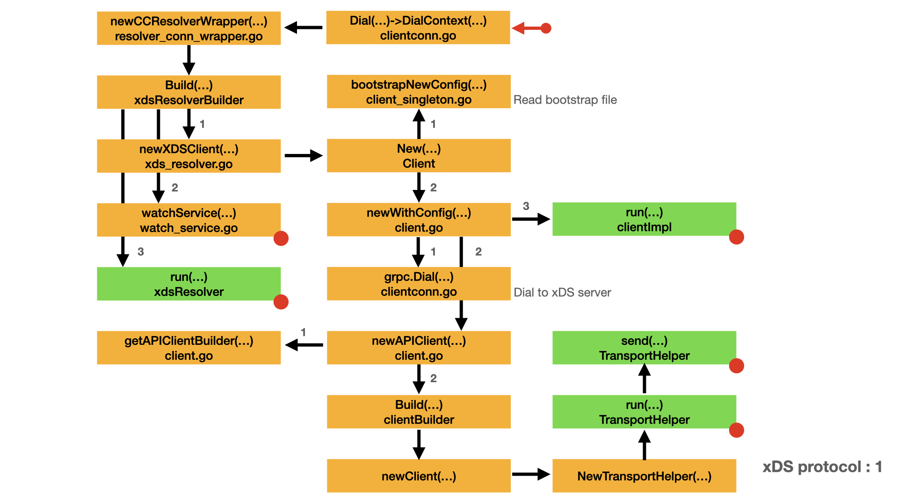
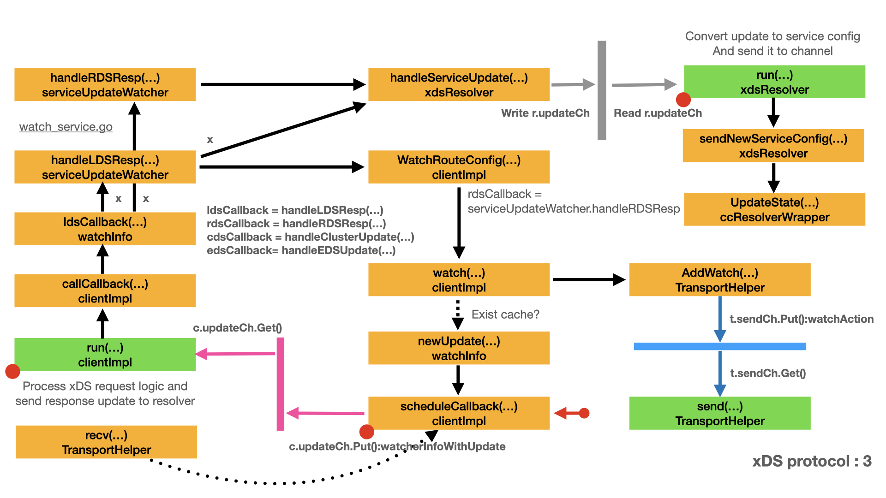

# xDS protocol support

- [Protocol buffers map for xDS v3 API](#protocol-buffers-map-for-xds-v3-api)
- [Connect with xDS Server](#connect-with-xds-server)
  - [xDS bootstrap file](#xds-bootstrap-file)
  - [`xdsResolverBuilder`](#xdsresolverbuilder)
  - [Prepare `Config` from bootstrap file](#prepare-config-from-bootstrap-file)
  - [Dial to xDS server](#dial-to-xds-server)
  - [v3 API client](#v3-api-client)
- [Communicate with xDS server](#communicate-with-xds-server)
  - [First LDS request](#first-lds-request)
  - [Prepare ADS stream](#prepare-ads-stream)
  - [Send LDS request](#send-lds-request)
  - [Get resource response](#get-resource-response)
  - [Handle LDS response](#handle-lds-response)
- [Transform into ServiceConfig](#transform-into-serviceconfig)
  - [LDS callback](#lds-callback)
  - [Send RDS request](#send-rds-request)
  - [Handle RDS response](#handle-rds-response)

The gRPC team believe that Envoy proxy (actually, any data plane) is not the only solution for service mesh. By support xDS protocol gRPC can take the role of Envoy proxy. In general gRPC wants to build a proxy-less service mesh without data plane.  See [xDS Support in gRPC - Mark D. Roth](https://www.youtube.com/watch?v=IbcJ8kNmsrE) and [Traffic Director and gRPC—proxyless services for your service mesh](https://cloud.google.com/blog/products/networking/traffic-director-supports-proxyless-grpc).

From the view of data plane API, envoy proxy is a client. gRPC is another different client, while gRPC only supports partial capability of Envoy proxy. Although they are different client with different design goal, they may share the same management server (control plane) and the same data plane API.  

The following is the design document for xDS protocol support. It's a good start point to understand the code. It's not easy to understand these documents if you are not familiar with Envoy proxy. It took me several weeks to read the [Envoy document](https://www.envoyproxy.io/docs/envoy/latest/about_docs) and [xDS REST and gRPC protocol](https://www.envoyproxy.io/docs/envoy/latest/api-docs/xds_protocol) before the following documents.

- [xDS-Based Global Load Balancing](https://github.com/grpc/proposal/blob/master/A27-xds-global-load-balancing.md)
- [Load Balancing Policy Configuration](https://github.com/grpc/proposal/blob/master/A24-lb-policy-config.md)
- [gRPC xDS traffic splitting and routing](https://github.com/grpc/proposal/blob/master/A28-xds-traffic-splitting-and-routing.md)
- [xDS v3 Support](https://github.com/grpc/proposal/blob/master/A30-xds-v3.md)
- [gRPC xDS Timeout Support and Config Selector Design](https://github.com/grpc/proposal/blob/master/A31-xds-timeout-support-and-config-selector.md)
- [gRPC xDS circuit breaking](https://github.com/grpc/proposal/blob/master/A32-xds-circuit-breaking.md)

There are [four variants of the xDS Transport Protocol](https://www.envoyproxy.io/docs/envoy/latest/api-docs/xds_protocol#four-variants). gRPC only supports the Aggregate Discovery Service (ADS) variant of xDS. Start from 2021, xDS v3 is the main API version supported by gRPC.

"In the future, we may add support for the incremental ADS variant of xDS. However, we have no plans to support any non-aggregated variants of xDS, nor do we plan to support REST or filesystem subscription."

For xDS protocol support, `RouteConfiguration` and `ServiceConfig` are important data structure. Envoy's [RouteConfiguration](https://github.com/envoyproxy/envoy/blob/9e83625b16851cdc7e4b0a4483b0ce07c33ba76b/api/envoy/api/v2/route.proto#L24) is different from gRPC's [ServiceConfig](https://github.com/grpc/grpc-proto/blob/master/grpc/service_config/service_config.proto). While gRPC intends to populate `ServiceConfig` with the data from `RouteConfiguration`. In brief summary:

- Utilizes bootstrap file to create the connection with xDS server.
- Communicates with xDS server to get the `RouteConfiguration`.
- Transform `RouteConfiguration` into `ServiceConfig`.
- Use `ServiceConfig` and balancer to make the business RPC call.

Before jump into the code, Let's prepare some maps to avoid lost in the code sea. Later you will need more maps. Envoy is a huge complex projct. xDS support is try to implement part of Envoy features. Which means xDS protocol support in gRPC is also a complex project.

## Protocol buffers map for xDS v3 API

I found adding the following information can help me to understand the relationship between xDS data structure. It is easy to get lost.  Especially for a Envoy newbie. Note that `static_resources` is not used in xDS protocol, instead it uses `dynamic_resources`. Yet xDS share the same proto (data structure) with static configuration.  

- LDS: [Listener](https://www.envoyproxy.io/docs/envoy/latest/api-v3/config/listener/v3/listener.proto#config-listener-v3-listener) -> [filter_chains](https://www.envoyproxy.io/docs/envoy/latest/api-v3/config/listener/v3/listener_components.proto#envoy-v3-api-msg-config-listener-v3-filterchain) -> [filters](https://www.envoyproxy.io/docs/envoy/latest/api-v3/config/listener/v3/listener_components.proto#envoy-v3-api-msg-config-listener-v3-filter) -> [HTTP connection manager](https://www.envoyproxy.io/docs/envoy/latest/api-v3/extensions/filters/network/http_connection_manager/v3/http_connection_manager.proto#envoy-v3-api-msg-extensions-filters-network-http-connection-manager-v3-httpconnectionmanager) -> [route_config](https://www.envoyproxy.io/docs/envoy/latest/api-v3/config/route/v3/route.proto#envoy-v3-api-msg-config-route-v3-routeconfiguration) RouteConfiguration
- RDS: [RouteConfiguration](https://www.envoyproxy.io/docs/envoy/latest/api-v3/config/route/v3/route.proto#envoy-v3-api-msg-config-route-v3-routeconfiguration) -> [virtual_hosts](https://www.envoyproxy.io/docs/envoy/latest/api-v3/config/route/v3/route_components.proto#envoy-v3-api-msg-config-route-v3-virtualhost) -> [routes](https://www.envoyproxy.io/docs/envoy/latest/api-v3/config/route/v3/route_components.proto#envoy-v3-api-msg-config-route-v3-route) -> [route](https://www.envoyproxy.io/docs/envoy/latest/api-v3/config/route/v3/route_components.proto#envoy-v3-api-msg-config-route-v3-routeaction) -> cluster: name

Example YAML:  

```yaml
static_resources:

  listeners:
  - name: listener_0
    address:
      socket_address:
        address: 0.0.0.0
        port_value: 10000
    filter_chains:
    - filters:
      - name: envoy.filters.network.http_connection_manager
        typed_config:
          "@type": type.googleapis.com/envoy.extensions.filters.network.http_connection_manager.v3.HttpConnectionManager
          stat_prefix: ingress_http
          access_log:
          - name: envoy.access_loggers.file
            typed_config:
              "@type": type.googleapis.com/envoy.extensions.access_loggers.file.v3.FileAccessLog
              path: /dev/stdout
          http_filters:
          - name: envoy.filters.http.router
          route_config:
            name: local_route
            virtual_hosts:
            - name: local_service
              domains: ["*"]
              routes:
              - match:
                  prefix: "/"
                route:
                  host_rewrite_literal: www.envoyproxy.io
                  cluster: service_envoyproxy_io
```

- CDS: [Cluster](https://www.envoyproxy.io/docs/envoy/latest/api-v3/config/cluster/v3/cluster.proto#config-cluster-v3-cluster) -> [load_assignment](https://www.envoyproxy.io/docs/envoy/latest/api-v3/config/endpoint/v3/endpoint.proto#envoy-v3-api-msg-config-endpoint-v3-clusterloadassignment) ClusterLoadAssignment
- EDS: [ClusterLoadAssignment](https://www.envoyproxy.io/docs/envoy/latest/api-v3/config/endpoint/v3/endpoint.proto#envoy-v3-api-msg-config-endpoint-v3-clusterloadassignment) -> [endpoints](https://www.envoyproxy.io/docs/envoy/latest/api-v3/config/endpoint/v3/endpoint_components.proto#envoy-v3-api-msg-config-endpoint-v3-localitylbendpoints) -> [lb_endpoints](https://www.envoyproxy.io/docs/envoy/latest/api-v3/config/endpoint/v3/endpoint_components.proto#envoy-v3-api-msg-config-endpoint-v3-lbendpoint) -> [endpoint](https://www.envoyproxy.io/docs/envoy/latest/api-v3/config/endpoint/v3/endpoint_components.proto#envoy-v3-api-msg-config-endpoint-v3-endpoint) -> [address](https://www.envoyproxy.io/docs/envoy/latest/api-v3/config/core/v3/address.proto#envoy-v3-api-msg-config-core-v3-address) -> [socket_address](https://www.envoyproxy.io/docs/envoy/latest/api-v3/config/core/v3/address.proto#envoy-v3-api-msg-config-core-v3-socketaddress)

Example YAML:  

```yaml
                  cluster: service_envoyproxy_io

  clusters:
  - name: service_envoyproxy_io
    connect_timeout: 30s
    type: LOGICAL_DNS
    # Comment out the following line to test on v6 networks
    dns_lookup_family: V4_ONLY
    load_assignment:
      cluster_name: service_envoyproxy_io
      endpoints:
      - lb_endpoints:
        - endpoint:
            address:
              socket_address:
                address: www.envoyproxy.io
                port_value: 443
    transport_socket:
      name: envoy.transport_sockets.tls
      typed_config:
        "@type": type.googleapis.com/envoy.extensions.transport_sockets.tls.v3.UpstreamTlsContext
        sni: www.envoyproxy.io
```

## Connect with xDS Server

In this stage, we will utilizes bootstrap file to create the connection with xDS server. Here is another map for this stage.  In this map:

- Yellow box represents the important type and method/function.
- Green box represents a function run in a dedicated goroutine.
- Arrow represents the call direction and order.
- Red dot means there is another map to be continue for that box.



In this stage, we will accomplish the following job:

- Uses xDS resolver builder to build the xDS resolver.
- Creates the xDS client to connect with the xDS server.
- Prepares for the response from xDS server.

### xDS bootstrap file

gRPC uses `XdsClient` to interact with xDS management server. `XdsClient` need a bootstrap file which is a JSON file. The bootstrap file is determined via the `GRPC_XDS_BOOTSTRAP` environment variable.  

The following is the definition of bootstrap JSON file.

```go
type bootstrapConfig struct {
    XdsServers               []server                   `json:"xds_servers,omitempty"`
    Node                     node                       `json:"node,omitempty"`
    CertificateProviders     map[string]json.RawMessage `json:"certificate_providers,omitempty"`
    GRPCServerResourceNameID string                     `json:"grpc_server_resource_name_id,omitempty"`
}

type server struct {
    ServerURI      string   `json:"server_uri,omitempty"`
    ChannelCreds   []creds  `json:"channel_creds,omitempty"`
    ServerFeatures []string `json:"server_features,omitempty"`
}

type creds struct {
    Type   string      `json:"type,omitempty"`
    Config interface{} `json:"config,omitempty"`
}

type node struct {
    ID string `json:"id,omitempty"`
}

```

The example of the gRPC xDS bootstrap file.

```json
{
   "xds_server": [
     {
       "server_uri": <string containing URI of management server>,
       "channel_creds": [
         {
           "type": <string containing channel cred type>,
           "config": <JSON object containing config for the type>
         }
       ],
       "server_features": [ ... ],
     }
   ],
   "node": <JSON form of Node proto>,
   "certificate_providers" : {
     "default": {
       "plugin_name": "default-plugin-name",
       "config": { default plugin config in JSON }
      },
     "foo": {
       "plugin_name": "foo",
       "config": { foo plugin config in JSON }
     }
   },
   "grpc_server_resource_name_id": "grpc/server"
}


```

Comparing it with the Envoy bootstrap file for ADS.  The `node` field in xDS bootstrap file will be populated with the xDS [Node proto](https://www.envoyproxy.io/docs/envoy/latest/api-v3/config/core/v3/base.proto#config-core-v3-node).

Add more information about `certificate_providers` and `grpc_server_resource_name_id` and `xds_server` TODO

```yaml
node:
  cluster: test-cluster
  id: test-id

dynamic_resources:
  ads_config:
    api_type: GRPC
    transport_api_version: V3
    grpc_services:
    - envoy_grpc:
        cluster_name: xds_cluster
  cds_config:
    resource_api_version: V3
    ads: {}
  lds_config:
    resource_api_version: V3
    ads: {}

static_resources:
  clusters:
  - connect_timeout: 1s
    type: strict_dns
    typed_extension_protocol_options:
      envoy.extensions.upstreams.http.v3.HttpProtocolOptions:
        "@type": type.googleapis.com/envoy.extensions.upstreams.http.v3.HttpProtocolOptions
        explicit_http_config:
          http2_protocol_options: {}
    name: xds_cluster
    load_assignment:
      cluster_name: xds_cluster
      endpoints:
      - lb_endpoints:
        - endpoint:
            address:
              socket_address:
                address: my-control-plane
                port_value: 18000

admin:
  access_log_path: /dev/null
  address:
    socket_address:
      address: 0.0.0.0
```

### `xdsResolverBuilder`

If the user application uses `xds:///example.grpc.io` as target URI, gRPC will start the `XdsClient` initialization process. `xdsResolverBuilder.Build()` will be called to prepare for the interaction with xDS server and return the resolver to gRPC.

- `Build()` calls `newXDSClient()` to build the `XdsClient`.
- `Build()` calls `watchService()` to register a watch. See [Communicate with xDS server](#communicate-with-xds-server) for detail.
- `Build()` starts a goroutine `r.run()` to receive the service update. See [Transform into ServiceConfig](#transform-into-serviceconfig) for detail.

Let's discuss the `newXDSClient()` in detail next.

```go
const xdsScheme = "xds"

// For overriding in unittests.
var newXDSClient = func() (xdsClientInterface, error) { return xdsclient.New() }

func init() {
    resolver.Register(&xdsResolverBuilder{})
}

type xdsResolverBuilder struct{}

// Build helps implement the resolver.Builder interface.
//
// The xds bootstrap process is performed (and a new xds client is built) every
// time an xds resolver is built.
func (b *xdsResolverBuilder) Build(t resolver.Target, cc resolver.ClientConn, opts resolver.BuildOptions) (resolver.Resolver, error) {
    r := &xdsResolver{
        target:         t,
        cc:             cc,
        closed:         grpcsync.NewEvent(),
        updateCh:       make(chan suWithError, 1),
        activeClusters: make(map[string]*clusterInfo),
    }
    r.logger = prefixLogger((r))
    r.logger.Infof("Creating resolver for target: %+v", t)

    client, err := newXDSClient()
    if err != nil {
        return nil, fmt.Errorf("xds: failed to create xds-client: %v", err)
    }
    r.client = client

    // If xds credentials were specified by the user, but bootstrap configs do
    // not contain any certificate provider configuration, it is better to fail
    // right now rather than failing when attempting to create certificate
    // providers after receiving an CDS response with security configuration.
    var creds credentials.TransportCredentials
    switch {
    case opts.DialCreds != nil:
        creds = opts.DialCreds
    case opts.CredsBundle != nil:
        creds = opts.CredsBundle.TransportCredentials()
    }
    if xc, ok := creds.(interface{ UsesXDS() bool }); ok && xc.UsesXDS() {
        bc := client.BootstrapConfig()
        if len(bc.CertProviderConfigs) == 0 {
            return nil, errors.New("xds: xdsCreds specified but certificate_providers config missing in bootstrap file")
        }
    }

    // Register a watch on the xdsClient for the user's dial target.
    cancelWatch := watchService(r.client, r.target.Endpoint, r.handleServiceUpdate, r.logger)
    r.logger.Infof("Watch started on resource name %v with xds-client %p", r.target.Endpoint, r.client)
    r.cancelWatch = func() {
        cancelWatch()
        r.logger.Infof("Watch cancel on resource name %v with xds-client %p", r.target.Endpoint, r.client)
    }

    go r.run()
    return r, nil
}

// Name helps implement the resolver.Builder interface.
func (*xdsResolverBuilder) Scheme() string {
    return xdsScheme
}

```

### Prepare `Config` from bootstrap file

`newXDSClient()` is a wrapper for `Client.New()`. `Client` is a singleton and a wrapper for `clientImpl` and maintains the reference count `refcount` to itself.

- `Client.New()` calls `bootstrapNewConfig()` to read the file specified in `GRPC_XDS_BOOTSTRAP` environment variable. It returns a `bootstrap.Config`. Which means `bootstrapNewConfig()` reads the bootstrap file and converts the content into `bootstrap.Config`. `bootstrap.Config` is an internal data structure for xDS client.
  - `bootstrapNewConfig()` is `bootstrap.NewConfig()`, which is actually `Config.NewConfig()`.
  - `Config.NewConfig()` calls `bootstrapConfigFromEnvVariable()` to read the file specified in either `GRPC_XDS_BOOTSTRAP` or `GRPC_XDS_BOOTSTRAP_CONFIG`
  - Here we does not show the code of `bootstrapConfigFromEnvVariable()`. It's simple enough.
  - Then `Config.NewConfig()` uses JSON decoder to decode the bootstrap data into `config` object.
    - `config.NodeProto` copies from `node`, note: the `node` data is transformed from JSON to `v3.Node proto`.
    - `config.BalancerName` copies from the first `server_uri`,
    - `config.Creds` comes from the first `channel_creds`,
    - `config.CertProviderConfigs` comes from `certificate_providers`
    - `config.ServerResourceNameID` comes from `grpc_server_resource_name_id`
    - `config.TransportAPI` is `version.TransportV2` by default. If the Server supports v3 and `GRPC_XDS_EXPERIMENTAL_V3_SUPPORT` is true, `config.TransportAPI` is `version.TransportV3`
  - `Config.NewConfig()` calls `config.updateNodeProto()` to automatically fill in some fields of `NodeProto`.
    - `config.updateNodeProto()` supports both xDS v2 and v3. We will explain it in v3 because v2 is no longer support by Envoy.
    - `UserAgentName` get the value `"gRPC Go"`
    - `UserAgentVersionType` get the value `{"userAgentVersion":"1.36.0-dev"}`
    - `ClientFeatures` get the value `"envoy.lb.does_not_support_overprovisioning"`
  - Now the `config` object is ready, bootstrap file accomplishes its job.
- `Client.New()` calls `newWithConfig()` to use the `bootstrap.Config` to create a `clientImpl`, which is the real `XdsClient`.

It's long enough. Let's discuss `newWithConfig()` in next part.

```go
// This is the Client returned by New(). It contains one client implementation,
// and maintains the refcount.
var singletonClient = &Client{}

// To override in tests.
var bootstrapNewConfig = bootstrap.NewConfig

// Client is a full fledged gRPC client which queries a set of discovery APIs
// (collectively termed as xDS) on a remote management server, to discover
// various dynamic resources.
//
// The xds client is a singleton. It will be shared by the xds resolver and
// balancer implementations, across multiple ClientConns and Servers.
type Client struct {
    *clientImpl

    // This mu protects all the fields, including the embedded clientImpl above.
    mu       sync.Mutex
    refCount int
}

// New returns a new xdsClient configured by the bootstrap file specified in env
// variable GRPC_XDS_BOOTSTRAP.
func New() (*Client, error) {
    singletonClient.mu.Lock()
    defer singletonClient.mu.Unlock()
    // If the client implementation was created, increment ref count and return
    // the client.
    if singletonClient.clientImpl != nil {
        singletonClient.refCount++
        return singletonClient, nil
    }
  
    // Create the new client implementation.
    config, err := bootstrapNewConfig()
    if err != nil {
        return nil, fmt.Errorf("xds: failed to read bootstrap file: %v", err)
    }
    c, err := newWithConfig(config, defaultWatchExpiryTimeout)
    if err != nil {
        return nil, err
    }

    singletonClient.clientImpl = c
    singletonClient.refCount++
    return singletonClient, nil
}

// NewConfig returns a new instance of Config initialized by reading the
// bootstrap file found at ${GRPC_XDS_BOOTSTRAP}.
//
// The format of the bootstrap file will be as follows:
// {
//    "xds_server": {
//      "server_uri": <string containing URI of management server>,
//      "channel_creds": [
//        {
//          "type": <string containing channel cred type>,
//          "config": <JSON object containing config for the type>
//        }
//      ],
//      "server_features": [ ... ],
//    },
//    "node": <JSON form of Node proto>,
//    "certificate_providers" : {
//      "default": {
//        "plugin_name": "default-plugin-name",
//        "config": { default plugin config in JSON }
//       },
//      "foo": {
//        "plugin_name": "foo",
//        "config": { foo plugin config in JSON }
//      }
//    },
//    "grpc_server_resource_name_id": "grpc/server"
// }
//
// Currently, we support exactly one type of credential, which is
// "google_default", where we use the host's default certs for transport
// credentials and a Google oauth token for call credentials.
//
// This function tries to process as much of the bootstrap file as possible (in
// the presence of the errors) and may return a Config object with certain
// fields left unspecified, in which case the caller should use some sane
// defaults.
func NewConfig() (*Config, error) {
    config := &Config{}

    data, err := bootstrapConfigFromEnvVariable()
    if err != nil {
        return nil, fmt.Errorf("xds: Failed to read bootstrap config: %v", err)
    }
    logger.Debugf("Bootstrap content: %s", data)

    var jsonData map[string]json.RawMessage
    if err := json.Unmarshal(data, &jsonData); err != nil {
        return nil, fmt.Errorf("xds: Failed to parse bootstrap config: %v", err)
    }

    serverSupportsV3 := false
    m := jsonpb.Unmarshaler{AllowUnknownFields: true}
    for k, v := range jsonData {
        switch k {
        case "node":
            // We unconditionally convert the JSON into a v3.Node proto. The v3
            // proto does not contain the deprecated field "build_version" from
            // the v2 proto. We do not expect the bootstrap file to contain the
            // "build_version" field. In any case, the unmarshal will succeed
            // because we have set the `AllowUnknownFields` option on the
            // unmarshaler.
            n := &v3corepb.Node{}
            if err := m.Unmarshal(bytes.NewReader(v), n); err != nil {
                return nil, fmt.Errorf("xds: jsonpb.Unmarshal(%v) for field %q failed during bootstrap: %v", string(v), k, err)
            }
            config.NodeProto = n
        case "xds_servers":
            var servers []*xdsServer
            if err := json.Unmarshal(v, &servers); err != nil {
                return nil, fmt.Errorf("xds: json.Unmarshal(%v) for field %q failed during bootstrap: %v", string(v), k, err)
            }
            if len(servers) < 1 {
                return nil, fmt.Errorf("xds: bootstrap file parsing failed during bootstrap: file doesn't contain any management server to connect to")
            }
            xs := servers[0]
            config.BalancerName = xs.ServerURI
            for _, cc := range xs.ChannelCreds {
                // We stop at the first credential type that we support.
                if cc.Type == credsGoogleDefault {
                    config.Creds = grpc.WithCredentialsBundle(google.NewDefaultCredentials())
                    break
                } else if cc.Type == credsInsecure {
                    config.Creds = grpc.WithTransportCredentials(insecure.NewCredentials())
                    break
                }
            }
            for _, f := range xs.ServerFeatures {
                switch f {
                case serverFeaturesV3:
                    serverSupportsV3 = true
                }
            }
        case "certificate_providers":
            var providerInstances map[string]json.RawMessage
            if err := json.Unmarshal(v, &providerInstances); err != nil {
                return nil, fmt.Errorf("xds: json.Unmarshal(%v) for field %q failed during bootstrap: %v", string(v), k, err)
            }
            configs := make(map[string]*certprovider.BuildableConfig)
            getBuilder := internal.GetCertificateProviderBuilder.(func(string) certprovider.Builder)
            for instance, data := range providerInstances {
                var nameAndConfig struct {
                    PluginName string          `json:"plugin_name"`
                    Config     json.RawMessage `json:"config"`
                }
                if err := json.Unmarshal(data, &nameAndConfig); err != nil {
                    return nil, fmt.Errorf("xds: json.Unmarshal(%v) for field %q failed during bootstrap: %v", string(v), instance, err)
                }

                name := nameAndConfig.PluginName
                parser := getBuilder(nameAndConfig.PluginName)
                if parser == nil {
                    // We ignore plugins that we do not know about.
                    continue
                }
                bc, err := parser.ParseConfig(nameAndConfig.Config)
                if err != nil {
                    return nil, fmt.Errorf("xds: Config parsing for plugin %q failed: %v", name, err)
                }
                configs[instance] = bc
            }
            config.CertProviderConfigs = configs
        case "grpc_server_resource_name_id":
            if err := json.Unmarshal(v, &config.ServerResourceNameID); err != nil {
                return nil, fmt.Errorf("xds: json.Unmarshal(%v) for field %q failed during bootstrap: %v", string(v), k, err)
            }
        }
        // Do not fail the xDS bootstrap when an unknown field is seen. This can
        // happen when an older version client reads a newer version bootstrap
        // file with new fields.
    }

    if config.BalancerName == "" {
        return nil, fmt.Errorf("xds: Required field %q not found in bootstrap %s", "xds_servers.server_uri", jsonData["xds_servers"])
    }
    if config.Creds == nil {
        return nil, fmt.Errorf("xds: Required field %q doesn't contain valid value in bootstrap %s", "xds_servers.channel_creds", jsonData["xds_servers"])
    }

    // We end up using v3 transport protocol version only if the following
    // conditions are met:
    // 1. Server supports v3, indicated by the presence of "xds_v3" in
    //    server_features.
    // 2. Environment variable "GRPC_XDS_EXPERIMENTAL_V3_SUPPORT" is set to
    //    true.
    // The default value of the enum type "version.TransportAPI" is v2.
    if env.V3Support && serverSupportsV3 {
        config.TransportAPI = version.TransportV3
    }

    if err := config.updateNodeProto(); err != nil {
        return nil, err
    }
    logger.Infof("Bootstrap config for creating xds-client: %+v", config)
    return config, nil
}

// updateNodeProto updates the node proto read from the bootstrap file.
//
// Node proto in Config contains a v3.Node protobuf message corresponding to the
// JSON contents found in the bootstrap file. This method performs some post
// processing on it:
// 1. If we don't find a nodeProto in the bootstrap file, we create an empty one
// here. That way, callers of this function can always expect that the NodeProto
// field is non-nil.
// 2. If the transport protocol version to be used is not v3, we convert the
// current v3.Node proto in a v2.Node proto.
// 3. Some additional fields which are not expected to be set in the bootstrap
// file are populated here.
func (c *Config) updateNodeProto() error {
    if c.TransportAPI == version.TransportV3 {
        v3, _ := c.NodeProto.(*v3corepb.Node)
        if v3 == nil {
            v3 = &v3corepb.Node{}
        }
        v3.UserAgentName = gRPCUserAgentName
        v3.UserAgentVersionType = &v3corepb.Node_UserAgentVersion{UserAgentVersion: grpc.Version}
        v3.ClientFeatures = append(v3.ClientFeatures, clientFeatureNoOverprovisioning)
        c.NodeProto = v3
        return nil
    }

    v2 := &v2corepb.Node{}
    if c.NodeProto != nil {
        v3, err := proto.Marshal(c.NodeProto)
        if err != nil {
            return fmt.Errorf("xds: proto.Marshal(%v): %v", c.NodeProto, err)
        }
        if err := proto.Unmarshal(v3, v2); err != nil {
            return fmt.Errorf("xds: proto.Unmarshal(%v): %v", v3, err)
        }
    }
    c.NodeProto = v2

    // BuildVersion is deprecated, and is replaced by user_agent_name and
    // user_agent_version. But the management servers are still using the old
    // field, so we will keep both set.
    v2.BuildVersion = gRPCVersion
    v2.UserAgentName = gRPCUserAgentName
    v2.UserAgentVersionType = &v2corepb.Node_UserAgentVersion{UserAgentVersion: grpc.Version}
    v2.ClientFeatures = append(v2.ClientFeatures, clientFeatureNoOverprovisioning)
    return nil
}
```

### Dial to xDS server

The goal of `newWithConfig()` is to create the `XdsClient`, which connect with the xDS server.

- `newWithConfig()` checks the `config` fields and prepares the `grpc.DialOption`, and creates the `clientImpl` object `c`.
- `config.Creds` is used as `grpc.DialOption` to create the TLS connection with the xDS server.
- `config.BalancerName` is used as target parameter for `grpc.Dial()`, `config.BalancerName` comes from `server_uri`. So `server_uri` is the target xDS server name.
- After `grpc.Dial()` successfully returns the `grpc.*ClientConn`, the connection to xDS server is ready. See [Dial process](dial.md) for detail.
- `newWithConfig()`  calls `newAPIClient()` to build the v2 or v3 `APIClient` according to the `config.TransportAPI` parameter.
  - `APIClientBuilder` creates an xDS client for a specific xDS transport protocol. There are two registered `APIClientBuilder` available: v2 builder and v3 builder.
  - `newAPIClient()` calls `getAPIClientBuilder()` to get the API builder `cb`.
  - `getAPIClientBuilder()` uses the `config.TransportAPI` as parameter to determine which `APIClientBuilder` to use.
  - `newAPIClient()` calls `cb.Build()` to build the v2 or v3 API client.
  - We will discuss the v3 `APIClientBuilder` in next chapter.
- After `apiClient` is ready, `c.run()` will be called to start a goroutine.
  - `c.run()` is responsible for async callback for watched update. See [Transform into ServiceConfig](#transform-into-serviceconfig) for detail.

Lets discsuss `APIClientBuilder` in next chapter.

```go
// newWithConfig returns a new xdsClient with the given config.
func newWithConfig(config *bootstrap.Config, watchExpiryTimeout time.Duration) (*clientImpl, error) {
    switch {
    case config.BalancerName == "":
        return nil, errors.New("xds: no xds_server name provided in options")
    case config.Creds == nil:
        return nil, errors.New("xds: no credentials provided in options")
    case config.NodeProto == nil:
        return nil, errors.New("xds: no node_proto provided in options")
    }

    switch config.TransportAPI {
    case version.TransportV2:
        if _, ok := config.NodeProto.(*v2corepb.Node); !ok {
            return nil, fmt.Errorf("xds: Node proto type (%T) does not match API version: %v", config.NodeProto, config.TransportAPI)
        }
    case version.TransportV3:
        if _, ok := config.NodeProto.(*v3corepb.Node); !ok {
            return nil, fmt.Errorf("xds: Node proto type (%T) does not match API version: %v", config.NodeProto, config.TransportAPI)
        }
    }

    dopts := []grpc.DialOption{
        config.Creds,
        grpc.WithKeepaliveParams(keepalive.ClientParameters{
            Time:    5 * time.Minute,
            Timeout: 20 * time.Second,
        }),
    }

    c := &clientImpl{
        done:               grpcsync.NewEvent(),
        config:             config,
        watchExpiryTimeout: watchExpiryTimeout,

        updateCh:    buffer.NewUnbounded(),
        ldsWatchers: make(map[string]map[*watchInfo]bool),
        ldsCache:    make(map[string]ListenerUpdate),
        rdsWatchers: make(map[string]map[*watchInfo]bool),
        rdsCache:    make(map[string]RouteConfigUpdate),
        cdsWatchers: make(map[string]map[*watchInfo]bool),
        cdsCache:    make(map[string]ClusterUpdate),
        edsWatchers: make(map[string]map[*watchInfo]bool),
        edsCache:    make(map[string]EndpointsUpdate),
        lrsClients:  make(map[string]*lrsClient),
    }

    cc, err := grpc.Dial(config.BalancerName, dopts...)
    if err != nil {
        // An error from a non-blocking dial indicates something serious.
        return nil, fmt.Errorf("xds: failed to dial balancer {%s}: %v", config.BalancerName, err)
    }
    c.cc = cc
    c.logger = prefixLogger((c))
    c.logger.Infof("Created ClientConn to xDS management server: %s", config.BalancerName)

    apiClient, err := newAPIClient(config.TransportAPI, cc, BuildOptions{
        Parent:    c,
        NodeProto: config.NodeProto,
        Backoff:   backoff.DefaultExponential.Backoff,
        Logger:    c.logger,
    })
    if err != nil {
        return nil, err
    }
    c.apiClient = apiClient
    c.logger.Infof("Created")
    go c.run()
    return c, nil
}

// Function to be overridden in tests.
var newAPIClient = func(apiVersion version.TransportAPI, cc *grpc.ClientConn, opts BuildOptions) (APIClient, error) {
    cb := getAPIClientBuilder(apiVersion)
    if cb == nil {
        return nil, fmt.Errorf("no client builder for xDS API version: %v", apiVersion)
    }
    return cb.Build(cc, opts)
}

var (
    m = make(map[version.TransportAPI]APIClientBuilder)
)

// RegisterAPIClientBuilder registers a client builder for xDS transport protocol
// version specified by b.Version().
//
// NOTE: this function must only be called during initialization time (i.e. in
// an init() function), and is not thread-safe. If multiple builders are
// registered for the same version, the one registered last will take effect.
func RegisterAPIClientBuilder(b APIClientBuilder) {
    m[b.Version()] = b
}

// getAPIClientBuilder returns the client builder registered for the provided
// xDS transport API version.
func getAPIClientBuilder(version version.TransportAPI) APIClientBuilder {
    if b, ok := m[version]; ok {
        return b
    }
    return nil
}

// APIClientBuilder creates an xDS client for a specific xDS transport protocol
// version.
type APIClientBuilder interface {
    // Build builds a transport protocol specific implementation of the xDS
    // client based on the provided clientConn to the management server and the
    // provided options.
    Build(*grpc.ClientConn, BuildOptions) (APIClient, error)
    // Version returns the xDS transport protocol version used by clients build
    // using this builder.
    Version() version.TransportAPI
}

// run is a goroutine for all the callbacks.
//
// Callback can be called in watch(), if an item is found in cache. Without this
// goroutine, the callback will be called inline, which might cause a deadlock
// in user's code. Callbacks also cannot be simple `go callback()` because the
// order matters.
func (c *clientImpl) run() {
    for {
        select {
        case t := <-c.updateCh.Get():
            c.updateCh.Load()
            if c.done.HasFired() {
                return
            }
            c.callCallback(t.(*watcherInfoWithUpdate))
        case <-c.done.Done():
            return
        }
    }
}
```

### v3 API client

Here is the v3 `APIClientBuilder`. Please note that v3 API is registered by the `init()` function. Once this package is imported by application the v3 API is ready for use.

- `APIClientBuilder.Build()` will call `newClient()`.
- `newClient()` creates a `v3c` object and uses `v3c` as parameter to call `xdsclient.NewTransportHelper()` to get the `TransportHelper`.
- `NewTransportHelper()` creates `TransportHelper` object and start a goroutine `t.run()`.
  - Inside `run()` starts a goroutine `t.send()`
- `send()` is responsible for sending data to the stream.  See [Communicate with xDS server](#communicate-with-xds-server) for detail.
- `run()` is responsible for receiving data from the stream.  See [Communicate with xDS server](#communicate-with-xds-server) for detail.
- Once `TransportHelper` is ready. `newClient()` returns the `v3c`.

In next chapter, We will continue the discussion how to communicate with xDS server.

```go
func init() {
    xdsclient.RegisterAPIClientBuilder(clientBuilder{})
}

var (
    resourceTypeToURL = map[xdsclient.ResourceType]string{
        xdsclient.ListenerResource:    version.V3ListenerURL,
        xdsclient.RouteConfigResource: version.V3RouteConfigURL,
        xdsclient.ClusterResource:     version.V3ClusterURL,
        xdsclient.EndpointsResource:   version.V3EndpointsURL,
    }
)

type clientBuilder struct{}

func (clientBuilder) Build(cc *grpc.ClientConn, opts xdsclient.BuildOptions) (xdsclient.APIClient, error) {
    return newClient(cc, opts)
}

func (clientBuilder) Version() version.TransportAPI {
    return version.TransportV3
}

func newClient(cc *grpc.ClientConn, opts xdsclient.BuildOptions) (xdsclient.APIClient, error) {
    nodeProto, ok := opts.NodeProto.(*v3corepb.Node)
    if !ok {
        return nil, fmt.Errorf("xds: unsupported Node proto type: %T, want %T", opts.NodeProto, v3corepb.Node{})
    }
    v3c := &client{
        cc:        cc,
        parent:    opts.Parent,
        nodeProto: nodeProto,
        logger:    opts.Logger,
    }
    v3c.ctx, v3c.cancelCtx = context.WithCancel(context.Background())
    v3c.TransportHelper = xdsclient.NewTransportHelper(v3c, opts.Logger, opts.Backoff)
    return v3c, nil
}

// NewTransportHelper creates a new transport helper to be used by versioned
// client implementations.
func NewTransportHelper(vc VersionedClient, logger *grpclog.PrefixLogger, backoff func(int) time.Duration) *TransportHelper {
    ctx, cancelCtx := context.WithCancel(context.Background())
    t := &TransportHelper{
        cancelCtx: cancelCtx,
        vClient:   vc,
        logger:    logger,
        backoff:   backoff,

        streamCh:   make(chan grpc.ClientStream, 1),
        sendCh:     buffer.NewUnbounded(),
        watchMap:   make(map[ResourceType]map[string]bool),
        versionMap: make(map[ResourceType]string),
        nonceMap:   make(map[ResourceType]string),
    }

    go t.run(ctx)
    return t
}

// run starts an ADS stream (and backs off exponentially, if the previous
// stream failed without receiving a single reply) and runs the sender and
// receiver routines to send and receive data from the stream respectively.
func (t *TransportHelper) run(ctx context.Context) {
    go t.send(ctx)
    // TODO: start a goroutine monitoring ClientConn's connectivity state, and
    // report error (and log) when stats is transient failure.

    retries := 0
    for {
        select {  
        case <-ctx.Done():
            return
        default:
        }

        if retries != 0 {
            timer := time.NewTimer(t.backoff(retries))
            select {
            case <-timer.C:
            case <-ctx.Done():
                if !timer.Stop() {
                    <-timer.C
                }
                return
            }
        }

        retries++
        stream, err := t.vClient.NewStream(ctx)
        if err != nil {
            t.logger.Warningf("xds: ADS stream creation failed: %v", err)
            continue
        }
        t.logger.Infof("ADS stream created")

        select {
        case <-t.streamCh:
        default:
        }
        t.streamCh <- stream
        if t.recv(stream) {
            retries = 0
        }
    }
}

// send is a separate goroutine for sending watch requests on the xds stream.
//
// It watches the stream channel for new streams, and the request channel for
// new requests to send on the stream.
//
// For each new request (watchAction), it's
//  - processed and added to the watch map
//    - so resend will pick them up when there are new streams
//  - sent on the current stream if there's one
//    - the current stream is cleared when any send on it fails
//
// For each new stream, all the existing requests will be resent.
//
// Note that this goroutine doesn't do anything to the old stream when there's a
// new one. In fact, there should be only one stream in progress, and new one
// should only be created when the old one fails (recv returns an error).
func (t *TransportHelper) send(ctx context.Context) {
    var stream grpc.ClientStream
    for {
        select {
        case <-ctx.Done():
            return
        case stream = <-t.streamCh:
            if !t.sendExisting(stream) {
                // send failed, clear the current stream.
                stream = nil
            }
        case u := <-t.sendCh.Get():
            t.sendCh.Load()

            var (
                target                 []string
                rType                  ResourceType
                version, nonce, errMsg string
                send                   bool
            )
            switch update := u.(type) {
            case *watchAction:
                target, rType, version, nonce = t.processWatchInfo(update)
            case *ackAction:
                target, rType, version, nonce, send = t.processAckInfo(update, stream)
                if !send {
                    continue
                }
                errMsg = update.errMsg
            }
            if stream == nil {
                // There's no stream yet. Skip the request. This request
                // will be resent to the new streams. If no stream is
                // created, the watcher will timeout (same as server not
                // sending response back).
                continue
            }
            if err := t.vClient.SendRequest(stream, target, rType, version, nonce, errMsg); err != nil {
                t.logger.Warningf("ADS request for {target: %q, type: %v, version: %q, nonce: %q} failed: %v", target, rType, version, nonce, err)
                // send failed, clear the current stream.
                stream = nil
            }
        }
    }
}
```

## Communicate with xDS server

Now the connection with xDS server is ready. Let's discuss how gRPC communicates with the xDS server via ADS v3 API. Here is another map for this stage. In this map:

- Yellow box represents the important type and method/function.
- Green box represents a function run in a dedicated goroutine.
- Arrow represents the call direction and order.
- Red dot means there is another map to be continue for that box.
- Blue bar and arrow represents the channel communication for `t.sendCh`.
- Green bar and arrow represents the channel communication for `t.streamCh`.


In this stage, we will accomplish the following job:

- Send the first ADS request to xDS server.
- Receive the response from xDS server and send ACK/NACK.
- Handle xDS response to prepare the update.

### First LDS request

According to the xDS protocol, client need to send the first ADS request to identify itself and specify resource name. In `xdsResolverBuilder.Build()`, `watchService()` will be called after `newXDSClient()` returns.

- `watchService()` builds a `serviceUpdateWatcher`, note that:
  - The value of `w.serviceCb` field is `xdsResolver.handleServiceUpdate()`.
  - The value of `w.serviceName` field is `example.grpc.io` in our case.
- `watchService()` call `c.WatchListener()`, which actually calls `clientImpl.WatchListener`. note that:
  - The argument of `cb` parameter is `serviceUpdateWatcher.handleLDSResp()`
- `WatchListener()` builds a `watchInfo` object, note that:
  - The value of `wi.ldsCallback` field is `serviceUpdateWatcher.handleLDSResp()`.
  - The value of `wi.rType` field is `ListenerResource`.
  - The value of `wi.target` field is `example.grpc.io` in our case.
- `WatchListener()` calls `c.watch()`, which actually calls `clientImpl.watch()`.
- `watch()` adds `*watchInfo` to `c.ldsWatchers()`. This is the new watcher. `c.apiClient.AddWatch()` will be called.
  - Calls `c.apiClient.AddWatch()`, which actually calls `TransportHelper.AddWatch()`.
  - `AddWatch()` simply sends a `watchAction` to unbounded buffer `t.sendCh`.
- Now the resource is not in cache, `watch()` skips the remain part to return.

After the invocation of `watch()`, `c.ldsWatchers()` got a new `watchInfo` record under the `wi.target` name.

```go
// watchService uses LDS and RDS to discover information about the provided
// serviceName.
//
// Note that during race (e.g. an xDS response is received while the user is
// calling cancel()), there's a small window where the callback can be called
// after the watcher is canceled. The caller needs to handle this case.
func watchService(c xdsClientInterface, serviceName string, cb func(serviceUpdate, error), logger *grpclog.PrefixLogger) (cancel func()) {
    w := &serviceUpdateWatcher{
        logger:      logger,
        c:           c,
        serviceName: serviceName,
        serviceCb:   cb,
    }
    w.ldsCancel = c.WatchListener(serviceName, w.handleLDSResp)

    return w.close
}


// WatchListener uses LDS to discover information about the provided listener.
//
// Note that during race (e.g. an xDS response is received while the user is
// calling cancel()), there's a small window where the callback can be called
// after the watcher is canceled. The caller needs to handle this case.
func (c *clientImpl) WatchListener(serviceName string, cb func(ListenerUpdate, error)) (cancel func()) {
    wi := &watchInfo{
        c:           c,
        rType:       ListenerResource,
        target:      serviceName,
        ldsCallback: cb,
    }

    wi.expiryTimer = ti<F6>me.AfterFunc(c.watchExpiryTimeout, func() {
        wi.timeout()
    })
    return c.watch(wi)
}

func (c *clientImpl) watch(wi *watchInfo) (cancel func()) {
    c.mu.Lock()
    defer c.mu.Unlock() 
    c.logger.Debugf("new watch for type %v, resource name %v", wi.rType, wi.target)
    var watchers map[string]map[*watchInfo]bool
    switch wi.rType {
    case ListenerResource:
        watchers = c.ldsWatchers
    case RouteConfigResource:
        watchers = c.rdsWatchers
    case ClusterResource:
        watchers = c.cdsWatchers
    case EndpointsResource:
        watchers = c.edsWatchers
    }

    resourceName := wi.target
    s, ok := watchers[wi.target]
    if !ok {
        // If this is a new watcher, will ask lower level to send a new request
        // with the resource name.
        //
        // If this (type+name) is already being watched, will not notify the
        // underlying versioned apiClient.
        c.logger.Debugf("first watch for type %v, resource name %v, will send a new xDS request", wi.rType, wi.target)
        s = make(map[*watchInfo]bool)
        watchers[resourceName] = s
        c.apiClient.AddWatch(wi.rType, resourceName)
    }
    // No matter what, add the new watcher to the set, so it's callback will be
    // call for new responses.
    s[wi] = true

    // If the resource is in cache, call the callback with the value.
    switch wi.rType {
    case ListenerResource:
        if v, ok := c.ldsCache[resourceName]; ok {
            c.logger.Debugf("LDS resource with name %v found in cache: %+v", wi.target, v)
            wi.newUpdate(v)
        }
    case RouteConfigResource:
        if v, ok := c.rdsCache[resourceName]; ok {
            c.logger.Debugf("RDS resource with name %v found in cache: %+v", wi.target, v)
            wi.newUpdate(v)
        }
    case ClusterResource:
        if v, ok := c.cdsCache[resourceName]; ok {
            c.logger.Debugf("CDS resource with name %v found in cache: %+v", wi.target, v)
            wi.newUpdate(v)
        }
    case EndpointsResource:
        if v, ok := c.edsCache[resourceName]; ok {
            c.logger.Debugf("EDS resource with name %v found in cache: %+v", wi.target, v)
            wi.newUpdate(v)
        }
    }

    return func() {
        c.logger.Debugf("watch for type %v, resource name %v canceled", wi.rType, wi.target)
        wi.cancel()
        c.mu.Lock()
        defer c.mu.Unlock()
        if s := watchers[resourceName]; s != nil {
            // Remove this watcher, so it's callback will not be called in the
            // future.
            delete(s, wi)
            if len(s) == 0 {
                c.logger.Debugf("last watch for type %v, resource name %v canceled, will send a new xDS request", wi.rType, wi.target)
                // If this was the last watcher, also tell xdsv2Client to stop
                // watching this resource.
                delete(watchers, resourceName)
                c.apiClient.RemoveWatch(wi.rType, resourceName)
                // Remove the resource from cache. When a watch for this
                // resource is added later, it will trigger a xDS request with
                // resource names, and client will receive new xDS responses.
                switch wi.rType {
                case ListenerResource:
                    delete(c.ldsCache, resourceName)
                case RouteConfigResource:
                    delete(c.rdsCache, resourceName)
                case ClusterResource:
                    delete(c.cdsCache, resourceName)
                case EndpointsResource:
                    delete(c.edsCache, resourceName)
                }
            }
        }
    }
}

// AddWatch adds a watch for an xDS resource given its type and name.
func (t *TransportHelper) AddWatch(rType ResourceType, resourceName string) {
    t.sendCh.Put(&watchAction{
        rType:    rType,
        remove:   false,
        resource: resourceName,
    })
}

```

### Prepare ADS stream

In `xDS protocol:2` map, `TransportHelper.send()` is waiting for the `t.sendCh` channel. But `send()` needs a `stream` to send the request. `run()` will create the `stream` for `send()` and `run()`. Let's see `run()` goroutine first.

- `run()` calls `t.vClient.NewStream()` to create a ADS stream `stream`.  `t.vClient.NewStream()` is actually v3 `client.NewStream()`.
  - `client.NewStream()` calls `v3adsgrpc.NewAggregatedDiscoveryServiceClient()` to get the `aggregatedDiscoveryServiceClient`.
  - Then calls its `StreamAggregatedResources()` method.
  - In `StreamAggregatedResources()`, `c.cc.NewStream()` will be called to create a bi-direction stream with the xDS server.
  - Please note the stream method is `/envoy.service.discovery.v3.AggregatedDiscoveryService/StreamAggregatedResources`
  - In `StreamAggregatedResources()`, then `aggregatedDiscoveryServiceStreamAggregatedResourcesClient` is built with the new stream.
  - The `aggregatedDiscoveryServiceStreamAggregatedResourcesClient` object implements `AggregatedDiscoveryService_StreamAggregatedResourcesClient` interface.
- `run()` checks and cleans the `t.streamCh` and send the new `stream` to `t.streamCh`
- `run()` calls `t.recv()` and uses the `stream` as parameter to get the response from xDS server.

Now the stream is ready, let's discuss `send()` in detail.

```go
func (v3c *client) NewStream(ctx context.Context) (grpc.ClientStream, error) {
    return v3adsgrpc.NewAggregatedDiscoveryServiceClient(v3c.cc).StreamAggregatedResources(v3c.ctx, grpc.WaitForReady(true))
} 

// AggregatedDiscoveryServiceClient is the client API for AggregatedDiscoveryService service.
// 
// For semantics around ctx use and closing/ending streaming RPCs, please refer to https://godoc.org/google.golang.org/grpc#ClientConn.NewStream.
type AggregatedDiscoveryServiceClient interface {
    // This is a gRPC-only API. 
    StreamAggregatedResources(ctx context.Context, opts ...grpc.CallOption) (AggregatedDiscoveryService_StreamAggregatedResourcesClient, error)
    DeltaAggregatedResources(ctx context.Context, opts ...grpc.CallOption) (AggregatedDiscoveryService_DeltaAggregatedResourcesClient, error)
} 

type aggregatedDiscoveryServiceClient struct {
    cc grpc.ClientConnInterface
}

func NewAggregatedDiscoveryServiceClient(cc grpc.ClientConnInterface) AggregatedDiscoveryServiceClient {
    return &aggregatedDiscoveryServiceClient{cc}
}

func (c *aggregatedDiscoveryServiceClient) StreamAggregatedResources(ctx context.Context, opts ...grpc.CallOption) (AggregatedDiscoveryService_StreamAggregatedResourcesClient, error) {
    stream, err := c.cc.NewStream(ctx, &_AggregatedDiscoveryService_serviceDesc.Streams[0], "/envoy.service.discovery.v3.AggregatedDiscoveryService/StreamAggregatedResources", opts...)
    if err != nil {
        return nil, err
    }
    x := &aggregatedDiscoveryServiceStreamAggregatedResourcesClient{stream}
    return x, nil
}
func (c *aggregatedDiscoveryServiceClient) DeltaAggregatedResources(ctx context.Context, opts ...grpc.CallOption) (AggregatedDiscoveryService_DeltaAggregatedResourcesClient, error) {
    stream, err := c.cc.NewStream(ctx, &_AggregatedDiscoveryService_serviceDesc.Streams[1], "/envoy.service.discovery.v3.AggregatedDiscoveryService/DeltaAggregatedResources", opts...)
    if err != nil {
        return nil, err
    }
    x := &aggregatedDiscoveryServiceDeltaAggregatedResourcesClient{stream}
    return x, nil
}

type AggregatedDiscoveryService_StreamAggregatedResourcesClient interface {
    Send(*DiscoveryRequest) error
    Recv() (*DiscoveryResponse, error)
    grpc.ClientStream
}

type aggregatedDiscoveryServiceStreamAggregatedResourcesClient struct {
    grpc.ClientStream
}

func (x *aggregatedDiscoveryServiceStreamAggregatedResourcesClient) Send(m *DiscoveryRequest) error {
    return x.ClientStream.SendMsg(m)
}

func (x *aggregatedDiscoveryServiceStreamAggregatedResourcesClient) Recv() (*DiscoveryResponse, error) {
    m := new(DiscoveryResponse)
    if err := x.ClientStream.RecvMsg(m); err != nil {
        return nil, err
    }
    return m, nil
}
```

### Send LDS request

`TransportHelper.send()` will receive the `stream` from `t.streamCh`, which is sent by `TransportHelper.run()`.

- `send()` keeps reading from channel `t.streamCh`. If we got the `stream` data, `t.sendExisting()` will be called.
- `send()` keeps reading from channel `t.sendCh.Get()` to get the `watchAction` or `ackAction` data.
- For `watchAction`, that is our case, `t.processWatchInfo()` will be called.
  - `processWatchInfo()` updates `t.watchMap` and prepares parameters for xDS request.
  - This means for any resource request. `send()` can send it as soon as `send()` receive the `watchAction`.
- For `ackAction`, `t.processAckInfo()` will be called.
  - `processAckInfo()` prepares parameters for the xDS ACK/NACK.
  - This means for any ACK/NACK, `send()` can send it as soon as `send()` receive the `ackAction`.
- At last, `t.vClient.SendRequest()` will be called with processed parameters.
  - `SendRequest()` uses`stream.Send()` to send the message to the xDS server.

Now the first LDS request is finally sent to the xDS server. Next, let's discuss the get response from xDS server.

```go
// processWatchInfo pulls the fields needed by the request from a watchAction.
// 
// It also updates the watch map.
func (t *TransportHelper) processWatchInfo(w *watchAction) (target []string, rType ResourceType, ver, nonce string) {
    t.mu.Lock()
    defer t.mu.Unlock()

    var current map[string]bool
    current, ok := t.watchMap[w.rType]
    if !ok {
        current = make(map[string]bool)
        t.watchMap[w.rType] = current
    }

    if w.remove {
        delete(current, w.resource)
        if len(current) == 0 {
            delete(t.watchMap, w.rType)
        }
    } else {
        current[w.resource] = true
    }

    rType = w.rType
    target = mapToSlice(current)
    // We don't reset version or nonce when a new watch is started. The version
    // and nonce from previous response are carried by the request unless the
    // stream is recreated.
    ver = t.versionMap[rType]
    nonce = t.nonceMap[rType]
    return target, rType, ver, nonce
}

type watchAction struct {
    rType    ResourceType
    remove   bool // Whether this is to remove watch for the resource.
    resource string
}

func mapToSlice(m map[string]bool) (ret []string) {
    for i := range m {
        ret = append(ret, i)
    }
    return
}

// processAckInfo pulls the fields needed by the ack request from a ackAction.
//
// If no active watch is found for this ack, it returns false for send.
func (t *TransportHelper) processAckInfo(ack *ackAction, stream grpc.ClientStream) (target []string, rType ResourceType, version, nonce string, send bool) {
    if ack.stream != stream {
        // If ACK's stream isn't the current sending stream, this means the ACK
        // was push<F6>ed to queue before the old stream broke, and a new stream has
        // been started since. Return immediately here so we don't update the
        // nonce for the new stream.
        return nil, UnknownResource, "", "", false
    }
    rType = ack.rType

    t.mu.Lock()
    defer t.mu.Unlock()

    // Update the nonce no matter if we are going to send the ACK request on
    // wire. We may not send the request if the watch is canceled. But the nonce
    // needs to be updated so the next request will have the right nonce.
    nonce = ack.nonce
    t.nonceMap[rType] = nonce

    s, ok := t.watchMap[rType]
    if !ok || len(s) == 0 {
        // We don't send the request ack if there's no active watch (this can be
        // either the server sends responses before any request, or the watch is
        // canceled while the ackAction is in queue), because there's no resource
        // name. And if we send a request with empty resource name list, the
        // server may treat it as a wild card and send us everything.
        return nil, UnknownResource, "", "", false
    }
    send = true
    target = mapToSlice(s)

    version = ack.version
    if version == "" {
        // This is a nack, get the previous acked version.
        version = t.versionMap[rType]
        // version will still be an empty string if rType isn't
        // found in versionMap, this can happen if there wasn't any ack
        // before.
    } else {
        t.versionMap[rType] = version
    }
    return target, rType, version, nonce, send
}

type ackAction struct {
    rType   ResourceType
    version string // NACK if version is an empty string.
    nonce   string
    errMsg  string // Empty unless it's a NACK.
    // ACK/NACK are tagged with the stream it's for. When the stream is down,
    // all the ACK/NACK for this stream will be dropped, and the version/nonce
    // won't be updated.
    stream grpc.ClientStream
}

// sendRequest sends out a DiscoveryRequest for the given resourceNames, of type
// rType, on the provided stream.
//
// version is the ack version to be sent with the request
// - If this is the new request (not an ack/nack), version will be empty.
// - If this is an ack, version will be the version from the response.
// - If this is a nack, version will be the previous acked version (from
//   versionMap). If there was no ack before, it will be empty.
func (v3c *client) SendRequest(s grpc.ClientStream, resourceNames []string, rType xdsclient.ResourceType, version, nonce, errMsg string) error {
    stream, ok := s.(adsStream)
    if !ok {
        return fmt.Errorf("xds: Attempt to send request on unsupported stream type: %T", s)
    }
    req := &v3discoverypb.DiscoveryRequest{
        Node:          v3c.nodeProto,
        TypeUrl:       resourceTypeToURL[rType],
        ResourceNames: resourceNames,
        VersionInfo:   version,
        ResponseNonce: nonce,
    }
    if errMsg != "" {
        req.ErrorDetail = &statuspb.Status{
            Code: int32(codes.InvalidArgument), Message: errMsg,
        }
    }
    if err := stream.Send(req); err != nil {
        return fmt.Errorf("xds: stream.Send(%+v) failed: %v", req, err)
    }
    v3c.logger.Debugf("ADS request sent: %v", req)
    return nil
}

// sendExisting sends out xDS requests for registered watchers when recovering
// from a broken stream.
//
// We call stream.Send() here with the lock being held. It should be OK to do
// that here because the stream has just started and Send() usually returns
// quickly (once it pushes the message onto the transport layer) and is only
// ever blocked if we don't have enough flow control quota.
func (t *TransportHelper) sendExisting(stream grpc.ClientStream) bool {
    t.mu.Lock()
    defer t.mu.Unlock()

    // Reset the ack versions when the stream restarts.
    t.versionMap = make(map[ResourceType]string)
    t.nonceMap = make(map[ResourceType]string)

    for rType, s := range t.watchMap {
        if err := t.vClient.SendRequest(stream, mapToSlice(s), rType, "", "", ""); err != nil {
            t.logger.Errorf("ADS request failed: %v", err)
            return false
        }
    }

    return true
}
```

## Get resource response

Now, let's discuss `t.recv()` in detail. `recv()` receives xDS responses, handles it and sends ACK/NACK back to xDS server.

- `recv()` calls `t.vClient.RecvResponse()`, which is actually v3 `client.RecvResponse()`. `RecvResponse()` simply read the response from the stream.
- `recv()` calls `t.vClient.HandleResponse()`, which is actually v3 `client.HandleResponse()`.
  - `HandleResponse()` will call different handle method according to the `resp.GetTypeUrl` of the incoming `DiscoveryResponse`.
  - For `ListenerResource`, `HandleResponse()` calls `v3c.handleLDSResponse()`,
  - For `RouteConfigResource`, `HandleResponse()` calls `v3c.handleRDSResponse()`,
  - For `ClusterResource`, `HandleResponse()` calls `v3c.handleCDSResponse()`,
  - For `EndpointsResource`, `HandleResponse()` calls `v3c.handleEDSResponse()`.
  - We will discuss `v3c.handleLDSResponse()` only, the other handle process is similar.
- With no error, `recv()` sends the `ackAction` to `t.sendCh`, which is ACK.
- With some error, `recv()` sends `ackAction` to `t.sendCh`, which is NACK.

Next, let's discuss `v3c.handleLDSResponse()` in detail.

```go
// recv receives xDS responses on the provided ADS stream and branches out to
// message specific handlers.
func (t *TransportHelper) recv(stream grpc.ClientStream) bool {
    success := false
    for {
        resp, err := t.vClient.RecvResponse(stream)
        if err != nil {
            t.logger.Warningf("ADS stream is closed with error: %v", err)
            return success
        }
        rType, version, nonce, err := t.vClient.HandleResponse(resp)
        if e, ok := err.(ErrResourceTypeUnsupported); ok {
            t.logger.Warningf("%s", e.ErrStr)
            continue
        }
        if err != nil {
            t.sendCh.Put(&ackAction{
                rType:   rType,
                version: "",
                nonce:   nonce,
                errMsg:  err.Error(),
                stream:  stream,
            })
            t.logger.Warningf("Sending NACK for response type: %v, version: %v, nonce: %v, reason: %v", rType, version, nonce, err)
            continue
        }
        t.sendCh.Put(&ackAction{
            rType:   rType,
            version: version,
            nonce:   nonce,
            stream:  stream,
        })
        t.logger.Infof("Sending ACK for response type: %v, version: %v, nonce: %v", rType, version, nonce)
        success = true
    }
}

// RecvResponse blocks on the receipt of one response message on the provided
// stream.
func (v3c *client) RecvResponse(s grpc.ClientStream) (proto.Message, error) {
    stream, ok := s.(adsStream)
    if !ok {
        return nil, fmt.Errorf("xds: Attempt to receive response on unsupported stream type: %T", s)
    }

    resp, err := stream.Recv()
    if err != nil {
        // TODO: call watch callbacks with error when stream is broken.
        return nil, fmt.Errorf("xds: stream.Recv() failed: %v", err)
    }
    v3c.logger.Infof("ADS response received, type: %v", resp.GetTypeUrl())
    v3c.logger.Debugf("ADS response received: %v", resp)
    return resp, nil
}

func (v3c *client) HandleResponse(r proto.Message) (xdsclient.ResourceType, string, string, error) {
    rType := xdsclient.UnknownResource
    resp, ok := r.(*v3discoverypb.DiscoveryResponse)
    if !ok {
        return rType, "", "", fmt.Errorf("xds: unsupported message type: %T", resp)
    }

    // Note that the xDS transport protocol is versioned independently of
    // the resource types, and it is supported to transfer older versions
    // of resource types using new versions of the transport protocol, or
    // vice-versa. Hence we need to handle v3 type_urls as well here.
    var err error
    url := resp.GetTypeUrl()
    switch {
    case xdsclient.IsListenerResource(url):
        err = v3c.handleLDSResponse(resp)
        rType = xdsclient.ListenerResource
    case xdsclient.IsRouteConfigResource(url):
        err = v3c.handleRDSResponse(resp)
        rType = xdsclient.RouteConfigResource
    case xdsclient.IsClusterResource(url):
        err = v3c.handleCDSResponse(resp)
        rType = xdsclient.ClusterResource
    case xdsclient.IsEndpointsResource(url):
        err = v3c.handleEDSResponse(resp)
        rType = xdsclient.EndpointsResource
    default:
        return rType, "", "", xdsclient.ErrResourceTypeUnsupported{
            ErrStr: fmt.Sprintf("Resource type %v unknown in response from server", resp.GetTypeUrl()),
        }
    }
    return rType, resp.GetVersionInfo(), resp.GetNonce(), err
}
```

### Handle LDS response

- `handleLDSResponse()` calls `xdsclient.UnmarshalListener()`.
  - `UnmarshalListener()` calls `proto.Unmarshal()` to unmarshal the `DiscoveryResponse` proto.
  - `UnmarshalListener()` calls `processListener()` to extract the supported fields from the `Listener` object.
    - `processListener()` calls `processClientSideListener()` or `processServerSideListener()` to check the `Listener` proto.
    - `processClientSideListener()` checks the `Listener` proto to makes sure it meet the following criteria.
    - The `api_listener` field is [config.listener.v3.Listener](https://www.envoyproxy.io/docs/envoy/latest/api-v3/config/listener/v3/listener.proto#config-listener-v3-listener) is valid.
    - The `api_listener` field in [config.listener.v3.ApiListener](https://www.envoyproxy.io/docs/envoy/latest/api-v3/config/listener/v3/api_listener.proto#envoy-v3-api-msg-config-listener-v3-apilistener) is valid.
    - The `type_url` field in `config.listener.v3.ApiListener` is v3 `HttpConnectionManager`
    - The `route_specifier` field of [HttpConnectionManager](https://www.envoyproxy.io/docs/envoy/latest/api-v3/extensions/filters/network/http_connection_manager/v3/http_connection_manager.proto) is `rds`
    - The `rds` field in `HttpConnectionManager` is valid.
    - The `route_config_name` field in [extensions.filters.network.http_connection_manager.v3.Rds](https://www.envoyproxy.io/docs/envoy/latest/api-v3/extensions/filters/network/http_connection_manager/v3/http_connection_manager.proto#envoy-v3-api-msg-extensions-filters-network-http-connection-manager-v3-rds) is not empty.
    - `update.RouteConfigName` gets the value from the above `route_config_name` field.
    - `update.MaxStreamDuration` gets the value from the `max_stream_duration` field of [config.core.v3.HttpProtocolOptions](https://www.envoyproxy.io/docs/envoy/latest/api-v3/config/core/v3/protocol.proto#envoy-v3-api-msg-config-core-v3-httpprotocoloptions)
    - `processServerSideListener()` checks the `Listener` proto to makes sure it meet the following criteria.
    - `update.SecurityCfg` field is set by `processServerSideListener()`.
    - `processListener()` calls either `processClientSideListener()` or `processServerSideListener()`, not both. The reason is not clear.
- `handleLDSResponse()` calls `v3c.parent.NewListeners()`, which is actually `clientImpl.NewListeners()`.
  - For every `ListenerUpdate`, `NewListeners()` checks if it exists in `c.ldsWatchers`, if it does exist, calls `wi.newUpdate()` and add it to `c.ldsCache`.
    - `wi.newUpdate()` updates the `wi.state`, stops the `wi.expiryTimer` and calls `wi.c.scheduleCallback()`.
  - If resource exists in cache, but not in the new update, delete it from cache and call `wi.resourceNotFound()`.
    - `wi.resourceNotFound()` updates the `wi.state`, stops the `wi.expiryTimer.Stop` and calls `wi.sendErrorLocked()`.
    - `wi.sendErrorLocked()` clears the `update` object and calls `wi.c.scheduleCallback()`.
  - `scheduleCallback()` sends `watcherInfoWithUpdate` message to channel `c.updateCh`.

Now the `watcherInfoWithUpdate` has been sent to channel `c.updateCh`. Let's discuss the receiving part in next chapter.

```go
// handleLDSResponse processes an LDS response received from the management
// server. On receipt of a good response, it also invokes the registered watcher
// callback.
func (v3c *client) handleLDSResponse(resp *v3discoverypb.DiscoveryResponse) error {
    update, err := xdsclient.UnmarshalListener(resp.GetResources(), v3c.logger)
    if err != nil {
        return err
    }
    v3c.parent.NewListeners(update)
    return nil
}

// UnmarshalListener processes resources received in an LDS response, validates
// them, and transforms them into a native struct which contains only fields we
// are interested in.
func UnmarshalListener(resources []*anypb.Any, logger *grpclog.PrefixLogger) (map[string]ListenerUpdate, error) {
    update := make(map[string]ListenerUpdate)
    for _, r := range resources {
        if !IsListenerResource(r.GetTypeUrl()) {
            return nil, fmt.Errorf("xds: unexpected resource type: %q in LDS response", r.GetTypeUrl())
        }
        lis := &v3listenerpb.Listener{}
        if err := proto.Unmarshal(r.GetValue(), lis); err != nil {
            return nil, fmt.Errorf("xds: failed to unmarshal resource in LDS response: %v", err)
        }
        logger.Infof("Resource with name: %v, type: %T, contains: %v", lis.GetName(), lis, lis)

        lu, err := processListener(lis)
        if err != nil {
            return nil, err
        }
        update[lis.GetName()] = *lu
    }
    return update, nil
}

func processListener(lis *v3listenerpb.Listener) (*ListenerUpdate, error) {
    if lis.GetApiListener() != nil {
        return processClientSideListener(lis)
    }
    return processServerSideListener(lis)
}

// processClientSideListener checks if the provided Listener proto meets
// the expected criteria. If so, it returns a non-empty routeConfigName.
func processClientSideListener(lis *v3listenerpb.Listener) (*ListenerUpdate, error) {
    update := &ListenerUpdate{}

    apiLisAny := lis.GetApiListener().GetApiListener()
    if !IsHTTPConnManagerResource(apiLisAny.GetTypeUrl()) {
        return nil, fmt.Errorf("xds: unexpected resource type: %q in LDS response", apiLisAny.GetTypeUrl())
    }
    apiLis := &v3httppb.HttpConnectionManager{}
    if err := proto.Unmarshal(apiLisAny.GetValue(), apiLis); err != nil {
        return nil, fmt.Errorf("xds: failed to unmarshal api_listner in LDS response: %v", err)
    }

    switch apiLis.RouteSpecifier.(type) {
    case *v3httppb.HttpConnectionManager_Rds:
        if apiLis.GetRds().GetConfigSource().GetAds() == nil {
            return nil, fmt.Errorf("xds: ConfigSource is not ADS in LDS response: %+v", lis)
        }
        name := apiLis.GetRds().GetRouteConfigName()
        if name == "" {
            return nil, fmt.Errorf("xds: empty route_config_name in LDS response: %+v", lis)
        }
        update.RouteConfigName = name
    case *v3httppb.HttpConnectionManager_RouteConfig:
        // TODO: Add support for specifying the RouteConfiguration inline
        // in the LDS response.
        return nil, fmt.Errorf("xds: LDS response contains RDS config inline. Not supported for now: %+v", apiLis)
    case nil:
        return nil, fmt.Errorf("xds: no RouteSpecifier in received LDS response: %+v", apiLis)
    default:
        return nil, fmt.Errorf("xds: unsupported type %T for RouteSpecifier in received LDS response", apiLis.RouteSpecifier)
    }

    update.MaxStreamDuration = apiLis.GetCommonHttpProtocolOptions().GetMaxStreamDuration().AsDuration()

    return update, nil
}

func processServerSideListener(lis *v3listenerpb.Listener) (*ListenerUpdate, error) {
    // Make sure that an address encoded in the received listener resource, and
    // that it matches the one specified in the name. Listener names on the
    // server-side as in the following format:
    // grpc/server?udpa.resource.listening_address=IP:Port.
    addr := lis.GetAddress()
    if addr == nil {
        return nil, fmt.Errorf("xds: no address field in LDS response: %+v", lis)
    }
    sockAddr := addr.GetSocketAddress()
    if sockAddr == nil {
        return nil, fmt.Errorf("xds: no socket_address field in LDS response: %+v", lis)
    }
    host, port, err := getAddressFromName(lis.GetName())
    if err != nil {
        return nil, fmt.Errorf("xds: no host:port in name field of LDS response: %+v, error: %v", lis, err)
    }
    if h := sockAddr.GetAddress(); host != h {
        return nl, fmt.Errorf("xds: socket_address host does not match the one in name. Got %q, want %q", h, host)
    }
    if p := strconv.Itoa(int(sockAddr.GetPortValue())); port != p {
        return nil, fmt.Errorf("xds: socket_address port does not match the one in name. Got %q, want %q", p, port)
    }

    // Make sure the listener resource contains a single filter chain. We do not
    // support multiple filter chains and picking the best match from the list.
    fcs := lis.GetFilterChains()
    if n := len(fcs); n != 1 {
        return nil, fmt.Errorf("xds: filter chains count in LDS response does not match expected. Got %d, want 1", n)
    }
    fc := fcs[0]

    // If the transport_socket field is not specified, it means that the control
    // plane has not sent us any security config. This is fine and the server
    // will use the fallback credentials configured as part of the
    // xdsCredentials.
    ts := fc.GetTransportSocket()
    if ts == nil {
        return &ListenerUpdate{}, nil
    }
    if name := ts.GetName(); name != transportSocketName {
        return nil, fmt.Errorf("xds: transport_socket field has unexpected name: %s", name)
    }
    any := ts.GetTypedConfig()
    if any == nil || any.TypeUrl != version.V3DownstreamTLSContextURL {
        return nil, fmt.Errorf("xds: transport_socket field has unexpected typeURL: %s", any.TypeUrl)
    }
    downstreamCtx := &v3tlspb.DownstreamTlsContext{}
    if err := proto.Unmarshal(any.GetValue(), downstreamCtx); err != nil {
        return nil, fmt.Errorf("xds: failed to unmarshal DownstreamTlsContext in LDS response: %v", err)
    }
    if downstreamCtx.GetCommonTlsContext() == nil {
        return nil, errors.New("xds: DownstreamTlsContext in LDS response does not contain a CommonTlsContext")
    }
    sc, err := securityConfigFromCommonTLSContext(downstreamCtx.GetCommonTlsContext())
    if err != nil {
        return nil, err
    }
    if sc.IdentityInstanceName == "" {
        return nil, errors.New("security configuration on the server-side does not contain identity certificate provider instance name")
    }
    sc.RequireClientCert = downstreamCtx.GetRequireClientCertificate().GetValue()
    if sc.RequireClientCert && sc.RootInstanceName == "" {
        return nil, errors.New("security configuration on the server-side does not contain root certificate provider instance name, but require_client_cert field is set")
    }
    return &ListenerUpdate{SecurityCfg: sc}, nil
}

// NewListeners is called by the underlying xdsAPIClient when it receives an
// xDS response.
//
// A response can contain multiple resources. They will be parsed and put in a
// map from resource name to the resource content.
func (c *clientImpl) NewListeners(updates map[string]ListenerUpdate) {
    c.mu.Lock()
    defer c.mu.Unlock()

    for name, update := range updates {
        if s, ok := c.ldsWatchers[name]; ok {
            for wi := range s {
                wi.newUpdate(update)
            }
            // Sync cache.
            c.logger.Debugf("LDS resource with name %v, value %+v added to cache", name, update)
            c.ldsCache[name] = update
        }
    }
    for name := range c.ldsCache {
        if _, ok := updates[name]; !ok {
            // If resource exists in cache, but not in the new update, delete it
            // from cache, and also send an resource not found error to indicate
            // resource removed.
            delete(c.ldsCache, name)
            for wi := range c.ldsWatchers[name] {
                wi.resourceNotFound()
            }
        }
    }
    // When LDS resource is removed, we don't delete corresponding RDS cached
    // data. The RDS watch will be canceled, and cache entry is removed when the
    // last watch is canceled.
}

func (wi *watchInfo) newUpdate(update interface{}) {
    wi.mu.Lock()
    defer wi.mu.Unlock()
    if wi.state == watchInfoStateCanceled {
        return
    }
    wi.state = watchInfoStateRespReceived
    wi.expiryTimer.Stop()
    wi.c.scheduleCallback(wi, update, nil)
}

// scheduleCallback should only be called by methods of watchInfo, which checks
// for watcher states and maintain consistency.
func (c *clientImpl) scheduleCallback(wi *watchInfo, update interface{}, err error) {
    c.updateCh.Put(&watcherInfoWithUpdate{
        wi:     wi,
        update: update,
        err:    err,
    })
}

func (wi *watchInfo) resourceNotFound() {
    wi.mu.Lock()
    defer wi.mu.Unlock()
    if wi.state == watchInfoStateCanceled {
        return
    }
    wi.state = watchInfoStateRespReceived
    wi.expiryTimer.Stop()
    wi.sendErrorLocked(NewErrorf(ErrorTypeResourceNotFound, "xds: %v target %s not found in received response", wi.rType, wi.target))
}

// Caller must hold wi.mu.
func (wi *watchInfo) sendErrorLocked(err error) {
    var (
        u interface{}
    )
    switch wi.rType {
    case ListenerResource:
        u = ListenerUpdate{}
    case RouteConfigResource:
        u = RouteConfigUpdate{}
    case ClusterResource:
        u = ClusterUpdate{}
    case EndpointsResource:
        u = EndpointsUpdate{}
    }
    wi.c.scheduleCallback(wi, u, err)
}
```

## Transform into ServiceConfig

You may think that only half of the xDS job is down in previous chapter. That's right. `clientImpl.run()` will finish the other half of the xDS job. Although `clientImpl.run()` goroutine increase complexity to understand the xDS module. Without this goroutine, the callback will be called inline, which might cause a deadlock in user's code. Here is another map for this stage. In this map:

- Yellow box represents the important type and method/function.
- Green box represents a function run in a dedicated goroutine.
- Arrow represents the call direction and order.
- Red dot means the box is a continue part form other map.
- Blue bar and arrow represents the channel communication for `t.sendCh`.
- Grey bar and arrow represents the channel communication for `r.updateCh`.
- Pink bar and arrow represents the channel communication for `c.upateCh`.
- Dot arrow represents there exist indirect relationship between two box.



In this stage, we will accomplish the following job:

- Process LDS response and issue RDS reqeust.
- B
- C

### LDS callback

`clientImpl.run()` waits on channel `c.updateCh.Get()`. Once `scheduleCallback()` sends the `watcherInfoWithUpdate`, `clientImpl.run()` gets the work.

- `run()` calls `c.callCallback()` with `watcherInfoWithUpdate` as parameter.
- `callCallback()` will call callback function based on `wiu.wi.rType`.
  - For `ListenerResource`, if `ldsWatchers` exists and `s[wiu.wi]` is true, calls the `ldsCallback`.
  - For `RouteConfigResource`, if `rdsWatchers` exists and `s[wiu.wi]` is true, calls the `rdsCallback`.
  - For `ClusterResource`, if `cdsWatchers` exists and `s[wiu.wi]` is true, calls the `cdsCallback`.
  - For `EndpointsResource`, if `edsWatchers` exists and `s[wiu.wi]` is true, calls the `edsCallback`.
- Here is some important function value from the following code.
  - `ldsCallback` is set by `WatchListener()`, it's `w.handleLDSResp()`.
  - `rdsCallback` is set by `WatchRouteConfig()`, it's `w.handleRDSResp()`.
  - `serviceUpdateWatcher.serviceCb` is set by `watchService()`, it's  `r.handleServiceUpdate`.
- `w.handleLDSResp()` updates `w.lastUpdate.ldsConfig`, which means update the `maxStreamDuration` to the new value `update.MaxStreamDuration`.
- `w.handleLDSResp()` checks if the new `RouteConfigName` is same as the previous. If it does not change and `w.lastUpdate.ldsConfig` does change, calls `w.serviceCb`, which is actually `r.handleServiceUpdate`.
  - `handleServiceUpdate()` sends `w.lastUpdate` to channel `r.updateCh`.
- If the new `RouteConfigName` is different from the previous value, `w.handleLDSResp()` calls `w.c.WatchRouteConfig()` and set `w.rdsCancel`.
  - `w.c.WatchRouteConfig()` is actually `clientImpl.WatchRouteConfig()`.
  - `WatchRouteConfig()` builds a `watchInfo` object, note that:
    - The value of `rdsCallback` field is `serviceUpdateWatcher.handleRDSResp()`.
    - The value of `wi.rType` field is `RouteConfigResource`.
    - The value of `wi.target` field is `RouteConfigName`.
  - Finally `WatchRouteConfig()` calls `c.watch()`, which is actually `clientImpl.watch()`.
    - `watch()` adds `*watchInfo` to `c.rdsWatchers`. Since is the new watcher, `c.apiClient.AddWatch` will be called.
    - After the invocation of `watch()`, `c.rdsWatchers` got a new `watchInfo` record under the `wi.target` name.
    - Calls `c.apiClient.AddWatch()`, which actually calls `TransportHelper.AddWatch()`.
    - `AddWatch()` simply sends a `watchAction` to unbounded buffer `t.sendCh`.
    - Since the resource is not in cache, `watch()` skips the remain part to return.
- After the return of `WatchRouteConfig()`, `w.rdsCancel` is set.

After the invocation of `handleServiceUpdate()`, a `w.lastUpdate` was sent to channel `r.updateCh`. `w.lastUpdate` is a `serviceUpdate`. In our case, only `sesrviceUpdate.ldsConfig` field is modified.

Next, we will discuss the processing of the RDS `watchAction`.

```go
// run is a goroutine for all the callbacks.
//
// Callback can be called in watch(), if an item is found in cache. Without this
// goroutine, the callback will be called inline, which might cause a deadlock
// in user's code. Callbacks also cannot be simple `go callback()` because the
// order matters.
func (c *clientImpl) run() {
    for {
        select {
        case t := <-c.updateCh.Get():
            c.updateCh.Load()
            if c.done.HasFired() {
                return
            }
            c.callCallback(t.(*watcherInfoWithUpdate))
        case <-c.done.Done():
            return
        }
    }
}

func (c *clientImpl) callCallback(wiu *watcherInfoWithUpdate) {
    c.mu.Lock()
    // Use a closure to capture the callback and type assertion, to save one
    // more switch case.
    //
    // The callback must be called without c.mu. Otherwise if the callback calls
    // another watch() inline, it will cause a deadlock. This leaves a small
    // window that a watcher's callback could be called after the watcher is
    // canceled, and the user needs to take care of it.
    var ccb func()
    switch wiu.wi.rType {
    case ListenerResource:
        if s, ok := c.ldsWatchers[wiu.wi.target]; ok && s[wiu.wi] {
            ccb = func() { wiu.wi.ldsCallback(wiu.update.(ListenerUpdate), wiu.err) }
        }
    case RouteConfigResource:
        if s, ok := c.rdsWatchers[wiu.wi.target]; ok && s[wiu.wi] {
            ccb = func() { wiu.wi.rdsCallback(wiu.update.(RouteConfigUpdate), wiu.err) }
        }
    case ClusterResource:
        if s, ok := c.cdsWatchers[wiu.wi.target]; ok && s[wiu.wi] {
            ccb = func() { wiu.wi.cdsCallback(wiu.update.(ClusterUpdate), wiu.err) }
        }
    case EndpointsResource:
        if s, ok := c.edsWatchers[wiu.wi.target]; ok && s[wiu.wi] {
            ccb = func() { wiu.wi.edsCallback(wiu.update.(EndpointsUpdate), wiu.err) }
        }
    }
    c.mu.Unlock()

    if ccb != nil {
        ccb()
    }
}

// watchService uses LDS and RDS to discover information about the provided
// serviceName.
//
// Note that during race (e.g. an xDS response is received while the user is
// calling cancel()), there's a small window where the callback can be called
// after the watcher is canceled. The caller needs to handle this case.
func watchService(c xdsClientInterface, serviceName string, cb func(serviceUpdate, error), logger *grpclog.PrefixLogger) (cancel func()) {
    w := &serviceUpdateWatcher{
        logger:      logger,
        c:           c,
        serviceName: serviceName,
        serviceCb:   cb,
    }
    w.ldsCancel = c.WatchListener(serviceName, w.handleLDSResp)

    return w.close
}

// WatchListener uses LDS to discover information about the provided listener.
//
// Note that during race (e.g. an xDS response is received while the user is
// calling cancel()), there's a small window where the callback can be called
// after the watcher is canceled. The caller needs to handle this case.
func (c *clientImpl) WatchListener(serviceName string, cb func(ListenerUpdate, error)) (cancel func()) {
    wi := &watchInfo{
        c:           c,
        rType:       ListenerResource,
        target:      serviceName,
        ldsCallback: cb,
    }

    wi.expiryTimer = time.AfterFunc(c.watchExpiryTimeout, func() {
        wi.timeout()
    })
    return c.watch(wi)
}

func (w *serviceUpdateWatcher) handleLDSResp(update xdsclient.ListenerUpdate, err error) {
    w.logger.Infof("received LDS update: %+v, err: %v", update, err)
    w.mu.Lock()
    defer w.mu.Unlock()
    if w.closed {
        return
    }
    if err != nil {
        // We check the error type and do different things. For now, the only
        // type we check is ResourceNotFound, which indicates the LDS resource
        // was removed, and besides sending the error to callback, we also
        // cancel the RDS watch.
        if xdsclient.ErrType(err) == xdsclient.ErrorTypeResourceNotFound && w.rdsCancel != nil {
            w.rdsCancel()
            w.rdsName = ""
            w.rdsCancel = nil
            w.lastUpdate = serviceUpdate{}
        }
        // The other error cases still return early without canceling the
        // existing RDS watch.
        w.serviceCb(serviceUpdate{}, err)
        return
    }

    oldLDSConfig := w.lastUpdate.ldsConfig
    w.lastUpdate.ldsConfig = ldsConfig{maxStreamDuration: update.MaxStreamDuration}

    if w.rdsName == update.RouteConfigName {
        // If the new RouteConfigName is same as the previous, don't cancel and
        // restart the RDS watch.
        if w.lastUpdate.ldsConfig != oldLDSConfig {
            // The route name didn't change but the LDS data did; send it now.
            // If the route name did change, then we will wait until the first
            // RDS update before reporting this LDS config.
            w.serviceCb(w.lastUpdate, nil)
        }
        return
    }
    w.rdsName = update.RouteConfigName
    if w.rdsCancel != nil {
        w.rdsCancel()
    }
    w.rdsCancel = w.c.WatchRouteConfig(update.RouteConfigName, w.handleRDSResp)
}

func (w *serviceUpdateWatcher) handleRDSResp(update xdsclient.RouteConfigUpdate, err error) {
    w.logger.Infof("received RDS update: %+v, err: %v", update, err)
    w.mu.Lock()
    defer w.mu.Unlock()
    if w.closed {
        return
    }
    if w.rdsCancel == nil {
        // This mean only the RDS watch is canceled, can happen if the LDS
        // resource is removed.
        return
    }
    if err != nil {
        w.serviceCb(serviceUpdate{}, err)
        return
    }

    matchVh := findBestMatchingVirtualHost(w.serviceName, update.VirtualHosts)
    if matchVh == nil {
        // No matching virtual host found.
        w.serviceCb(serviceUpdate{}, fmt.Errorf("no matching virtual host found for %q", w.serviceName))
        return
    }

    w.lastUpdate.routes = matchVh.Routes
    w.serviceCb(w.lastUpdate, nil)
}

// WatchRouteConfig starts a listener watcher for the service..
//
// Note that during race (e.g. an xDS response is received while the user is
// calling cancel()), there's a small window where the callback can be called
// after the watcher is canceled. The caller needs to handle this case.
func (c *clientImpl) WatchRouteConfig(routeName string, cb func(RouteConfigUpdate, error)) (cancel func()) {
    wi := &watchInfo{
        c:           c,
        rType:       RouteConfigResource,
        target:      routeName,
        rdsCallback: cb,
    }

    wi.expiryTimer = time.AfterFunc(c.watchExpiryTimeout, func() {
        wi.timeout()
    })
    return c.watch(wi)
}

// handleServiceUpdate is the callback which handles service updates. It writes
// the received update to the update channel, which is picked by the run
// goroutine.
func (r *xdsResolver) handleServiceUpdate(su serviceUpdate, err error) {
    if r.closed.HasFired() {
        // Do not pass updates to the ClientConn once the resolver is closed.
        return
    }
    r.updateCh <- suWithError{su: su, err: err}
}
```

### Send RDS request

In previous Chapter, `AddWatch()` send a RDS `watchAction` to channel `t.sendCh`. From [Send LDS request](#send-lds-request), we know the following process will happen:

- `send()` gets the `watchAction` from channel `t.sendCh.Get()`.
- `send()` calls `t.processWatchInfo()` for this `watchAction`.
  - `processWatchInfo()` updates `t.watchMap` and prepares parameters for xDS request.
- `send()` calls v3 `client.SendRequest()` to send the `DiscoveryRequest` message to the xDS server.  

### Handle RDS response

From [Get resource response](#get-resource-response), we know the following process will happen:

- `recv()` calls v3 `client.RecvResponse()` to read the `DiscoveryResponse` proto.
- `recv()` calls v3 `client.HandleResponse()` to call the `v3c.handleRDSResponse()` according to `resp.GetTypeUrl`.
- `handleRDSResponse()` calls `xdsclient.UnmarshalRouteConfig()`.
  - `UnmarshalRouteConfig()` calls `proto.Unmarshal()` to unmarshal the `RouteConfiguration` proto.
  - `UnmarshalRouteConfig()` calls `generateRDSUpdateFromRouteConfiguration()` to extract the supported fields from the `RouteConfiguration` object. In the following description, we will briefly call `generate()` to replace the long `generateRDSUpdateFromRouteConfiguration()`.
    - `generate()` checks if the provided `RouteConfiguration` meets the expected criteria.
    - [RouteConfiguration](https://www.envoyproxy.io/docs/envoy/latest/api-v3/config/route/v3/route.proto) has repeated [VirtualHost](https://www.envoyproxy.io/docs/envoy/latest/api-v3/config/route/v3/route_components.proto#envoy-v3-api-msg-config-route-v3-virtualhost).
    - For every `VirtualHost` we are only interested the `domains` field and `routes` field. `routes` field contains repeated [Route](https://www.envoyproxy.io/docs/envoy/latest/api-v3/config/route/v3/route_components.proto#envoy-v3-api-msg-config-route-v3-route).
    - For every `Routes`, `generate()` calls `routesProtoToSlice()` to validate the `Routes`.
    - `routesProtoToSlice()` checks `Routes` meets the expected criteria.
    - `Route` contains `match` field, which is `RouteMatch`, and [RouteMatch](https://www.envoyproxy.io/docs/envoy/latest/api-v3/config/route/v3/route_components.proto#envoy-v3-api-msg-config-route-v3-routematch) does not contain `query_parameters` field.
    - `RouteMatch` does contains `path_specifier` field. `RouteMatch` contains one of `prefix` field, `path` field or `safe_regex` field. The field is copied to `route`
    - `RouteMatch`'s `case_sensitive` field is copied to `route`.
    - For the `headers` field in `RouteMatch`, which is `HeaderMatcher`, all field is copied `route.Headers` except the `contains_match` field.
    - If the `runtime_fraction` field in `RouteMatch` exists, the `default_value` field is calculated and the `route.Fraction` is set base on it. See [RuntimeFractionalPercent](https://www.envoyproxy.io/docs/envoy/latest/api-v3/config/core/v3/base.proto#envoy-v3-api-msg-config-core-v3-runtimefractionalpercent) for detail.
    - For the `route` field - [RouteAction](https://www.envoyproxy.io/docs/envoy/latest/api-v3/config/route/v3/route_components.proto#envoy-v3-api-msg-config-route-v3-routeaction) - in `Route`, only `cluster` or `weighted_clusters` is supported. `route.Action` get the value from them.
    - The return value of `generateRDSUpdateFromRouteConfiguration()` is `RouteConfigUpdate`, which only contains `VirtualHosts` field.
    - `route.MaxStreamDuration` get value from either `grpc_timeout_header_max` field or `max_stream_duration` field in [MaxStreamDuration](https://www.envoyproxy.io/docs/envoy/latest/api-v3/config/route/v3/route_components.proto#envoy-v3-api-msg-config-route-v3-routeaction-maxstreamduration), the former has high priority.  
    - `MaxStreamDuration` is the `max_stream_duration` field of `RouteAction`.
    - The above description is tedious and error-prone, a easy way is to refer to the `Route` struct in the following code.
- `handleRDSResponse()` calls `v3c.parent.NewRouteConfigs()`, which is actually `clientImpl.NewRouteConfigs()`.

It's long enough, let's discuss `NewRouteConfigs()` in next section.

```go
// handleRDSResponse processes an RDS response received from the management
// server. On receipt of a good response, it caches validated resources and also
// invokes the registered watcher callback.
func (v3c *client) handleRDSResponse(resp *v3discoverypb.DiscoveryResponse) error {
    update, err := xdsclient.UnmarshalRouteConfig(resp.GetResources(), v3c.logger)
    if err != nil {
        return err
    }
    v3c.parent.NewRouteConfigs(update)
    return nil
}

// UnmarshalRouteConfig processes resources received in an RDS response,
// validates them, and transforms them into a native struct which contains only
// fields we are interested in. The provided hostname determines the route
// configuration resources of interest.
func UnmarshalRouteConfig(resources []*anypb.Any, logger *grpclog.PrefixLogger) (map[string]RouteConfigUpdate, error) {
    update := make(map[string]RouteConfigUpdate)
    for _, r := range resources {
        if !IsRouteConfigResource(r.GetTypeUrl()) {
            return nil, fmt.Errorf("xds: unexpected resource type: %q in RDS response", r.GetTypeUrl())
        }
        rc := &v3routepb.RouteConfiguration{}
        if err := proto.Unmarshal(r.GetValue(), rc); err != nil {
            return nil, fmt.Errorf("xds: failed to unmarshal resource in RDS response: %v", err)
        }
        logger.Infof("Resource with name: %v, type: %T, contains: %v.", rc.GetName(), rc, rc)

        // Use the hostname (resourceName for LDS) to find the routes.
        u, err := generateRDSUpdateFromRouteConfiguration(rc, logger)
        if err != nil {
            return nil, fmt.Errorf("xds: received invalid RouteConfiguration in RDS response: %+v with err: %v", rc, err)
        }
        update[rc.GetName()] = u
    }
    return update, nil
}

// generateRDSUpdateFromRouteConfiguration checks if the provided
// RouteConfiguration meets the expected criteria. If so, it returns a
// RouteConfigUpdate with nil error.
//
// A RouteConfiguration resource is considered valid when only if it contains a
// VirtualHost whose domain field matches the server name from the URI passed
// to the gRPC channel, and it contains a clusterName or a weighted cluster.
//
// The RouteConfiguration includes a list of VirtualHosts, which may have zero
// or more elements. We are interested in the element whose domains field
// matches the server name specified in the "xds:" URI. The only field in the
// VirtualHost proto that the we are interested in is the list of routes. We
// only look at the last route in the list (the default route), whose match
// field must be empty and whose route field must be set.  Inside that route
// message, the cluster field will contain the clusterName or weighted clusters
// we are looking for.
func generateRDSUpdateFromRouteConfiguration(rc *v3routepb.RouteConfiguration, logger *grpclog.PrefixLogger) (RouteConfigUpdate, error) {
    var vhs []*VirtualHost
    for _, vh := range rc.GetVirtualHosts() {
        routes, err := routesProtoToSlice(vh.Routes, logger)
        if err != nil {
            return RouteConfigUpdate{}, fmt.Errorf("received route is invalid: %v", err)
        }
        vhs = append(vhs, &VirtualHost{
            Domains: vh.GetDomains(),
            Routes:  routes,
        })
    }
    return RouteConfigUpdate{VirtualHosts: vhs}, nil
}

func routesprototoslice(routes []*v3routepb.route, logger *grpclog.prefixlogger) ([]*route, error) {
    var routesret []*route

    for _, r := range routes {
        match := r.getmatch()
        if match == nil {
            return nil, fmt.errorf("route %+v doesn't have a match", r)
        }

        if len(match.getqueryparameters()) != 0 {
            // ignore route with query parameters.
            logger.warningf("route %+v has query parameter matchers, the route will be ignored", r)
            continue
        }

        pathsp := match.getpathspecifier()
        if pathsp == nil {
            return nil, fmt.errorf("route %+v doesn't have a path specifier", r)
        }

        var route route
        switch pt := pathSp.(type) {
        case *v3routepb.RouteMatch_Prefix:
            route.Prefix = &pt.Prefix
        case *v3routepb.RouteMatch_Path:
            route.Path = &pt.Path
        case *v3routepb.RouteMatch_SafeRegex:
            route.Regex = &pt.SafeRegex.Regex
        default:
            return nil, fmt.Errorf("route %+v has an unrecognized path specifier: %+v", r, pt)
        }

        if caseSensitive := match.GetCaseSensitive(); caseSensitive != nil {
            route.CaseInsensitive = !caseSensitive.Value
        }

        for _, h := range match.GetHeaders() {
            var header HeaderMatcher
            switch ht := h.GetHeaderMatchSpecifier().(type) {
            case *v3routepb.HeaderMatcher_ExactMatch:
                header.ExactMatch = &ht.ExactMatch
            case *v3routepb.HeaderMatcher_SafeRegexMatch:
                header.RegexMatch = &ht.SafeRegexMatch.Regex
            case *v3routepb.HeaderMatcher_RangeMatch:
                header.RangeMatch = &Int64Range{
                    Start: ht.RangeMatch.Start,
                    End:   ht.RangeMatch.End,
                }
            case *v3routepb.HeaderMatcher_PresentMatch:
                header.PresentMatch = &ht.PresentMatch
            case *v3routepb.HeaderMatcher_PrefixMatch:
                header.PrefixMatch = &ht.PrefixMatch
            case *v3routepb.HeaderMatcher_SuffixMatch:
                header.SuffixMatch = &ht.SuffixMatch
            default:
                return nil, fmt.Errorf("route %+v has an unrecognized header matcher: %+v", r, ht)
            }
            header.Name = h.GetName()
            invert := h.GetInvertMatch()
            header.InvertMatch = &invert
            route.Headers = append(route.Headers, &header)
        }

        if fr := match.GetRuntimeFraction(); fr != nil {
            d := fr.GetDefaultValue()
            n := d.GetNumerator()
            switch d.GetDenominator() {
            case v3typepb.FractionalPercent_HUNDRED:
                n *= 10000
            case v3typepb.FractionalPercent_TEN_THOUSAND:
                n *= 100
            case v3typepb.FractionalPercent_MILLION:
            }
            route.Fraction = &n
        }

        clusters := make(map[string]uint32)
        action := r.GetRoute()
        switch a := action.GetClusterSpecifier().(type) {
        switch a := action.GetClusterSpecifier().(type) {
        case *v3routepb.RouteAction_Cluster:
            clusters[a.Cluster] = 1
        case *v3routepb.RouteAction_WeightedClusters:
            wcs := a.WeightedClusters
            var totalWeight uint32
            for _, c := range wcs.Clusters {
                w := c.GetWeight().GetValue()
                if w == 0 {
                    continue
                }
                clusters[c.GetName()] = w
                totalWeight += w
            }
            if totalWeight != wcs.GetTotalWeight().GetValue() {
                return nil, fmt.Errorf("route %+v, action %+v, weights of clusters do not add up to total total weight, got: %v, want %v", r, a, wcs.GetTotalWeight().GetValue(), totalWeight)
            }
            if totalWeight == 0 {
                return nil, fmt.Errorf("route %+v, action %+v, has no valid cluster in WeightedCluster action", r, a)
            }
        case *v3routepb.RouteAction_ClusterHeader:
            continue
        }

        route.Action = clusters

        msd := action.GetMaxStreamDuration()
        // Prefer grpc_timeout_header_max, if set.
        dur := msd.GetGrpcTimeoutHeaderMax()
        if dur == nil {
            dur = msd.GetMaxStreamDuration()
        }
        if dur != nil {
            d := dur.AsDuration()
            route.MaxStreamDuration = &d
        }
        routesRet = append(routesRet, &route)
    }
    return routesRet, nil
}

// VirtualHost contains the routes for a list of Domains.
//
// Note that the domains in this slice can be a wildcard, not an exact string.
// The consumer of this struct needs to find the best match for its hostname.
type VirtualHost struct {
    Domains []string
    // Routes contains a list of routes, each containing matchers and
    // corresponding action.
    Routes []*Route
}

// Route is both a specification of how to match a request as well as an
// indication of the action to take upon match.
type Route struct {
    Path, Prefix, Regex *string
    // Indicates if prefix/path matching should be case insensitive. The default
    // is false (case sensitive).
    CaseInsensitive bool
    Headers         []*HeaderMatcher
    Fraction        *uint32

    // If the matchers above indicate a match, the below configuration is used.
    Action map[string]uint32 // action is weighted clusters.
    // If MaxStreamDuration is nil, it indicates neither of the route action's
    // max_stream_duration fields (grpc_timeout_header_max nor
    // max_stream_duration) were set.  In this case, the ListenerUpdate's
    // MaxStreamDuration field should be used.  If MaxStreamDuration is set to
    // an explicit zero duration, the application's deadline should be used.
    MaxStreamDuration *time.Duration
}

// HeaderMatcher represents header matchers.
type HeaderMatcher struct {
    Name         string      `json:"name"`
    InvertMatch  *bool       `json:"invertMatch,omitempty"`
    ExactMatch   *string     `json:"exactMatch,omitempty"`
    RegexMatch   *string     `json:"regexMatch,omitempty"`
    PrefixMatch  *string     `json:"prefixMatch,omitempty"`
    SuffixMatch  *string     `json:"suffixMatch,omitempty"`
    RangeMatch   *Int64Range `json:"rangeMatch,omitempty"`
    PresentMatch *bool       `json:"presentMatch,omitempty"`
}

// Int64Range is a range for header range match.
type Int64Range struct {
    Start int64 `json:"start"`
    End   int64 `json:"end"`
}
```

In `NewRouteConfigs()`:

- For every `RouteConfigUpdate`, `NewRouteConfigs()` checks if it exists in `c.rdsWatchers`,
- If it does exist, calls `wi.newUpdate` and add it to `c.rdsCache`.
  - `wi.newUpdate()` updates the `wi.state`, stops the `wi.expiryTimer` and calls `wi.c.scheduleCallback()`.
  - `scheduleCallback()` sends `watcherInfoWithUpdate` message to channel `c.updateCh`.

```go
// NewRouteConfigs is called by the underlying xdsAPIClient when it receives an
// xDS response.
//
// A response can contain multiple resources. They will be parsed and put in a
// map from resource name to the resource content.
func (c *clientImpl) NewRouteConfigs(updates map[string]RouteConfigUpdate) {
    c.mu.Lock()
    defer c.mu.Unlock()

    for name, update := range updates {
        if s, ok := c.rdsWatchers[name]; ok {
            for wi := range s {
                wi.newUpdate(update)
            }
            // Sync cache.
            c.logger.Debugf("RDS resource with name %v, value %+v added to cache", name, update)
            c.rdsCache[name] = update
        }
    }
}
```

### RDS callback
