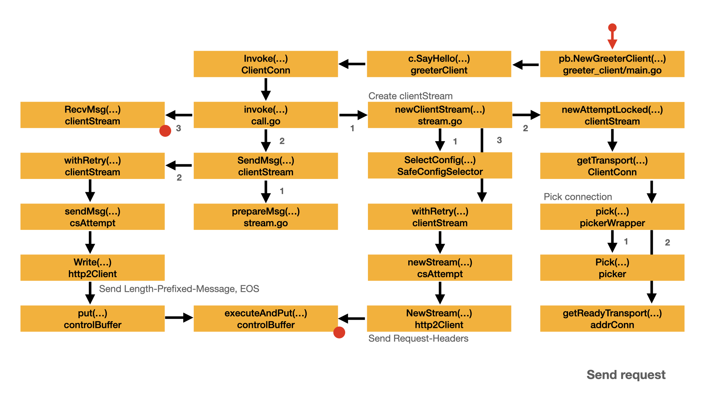

# Interceptor

gPRC Interceptor is a powerful mechanism to add addtional logic such as logging, authentication, authorization, metrics, tracing, and any other customer requirements.

let's talk about server side interceptor first. client side interceptor is rarely used in practice.
### Interceptors execute flow

There two key func definition. ```UnaryHandler``` and ```UnaryServerInterceptor```. each ```UnaryServerInterceptor``` is a interceptor. in gRPC interceptor chain is just as simple as ```[]UnaryServerInterceptor```. plse note that  ```UnaryServerInterceptor``` function has an ```UnaryHandler``` args. see ***code-03***

on the server side, 


### Launch Intercetor

